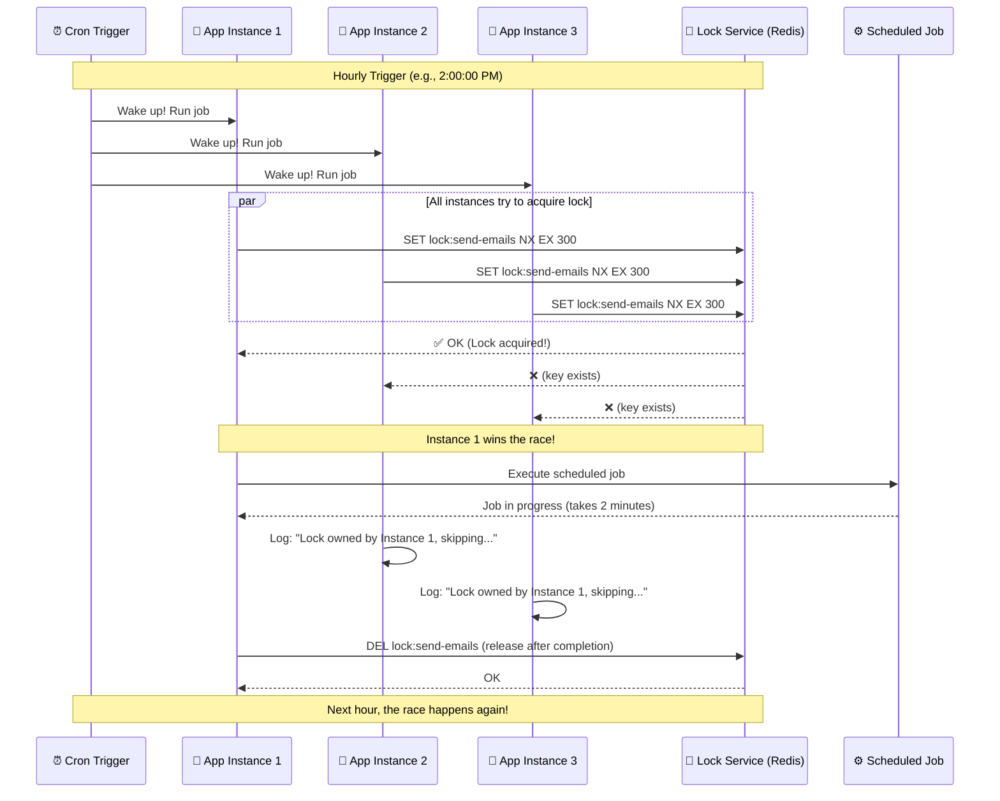

# Scheduled Locks: Distributed Lock for Cron Jobs — Step-by-Step Workflow
### Day 32 of 50 - System Design Interview Preparation Series

**By Sunchit Dudeja**

---

## 🎯 Welcome to Day 32!

Yesterday, we mastered Kafka Schema Evolution. Today, we break down the **distributed lock pattern** for scheduled jobs—step by step, exactly as the flow runs in production.

> **The Problem:** Multiple app instances wake up at the same time (cron trigger). Without a lock, all would run the same job → duplicates, wasted resources, data corruption.

> **The Solution:** One distributed lock. Only the fastest instance wins. Others skip.

> **📐 Excalidraw Diagrams:**  
> - **Sequence diagram** (matches Mermaid): [scheduled-locks-sequence-diagram.excalidraw](./scheduled-locks-sequence-diagram.excalidraw)  
> - **8-step workflow:** [scheduled-locks-distributed-lock.excalidraw](./scheduled-locks-distributed-lock.excalidraw)  
> Open at [excalidraw.com](https://excalidraw.com) (File → Open) — dark background.

---

## 📐 Sequence Diagram (Mermaid Reference)



---

## 📋 DETAILED STEPS: One by One

### Step 1: Cron Trigger Fires

| What | Details |
|------|---------|
| **When** | e.g., 2:00:00 PM (hourly) |
| **Who** | System cron (Kubernetes CronJob, Linux cron, or app scheduler) |
| **Action** | Sends "wake up" signal to all instances |

**What happens:**
- Every app instance (pod, server, container) that runs the scheduled job receives the trigger at the same time.
- All instances are now "awake" and ready to run the job.

---

### Step 2: All Instances Wake Up

| What | Details |
|------|---------|
| **Who** | App Instance 1, App Instance 2, App Instance 3 |
| **Action** | Each instance's scheduler/cron handler fires |
| **Result** | All three instances decide to run the job simultaneously |

**What happens:**
- **App Instance 1:** "Cron says run send-emails. I'll run it."
- **App Instance 2:** "Cron says run send-emails. I'll run it."
- **App Instance 3:** "Cron says run send-emails. I'll run it."

Without a lock, all three would execute the job → 3x duplicate emails, 3x database writes, etc.

---

### Step 3: All Instances Try to Acquire the Lock (The Race)

| What | Details |
|------|---------|
| **Who** | App Instance 1, App Instance 2, App Instance 3 |
| **Target** | Lock Service (Redis) |
| **Command** | `SET lock:send-emails <value> NX EX 300` |

**Redis command breakdown:**

| Part | Meaning |
|------|---------|
| `SET` | Set a key |
| `lock:send-emails` | Lock key (unique per job type) |
| `<value>` | e.g., hostname or instance ID (who holds the lock) |
| `NX` | **N**ot e**X**ists — only set if key does not exist (atomic) |
| `EX 300` | Expire in 300 seconds (5 min) — auto-release if instance crashes |

**What happens:**
- All three instances send the command to Redis at nearly the same time.
- Redis processes them **atomically** — only the first one wins.
- The first `SET` to arrive succeeds: key is created.
- The second and third `SET` fail: key already exists.

---

### Step 4: Redis Responds — One Winner, Two Losers

| Instance | Redis Response | Meaning |
|----------|----------------|---------|
| **App Instance 1** | `OK` | Lock acquired! You are the winner. |
| **App Instance 2** | `nil` (key exists) | Lock already held. You lost. |
| **App Instance 3** | `nil` (key exists) | Lock already held. You lost. |

**What happens:**
- **App Instance 1:** Receives `OK` → proceeds to execute the job.
- **App Instance 2:** Receives "key exists" → skips execution.
- **App Instance 3:** Receives "key exists" → skips execution.

**Why Instance 1?** Network latency, CPU scheduling, and Redis processing order determine the winner. It can be any instance on any run — it's a race.

---

### Step 5: Winner Executes the Scheduled Job

| What | Details |
|------|---------|
| **Who** | App Instance 1 (the winner) |
| **Action** | Executes the actual job logic (e.g., send-emails) |
| **Duration** | e.g., 2 minutes |

**What happens:**
- App Instance 1 calls `execute_job("send-emails")`.
- The job runs: query emails to send, send batch, update database, etc.
- App Instance 1 holds the lock for the entire duration.

---

### Step 6: Losers Log and Skip

| What | Details |
|------|---------|
| **Who** | App Instance 2, App Instance 3 |
| **Action** | Log that they skipped, optionally check who holds the lock |
| **Result** | No job execution, no duplicate work |

**What happens:**
- **App Instance 2:** `Log: "Lock owned by Instance 1, skipping..."`
- **App Instance 3:** `Log: "Lock owned by Instance 1, skipping..."`
- Both instances optionally call `GET lock:send-emails` to see the holder (hostname/instance ID).
- Both return to idle and wait for the next cron cycle.

---

### Step 7: Winner Releases the Lock (After Completion)

| What | Details |
|------|---------|
| **Who** | App Instance 1 |
| **Action** | `DEL lock:send-emails` |
| **When** | After job completes successfully |

**What happens:**
- Job finishes (e.g., after 2 minutes).
- App Instance 1 calls `redis.DEL("lock:send-emails")`.
- Lock key is removed from Redis.
- Redis responds: `OK`.

**Why DEL?** So the lock is released immediately instead of waiting for TTL (300s). If the instance crashes before DEL, the TTL (EX 300) ensures the lock auto-expires after 5 minutes.

---

### Step 8: Next Hour — The Race Happens Again

| What | Details |
|------|---------|
| **When** | e.g., 3:00:00 PM (next cron trigger) |
| **Action** | Steps 1–7 repeat |
| **Winner** | Could be Instance 1, 2, or 3 — whoever wins the race |

**What happens:**
- Cron fires again.
- All instances wake up.
- All try `SET lock:send-emails NX EX 300`.
- One wins, others skip.
- The cycle repeats every hour.

---

## 📊 TIMELINE: Lock Acquisition

```
2:00:00.000  Cron fires
2:00:00.001  App1, App2, App3 wake up
2:00:00.002  App1 → Redis: SET lock:send-emails NX EX 300
2:00:00.003  App2 → Redis: SET lock:send-emails NX EX 300
2:00:00.004  App3 → Redis: SET lock:send-emails NX EX 300
2:00:00.005  Redis: App1's SET arrives first → OK
2:00:00.006  Redis: App2's SET → key exists → nil
2:00:00.007  Redis: App3's SET → key exists → nil
2:00:00.008  App1 wins: starts executing job
2:00:00.009  App2, App3: log "skipping", go idle
2:02:00.000  App1: job complete
2:02:00.001  App1 → Redis: DEL lock:send-emails
2:02:00.002  Lock released
3:00:00.000  Next cycle: race again!
```

---

## 🔧 CODE: Lock Acquisition (Simplified)

```python
import redis
import socket

def run_scheduled_job(job_name, ttl_seconds=300):
    redis_client = redis.Redis(host='redis-cluster', port=6379)
    lock_key = f"lock:{job_name}"
    
    # Step 3: Try to acquire lock (SET if Not eXists with TTL)
    lock_acquired = redis_client.set(
        lock_key,
        socket.gethostname(),  # Store which node has lock
        nx=True,               # Only set if key doesn't exist
        ex=ttl_seconds         # Auto-release after TTL
    )
    
    if lock_acquired:
        # Step 5: Winner executes
        try:
            print(f"✅ Lock acquired! Running {job_name}...")
            execute_job(job_name)
        finally:
            # Step 7: Release lock when done
            redis_client.delete(lock_key)
            print(f"🔓 Lock released for {job_name}")
    else:
        # Step 6: Losers skip
        holder = redis_client.get(lock_key).decode('utf-8')
        print(f"⏭️ {job_name} already running on {holder}, skipping...")
```

---

## ✅ KEY TAKEAWAYS

| # | Step | Summary |
|---|------|---------|
| 1 | Cron fires | All instances receive trigger |
| 2 | All wake up | All decide to run the job |
| 3 | All try SET NX | Atomic race to Redis |
| 4 | One OK, others nil | Winner gets lock, losers don't |
| 5 | Winner executes | Job runs on one instance |
| 6 | Losers skip | Log and wait for next cycle |
| 7 | Winner releases | DEL lock when done |
| 8 | Next cycle | Race repeats |

**Critical Design Points:**
- Use **atomic** lock acquisition (`SET NX` in Redis)
- Always set **TTL** to prevent deadlocks if winner crashes
- Make jobs **idempotent** (safe to run twice)
- **Monitor** lock acquisition success/failure

---

## 🎯 THE 30-SECOND EXPLANATION

> *"Think of it like a race: when the starting gun fires (cron trigger), all runners (app instances) sprint to grab a single flag (distributed lock). Only one gets it and runs the job. The others go back to the starting line and wait for the next race. If the winner collapses (crashes), the flag auto-returns after TTL so someone else can win next time!"*

---

*— Sunchit Dudeja*  
*Day 32 of 50: System Design Interview Preparation Series*
