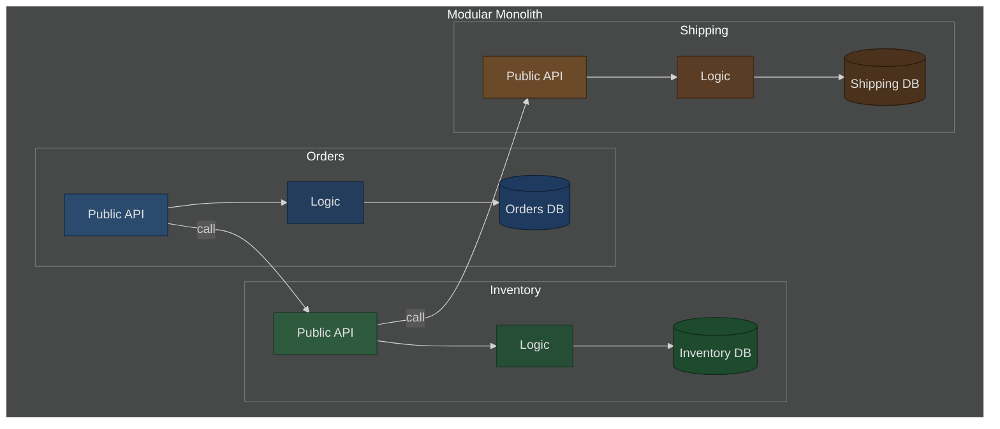

# Modular Monolith Architecture: The Best of Both Worlds
### Day 40 of 50 - System Design Interview Preparation Series

**By Sunchit Dudeja**

---

## 🎯 What Is a Modular Monolith?

A **modular monolith** is a **single deployment unit** (one app, one process, often one database server) that is **internally** split into **modules** with **clear boundaries**. Each module owns its data, exposes a **public API**, and talks to other modules through **explicit interfaces**—not through random cross-package database access.

Think: **one box**, **many labeled compartments**—not many separate servers (that would be microservices).

---

## 🏛️ High-Level Design (Dark Theme Diagram)

Use a **dark theme** in the viewer (GitHub, Mermaid Live, VS Code). Node fills are **muted** (navy / forest / brown)—**not** bright primaries; label text **#e0e0e0** on dark fills.



**How to read it:** External traffic hits **one** application. Inside, **Orders** may call **Inventory** and **Shipping** through **interfaces**—same JVM / process, **no HTTP between modules** unless you deliberately add it.

---

## 📊 Comparison: Monolith vs Modular Monolith vs Microservices

| Aspect | Traditional monolith | Modular monolith | Microservices |
|--------|------------------------|------------------|---------------|
| **Deployment** | Single unit | Single unit | Many units |
| **Code organization** | Often tangled | Modules + boundaries | Services + APIs |
| **Data** | One shared schema often | **Module-owned** tables/schemas | DB per service |
| **Cross-module comms** | Anywhere | **Via public APIs** (in-process) | Network (HTTP/gRPC) |
| **Team ownership** | Blurry | Per module | Per service |
| **Scale** | Whole app | Whole app | Per service |
| **Ops complexity** | Low | Low | High |
| **Refactor to services** | Hard | **Easier** (boundaries exist) | N/A (already split) |

---

## 🧱 Anatomy of a Modular Monolith

### 1. Module boundaries

Each module should have:

- **Encapsulation:** No direct access to another module’s internals or private tables.
- **Explicit API:** Interfaces other modules (and tests) depend on.
- **Owned data:** Tables belong to one module; **avoid foreign keys across modules**—use IDs and validate via APIs.

```java
// Orders — public surface
package com.myapp.orders.api;

public interface OrderService {
    Order createOrder(OrderRequest request);
    Order getOrder(Long id);
}

// Inventory — public surface
package com.myapp.inventory.api;

public interface InventoryService {
    void reserveStock(Long productId, int quantity);
    void releaseStock(Long productId, int quantity);
}
```

### 2. Module communication (in-process)

```java
@Service
public class OrderServiceImpl implements OrderService {

    private final InventoryService inventoryService; // same JVM

    @Override
    public Order createOrder(OrderRequest request) {
        inventoryService.reserveStock(request.getProductId(), request.getQuantity());
        return orderRepository.save(new Order(request));
    }
}
```

### 3. Data ownership (illustrative SQL)

```sql
-- Orders module owns orders
CREATE TABLE orders (
    id BIGINT PRIMARY KEY,
    user_id BIGINT,
    product_id BIGINT,
    quantity INT
);

-- Inventory module owns inventory
CREATE TABLE inventory (
    product_id BIGINT PRIMARY KEY,
    stock_quantity INT
);
```

Cross-module rules are enforced in **code** (services), not with **FK** from `orders` → `inventory` if that blurs ownership—teams differ; some use FKs read-only from one side; the strict rule is **no reaching into another module’s repository**.

---

## 🔗 How Modules Communicate (Short Answer)

| Style | What it is | When |
|--------|------------|------|
| **Direct calls** | `inventoryApi.reserveStock(...)` via injected interface | Default; need result now; same transaction boundary possible |
| **Domain events** | `eventPublisher.publish(OrderCreated)`; another module **subscribes** | Fire-and-forget: email, analytics, cache invalidation |
| **Shared interfaces only** | Depend on **`InventoryApi`**, not `InventoryRepository` | Keeps boundaries stable when internals change |

**There is no HTTP between modules** in a classic modular monolith—unless you’ve extracted a remote client for a specific reason.

---

## ✅ Benefits

| Benefit | Why it matters |
|---------|----------------|
| **Simple deploy** | One artifact; one pipeline |
| **Fast dev** | No network latency between modules; easy refactor in IDE |
| **ACID across modules** | One database transaction can span calls (design carefully) |
| **Clear teams** | Module ≈ ownership boundary |
| **Evolution path** | Hot module can become a **service** later; API already explicit |

---

## ⚠️ Trade-offs

| Challenge | Detail |
|-----------|--------|
| **Single blast radius** | One bad deploy affects all modules |
| **No per-module scale** | You scale the **whole** app (unless you split) |
| **Boundary discipline** | Easy to “just import” another repo—needs **reviews / ArchUnit** |
| **Single tech stack** | One language/runtime dominant |
| **Coupled releases** | One version goes live together |

---

## 🏗️ When to Choose a Modular Monolith

**Strong fit:**

- MVPs, small/medium teams (roughly **5–20** devs—rule of thumb)
- Strong **transactional** workflows across domains
- Microservices **complexity not yet justified**
- Planned **gradual** extraction later

**Poor fit:**

- Wildly different **scale** per domain (e.g. search vs checkout)
- **Independent deploys** mandatory per domain
- **Hard isolation** (PCI, tenant) requiring separate runtime
- **Polyglot** per domain as a requirement

---

## 🚀 Evolving Toward Microservices

1. Keep **clear module APIs** and data ownership from day one.  
2. Measure: which module needs **independent scale** or **deploy cadence**?  
3. **Extract** one module: new DB, replace in-process interface with **HTTP/gRPC**, use **outbox** (Day 39) for reliable events.  
4. Repeat only where metrics justify cost.

**Example:** E-commerce monolith with Orders, Inventory, Shipping—if Orders spikes **100×**, extract **Orders** first; keep the rest modular inside the monolith until needed.

---

## 📝 Real-World Note: Shopify

Shopify is often cited as a **large modular monolith** (Ruby on Rails, many internal areas with boundaries, huge team). Lesson: **disciplined modularity** can scale far before defaulting to microservices.

---

## 🛠️ Implementation Guidelines

**Do:**

- Define boundaries **before** spaghetti spreads.
- Prefer **package-by-feature** (`orders/`, `inventory/`).
- Enforce with **ArchUnit**, dependency rules, or similar.
- Keep module **APIs small and stable**.
- Use **events** when sync coupling isn’t needed.
- Test modules with **contract-style** tests.

**Don’t:**

- Reach across modules into **internal** repositories.
- Create **FKs** that turn the DB into the integration layer.
- Allow **circular** module dependencies.
- Split into **too many** tiny modules (often **~5–15** domains is a sane range to aim for—context-dependent).

**Example layout:**

```text
com.myapp/
├── orders/
│   ├── api/
│   ├── domain/
│   ├── application/
│   └── infrastructure/
├── inventory/
│   ├── api/
│   ├── domain/
│   ├── application/
│   └── infrastructure/
└── shared/kernel/   # no business rules here
```

---

## 📚 For Students: Simple Picture

### One-liner

A modular monolith is like **one backpack** with **labeled folders**—still one bag, but not a mess.

### Backpack analogy

| Style | Picture |
|--------|---------|
| **Messy monolith** | Everything tossed in one pocket |
| **Modular monolith** | One backpack, **folders** per subject |
| **Microservices** | **Separate bags** per subject (separate deploys) |

**Facts:**

- **One** app to run and deploy.
- **Many** modules inside.
- Each module **owns** its data; talk through **APIs** or **events**.
- **No network** between modules inside the box—**method calls** (fast).

### 10-second takeaway

> *One application, organized into modules: **simple like a monolith**, **structured like services**—split out a service **only when you must**.*

---

## 🎯 The 30-Second Summary

> *"A modular monolith is **one deployment** with **internal modules**: clear APIs, owned tables, in-process calls. You get **speed** and **transactions** without microservice ops. **Discipline** matters—no sneaky cross-module DB access. Use it as the **default** for many products; **extract services** when scale or isolation truly demands it."*

---

## 🔗 Connecting to Previous Days

| Day | Concept | How It Connects |
|-----|---------|-----------------|
| Day 22 | 7-layer HLD | Your “service” boundaries can start as modules |
| Day 25 | Deployment | Single artifact deploy |
| Day 39 | Outbox pattern | When a module later emits events to Kafka reliably |

---

## ✅ Day 40 Action Items

1. Draw your current app: **one module** or **many**? Where are the leaks?  
2. Pick **one** cross-module call and ensure it goes only through a **public interface**.  
3. List **one** criterion that would make you **extract** a module to a separate service.

---

*— Sunchit Dudeja*  
*Day 40 of 50: System Design Interview Preparation Series*
