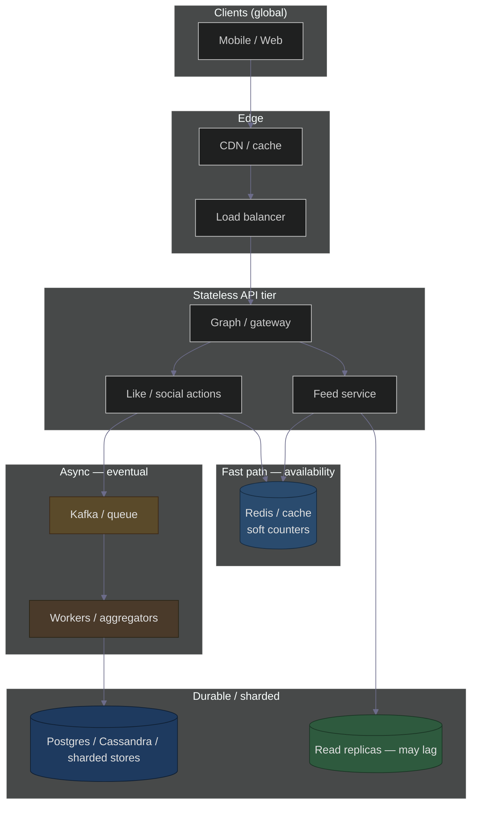

# ACID vs BASE: Why Instagram Feels Fast (CAP: AP + BASE)
### Day 41 of 50 - System Design Interview Preparation Series

**By Sunchit Dudeja**

---

## 🎯 Welcome to Day 41

**ACID** and **BASE** describe two different **consistency philosophies**. Large consumer apps like **Instagram** are usually engineered for **availability** and **partition tolerance** under the **CAP theorem**—often summarized as **AP**—which aligns with **BASE** (Basically Available, Soft state, Eventual consistency), not strict **ACID** everywhere.

Exact internals are proprietary; public engineering talks and common distributed patterns justify the **interview narrative** below.

---

## 📊 ACID vs BASE (Quick Refresher)

| | **ACID** | **BASE** |
|---|----------|----------|
| **Mindset** | Strong guarantees per transaction | Accept **temporary** looseness for scale |
| **A / B** | **Atomicity**, **Consistency**, **Isolation**, **Durability** | **Basically** **Available** |
| **Middle** | Isolation levels, strict ordering | **Soft state** (data may be in flux) |
| **End** | Durable commit | **Eventual consistency** (replicas/caches converge) |
| **Typical home** | OLTP RDBMS for money-grade rows | Global reads, feeds, counters, caches |

**Interview line:** *“ACID for the rows that must be bank-accurate; BASE for the experience layer that must stay up at planet scale.”*

---

## 🧭 CAP: Where Instagram Sits (Conceptually)

Under **partition** (network split, slow region, failed link), systems **cannot** guarantee **linearizable consistency** and **100% availability** simultaneously.

| Choice | What you optimize |
|--------|-------------------|
| **CP** | Consistency + partition tolerance (may **refuse** requests) |
| **AP** | **Availability** + partition tolerance (responses may be **stale** or divergent briefly) |

**Instagram (product experience)** is widely described as **AP-leaning**: keep the app **responsive** and **available**; accept **seconds** of **eventual** convergence for counts, feeds, and views.

> **Not every sub-system is AP.** Payments, account security, or legal holds may still use **stronger** consistency on dedicated stores. The **feed and social counters** are the usual BASE examples.

---

## 🟣 BASE on the Instagram App: Concrete Instances

These are **user-visible patterns** that match **BASE**, not proof of a specific internal implementation.

### 1. Basically Available — Like / reaction counts

- **What you see:** Likes **always** land (you rarely get “try again”); the **number** may **catch up** a moment later.
- **Why it’s BASE:** Under viral load, **serving** the app beats **global agreement** on the exact integer for every eyeball at every millisecond.
- **Soft state:** The displayed count may sit in **cache / aggregated shards** before every replica agrees.
- **Eventual consistency:** After a short window, counts **converge** for practical purposes.

### 2. Soft state — Feed and “new post” visibility

- **What you see:** Your post can show **for you** before every follower’s home feed reflects it **at the same instant**.
- **Why it’s BASE:** **Fan-out** (push to many inboxes) and **regional caches** mean **intermediate** states: “posted” vs “visible everywhere.”
- **Eventual consistency:** Followers see the post within **seconds** (typical), not one global atomic tick.

### 3. Eventual consistency — Story / Reels view counts, insights

- **What you see:** **Creator analytics** (views, reach) **update on a delay**; two devices may show **slightly different** numbers briefly.
- **Why it’s BASE:** Aggregations are **batched** and **sharded**; **strong** real-time truth for every metric everywhere would bottleneck the system.

### 4. Basically Available — “Hot” posts (celebrity / viral spikes)

- **What you see:** Counters may **jump** in **steps** or feel **sticky**, then **catch up**—the informal “**hot key**” / viral-post problem in systems design talks.
- **Why it’s BASE:** **Batching**, **rate limits**, and **approximate** fast paths keep the service **up** instead of **perfectly linear** counts in real time.

### 5. Soft state — Comments, notifications order

- **What you see:** Comment **order** or notification **ordering** can feel **slightly** off across devices for a moment after a spike.
- **Why it’s BASE:** **Per-shard** ordering and **async** notification pipelines favor **availability** over one global total order for every read path.

---

## 📋 Mapping Features → BASE Letters

| BASE letter | Meaning (short) | Instagram-style instance |
|-------------|-----------------|---------------------------|
| **B** — Basically Available | Degraded or approximate is OK; **don’t go dark** | Like still registers; UI stays fast under viral load |
| **A** — (in BASE: “Basically”) | Same row | Resilience over perfect metrics |
| **S** — Soft state | Counts / feeds in **transition** | Count not final; feed still fanning out |
| **E** — Eventual consistency | **Converge later** | All regions / caches show same like count **soon** |

---

## 🏛️ High-Level Design (Dark Theme): AP / BASE Read Path

Muted colors; turn on **dark theme** in your Mermaid viewer.

### How this HLD reflects **BASE / AP**

| Idea | In the diagram |
|------|----------------|
| **Basically Available** | Stateless **API** + **CDN** + **cache** keep requests served when shards lag. |
| **Soft state** | **Redis** holds **fast**, **mutable** counters; not the only source of truth forever. |
| **Eventual consistency** | **Queues → workers →** durable store; **read replicas** may trail primary. |
| **AP** | Under partition or overload, **serve** from cache / replica with **stale** data rather than **fail closed**. |

**What’s not in the picture:** Strongly consistent financial or identity flows would branch to **different** services with **stricter** stores (still “Instagram” the company, not every byte on BASE).

---

## 🎯 The 30-Second Interview Answer

> *“ACID is for transactions that must be exactly right. **BASE** is for global scale: **Basically Available** so the app stays up, **Soft state** because counts and feeds pass through caches and queues, **Eventual consistency** so replicas agree soon—not instantly. Instagram’s **social surface** behaves like an **AP** product: availability and partition tolerance over **strong** consistency for every read. You see that in **like count lag**, **feed delay**, and **analytics** catching up—that’s **BASE**, not a bug.”*

---

## 🔗 Connecting to Previous Days

| Day | Concept | How It Connects |
|-----|---------|-----------------|
| Day 17 | Instagram-like architecture | Feed, fan-out, scale |
| Day 23 | Database selection | OLTP ACID vs wide-column / cache BASE |
| Day 28 | Consistent hashing | Sharding hot keys / viral posts |
| Day 37 | Cache hit rate | Soft counters in Redis |

---

## ✅ Day 41 Action Items

1. Name **one** feature in your product that should stay **ACID** and **one** that can be **BASE**.  
2. Draw **read path** vs **write path** for a “like” with a **queue** in the middle.  
3. Explain **one** user-visible delay that is an acceptable **eventual consistency** trade-off.

---

*— Sunchit Dudeja*  
*Day 41 of 50: System Design Interview Preparation Series*
