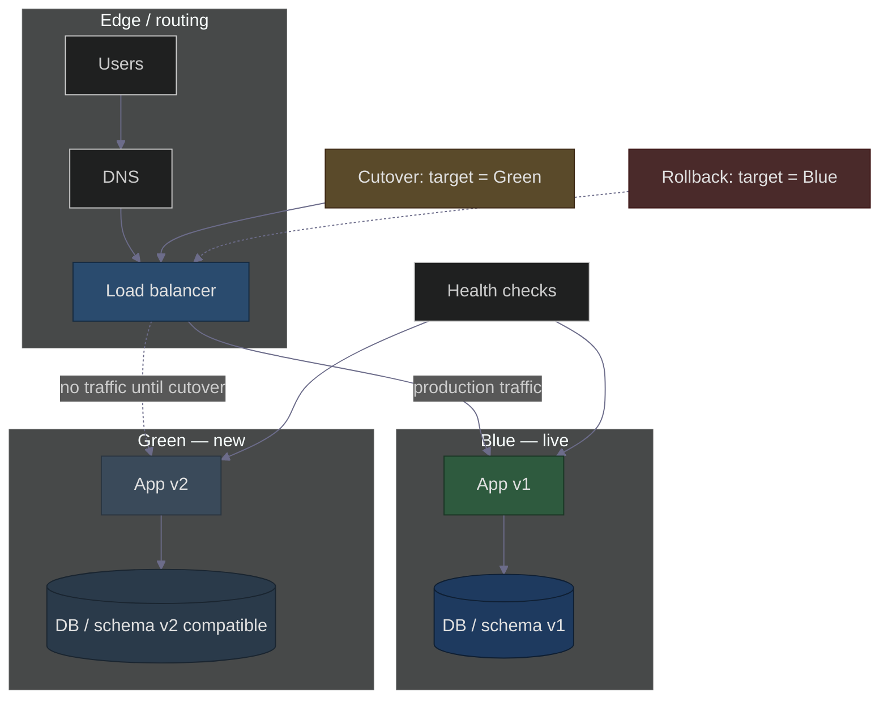

# Blue-Green Deployment: Achieving Zero Downtime
### Day 41 of 50 - System Design Interview Preparation Series

**By Sunchit Dudeja**

---

## 🎯 The Core Idea

**Blue–Green deployment** removes **deployment downtime** by running **two production-capacity environments**: **Blue** (current live traffic) and **Green** (new version). You deploy and test **Green** while **Blue** serves users, then **switch traffic** in one step (often via load balancer / DNS). **Rollback** is flipping back to **Blue**.

> **📐 Excalidraw:** Open [blue-green-deployment.excalidraw](./blue-green-deployment.excalidraw) at [excalidraw.com](https://excalidraw.com) — dark background (`#1e1e2e`), muted blues/greens/slate.

---

## 🏛️ High-Level Design (Dark Theme)

Muted colors, readable on dark. Toggle **dark theme** in Mermaid Live if needed.

**How zero downtime works:** **Blue** keeps serving during **Green** deploy and smoke tests. The **switch** updates routing in **milliseconds**. If **Green** misbehaves, **rollback** points traffic back to **Blue** immediately.

| HLD element | Role |
|-------------|------|
| **DNS** | Stable hostname; may weight toward LB VIP |
| **Load balancer** | Holds **active target** (Blue or Green); **atomic** switch |
| **Blue / Green** | Identical capacity; **Green** validated before cutover |
| **DB** | Often **shared** with backward-compatible schema, or **replica** / phase migration |
| **Health checks** | Gate cutover; automate rollback triggers |

---

## 🔧 How It Works (Step by Step)

| Step | Action | Downtime? |
|------|--------|-----------|
| 1 | Deploy **v2** to **Green**; **Blue** still serves | None |
| 2 | Smoke / synthetic tests on **Green** | None |
| 3 | **Flip** load balancer (or DNS weight) to **Green** | None (instant switch) |
| 4 | Keep **Blue** warm for **rollback** | None |

---

## ✅ Why Zero Downtime?

| Property | Why |
|----------|-----|
| **No in-place rolling of the only pool** | Old version keeps running until you cut over |
| **Fast switch** | LB / target group change is typically ms–seconds |
| **Fast rollback** | Same mechanism: point back to **Blue** |

---

## 📊 Comparison with Other Strategies

| Strategy | Downtime | Rollback | Risk (typical) |
|----------|----------|----------|----------------|
| **Recreate** | Often yes | Redeploy | Higher |
| **Rolling** | Usually no | Gradual | Medium |
| **Blue–Green** | **No** (goal) | **Instant** | Lower (if health + tests OK) |
| **Canary** | Usually no | Fast stop / shift | Lowest blast radius (gradual) |

---

## 🚀 Real-World Pattern

Large platforms often use **blue–green** (or equivalent: two ASGs, two clusters behind a single LB) for **critical** paths: deploy **Green**, validate health checks and canaries at the edge, then **shift** traffic. Exact internals vary by cloud (ALB target groups, Kubernetes service selectors, etc.).

---

## ⚠️ Trade-offs

| Trade-off | Detail |
|-----------|--------|
| **Cost** | Roughly **2×** capacity while both stacks exist (or shorter overlap) |
| **Database** | Migrations must be **backward compatible** (expand–contract) or use **dual-write / phase** patterns—no trivial “flip” if schemas diverge |
| **Sessions** | Prefer **sticky external store** (Redis) or **stateless JWT** so users survive the switch |
| **Long-lived connections** | WebSockets / gRPC streams may need **drain** policy even with blue–green |

---

## 🎯 The 10-Second Takeaway

> *Two full environments: **Blue** = live, **Green** = new. Deploy and test **Green**, then **flip** traffic. **Zero** planned downtime; **rollback** = flip back to **Blue**.*

---

## 🔗 Connecting to Previous Days

| Day | Concept | How It Connects |
|-----|---------|-----------------|
| Day 25 | Deployment strategies | Rolling vs blue–green vs canary |
| Day 40 | Modular monolith | Deploy unit may still be one app; blue–green is infra pattern |
| Day 35 | Failure modes | Bad cutover → detect fast, rollback |

---

## ✅ Day 41 Action Items

1. For one service, sketch **Blue** vs **Green** as target groups or namespaces—where is the **flip**?  
2. List **one** DB change that would **break** a naive blue–green flip; plan **expand–contract** instead.  
3. Define **rollback** criterion (error rate, latency) **before** the first production cutover.

---

*— Sunchit Dudeja*  
*Day 41 of 50: System Design Interview Preparation Series*
