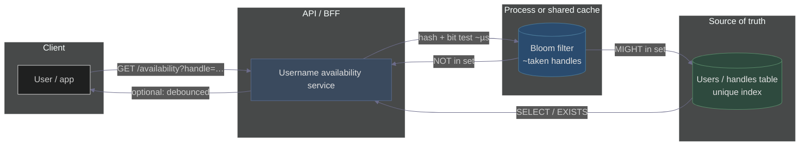
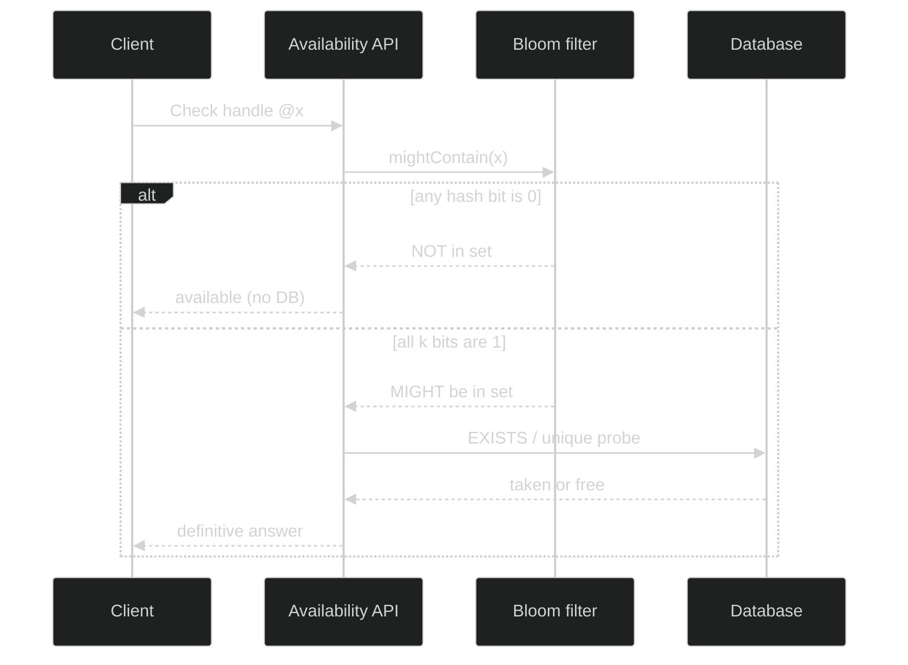
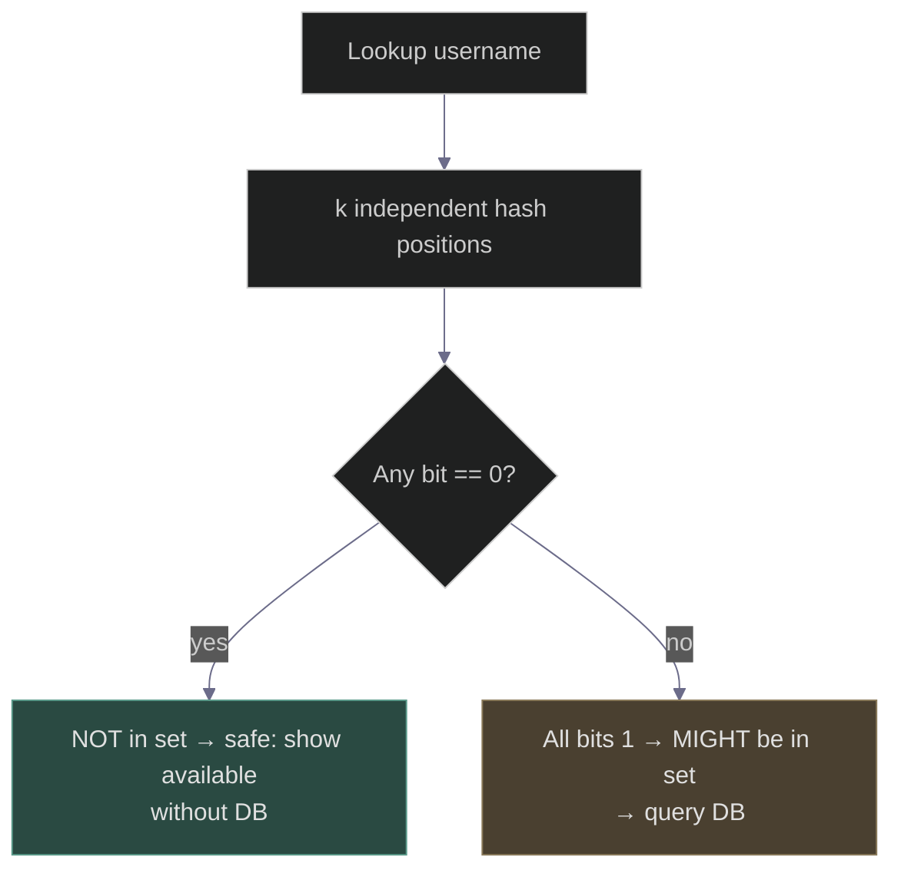
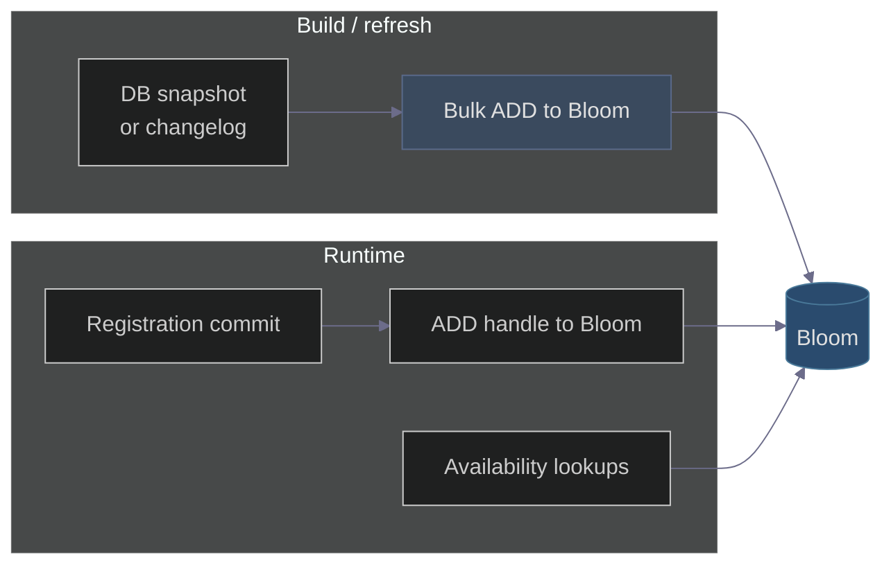

# Bloom Filter: Instagram Username Availability (No False Negatives)
### Day 43 of 50 - System Design Interview Preparation Series

**By Sunchit Dudeja**

---

## Executive summary

For **“is this handle already taken?”** at sign-up scale, a **Bloom filter** is a **probabilistic membership** structure in **RAM**: it can answer **“definitely not in the taken set”** with **no false negatives** *when the filter is an accurate superset of what it represents*. That lets the edge/API return **“available”** for most random strings **without a database round-trip**. When the filter says **“maybe,”** you **fall back to the authoritative store** (false positives are acceptable; wrong “available” is not).

Below: **inline diagrams** (Mermaid, dark theme) plus a link to the **Excalidraw** asset if you want to edit the sketch.

> **📐 Excalidraw (editable):** [bloom-filter-instagram-username.excalidraw](./bloom-filter-instagram-username.excalidraw) — open at [excalidraw.com](https://excalidraw.com). Canvas background `#1e1e2e`.

---

## 1. The problem an architect actually optimizes

| Pressure | Why it matters |
|----------|----------------|
| **Latency** | Username checks fire on **every keystroke** or debounced burst; remote **DB + index** per check does not scale cost-wise and feels sluggish. |
| **Correctness** | You must **never** allocate a handle that already exists. **Optimistic UI** can say “maybe available,” but **commit** must be **uniquely enforced** (DB constraint, strong consistency). |
| **Cost** | Read-heavy, skewed toward **non-existent** strings (users try creative names). You want **O(1)-ish, in-memory** rejection of the “definitely free” case. |

**Product invariant:** Showing **“taken”** when the name is free is annoying but safe. Showing **“available”** when taken is a **data-integrity incident**. The Bloom filter is tuned so the **fast path only asserts availability when the structure mathematically rules out membership**—not when it “probably” looks free.

---

## 2. Where the Bloom filter sits (system view)



**Placement options (interview trade-offs):**

| Option | Pros | Cons |
|--------|------|------|
| **In-process bitmap** | Lowest latency; no network | Every instance needs a **copy** or rebuild; memory per node |
| **Shared Redis** (e.g. RedisBloom) | One logical filter; fewer rebuilds | Extra hop (~sub-ms LAN); ops complexity |
| **Embedded in API gateway** | Shields DB earliest | Hot path coupling; deployment coupling |

For **Instagram-scale** narratives, think **many stateless API nodes** + **replicated filter** or **periodic snapshot + short-lived in-memory overlay** for recent registrations (see §7).

---

## 3. Request path: sequence (fast vs slow)



**Latency intuition:** Bloom path = **k** hash functions + **k** memory reads → often **~1–2 µs** in-process. **µs** = **microsecond** (µ = SI **micro-**, 10⁻⁶). A single **indexed** DB round-trip is commonly **~1–5 ms** = **1000–5000 µs**—hence **~10³×** gap for the hot path, before counting connection pool queuing and cross-AZ latency.

---

## 4. Core property: no false negatives (and what that *really* means)

**Mathematical guarantee (standard Bloom):** If an element was **inserted**, all **k** positions are **1**. Lookup returns **“might be in set”** only if **all** those bits are **1**. Therefore, if **any** bit is **0**, the element was **never inserted** → **cannot** be a false **“not in set”** for that element.



**False positive:** Hash collisions make **unused** names look “maybe taken.” You **confirm in DB**—user sees a small delay, not wrong data.

**Critical architect caveat — staleness:** The **no-false-negative** property holds **only if every taken username is present in the filter**. If the filter **lags** the database (e.g. new sign-up not yet added to Bloom), you could answer **NOT in set** for a name that **is** taken → **practical false negative**. Production mitigations:

- **Update Bloom on successful registration** (same transaction or async with idempotent add), **or**
- Treat Bloom as **pure optimization**: **DB unique constraint** always wins on `INSERT`; Bloom never overrides correctness.

---

## 5. Insert vs lookup (how bits behave)

Simplified mental model (interview code sketch):

```python
def might_be_taken(username: str, bit_array, k_hashes) -> bool:
    for h in k_hashes(username):
        idx = h % len(bit_array)
        if bit_array[idx] == 0:
            return False   # definitely NOT in set → fast "available"
    return True            # might be taken → slow path: DB
```

**Insert** only **sets bits to 1** (never back to 0 in a classic Bloom). That is why **deleting** a released username is **not** supported without **counting Bloom** or **rebuild**—another senior talking point for **handle recycling** policies.

---

## 6. Sizing: false-positive rate vs memory (brief)

For **n** elements, **m** bits, **k** hash functions, optimal **k ≈ (m/n) ln 2** minimizes false-positive rate **p ≈ (1 - e^(-kn/m))^k**. You do not need to derive on a whiteboard—state the **trade-off**:

| Knob | Effect |
|------|--------|
| **Larger m** (more bits) | Lower **p**, more RAM |
| **More k** (up to a point) | Sharper distinction; too many raises work per lookup |
| **Higher p** | More **slow-path** DB queries; still OK if DB is cheap enough |

**Rule of thumb:** For **hundreds of millions** of taken names, the filter is still **far smaller** than storing the strings themselves—hence **edge-friendly**.

---

## 7. End-to-end lifecycle (architect narrative)

1. **Cold start / rebuild:** Stream **existing taken handles** from DB (or replica) → **bulk insert** into Bloom (batch jobs or startup).
2. **Steady state:** On **successful registration**, **add** handle to Bloom (or enqueue to a **merge** process). If async, keep **DB** as the **only** hard gate.
3. **Lookup:** As in §3—**NOT in set** → instant; **MIGHT** → DB.
4. **Releases / renames:** If handles become free, **classic Bloom cannot remove**—use **counting Bloom**, **periodic rebuild**, or **TTL’d segment** of truth (advanced).



---

## 8. Instagram-style walkthrough (four cases)

| Step | Handle | Bloom | Ground truth | Outcome |
|------|--------|-------|----------------|---------|
| 1 | `@john_doe` | **NOT in set** | Available | **Fast path** — show available |
| 2 | `@jane_doe` | **NOT in set** | Available | **Fast path** |
| 3 | `@alex_smith` | **MIGHT in set** | Actually free (FP) | **Slow path** — DB says available |
| 4 | `@taken_user` | **MIGHT in set** | Taken | **Slow path** — DB says taken |

**Narrative:** Most **long random** handles hit **NOT in set** (bits sparse). Collisions cluster on **short / common** patterns—exactly where a **DB check** is acceptable.

---

## 9. Alternatives and when not to use Bloom alone

| Approach | Role |
|----------|------|
| **DB unique index only** | Correct; **slow** at extreme read QPS for existence checks |
| **Cache (Redis) negative cache** | Fast; need invalidation discipline |
| **Cuckoo filter** | Similar use case; **deletable** variants; different FP/memory trade-offs |
| **Bloom + DB** | **Standard interview answer:** cheap **negative**, authoritative **positive path** |

---

## 10. Failure modes (what seniors mention)

| Risk | Mitigation |
|------|------------|
| **Stale Bloom** missing new users | **Add on register** + **DB uniqueness**; or **short rebuild** windows |
| **FP storm** (too high **p**) | Increase **m** / tune **k**; monitor **slow-path rate** |
| **Memory pressure** | Sharded filters by **prefix**; RedisBloom cluster |
| **Abuse / enumeration** | **Rate limit** + **WAF**; Bloom does not fix security |

---

## 11. Summary table

| Bloom says | Meaning | Action | False negative on this answer? |
|------------|---------|--------|----------------------------------|
| **NOT in set** | Not in the represented taken set | Show **available**; skip DB | **No** *(if filter is complete)* |
| **MIGHT in set** | Collision or really taken | **Query DB** | N/A — DB decides |

---

## 12. The 10-second takeaway

> *Bloom filters give a **RAM-speed** “**definitely not in the taken set**” answer with **no false negatives** on that conclusion—so the UI can safely skip the DB **when any hash bit is zero**. **“Maybe”** triggers the **authoritative** store; **false positives** only cost latency. **Staleness** breaks the guarantee—so production designs pair the filter with **DB uniqueness** and **lifecycle discipline**.*

---

## 🔗 Connecting to Previous Days

| Day | Concept | How It Connects |
|-----|---------|-----------------|
| Day 9 | Bloom filters & cache penetration | Same structure; **membership** vs **cache key** presence |
| Day 19 | Google email uniqueness | Same **Bloom-then-DB** pattern |
| Day 38 | Primary keys | Handle as **natural unique key** |

---

## ✅ Day 43 Action Items

1. Explain **staleness** and why **DB unique constraint** still matters.  
2. Estimate **slow-path QPS** if **p = 1%** and **10k checks/s**.  
3. Draw **insert path** vs **lookup path** on a whiteboard (use §2–§3).

---

*— Sunchit Dudeja*  
*Day 43 of 50: System Design Interview Preparation Series*
