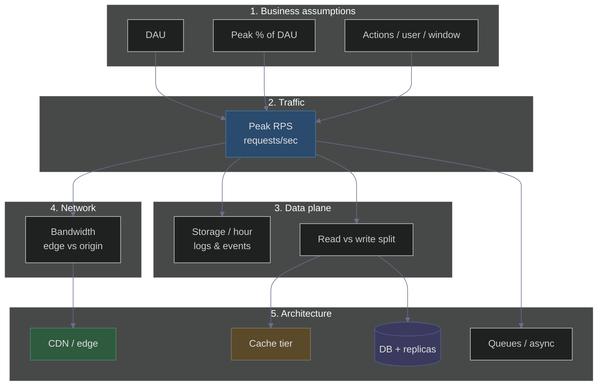
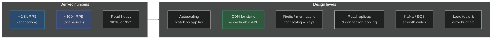

# Capacity Estimation for Black Friday: How Amazon Prepares for the Madness
### Day 44 of 50 - System Design Interview Preparation Series

**By Sunchit Dudeja**

---

## Opening hook

Amazon’s Black Friday window can see **enormous** traffic in the first minutes after deals go live. If you **underestimate** capacity, checkout degrades or fails; if you **overestimate** blindly, you burn budget. **Capacity estimation** is how you turn business assumptions into **RPS**, **storage**, **read/write mix**, and **bandwidth**—and then into **architecture** (CDN, cache, replicas, queues, autoscaling).

> **Reality check:** Exact **peak RPS** for Amazon’s production edge is **not** public. Interview answers are judged on **clear assumptions**, **order-of-magnitude math**, and **what you do with the numbers**—not on pretending you know confidential metrics.

> **📐 Excalidraw (dark canvas `#1e1e2e`):** [day44-capacity-estimation-black-friday.excalidraw](./day44-capacity-estimation-black-friday.excalidraw) — open at [excalidraw.com](https://excalidraw.com). Same file can live in **Downloads** as `day44-capacity-estimation-black-friday-dark.excalidraw` for local edits.

---

## Why capacity estimation matters

| Goal | What good estimates unlock |
|------|----------------------------|
| **Plan capacity** | Instance counts, DB throughput, cache size, CDN contracts |
| **Avoid waste** | Right-size pre-warming; avoid idle 10× over-provision |
| **Avoid incidents** | Sudden spikes exceed lazy autoscaling; **plan the peak** |
| **Align teams** | Engineering, SRE, finance, product share one model |

For events like Black Friday, **“we’ll scale when we see load”** is risky: spikes are **seconds-wide**, cold starts and DB connection storms lag behind demand.

---

## Interview rule: state assumptions first

Before any multiplication, say explicitly:

1. **What** you’re counting (HTTP requests to **origin** vs **edge**, **API** vs **page**).
2. **Time window** (peak **hour**, **minute**, or **flash** sale).
3. **Geography** (global vs one region)—drives **parallelism** and **CDN** math.

Then compute. Interviewers reward **traceable** math, not magic constants.

---

## Scenario A — “Back-of-envelope” (simple numbers)

Good for **learning the pipeline**. Numbers are **illustrative**, not claims about Amazon.

### Assumptions

| Metric | Value | Notes |
|--------|-------|--------|
| **DAU** | 10 million | Narrow to one **large region** or **single service** if you prefer |
| **Peak-hour share of DAU** | 20% | Aggressive concentration (midnight rush) |
| **Requests per user in that hour** | 5 | Mix of browse / search / cart — **low** if many assets come from CDN |
| **Avg write payload (logs/analytics)** | ~1 KB | Order of magnitude for **structured** log lines |
| **Avg response size (to client)** | ~200 KB | **High** if you count full page + images **before** CDN offload (see §6) |

### Peak RPS

- Peak concurrent users ≈ 10M × 20% = **2M users** in the peak hour (not all at the same second—this is a **simplifying** model).
- Requests in that hour ≈ 2M × 5 = **10M requests**.
- RPS ≈ 10,000,000 / 3,600 ≈ **2,778 → ~2,800 RPS** (average over the hour).

**Interpretation:** **~2.8k RPS** average **over a peak hour** is a **floor** for a **small slice** of a giant system. A **true per-second peak** inside that hour (e.g. first minute) is often **several× higher**—call that out in interviews.

### Storage (rough)

- 10M requests × 1 KB ≈ **10 GB/hour** of **append-only style** data (logs, events).
- If “heavy” hours repeat, multiply; add **indexes**, **replicas** (×2–3), **retention** → **hundreds of GB** for the event is plausible for **one** pipeline—**not** the whole company.

### Read vs write

| Type | Share | RPS @ 2,800 |
|------|-------|-------------|
| **Writes** | 10% | ~280 |
| **Reads** | 90% | ~2,520 |

E‑commerce is **read-heavy**; tune for **cache + CDN + read replicas**.

### Bandwidth (naive origin calculation)

- 2,800 RPS × 200 KB ≈ 560,000 KB/s ≈ **~547 MB/s** ≈ **~4.4 Gbps** **if** every byte exited your **origin**.

In production, **most static bytes** are served from **CDN**—so **origin** egress is often **much lower** than this naive line (see §6).

---

## Scenario B — “Interview global e‑commerce” (larger assumptions)

Use when the prompt says **“design at Amazon scale.”** Again: **assumptions**, not leaked data.

### Assumptions

| Metric | Value | Rationale |
|--------|-------|-----------|
| **DAU** | 200 million | Order-of-magnitude for **very large** global retail surface |
| **Peak-hour fraction of DAU** | 10% | ~20M users “in the peak hour” (less concentrated than Scenario A’s 20%) |
| **Actions per user in peak hour** | 20 | Page fragments, APIs, search, recommendations—**more realistic** than 5 for a rich app |

### Peak RPS (hourly average)

- (20,000,000 peak-hour users × 20 actions) ÷ 3,600 s ≈ **111,111 RPS** → round to **~110k RPS** (or **~100k** on a whiteboard).

The **method** matters more than the fourth digit.

### Read vs write (stricter read-heavy split)

| Type | Share | RPS @ ~111k |
|------|-------|-------------|
| **Writes** | 5% | ~5,500 |
| **Reads** | 95% | ~105,500 |

Checkouts and inventory mutations are **rare** vs **browse/search**.

### Storage (order of magnitude)

- ~111k RPS × 1 KB ≈ **111 MB/s** raw event/log throughput ≈ **~400 GB/hour** uncompressed.
- **Compression**, **sampling**, and **tiering** (hot → cold) reduce what you **store** vs what you **generate**.

### Bandwidth (and why CDN dominates)

- If you naively multiply **111k RPS × 150 KB** you get **tens of Gbps** at **origin**—unrealistic without a CDN.
- **Interview move:** “**Assume 80–90% of bytes are cacheable** at edge; **origin** sees **10–20%** of that” → design **CDN**, **asset domains**, **cache headers**, **S3 + CloudFront** (or equivalent).

---

## Visual: estimation pipeline (dark theme)

---

## Visual: from numbers to components

---

## Architectural implications (what the numbers buy you)

| Signal | Design response |
|--------|------------------|
| **High RPS**, stateless tier | **Horizontal scale**, **LB**, **no session in app** |
| **Read-heavy** | **CDN**, **cache**, **read replicas**, **materialized views** |
| **Write bursts** | **Queues**, **idempotency**, **back-pressure**, **isolated checkout path** |
| **Bandwidth** | **CDN offload**, **compress APIs**, **smaller JSON**, **image sizes** |
| **Unknown true peak** | **Load testing**, **game days**, **graceful degradation**, **queues** |

---

## Cheat sheet (both scenarios)

| Metric | Scenario A (simple) | Scenario B (interview “global”) |
|--------|---------------------|----------------------------------|
| **Model** | 10M DAU, 20% × 5 req/hr | 200M DAU, 10% × 20 req/hr |
| **Peak RPS (hourly avg)** | ~**2,800** | ~**110,000** |
| **Writes @ 10% / 5%** | ~280 WPS | ~5.5k WPS |
| **Reads** | ~2,520 RPS | ~105k RPS |
| **Bandwidth caution** | Don’t equate **client MB/s** with **origin** | Same + **CDN** split |

---

## Key takeaways

1. **Assumptions first**, then math—interviewers trust **transparent** models.
2. **RPS** drives app tier and LB; **separate** **edge** vs **origin** for bandwidth.
3. **E‑commerce** is **read-heavy**—optimize **read path** first.
4. **Black Friday** needs **pre-planned** capacity and **tested** degradation—not only reactive autoscaling.
5. **Public** peak internals for Amazon are **unknown**—your **reasoning** is the product.

---

## Connecting to Previous Days

| Day | Topic | Link |
|-----|--------|------|
| Day 5 | Capacity estimation fundamentals | [Day5_Capacity_Estimation.md](./Day5_Capacity_Estimation.md) |
| Day 8 | Load balancing | [Day8_Load_Balancing.md](./Day8_Load_Balancing.md) |
| Day 25 | Deployment strategies | [Day25_Deployment_Strategies.md](./Day25_Deployment_Strategies.md) |

---

## Day 44 action items

1. Recompute **peak RPS** if **25%** of DAU hits the peak hour with **8** actions each—state DAU yourself.  
2. List **three** reasons **origin** bandwidth **≠** **browser**-level bandwidth.  
3. Add **one** sentence on **coordinated omission testing** before a major sale.

---

*If you fail to plan capacity assumptions, you plan to fail at the peak.*  
*— Sunchit Dudeja · Day 44 of 50*
