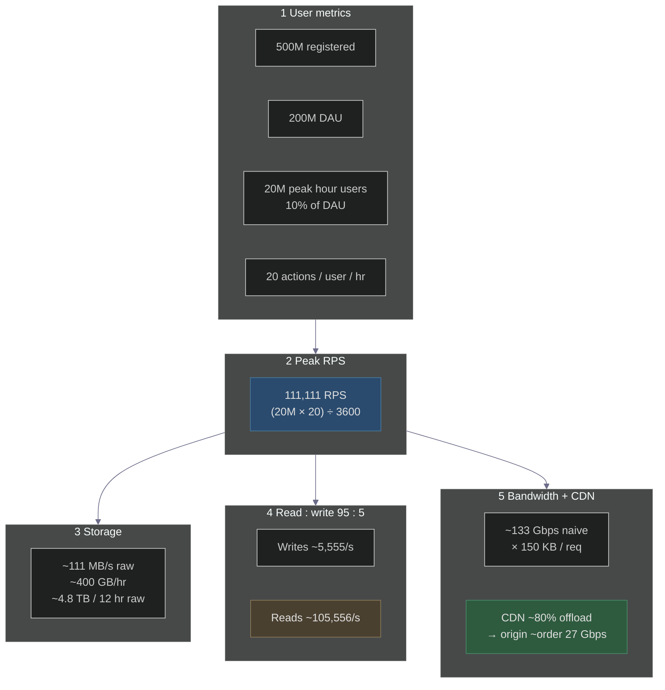
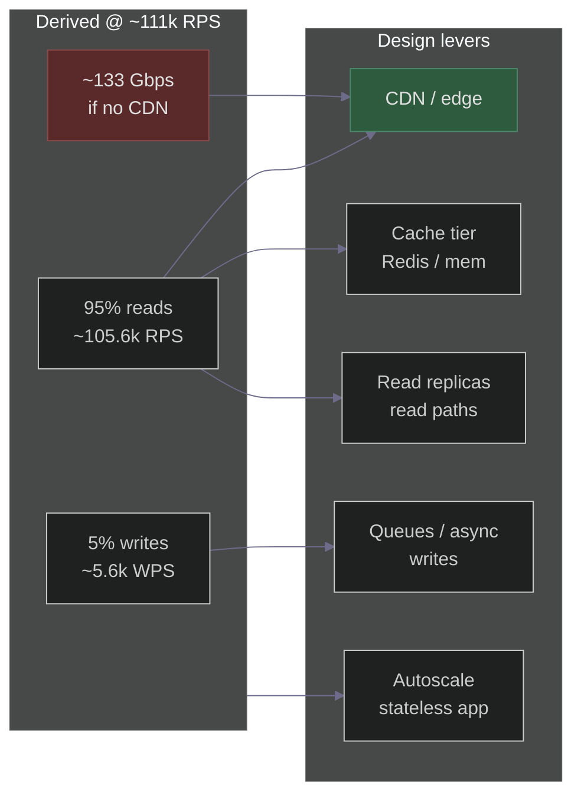
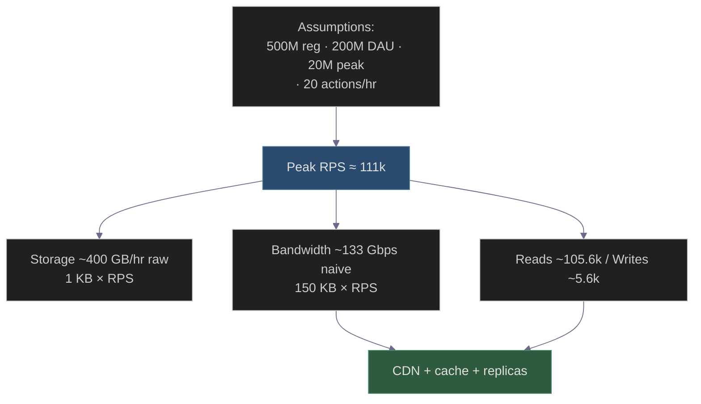

# Capacity Estimation for Black Friday: How Amazon Prepares for the Madness
### Day 44 of 50 - System Design Interview Preparation Series

**By Sunchit Dudeja**

---

## Opening hook

Amazon’s Black Friday window can see **enormous** traffic in the first minutes after deals go live. If you **underestimate** capacity, checkout degrades or fails; if you **overestimate** blindly, you burn budget. **Capacity estimation** is how you turn business assumptions into **RPS**, **storage**, **read/write mix**, and **bandwidth**—and then into **architecture** (CDN, cache, replicas, queues, autoscaling).

> **Reality check:** Exact **peak RPS** for any retailer’s production edge is usually **not** public. Interview answers are judged on **clear assumptions**, **order-of-magnitude math**, and **what you do with the numbers**—not on pretending you know confidential metrics.

> **📐 Excalidraw (dark canvas `#1e1e2e`):** [day44-capacity-estimation-black-friday.excalidraw](./day44-capacity-estimation-black-friday.excalidraw) — open at [excalidraw.com](https://excalidraw.com).

---

## Why capacity estimation matters

| Goal | What good estimates unlock |
|------|----------------------------|
| **Plan capacity** | Instance counts, DB throughput, cache size, CDN contracts |
| **Avoid waste** | Right-size pre-warming; avoid idle 10× over-provision |
| **Avoid incidents** | Sudden spikes exceed lazy autoscaling; **plan the peak** |
| **Align teams** | Engineering, SRE, finance, product share one model |

---

## The Architect’s Framework (step-by-step)

This is the **spine** of a strong interview answer: **assumptions first**, then **one formula** for RPS, then **storage**, **read/write split**, **bandwidth**, and **immediate** design consequences—especially **CDN** when bandwidth explodes.

---

### 1. Define top-line user metrics

State these **out loud** before multiplying.

| Metric | Value |
|--------|--------|
| **Total registered users** | **500 million** |
| **Daily Active Users (DAU)** | **200 million** |
| **Peak-hour users** | **20 million** (**10%** of DAU in the peak hour) |
| **User actions in that peak hour** | **20** (page views, searches, add-to-cart, APIs, etc.) |

**Interview tip:** *“I’m assuming **200M DAU**, **10%** of them active in the peak hour (**20M users**), each doing about **20 actions** in that hour.”* That shows **first-principles** modeling.

---

### 2. Convert users to RPS (requests per second)

**Formula (peak hour, evenly spread — interview standard):**

**Peak RPS** = (Peak hour users × Actions per user in that hour) ÷ 3,600 seconds

**Numbers:** (20,000,000 × 20) ÷ 3,600 = 400,000,000 ÷ 3,600 ≈ **111,111 RPS**

Round on the whiteboard to **~111k RPS** or **~100k RPS**—interviewers care about **logic**, not the fourth digit.

---

### 3. Estimate storage needs

| Assumption | Value |
|------------|--------|
| **Data per request** (logs, events, analytics — order of magnitude) | **1 KB** |

**Throughput:**

- **111,111 RPS × 1 KB ≈ 111 MB/s** of raw ingest (generation rate).

**Per hour:**

- **111 MB/s × 3,600 s ≈ ~400 GB/hour** (raw, uncompressed narrative).

**Event duration (example):**

- **12 hours × ~400 GB/hour ≈ ~4.8 TB** of **raw** data over the window.

**Interview depth:** *“That’s **raw** volume. In production we’d use **compression**, **sampling**, and **tiered** storage (e.g. hot OLAP → cold object store), often cutting **stored** footprint by **~70–80%** for logs and metrics.”*

---

### 4. Read vs write ratio

E‑commerce at peak is **read-dominated**: most actions are **browse / search / recommendations**; **checkout** is a thin slice.

| Assumption | Share |
|------------|--------|
| **Writes** (checkout, cart commit, inventory mutation, etc.) | **5%** of peak actions |
| **Reads** | **95%** |

**At ~111,111 RPS:**

| Type | Calculation | RPS |
|------|-------------|-----|
| **Writes** | 111,111 × 0.05 | **~5,555 WPS** |
| **Reads** | 111,111 × 0.95 | **~105,556 RPS** |

**Design sentence (use in interview):** *“With a **95:5** read-to-write ratio, this is **read-heavy**. I’ll prioritize **CDN** for static and cacheable responses, a **strong cache tier** for catalog and keys, and **read replicas** / read-optimized paths for the database.”*

---

### 5. Bandwidth (and why CDN is non-optional)

| Assumption | Value |
|------------|--------|
| **Average response size** (HTML, JSON bundles — **before** thinking about edge) | **150 KB** |
| **Static / media** | Mostly **offloaded to CDN** in a real design |

**Naive edge-to-client product (illustrative):**

- **111,111 RPS × 150 KB ≈ 16,666 MB/s** → order **~130–133 Gbps** of **theoretical** egress if everything left **origin** (same order of magnitude as **~133 Gbps** in a back-of-envelope talk track).

**CDN narrative:**

- If the **CDN absorbs ~80%** of bytes (cacheable assets, edge hits), **origin** might see on the order of **~20%** of that stress → **~27 Gbps** ballpark at origin—still huge, but **architecturally** you’ve **justified** **edge caching**, **asset domains**, and **separating** API from static.

**Interview line:** *“That’s why we need a **CDN** and aggressive **caching**—offload **most** bytes at the edge so **origin** and **API** tiers aren’t carrying full **133 Gbps**.”*

---

## Interview rule (always)

Before any multiplication, fix **what** you count (origin vs edge request, peak **hour** vs **minute**), **where** (global vs region), and that **first minute** of a sale can be **several×** hotter than the **hourly average** RPS above.

---

## Visual 1 — Architect’s pipeline (numbers on dark background)

---

## Visual 2 — From ratios to architecture (dark theme)

---

## Visual 3 — End-to-end flow (compact)

---

## Optional warm-up — smaller “tutorial” numbers

Use when you want a **quick** pipeline before the big model: e.g. **10M DAU**, **20%** in peak hour, **5** req/user/hour → **~2.8k RPS** average over that hour; **90:10** read/write → **~2.5k reads / ~280 writes**; bandwidth still needs **CDN** separation from **origin**.

---

## Architectural implications (summary)

| Signal | Design response |
|--------|------------------|
| **~111k RPS** | Stateless **app** tier, **LB**, horizontal **scale** |
| **95:5 reads** | **CDN**, **cache**, **read replicas**, materialized **catalog** views |
| **~5.6k WPS** | **Queues**, **idempotency**, **checkout** isolation, **back-pressure** |
| **~133 Gbps** naive | **CDN** (majority of bytes), **compress** APIs, **split** static vs API |
| **~400 GB/hr raw logs** | **Compression**, **TTL**, **cold** storage, **TSDB** where fit |

---

## Cheat sheet (Architect’s Framework)

| Step | Key numbers |
|------|-------------|
| **Users** | 500M registered · **200M DAU** · **20M** peak hour · **20** actions/hr |
| **Peak RPS** | **~111,111** (say **~111k** or **~100k**) |
| **Storage** | **~111 MB/s** raw · **~400 GB/hr** · **~4.8 TB / 12 hr** raw |
| **Read / write** | **95% / 5%** → **~105.6k R** · **~5.6k W** |
| **Bandwidth** | **150 KB** × RPS → **~133 Gbps** naive; **CDN ~80%** → **~27 Gbps** origin (order of magnitude) |

---

## Key takeaways

1. **State assumptions first**—then every multiplication is **defensible**.  
2. **Peak RPS** is the **hub** number; storage, R/W, and bandwidth **radiate** from it.  
3. **95:5** forces a **read-optimized** story.  
4. **Bandwidth** drives **CDN**—turn the scary Gbps into an **architectural** win.  
5. **Raw TB** for logs is **not** final footprint—**compression** and **tiering** are part of the senior answer.

---

## Connecting to Previous Days

| Day | Topic | Link |
|-----|--------|------|
| Day 5 | Capacity estimation fundamentals | [Day5_Capacity_Estimation.md](./Day5_Capacity_Estimation.md) |
| Day 8 | Load balancing | [Day8_Load_Balancing.md](./Day8_Load_Balancing.md) |
| Day 25 | Deployment strategies | [Day25_Deployment_Strategies.md](./Day25_Deployment_Strategies.md) |

---

## Day 44 action items

1. Re-say the **five steps** in order without looking—**numbers optional**, **logic** required.  
2. Recompute **peak RPS** if peak hour is **15M users** and **15** actions/hour.  
3. Explain why **hourly average RPS** can be **much lower** than **first-minute** spike RPS.

---

*If you fail to plan capacity assumptions, you plan to fail at the peak.*  
*— Sunchit Dudeja · Day 44 of 50*
