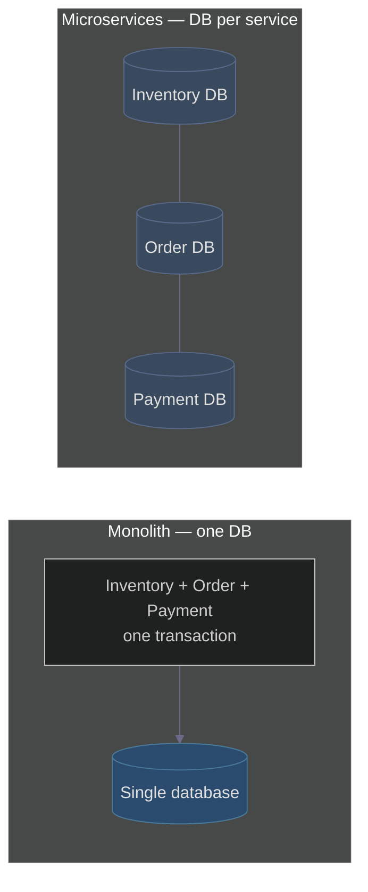
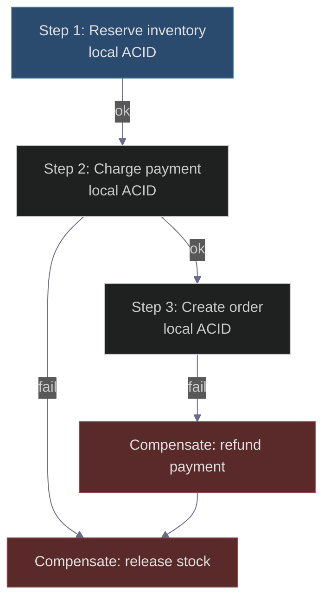
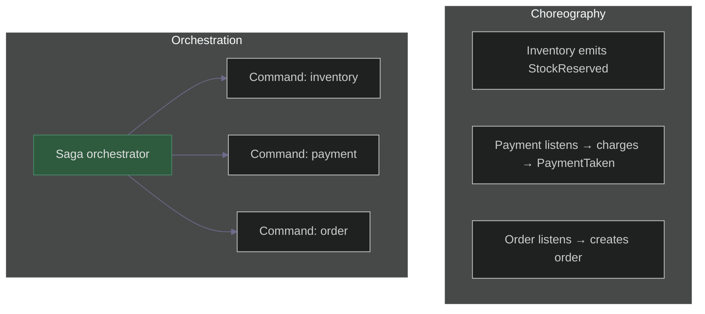

# Why ACID Breaks in Microservices & How the Saga Pattern Fixes It
### Day 45 of 50 - System Design Interview Preparation Series

**By Sunchit Dudeja**

---

## Opening

**ACID transactions** assume a **single** transactional store: one process, one commit boundary, one place to roll back. **Microservices** typically give **each service its own database** (database-per-service). A single business operation then spans **multiple** databases—so there is **no** classical ACID transaction wrapping “inventory + payment + order” in one shot.

**Saga** is the standard interview answer: a **sequence of local ACID transactions** (one per service), plus **compensating transactions** when something fails—trading **cross-service strong consistency** for **eventual consistency**, **availability**, and **loose coupling**.

---

## The ACID comfort zone (monolith)

In a monolithic app, related tables often live in **one** database. You can wrap multiple statements in **one** transaction:

```sql
BEGIN;
  UPDATE inventory SET quantity = quantity - 1 WHERE product_id = 123;
  INSERT INTO orders (user_id, product_id, quantity) VALUES (456, 123, 1);
  UPDATE payment SET balance = balance - 100 WHERE user_id = 456;
COMMIT;
```

| Property | What you get |
|----------|----------------|
| **Atomicity** | All steps commit, or none do. |
| **Consistency** | Constraints and invariants hold after commit. |
| **Isolation** | Concurrent transactions are controlled (per isolation level). |
| **Durability** | Committed work survives crashes. |

**Interview point:** ACID here is **one bounded context, one engine**—the boundary is clear.

---

## The microservices reality (separate databases)

Split into services with **isolated** data:

| Service | Owns |
|---------|------|
| **Inventory** | Stock / reservations |
| **Order** | Orders |
| **Payment** | Balances / charges |

There is **no single `BEGIN…COMMIT`** across all three. If you deduct stock and the **payment** step fails, you cannot “just roll back” the inventory DB from the payment service—you need an **explicit** recovery story.



---

## Why classic distributed transactions (2PC) are a weak default here

**Two-Phase Commit (2PC)** coordinates a prepare/commit across participants. It preserves **atomicity** across resources—but at a cost:

| Issue | Why it hurts microservices |
|-------|-----------------------------|
| **Blocking / locks** | Participants hold resources during prepare; latency and deadlock risk rise. |
| **Coordinator** | Can become a **SPF**; failure modes get harder. |
| **Chatty protocol** | Multiple **round-trips** across network boundaries. |
| **Unsupported stacks** | Many distributed / NoSQL stores **don’t** play the 2PC game the same way SQL did on a LAN. |

So in interviews: **“We avoid cross-service 2PC as the default; we model workflows with Sagas.”** (Deep dive: [Day 27 — 2PC](./Day27_Two_Phase_Commit.md).)

---

## The Saga pattern

A **Saga** is a **long-running business process** implemented as **steps**. Each step:

1. Runs a **local transaction** in **its** service database (**ACID inside the service**).
2. Signals completion (event, callback, or orchestrator command).
3. On **failure**, runs **compensating** transactions **in order** (often **reverse** of forward steps).

**Compensation** is **not** a magical distributed rollback—it is **new business logic** that **undoes** or **offsets** prior effects (refund, release reservation, mark cancelled).



---

## Two Saga styles

| Style | How it works | Best when |
|-------|----------------|-----------|
| **Choreography** | Services emit/consume **events**; each knows what to do next. | Few steps, strong team ownership, simple flows. |
| **Orchestration** | A **coordinator** (orchestrator) sequences commands and handles failure. | Complex workflows, centralized visibility, rich retry policies. |

**Trade-off:** Choreography avoids a central brain but can become **event spaghetti**; orchestration adds a **single place** to reason about flow (Temporal, Camunda, Step Functions–style patterns).

---

## Example: order placement (sketch)

| Step | Forward action | Local effect | Compensation if later step fails |
|------|----------------|--------------|----------------------------------|
| 1 | Reserve stock | `reserved += 1` | Release reservation |
| 2 | Charge / hold payment | Payment row + gateway | Refund / release hold |
| 3 | Create order | `INSERT` order | Cancel / mark failed + downstream comp |

If step 3 fails, run **refund** then **release stock** (order matters—define it explicitly).

---

## Compensating actions (rules of thumb)

| Forward | Compensation |
|---------|--------------|
| Reserve stock | Release stock |
| Charge card | Refund |
| Send confirmation email | Send correction / void (or accept duplicate-safe messaging) |

**Requirements (interview checklist):**

- **Idempotent** — safe to retry (network duplicates happen).
- **Semantic correctness** — “undo” matches business rules, not blind `DELETE`.
- **Ordering** — define whether compensation is **LIFO** reverse order or domain-specific.
- **Eventually consistent** — readers may see **in-between** states; design for that ([BASE / CAP context](./Day41_ACID_vs_BASE_Instagram_CAP.md)).

---

## Benefits vs costs

**Benefits**

| Benefit | Why |
|---------|-----|
| **No distributed DB locks** as the default cross-cutting tool | Each service keeps **local** ACID. |
| **Looser coupling** | Services don’t share tables; they coordinate via **contracts**. |
| **Flexible infrastructure** | Works with **polyglot** persistence. |
| **Fits event-driven stacks** | Kafka / RabbitMQ / SNS–SQS style flows. |

**Challenges**

| Challenge | Mitigation |
|-----------|------------|
| **Weak cross-saga isolation** | Semantic locking, **versioning**, acceptable **dirty reads** / business rules |
| **Compensation code** | First-class design + tests; not an afterthought |
| **Debugging** | **Correlation IDs**, distributed tracing (OpenTelemetry, Jaeger, Zipkin) |
| **Orchestration complexity** | Dedicated orchestration engine + clear state machine |

Reliable messaging patterns (e.g. **outbox**) pair well with Sagas: [Day 39 — Outbox](./Day39_Outbox_Pattern_Reliable_Messaging.md).

---

## ACID (monolith) vs Saga (microservices) — interview snapshot

| Dimension | **Monolith ACID** | **Saga** |
|-----------|-------------------|----------|
| **Consistency across ops** | Strong in one DB | **Eventual** across services |
| **Isolation** | Full (per SQL level) | **No** classical saga isolation—plan for visible interim states |
| **Failure** | Rollback in one engine | **Compensations** (application-level) |
| **Performance** | One hop to DB | Network + steps + compensation paths |
| **Complexity** | Lower for one team / one DB | Higher—**workflow** + **failure matrix** |

**30-second takeaway:** *ACID lives **inside** each service’s database. Across services, use a **Saga**: local transactions + **compensating actions**. You accept **eventual consistency** and **explicit recovery** instead of **one giant distributed lock**.*

---

## Illustrative real-world narrative: multi-step workflows

Products like ride-hailing or delivery flows are often modeled as **sagas**: match provider → hold payment → open trip → notify. If a late step fails (e.g. match disappears), **compensations** release holds and notify the user—**without** requiring one distributed transaction across all subsystems. Naming a company is **illustrative**; your design should cite **your** steps and **your** failure matrix.

---

## Visual: choreography vs orchestration (compact)



---

## Connecting to Previous Days

| Day | Topic | Link |
|-----|--------|------|
| 27 | Two-phase commit (why it’s heavy) | [Day27_Two_Phase_Commit.md](./Day27_Two_Phase_Commit.md) |
| 39 | Outbox for reliable events | [Day39_Outbox_Pattern_Reliable_Messaging.md](./Day39_Outbox_Pattern_Reliable_Messaging.md) |
| 41 | ACID vs BASE, CAP framing | [Day41_ACID_vs_BASE_Instagram_CAP.md](./Day41_ACID_vs_BASE_Instagram_CAP.md) |

---

## Day 45 action items

1. Write **three** compensations for: reserve → charge → ship (what if **ship** fails?).  
2. Argue **one** scenario where you’d pick **orchestration** over **choreography**.  
3. Explain why **idempotency keys** matter on both **forward** and **compensating** APIs.

---

*— Sunchit Dudeja*  
*Day 45 of 50: System Design Interview Preparation Series*
