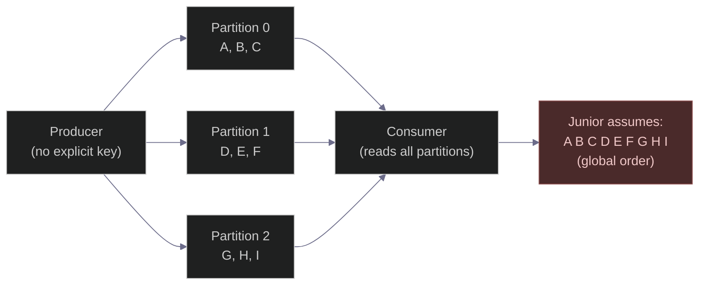
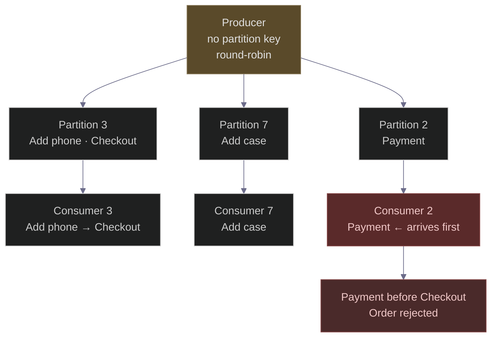
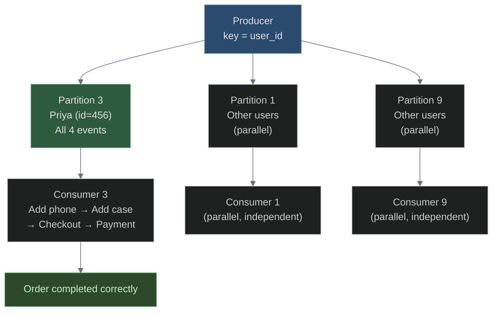
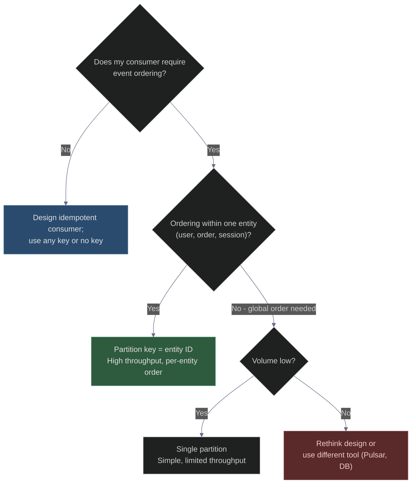

# Kafka Message Ordering: What Juniors Get Wrong & Architects Know
### Day 46 of 50 - System Design Interview Preparation Series

**By Sunchit Dudeja**

---

## The assumption that breaks production

> *"Kafka preserves order, so my events are always ordered."*

This is one of the most common misunderstandings in event-driven architecture. It sounds reasonable, it sometimes works in dev, and it **silently breaks** on Black Friday at 1 AM.

**The architect's mental model:** Order is guaranteed only **within a partition**. If you need global order, you must use a single partition (kills throughput) or design your consumer to be **idempotent** and **out-of-order tolerant**.

> **📐 Excalidraw (dark `#1e1e2e`):** [day46-kafka-ordering.excalidraw](./day46-kafka-ordering.excalidraw) — open at [excalidraw.com](https://excalidraw.com).

---

## The junior's mental model (and why it breaks)



**Reality:** Kafka delivers from each partition in order, but **interleaves** partitions as they arrive. The consumer might see `A, D, B, G, E, C...`—not `A, B, C, D, E, F`.

---

## The real-life story: ShopFast's Black Friday

### The setup

**ShopFast** is a growing e-commerce platform. A junior developer named **Raj** is tasked with building the event pipeline for user actions:

- `UserAddedToCart`
- `UserProceededToCheckout`
- `PaymentProcessed`
- `OrderShipped`

Raj creates a Kafka topic **`user_actions`** with **10 partitions** and configures the producer **without a key**—so messages are distributed **round-robin** across partitions.

He says: *"Kafka guarantees order, so events will always be in sequence."*

### The Black Friday moment

A customer named **Priya** (user_id = 456) shops on Black Friday. She:

1. Adds a phone to cart
2. Adds a case to cart
3. Proceeds to checkout
4. Pays successfully

Produced in that exact order—but because there's **no key**, events scatter across partitions:

| Event | Partition |
|-------|-----------|
| Add phone to cart | 3 |
| Add case to cart | 7 |
| Proceed to checkout | 3 |
| Payment processed | **2** |

Three consumers run **in parallel**, each reading one partition. Partition 2 (payment) finishes before partition 7 (checkout confirmation) arrives.

**The payment service sees `PaymentProcessed` before `UserProceededToCheckout`.** It tries to charge a cart that was never finalised → error thrown → order rejected.

Priya sees: *"Payment failed, please try again."* She was already charged.

---

## What went wrong (visual)



---

## The midnight call: architect explains

At 1 AM, Raj gets the PagerDuty alert. He calls **Meera**, the senior architect.

**Raj:** "But Kafka preserves order! How did this happen?"

**Meera:** "Kafka preserves order *within a partition*. You sent events for the same user to *different* partitions. Partitions are consumed **concurrently**. There's no global sequence lock—that would kill throughput."

**Raj:** "So what do we do?"

**Meera:** "One line of code."

---

## The fix: consistent partition key

```java
// Raj's original code — no key, round-robin
producer.send(new ProducerRecord<>("user_actions", event));

// Meera's fix — partition by user_id
producer.send(new ProducerRecord<>("user_actions", user_id, event));
```

With `user_id` as the partition key, Kafka hashes it to the **same partition every time**. All of Priya's events now land on **Partition 3**, consumed by one consumer, in strict order.

---

## After the fix (visual)



**Result:**
- Events for **Priya** are strictly ordered on Partition 3.
- Events for **other users** process in parallel on other partitions.
- **Throughput is maintained.** Only one line changed.

---

## Four architect solutions (when to use each)

### 1. Consistent partition key — the most common pattern

```java
producer.send(new ProducerRecord<>("topic", entity_id, event));
```

| What you get | Trade-off |
|---|---|
| Per-entity (user/order/session) ordering | No global cross-entity ordering |
| Full parallel throughput per partition | Hot partition if one key dominates (e.g., one viral seller) |

**Use for:** E-commerce, payments, user sessions, ride state—any place where an **entity** drives the ordering requirement.

### 2. Single partition — simple but limited

```yaml
topic:
  partitions: 1
```

| What you get | Trade-off |
|---|---|
| Global total order | One consumer, no parallelism |
| Simple to reason about | Throughput cap |

**Use for:** Strict audit logs, tiny-volume ordered sequences. Not for high-traffic topics.

### 3. Idempotent + out-of-order tolerant consumer

When you **can't** guarantee per-key order (e.g., cross-entity business rules), build the consumer to survive disorder:

```python
def handle_event(event):
    if event.type == "payment_processed":
        if not order_state.has_checkout(event.order_id):
            deferred.add(event)   # Park and retry
            return
    # Process normally
    order_state.apply(event)
```

**Patterns:**
- **Idempotency keys** — deduplicate on event ID; safe to replay.
- **State machine** — accept events only in valid state transitions; defer or discard others.
- **Sequence numbers** — reject events with lower version than current state.

**Use for:** High-throughput topics, cross-partition business logic, rebalance-safe consumers.

### 4. Use a different tool for total global order

If your business truly requires one global sequence across all events (rare), Kafka is the **wrong** default:

| Tool | Why |
|------|-----|
| Single-partition Kafka | Simple but unscalable |
| Apache Pulsar | Explicit sequence IDs per topic |
| Database table + sequence | Correct but slow |
| Redis queue (exclusive consumer) | Fast but single node |

**Rule:** Need global order AND high throughput at the same time? That combination demands hard architectural trade-offs.

---

## Comparison: which approach when?

| Approach | Global order | Throughput | Complexity | Use when |
|----------|:---:|:---:|:---:|---|
| **Single partition** | Yes | Very low | Low | Tiny volume, strict total order |
| **Per-key partitioning** | Per entity only | High | Medium | Entity-scoped ordering (most systems) |
| **Idempotent + out-of-order consumer** | No (tolerates it) | Very high | High | Cross-key ordering impossible; consumer must cope |
| **Different tool (Pulsar, DB)** | Yes | Medium | High | True global order is non-negotiable |

---

## What juniors miss: rebalances cause duplicates even with ordering

Even with correct partition keys, a **consumer group rebalance** can re-deliver the last uncommitted offset. If your consumer writes to a DB on every event without idempotency logic, you'll double-process.

**Defence:**
- **Idempotency key** on every downstream write.
- **Exactly-once semantics** (Kafka transactional producer + idempotent consumer) where the business demands it—at the cost of throughput.

---

## The architect's checklist



---

## Raj's updated onboarding note (after the incident)

> **Kafka ordering — what every engineer on this team must know:**
>
> 1. Kafka guarantees order **within a partition only**. Not across partitions.
> 2. **No partition key** = round-robin = **no ordering guarantees**.
> 3. **Partition key = entity ID** → all events for that entity in the same partition → ordering preserved for that entity.
> 4. Even with correct keys, rebalances cause re-delivery. Build **idempotent** consumers.
> 5. Global order at high throughput is a contradiction. Pick one or redesign.

---

## The 30-second takeaway

> *Never assume global ordering in Kafka. Partition by the key that matters for your business, and design your consumers to be idempotent and tolerant to out-of-order delivery.*
>
> The moment you assume global order in Kafka is the moment your production system breaks during a rebalance.

---

## Connecting to Previous Days

| Day | Topic | Link |
|-----|-------|------|
| 31 | Kafka schema evolution | [Day31](./Day31_Kafka_Schema_Evolution_New_Topic_Strategy.md) |
| 34 | Kafka partition assignment & rebalancing | [Day34](./Day34_Kafka_Partition_Assignment_And_Rebalancing.md) |
| 39 | Outbox pattern (reliable event publishing) | [Day39](./Day39_Outbox_Pattern_Reliable_Messaging.md) |
| 45 | Saga (ordering across microservices) | [Day45](./Day45_Why_ACID_Breaks_Microservices_Saga_Pattern.md) |

---

## Day 46 action items

1. Look at any existing Kafka producer in your codebase — does it set an explicit key? Is that intentional?
2. Explain **in one sentence** why round-robin distribution breaks ordering.
3. Design a Kafka topic for a **ride-hailing app**: what is the partition key for ride events? What events could arrive out of order across rides?

---

*— Sunchit Dudeja*
*Day 46 of 50: System Design Interview Preparation Series*
