# Database Connection Pools: The Biggest Blunder in Distributed Systems
### Day 47 of 50 - System Design Interview Preparation Series

**By Sunchit Dudeja**

---

> *"More connections = more throughput."*
>
> This sentence has cost companies more money than almost any other line of reasoning in distributed systems. And the worst part? It sounds completely correct until the moment it destroys your production system.

Let me tell you exactly what happens under the hood — not the hand-wavy version, but the actual mechanics — so that when you face this in an interview or at 2 AM on Black Friday, you know precisely why the system is melting down and exactly how to fix it.

---

## Before We Start: What Even Is a Connection Pool?

Most explanations skip this. Let's not.

Opening a database connection is **expensive**. Not "slightly slow" expensive — we're talking:

- TCP handshake with the database server
- TLS negotiation (if encrypted)
- PostgreSQL spawning a **new OS-level backend process** for your connection
- Authentication round-trip
- Session state initialisation

That's easily **50–200ms** just to open a connection. If your API endpoint takes 30ms to respond, spending 150ms on connection setup is absurd.

**The solution:** Create a pool of connections upfront at startup, keep them alive, and let application threads *borrow* and *return* them. That's the entire idea.

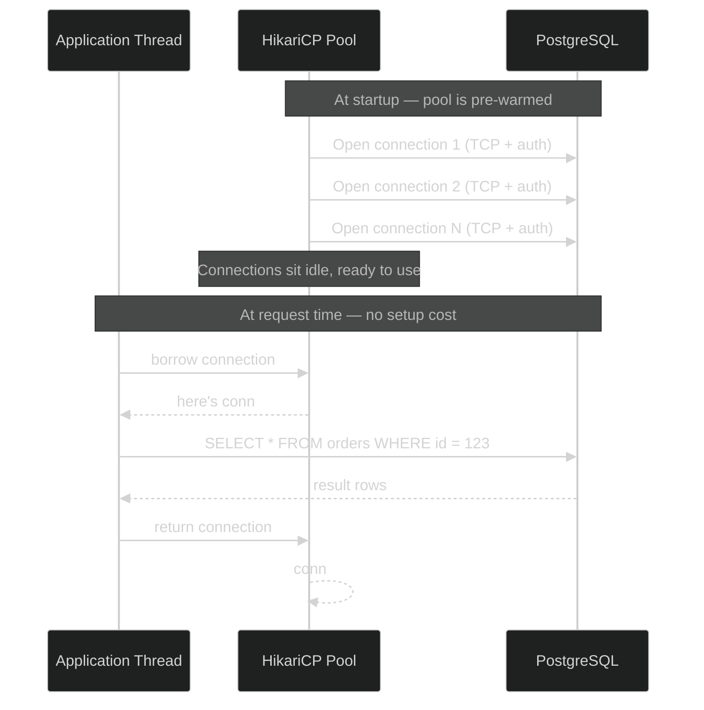

HikariCP (the most popular Java connection pool) maintains two data structures internally:
- **ConcurrentBag** — holds all connections (idle + active), designed for near-zero lock contention
- **FastList** — tracks open statements per connection for cleanup

When you call `getConnection()`, HikariCP tries to hand you an idle connection in microseconds. No TCP. No auth. Just a pointer swap.

Now that you understand *why* pools exist, let's talk about why Priya's change broke everything.

---

## The Real-Life Story: Amazon's Checkout Service

### The Setup

It's **November**. Amazon's team is preparing for Black Friday.

The checkout service architecture:

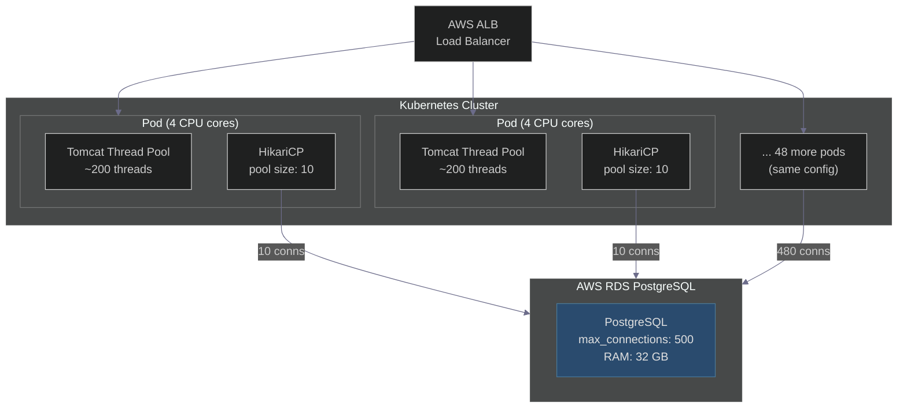

The current HikariCP config — written by a senior engineer, deliberately chosen:

```yaml
spring:
  datasource:
    hikari:
      maximum-pool-size: 10       # (4 cores × 2) + 1 = 9, rounded up
      minimum-idle: 5             # keep 5 warm even during quiet periods
      connection-timeout: 30000   # 30s to borrow a connection from pool
      idle-timeout: 600000        # close idle connections after 10 minutes
      max-lifetime: 1800000       # recycle connections every 30 minutes
      keepalive-time: 300000      # ping DB every 5 minutes to prevent stale conns
```

**Priya**, a junior developer, reads the config comment and thinks:

> *"We expect 10× more traffic on Black Friday. The comment says the formula is `(cores × 2) + 1`. That gives 9. But we need 10× throughput. So I should use `(cores × 2) + 1 × 10 = 90`, round up to 100. Done."*

Her logic is entirely linear. Traffic goes up 10×, so all the numbers go up 10×. She changes the config:

```yaml
spring:
  datasource:
    hikari:
      maximum-pool-size: 100   # Priya's "optimisation" for Black Friday
```

She deploys to staging. Staging has 5 pods with moderate load. Everything looks fine. The team approves.

---

### The Black Friday Meltdown

Black Friday. Midnight. Traffic spikes. The first 3 minutes look normal.

Then:

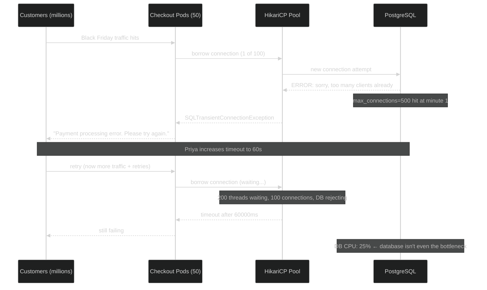

Priya checks the logs:

```
java.sql.SQLTransientConnectionException: HikariPool-1 - Connection is not available,
request timed out after 30000ms.

FATAL: remaining connection slots are reserved for non-replication superuser connections
FATAL: sorry, too many clients already
```

The database CPU is at **25%**. Plenty of headroom. This confuses Priya entirely — the database has capacity, yet everything is failing. She increases `connectionTimeout` to 60 seconds. Requests pile up in a queue. Still failing.

---

## Two Separate Problems Happening Simultaneously

Here's the thing Priya missed: there were actually **two distinct failure modes** happening at the same time.

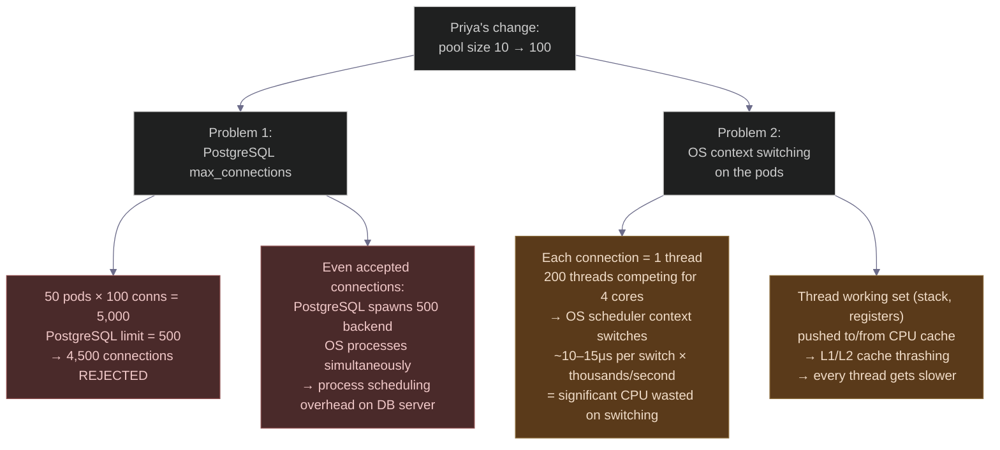

Let's go deep on both.

---

## Deep Dive: What PostgreSQL Does With Each Connection

Most developers think of a database connection as a *logical* concept — a session, a channel. It's actually much heavier than that.

When your application opens a connection to PostgreSQL, here's what happens on the database server:

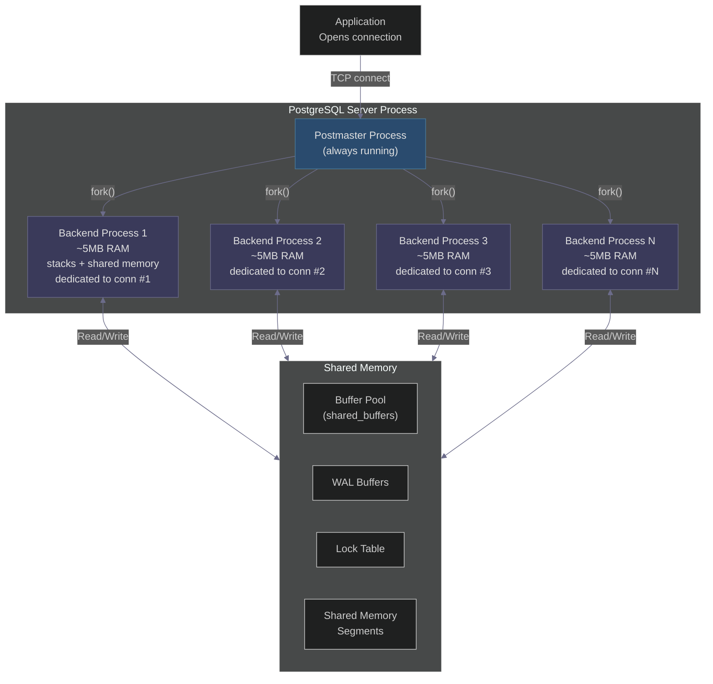

**Key insight:** PostgreSQL uses a **process-per-connection** model. Every single open connection is backed by a dedicated OS process — not a thread, a full **process**.

This means:

| 100 connections per pod | Cost |
|------------------------|------|
| 100 backend processes on the DB server | 500 MB+ of RAM just for process overhead |
| 100 entries in the lock table | Lock contention grows O(n²) |
| 100 processes sharing the buffer pool | Cache line invalidation across processes |
| Postmaster forks on every new connection | Connection setup takes tens of milliseconds |

With 5,000 total connections demanded (50 pods × 100):

```sql
-- This is what Priya's change looked like from PostgreSQL's perspective
SELECT count(*) FROM pg_stat_activity;
-- Returns: 500 (the limit, rejecting the other 4,500)

-- The error Priya saw:
-- FATAL: sorry, too many clients already
-- This means max_connections was breached

-- What Rajesh immediately checked:
SHOW max_connections;                    -- 500
SELECT count(*) FROM pg_stat_activity;  -- 500 (maxed out)
SELECT wait_event_type, wait_event, count(*)
FROM pg_stat_activity
GROUP BY 1, 2
ORDER BY 3 DESC;
-- Shows hundreds of backends waiting on Lock or Client
```

---

## Deep Dive: What the OS Does With 200 Threads on 4 Cores

This is the second problem — the one that would have killed performance even if the database had unlimited connections.

Here's what happens inside a pod with 200 threads and 4 cores:

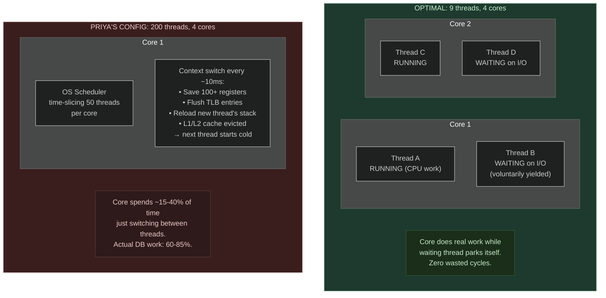

Let me show you the thread lifecycle that most engineers don't think about:

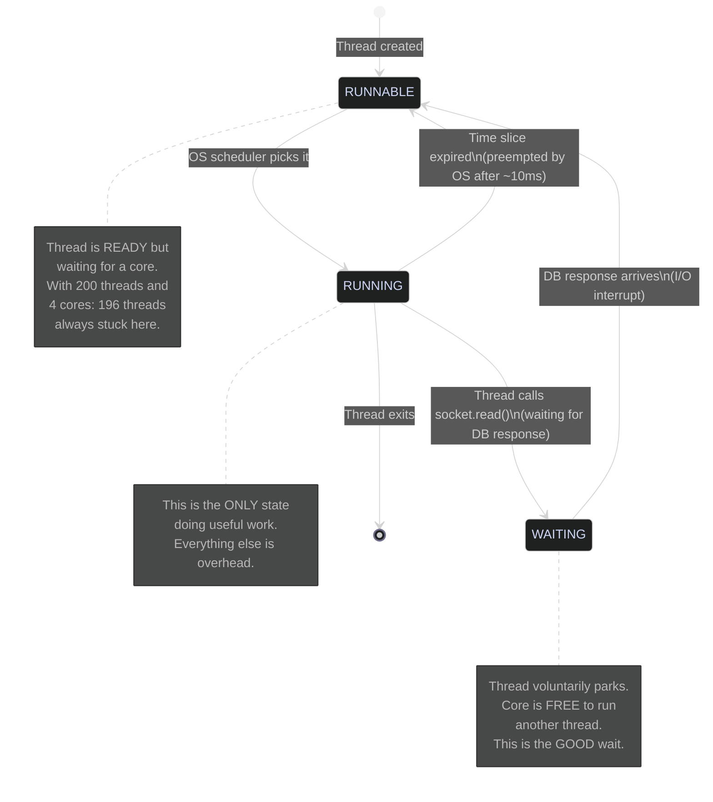

The `×2` in the formula exists precisely because of the WAITING state. When a thread sends a query to the database and waits for the response (network I/O), it voluntarily parks — freeing the CPU core to run another thread. So one core can productively handle 2 active threads: one running, one waiting on I/O.

```
Core 1 timeline (OPTIMAL — 2 threads per core):
|──Thread A: SQL query prep──|──Thread A: waiting for DB────────────|──Thread A: process result──|
                              |──Thread B: SQL query prep──|──B: wait──────────|──B: result──|
^                             ^                            ^
Core doing real work          Core doing real work         Core doing real work
No gaps. No wasted cycles.

Core 1 timeline (PRIYA'S CONFIG — 50 threads per core):
|T1:work|SWITCH|T2:work|SWITCH|T3:work|SWITCH|T4:work|SWITCH|T5:work|SWITCH|...
        ^             ^             ^             ^             ^
     15-40μs       15-40μs       15-40μs       15-40μs       15-40μs
   wasted on     wasted on     wasted on     wasted on     wasted on
  context switch context switch ...
```

At 200 threads per pod, the OS scheduler is doing **thousands of context switches per second** per core. Each switch:
- Takes 10–40 microseconds of pure overhead
- Flushes CPU registers (100+ values saved/restored)
- Invalidates TLB entries (virtual-to-physical memory mappings)
- Evicts the thread's working set from L1/L2 cache

By the time Thread #47 gets a CPU slice again, its data is cold. It has to wait for cache misses. This is why the database CPU was at 25% while the system was completely unresponsive — the pods themselves were thrashing.

---

## The Architect's Formula: Where It Actually Comes From

```
Optimal pool size = (core_count × 2) + 1
```

This isn't a made-up rule. It comes from **queuing theory** — specifically **Little's Law**:

```
L = λW

Where:
  L = average number of requests in the system (connections needed)
  λ = throughput (requests per second)
  W = average time a request spends in the system (latency)
```

For a database query:
- A thread spends ~40% of time doing CPU work (query parsing, result processing)
- A thread spends ~60% of time waiting on I/O (network round trip to DB, disk reads)

So for 1 core handling work efficiently:
- While Thread A does CPU work (40% of time), Thread B can be waiting on I/O
- While Thread B does CPU work, Thread A can be waiting on I/O
- This gives you 2 productive threads per core

The `+1` is a **jitter buffer** — it handles the moments where both threads happen to need the CPU simultaneously without causing a queue to form.

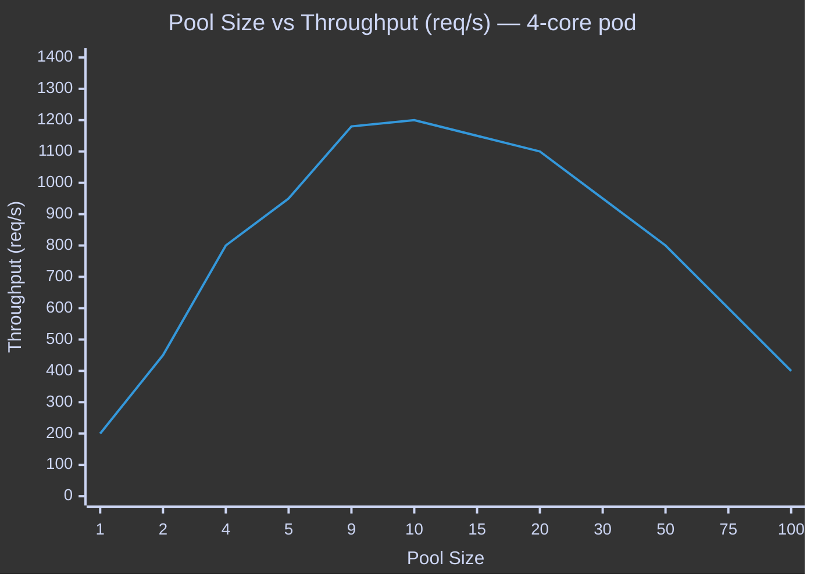

The curve rises steeply up to the formula value, plateaus briefly, then falls — because context switching costs eat into throughput faster than additional parallelism helps.

---

## The Midnight Call to the Architect

At 12:47 AM, Priya calls **Rajesh**, senior architect.

**Priya:** "Rajesh, I increased the connection pool to 100 per pod, but we're still getting timeouts. The database CPU is only at 25% — it's not even busy!"

**Rajesh:** "How many pods are running?"

**Priya:** "50."

**Rajesh:** "50 pods × 100 connections = 5,000 connections demanded. What's PostgreSQL's `max_connections`?"

**Priya:** "... 500."

**Rajesh:** "So 4,500 connections are being rejected before they reach the database. That's why the database CPU looks healthy — it's only handling 10% of the traffic. The rest is hitting connection errors at the pool layer."

**Priya:** "Okay, I'll increase `max_connections` on the database—"

**Rajesh:** "Don't. Each PostgreSQL connection is an OS process. 5,000 processes on that RDS instance would require 25+ GB of RAM just for process overhead, and the lock table would be serialising every query. You'd kill the database for real this time. The fix is the opposite direction."

**Priya:** "So what do I do?"

**Rajesh:** "Revert the pool size. And let me show you why the formula exists."

---

## The Complete Picture of What Went Wrong

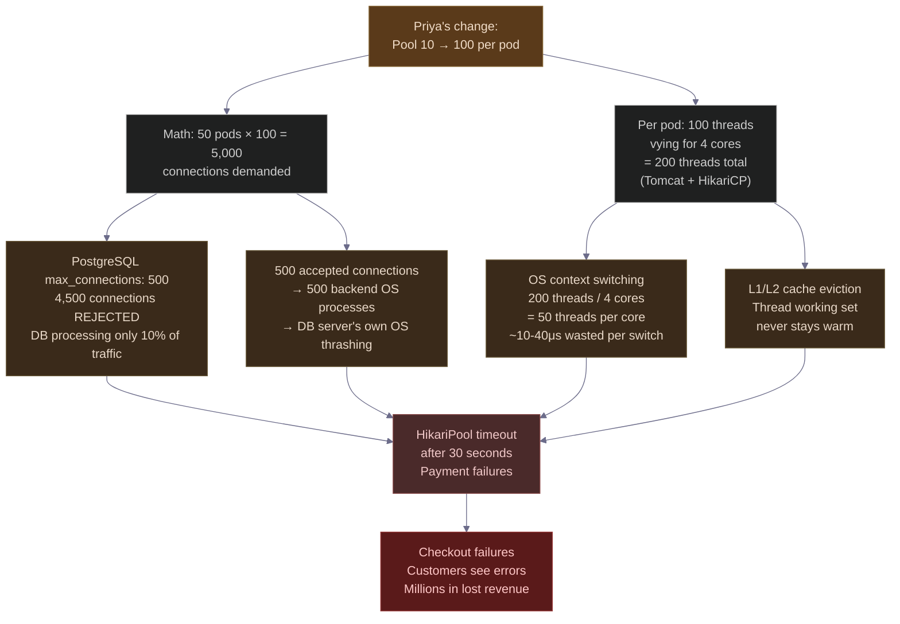

---

## The Fix: What Rajesh Actually Did

Rajesh didn't just revert the config. He did five things in 30 minutes.

### Step 1: Revert to the formula

```yaml
spring:
  datasource:
    hikari:
      maximum-pool-size: 10         # (4 cores × 2) + 1 = 9, rounded to 10
      minimum-idle: 5               # keep 5 warm; don't let the pool shrink to 0
      connection-timeout: 30000     # 30s to borrow — fail fast, don't queue forever
      idle-timeout: 600000          # close unused connections after 10 min
      max-lifetime: 1800000         # recycle every 30 min — prevents stale connections
      keepalive-time: 300000        # ping DB every 5 min — prevents RDS firewall drops
      leak-detection-threshold: 5000  # warn if a connection isn't returned in 5s
      validation-timeout: 5000      # fail fast if connection health check hangs
      pool-name: "CheckoutHikariPool"  # named pools are easier to debug in logs
```

### Step 2: Verify the math holds across the cluster

```
Constraint: (pods × maximumPoolSize) ≤ (max_connections × 0.9)

50 pods × 10 connections = 500
PostgreSQL max_connections = 500
Buffer (10% reserved for superuser/replication): 500 × 0.9 = 450

Result: 500 > 450 → still tight. 
Rajesh's actual recommendation: pool size 9 (450 total) and request RDS to increase max_connections to 600.
```

```sql
-- Rajesh's immediate PostgreSQL triage queries
-- 1. Current connection state
SELECT state, count(*) 
FROM pg_stat_activity 
GROUP BY state;
-- idle: 450 (pool connections sitting idle — healthy)
-- active: 23 (actually running queries — healthy)
-- idle in transaction: 2 (potentially stale — investigate)

-- 2. Who is waiting and why
SELECT pid, wait_event_type, wait_event, query, query_start
FROM pg_stat_activity
WHERE wait_event IS NOT NULL
ORDER BY query_start;

-- 3. Lock contention
SELECT blocked_locks.pid AS blocked_pid,
       blocking_locks.pid AS blocking_pid,
       blocked_activity.query AS blocked_query
FROM pg_catalog.pg_locks blocked_locks
JOIN pg_catalog.pg_stat_activity blocked_activity ON blocked_activity.pid = blocked_locks.pid
JOIN pg_catalog.pg_locks blocking_locks ON blocking_locks.locktype = blocked_locks.locktype
    AND blocking_locks.pid != blocked_locks.pid
    AND blocking_locks.granted
WHERE NOT blocked_locks.granted;
```

### Step 3: Expose pool metrics to Prometheus

```java
@Configuration
public class DataSourceConfig {

    @Bean
    public DataSource dataSource(HikariConfig config) {
        HikariDataSource ds = new HikariDataSource(config);
        // Registers these metrics to Prometheus/Grafana:
        // hikaricp_connections_active   — currently borrowed connections
        // hikaricp_connections_idle     — connections sitting in the pool
        // hikaricp_connections_pending  — threads waiting for a connection
        // hikaricp_connections_timeout_total — connections that timed out
        // hikaricp_connection_acquisition_ms — how long threads waited
        return ds;
    }
}
```

```yaml
# Grafana alert rules Rajesh added
- alert: HikariPendingThreadsHigh
  expr: hikaricp_connections_pending{pool="CheckoutHikariPool"} > 0
  for: 1m
  labels:
    severity: warning
  annotations:
    summary: "Threads waiting for DB connections — pool may be too small"

- alert: HikariConnectionTimeouts
  expr: rate(hikaricp_connections_timeout_total[5m]) > 0.1
  for: 30s
  labels:
    severity: critical
  annotations:
    summary: "Connection timeouts occurring — investigate immediately"

- alert: HikariConnectionAcquisitionSlow
  expr: hikaricp_connection_acquisition_ms_p99 > 100
  for: 2m
  labels:
    severity: warning
  annotations:
    summary: "P99 connection wait > 100ms — pool contention starting"
```

### Step 4: Run the load test to validate (not guess)

Rajesh didn't assume pool size 10 was optimal. He measured it:

| Pool Size | P50 Latency | P95 Latency | P99 Latency | Throughput (req/s) | DB CPU | Pending Threads |
|-----------|:-----------:|:-----------:|:-----------:|:------------------:|:------:|:---------------:|
| 5 | 80 ms | 150 ms | 210 ms | 800 | 20% | frequent |
| 7 | 75 ms | 130 ms | 180 ms | 1,050 | 28% | occasional |
| **9** | **70 ms** | **118 ms** | **160 ms** | **1,220** | **33%** | **none** |
| **10** | **70 ms** | **120 ms** | **162 ms** | **1,200** | **35%** | **none** |
| 15 | 85 ms | 165 ms | 230 ms | 1,100 | 42% | none |
| 20 | 110 ms | 185 ms | 280 ms | 1,050 | 47% | none |
| 50 | 210 ms | 350 ms | 520 ms | 800 | 60% | none |
| 100 | 680 ms | 1,200 ms | 2,100 ms | 400 | 70% | none |

**Reading the table:** Pool size 9–10 is the inflection point. Below it, threads queue for connections. Above it, context switching overhead degrades latency and throughput *simultaneously*. The database CPU climbs but produces less useful work.

### Step 5: Add connection pool warm-up

```java
@Component
public class ConnectionPoolWarmup implements ApplicationListener<ApplicationReadyEvent> {

    @Autowired
    private DataSource dataSource;

    @Override
    public void onApplicationEvent(ApplicationReadyEvent event) {
        // On pod startup, pre-open all minimum-idle connections
        // so the first real traffic doesn't hit cold connection setup
        HikariDataSource hikari = (HikariDataSource) dataSource;
        int targetWarmup = hikari.getMinimumIdle();

        List<Connection> conns = new ArrayList<>();
        for (int i = 0; i < targetWarmup; i++) {
            try {
                conns.add(hikari.getConnection());
            } catch (SQLException e) {
                log.warn("Warmup connection {} failed: {}", i, e.getMessage());
            }
        }
        // Return all borrowed connections back to pool
        conns.forEach(c -> {
            try { c.close(); } catch (SQLException ignored) {}
        });

        log.info("Connection pool warmed up with {} connections", conns.size());
    }
}
```

Without warm-up, the first burst of traffic after a pod starts triggers cold connection setup — each taking 100–200ms. With warm-up, all minimum-idle connections exist before traffic arrives.

---

## Why Staging Missed This: The Pod Count Trap

This is the part that should make you update your staging strategy.

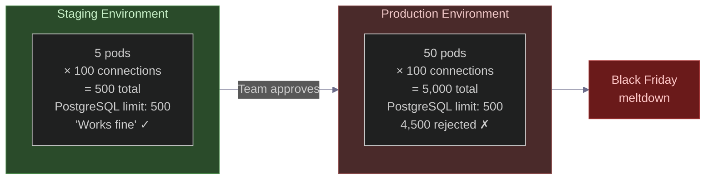

**The trap:** Staging happened to use 5 pods. 5 × 100 = 500 connections. Exactly PostgreSQL's limit. It worked — barely — without triggering the rejection. Production has 50 pods. The math changed by 10× but nobody checked it.

**The rule Rajesh added to the deployment checklist:**

```yaml
# Pre-deployment database connection sanity check
checks:
  - name: "Connection math"
    formula: "pods × maximumPoolSize ≤ (max_connections × 0.9)"
    staging_check: "5 × 100 = 500 > 450 — SHOULD HAVE CAUGHT THIS"
    production_check: "50 × 10 = 500 ≤ 450 — PASSES (after fix)"
    
  - name: "Staging parity"
    rule: "Staging pod count must be ≥ 10% of production pod count"
    reason: "Connection math failures only surface at realistic pod counts"
```

---

## The Senior Engineer's Instinct: Check These Before Touching Pool Size

Here's what separates a junior's response from a senior's response to "we're getting DB timeouts":

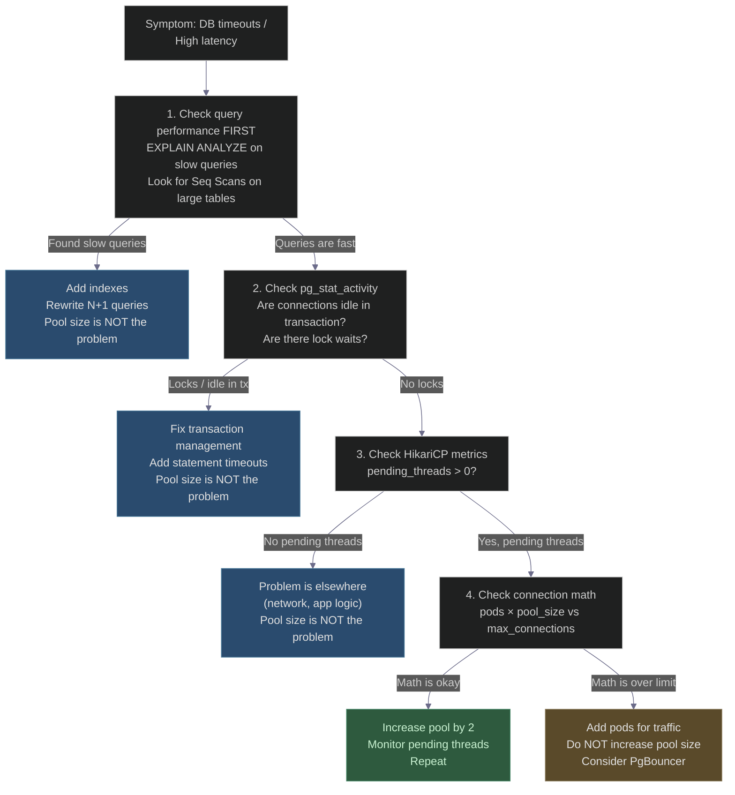

---

## The Real Production Solution: PgBouncer

Here's what Rajesh knew but Priya didn't: at Amazon's scale, you don't configure HikariCP against PostgreSQL directly. You put **PgBouncer** in between.

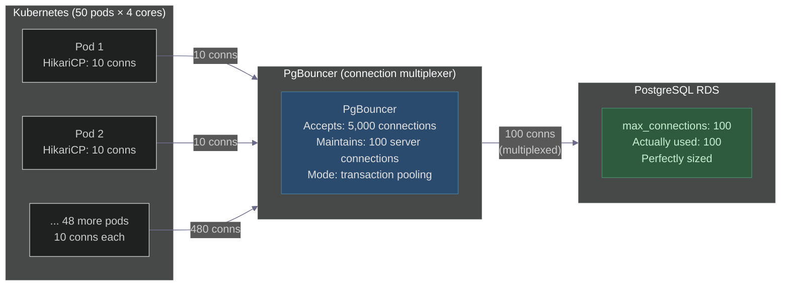

**How PgBouncer works (transaction pooling mode):**

```
App thread borrows connection from HikariCP →
  HikariCP has a connection to PgBouncer →
    Thread sends BEGIN; query; COMMIT;
    PgBouncer holds a real PostgreSQL connection only for the duration of that transaction
    After COMMIT, PgBouncer returns that server connection to its pool
    The HikariCP connection still "exists" but holds no server resources

Result:
  - 500 HikariCP connections (from 50 pods)
  - Multiplexed into only 100 real PostgreSQL connections
  - PostgreSQL only needs max_connections = 100-150
  - PgBouncer handles the overhead, not PostgreSQL backend processes
```

**PgBouncer configuration for this setup:**

```ini
# /etc/pgbouncer/pgbouncer.ini
[databases]
checkout_db = host=rds-endpoint.amazonaws.com dbname=checkout port=5432

[pgbouncer]
pool_mode = transaction          # connection shared per transaction (not per session)
max_client_conn = 5000           # accept up to 5000 connections from apps
default_pool_size = 100          # maintain 100 server connections to PostgreSQL
min_pool_size = 20               # keep 20 warm at minimum
reserve_pool_size = 10           # emergency pool for bursts
reserve_pool_timeout = 3         # use reserve pool if normal pool waits > 3s
max_db_connections = 100         # hard cap on PostgreSQL connections
server_idle_timeout = 600        # close idle server conns after 10 min
client_idle_timeout = 0          # clients can stay connected as long as they want
log_connections = 0              # don't log every connection (too noisy)
log_disconnections = 0
stats_period = 60                # emit stats every 60s
```

**The caveat:** Transaction pooling means you **cannot** use session-level features: `SET search_path`, prepared statements pinned to a session, advisory locks, or `LISTEN/NOTIFY`. If you need those, use statement pooling or session pooling (which reduces but doesn't eliminate the connection multiplexing benefit).

---

## Understanding HikariCP's Internal State Machine

When a thread calls `getConnection()`, here's exactly what HikariCP does:

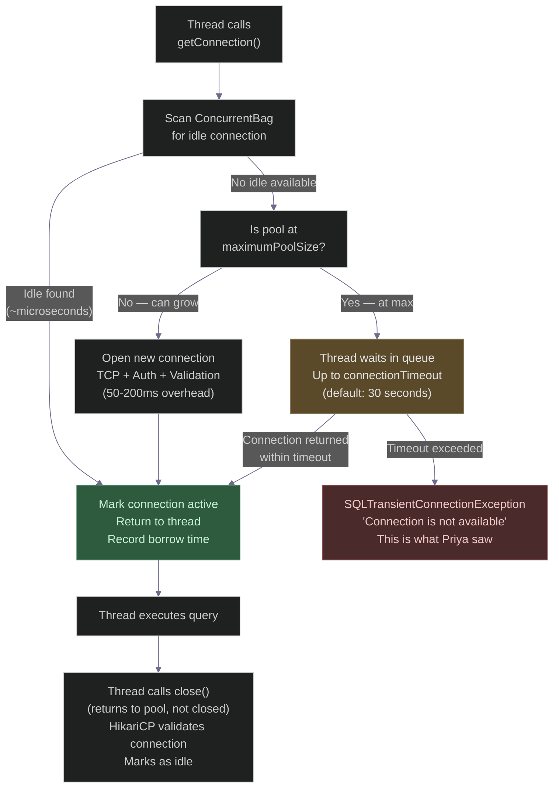

**The key insight for the interview:** `connection.close()` in HikariCP does **not** close the TCP connection. It returns the connection object to the pool. The TCP connection to PostgreSQL stays alive. This is the entire value of the pool.

**What HikariCP validates before returning a connection:**

```java
// HikariCP's validation logic (simplified)
// Runs when a connection is borrowed from the pool
if (config.getConnectionTestQuery() != null) {
    // Legacy: runs a test SQL query (slow, avoid)
    statement.execute(config.getConnectionTestQuery());
} else {
    // Modern: uses Connection.isValid() — a lightweight ping
    if (!connection.isValid(5)) {  // 5 second timeout
        // Connection is dead (DB restarted, RDS failover, etc.)
        // Discard it, open a new one
        pool.closeConnection(connection, "Failed isValid() check");
        connection = pool.openNewConnection();
    }
}
```

---

## The Full Request Lifecycle (What Actually Happens)

Let's trace a single checkout request end-to-end, with the correct pool configuration:

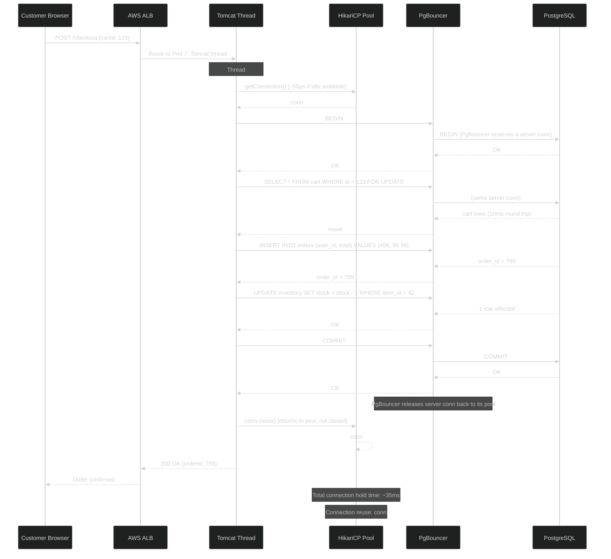

With pool size 10 on a 4-core pod, 10 checkout requests can execute in parallel — each holding a connection for ~35ms, releasing it, and letting the next request in. At 1,200 requests/second per pod × 50 pods = **60,000 checkout requests per second** across the cluster.

With pool size 100, you'd have 100 threads simultaneously fighting for CPU time, each taking 3× longer due to context switching, and the database rejecting most connection attempts. **Actual throughput: ~400 req/s per pod** — 3× worse.

---

## After the Fix: The Healthy State

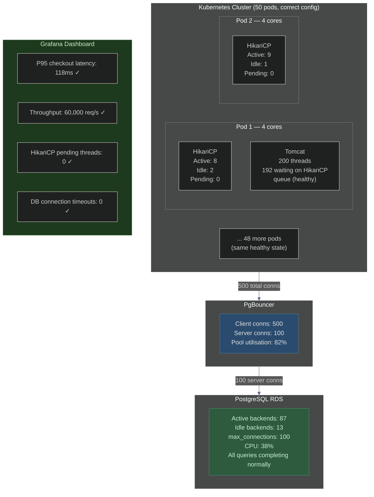

---

## Priya's Updated Team Runbook

After the incident, Priya wrote this and it became part of the team's standard onboarding:

```yaml
# ============================================================
# Connection Pool Guidelines — Checkout Team
# Last updated: Post Black Friday incident
# Author: Priya (with Rajesh's guidance)
# ============================================================

baseline_config:
  formula: "(core_count × 2) + 1"
  example:
    cores_per_pod: 4
    pool_size: 10   # (4 × 2) + 1 = 9, rounded to 10
  rationale: >
    A core handles 2 concurrent threads efficiently (one running, one on I/O).
    The +1 is a jitter buffer. More than this causes context-switch overhead
    that increases latency faster than parallelism helps throughput.

cluster_math_check:
  formula: "pods × pool_size ≤ max_connections × 0.9"
  our_values:
    pods: 50
    pool_size: 10
    total_connections: 500
    db_max_connections: 600    # we increased this after the incident
    limit_with_buffer: 540     # 600 × 0.9
    result: "500 ≤ 540 — PASSES"
  check_this_before_every_deployment: true

monitoring:
  alerts:
    - name: pending_threads_high
      condition: "hikaricp_connections_pending > 0 for 1m"
      action: "Investigate before increasing pool size"
    - name: connection_timeouts
      condition: "hikaricp_connections_timeout_total rate > 0.1/s"
      action: "Page on-call immediately"
    - name: acquisition_time_high
      condition: "hikaricp_connection_acquisition_ms p99 > 100ms"
      action: "Pool may be undersized or DB may be slow"

tuning_process:
  start_at: "(cores × 2) + 1"
  increase_pool_by_2_if:
    - "pending_threads > 0 for more than 1 minute"
    - "connection_acquisition p99 > 100ms"
    - "Verify cluster math still passes before increasing"
  decrease_pool_by_2_if:
    - "db_cpu > 70%"
    - "db_lock_waits increasing"
  never_increase_if:
    - "cluster math (pods × pool_size) would exceed max_connections × 0.9"
    - "Instead: add more pods for horizontal scaling"

common_mistakes:
  - mistake: "Increasing pool size to handle more traffic"
    correct: "Add more pods. Pool size is CPU-bounded, not traffic-bounded."
  - mistake: "Setting pool size from a Stack Overflow answer"
    correct: "Calculate from YOUR core count. Different machines, different formula output."
  - mistake: "Testing pool config in staging with fewer pods than production"
    correct: "Staging must simulate production pod count for connection math to be valid."
  - mistake: "Increasing connectionTimeout when timeouts occur"
    correct: "Longer timeout = longer queue = more users stuck = worse UX. Fix the root cause."

production_architecture:
  app_to_db: "HikariCP → PgBouncer → PostgreSQL RDS"
  why_pgbouncer: >
    HikariCP handles app-side thread management (borrow/return).
    PgBouncer multiplexes application connections into fewer server connections.
    Together: 500 app connections, 100 PostgreSQL backends, 38% DB CPU.
```

---

## The Five Questions Every Interviewer Wants You to Answer

**Q1: Why is the formula `(cores × 2) + 1`?**

A: A CPU core can efficiently interleave 2 threads — one running (CPU-bound), one parked waiting for I/O (network round-trip to the database). The `+1` absorbs jitter where both threads briefly need CPU simultaneously. More connections than this means threads spend time waiting for a CPU slice rather than doing database work.

**Q2: Why does increasing connections *decrease* throughput past the sweet spot?**

A: OS context switching. Each switch takes 10–40 microseconds: save CPU registers, flush TLB, evict the thread's working set from L1/L2 cache. With 50 threads per core, the overhead eats 15–40% of CPU cycles. The core is busy but not productive. This shows up as rising latency and falling throughput simultaneously — the distinctive signature of thread thrashing.

**Q3: The database CPU is at 25% but we're getting timeouts. How?**

A: Two possible causes. First: `max_connections` breached — PostgreSQL is rejecting most connection attempts, so only a fraction of traffic is reaching the database (hence low CPU). Second: the application pods themselves are thrashing — threads are context-switching, HikariCP's borrow queue is backed up, and connections time out before they ever reach the database. The fix is *not* increasing the database's `max_connections` — it's reducing pool size and potentially adding PgBouncer.

**Q4: How do you handle 10× more traffic if you can't increase pool size?**

A: Horizontal scaling. Add more pods. Each new pod brings 4 more CPU cores and 10 more connection slots. This scales throughput linearly without changing the per-pod formula. Pool size is a function of CPU cores per pod, not total system traffic.

**Q5: What's PgBouncer and when do you need it?**

A: PgBouncer is a connection multiplexer. It sits between your application and PostgreSQL, accepting many client connections but maintaining far fewer server connections. In transaction pooling mode, it lends a PostgreSQL backend process only for the duration of a transaction, then reclaims it. This lets you run 50 pods × 10 HikariCP connections (500 total) against PostgreSQL with only 100 real backend processes — drastically reducing PostgreSQL's memory footprint and process management overhead. You need it when your pod count × pool size threatens to approach `max_connections`.

---

## The Architect's Golden Rules

| Rule | The Wrong Move | The Right Move |
|------|---------------|----------------|
| Sizing pool | Copy from Stack Overflow | Calculate: `(cores × 2) + 1` |
| Handling traffic spikes | Increase pool size | Add pods (horizontal scale) |
| DB timeouts | Increase `connectionTimeout` | Find root cause (slow queries → locks → pool) |
| Staging validation | Test with 5 pods | Test with pod count matching production math |
| PostgreSQL scaling | Increase `max_connections` to 5,000 | Add PgBouncer, keep `max_connections` sane |
| Monitoring | React to alerts | Pre-wire metrics: pending threads, acquisition time |
| Connection math | Assume it's fine | Verify: `pods × pool_size ≤ max_connections × 0.9` |

---

## The 30-Second Takeaway

> *A connection pool is like a highway. Too few lanes: traffic jams at peak. Too many lanes: merging chaos, everyone slows down, the road itself becomes the bottleneck.*
>
> *Your database doesn't need a thousand connections. It needs the right number of connections, monitored continuously, with PgBouncer absorbing the multiplexing overhead at scale.*
>
> *The formula is `(cores × 2) + 1`. The instinct is: when traffic grows, add pods — never widen the pool.*

---

## Connecting to Previous Days

| Day | Topic | Why It's Related |
|-----|-------|-----------------|
| [Day 5](./Day5_Capacity_Estimation.md) | Capacity estimation | The pod × pool math is capacity estimation applied to DB connections |
| [Day 21](./Day21_Optimistic_vs_Pessimistic_Locking.md) | Locking strategies | `idle in transaction` connections hold locks — directly interacts with pool sizing |
| [Day 23](./Day23_Database_Selection_System_Design.md) | Database selection | PostgreSQL's process-per-connection model vs MySQL's thread-per-connection |
| [Day 35](./Day35_Distributed_Systems_Failure_Modes_HLD.md) | Failure modes | Connection pool exhaustion is a classic cascading failure pattern |
| [Day 44](./Day44_Capacity_Estimation_Black_Friday_Amazon.md) | Black Friday capacity | That post calculated pod count — this post calculates the connection math that follows |

---

## Day 47 Action Items

1. **Audit your config right now.** Find any `maximumPoolSize` or equivalent in your codebase. Does it follow `(cores × 2) + 1`? Is there a comment explaining the reasoning, or did someone just type a number that "felt right"?

2. **Run the cluster math.** Calculate `pods × pool_size`. Compare it against your database's `max_connections`. If the ratio is above 80%, you're one scaling event away from Priya's situation.

3. **Check for pending threads.** If you have HikariCP metrics exposed, look at `hikaricp_connections_pending` over the last 24 hours. Anything above zero means threads are already waiting for connections — and you don't know it yet.

4. **Design challenge.** Your service runs on 8-core pods. You have 30 pods in production. PostgreSQL `max_connections` is 400. Design the connection pool configuration and determine whether you need PgBouncer.

---

*— Sunchit Dudeja*
*Day 47 of 50: System Design Interview Preparation Series*
