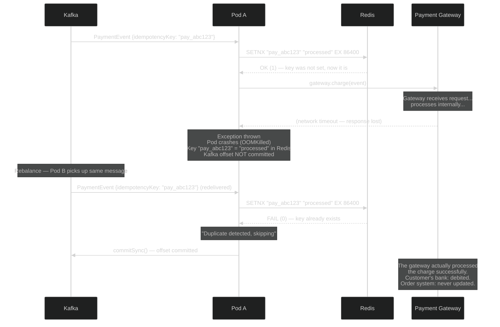
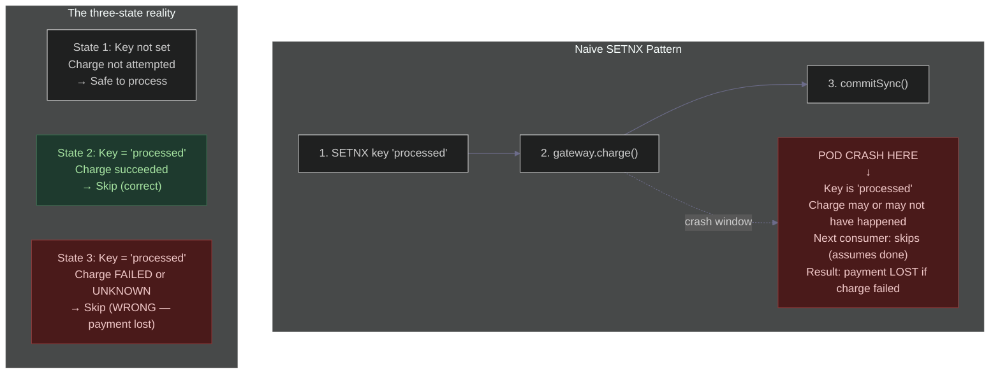
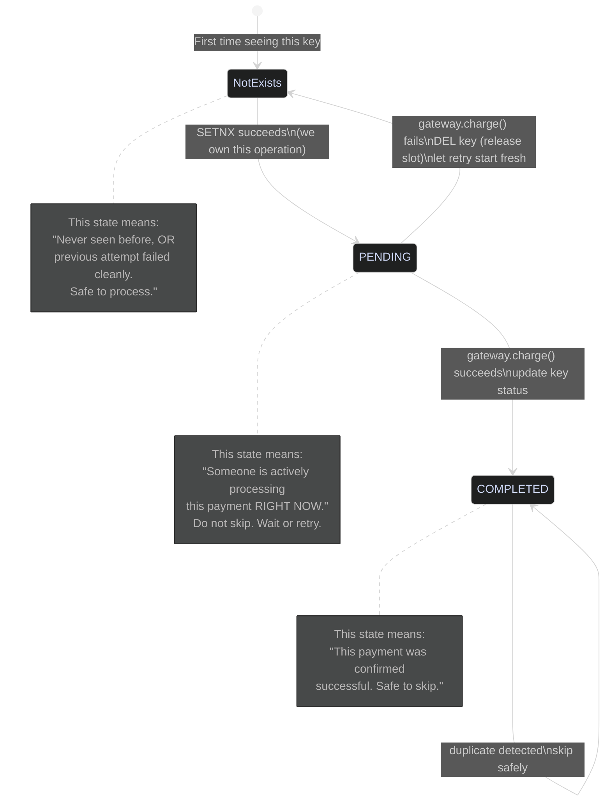
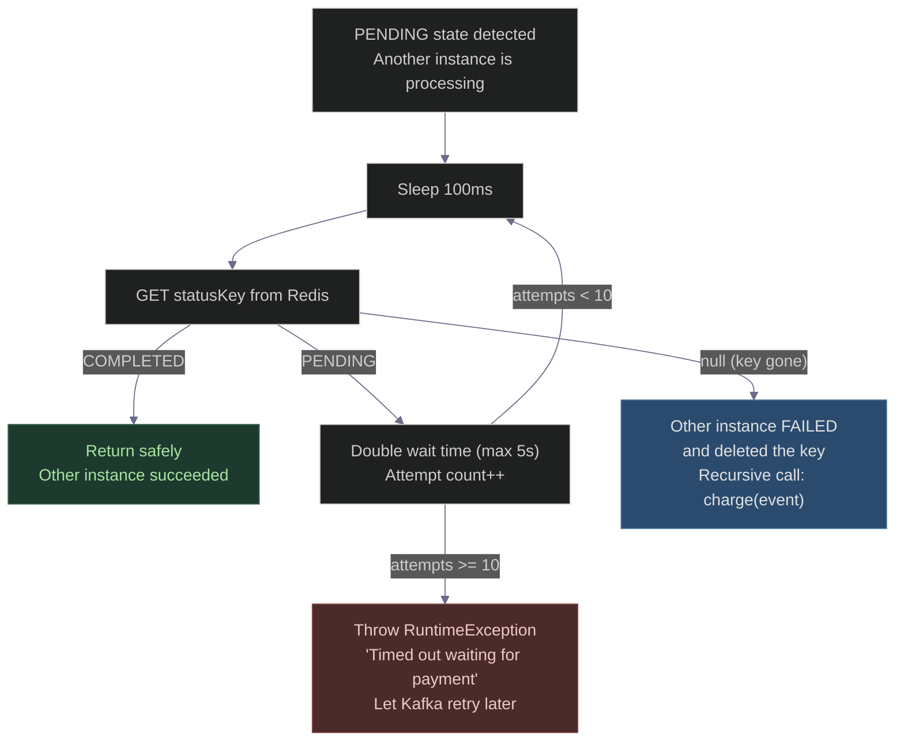
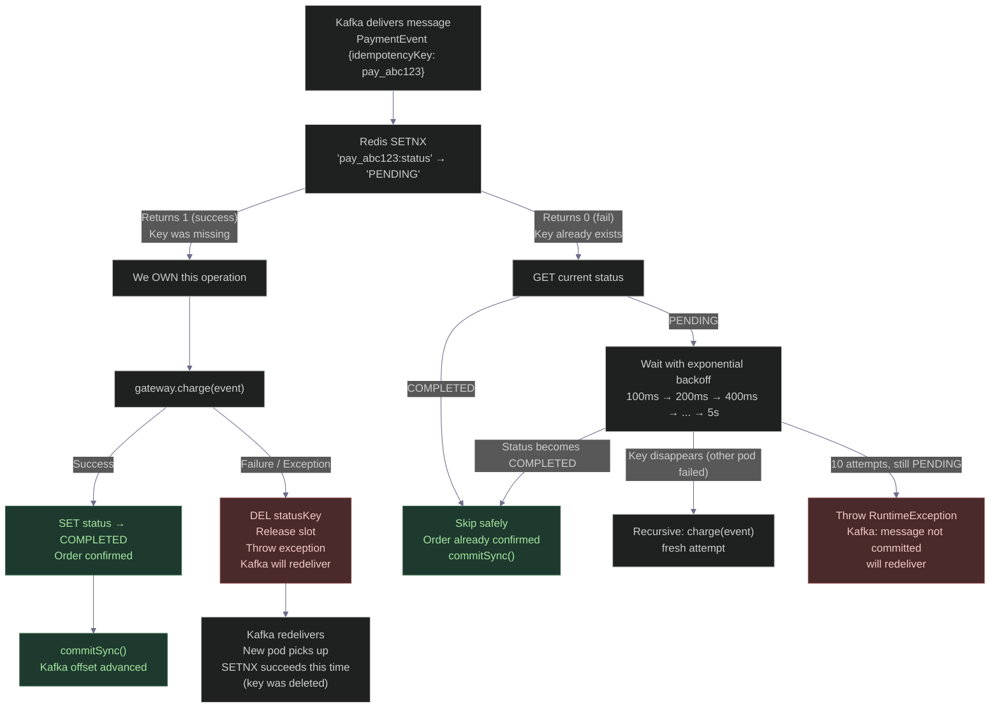
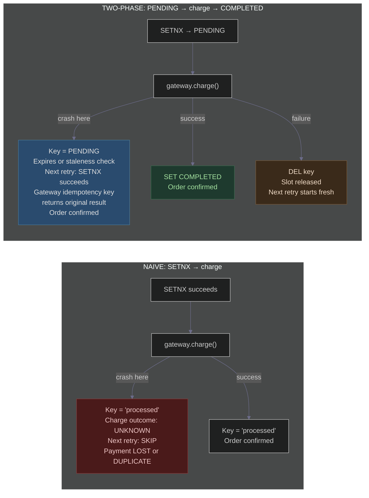
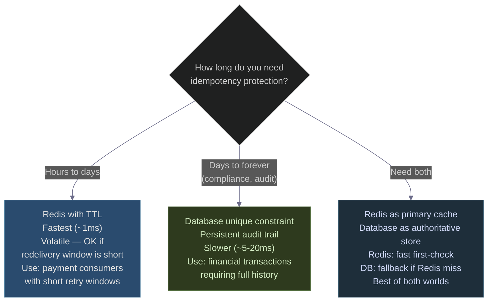

# The Idempotency Key That Lied
### Day 48 of 50 - System Design Interview Preparation Series

**By Sunchit Dudeja**

---

> *"I added an idempotency key. Duplicate payments are impossible now."*
>
> Six hours later: a payment that was charged to the customer's bank but never processed. Order stuck. Money taken. Customer furious. And the idempotency key is the reason it happened.

This is the story of the **fix that introduced a worse bug**. Rahul correctly identified that Kafka's at-least-once delivery could cause duplicate charges. He added a Redis check. The duplicate charge problem disappeared. But a new problem appeared — payments that vanish without a trace — and it took three days to find it.

The naive idempotency implementation is like a deadbolt on a glass door. It looks like security. It isn't.

---

## The Context: Why Rahul Added Idempotency

After a Kafka rebalance caused 1,000 duplicate charges (the full story is in [Day 49](./Day49_Kafka_OOM_Crash_Duplicate_Charge_Idempotency.md)), Rahul's team mandated that every payment consumer must be idempotent.

Rahul reads about Redis `SETNX` and implements what he thinks is the solution:

```java
// Rahul's "fix" — Version 1
public void charge(PaymentEvent event) {
    String idempotencyKey = event.getIdempotencyKey();

    // If key doesn't exist → set it and process
    // If key exists → already processed, skip
    if (redis.setnx(idempotencyKey, "processed", 86400)) {
        gateway.charge(event);   // call payment gateway
    } else {
        log.info("Duplicate detected, skipping: {}", idempotencyKey);
    }
}
```

He deploys it. Duplicate charges stop. The team celebrates.

Three days later, a customer emails:

> *"I tried to pay for my order twice because the first attempt showed an error. My bank shows one charge. But my order is still unpaid in your system. Where is my money?"*

---

## The Bug: What Actually Happened

The sequence looked like this:



**The timeline of the lie:**

| Time | What happened |
|------|---------------|
| T+0 | Redis `SETNX` succeeds — key set to `"processed"` |
| T+0.1 | `gateway.charge()` called — gateway receives it and charges the bank |
| T+0.5 | Network timeout — response from gateway never arrives |
| T+0.5 | Exception thrown — pod crashes |
| T+0.5 | Redis key = `"processed"` (was set before the charge) |
| T+30s | Kafka rebalances — Pod B picks up same message |
| T+30s | Pod B checks Redis — key exists — **skips the charge** |
| T+30s | Order never confirmed — customer's bank already debited |

The idempotency key said the payment was processed. The payment gateway did process it. But the order system never got the confirmation. **The key lied about the state.**

---

## Why the Naive SETNX Pattern Is Broken

The flaw is a race condition between three operations that need to be atomic but aren't:



The naive pattern collapses two fundamentally different states — "charge succeeded" and "charge was attempted but outcome unknown" — into the same Redis value. The idempotency key says `"processed"` but it actually means `"attempted"`.

Rahul calls **Meera**, his senior architect.

---

## The Midnight Call

**Rahul:** "Meera, I added the idempotency key like you said. Duplicates are fixed. But now we have missing payments — customers are charged but orders aren't confirmed."

**Meera:** "What does your Redis key say when the gateway call fails?"

**Rahul:** "'processed'."

**Meera:** "There's your problem. You set the key before you know if the operation succeeded. Your idempotency key isn't tracking 'this payment completed successfully' — it's tracking 'this payment was started.' Those are completely different states."

**Rahul:** "So I should set the key after the charge?"

**Meera:** "If you set it after, and the pod crashes between the charge and the Redis write, you get a duplicate charge on retry. You're back to the original problem. You need a key that has **three states** — not two."

---

## The Three States of an Idempotent Operation



**The key insight:** `PENDING` is a real, meaningful state. It means "someone owns this operation right now." It is not the same as `COMPLETED`. A consumer that sees `PENDING` must **wait** — not skip.

---

## The Fix: Two-Phase Idempotency

Meera redesigns the pattern. Instead of one Redis value, there are now three possible states for a key:

| Redis state | Meaning | Action |
|-------------|---------|--------|
| Key missing | Never processed, or previous attempt failed cleanly | Process it — you own it |
| `PENDING` | Currently being processed by another instance | Wait (exponential backoff) |
| `COMPLETED` | Successfully processed | Skip — return immediately |

```java
public void charge(PaymentEvent event) {
    String idempotencyKey = event.getIdempotencyKey();
    if (idempotencyKey == null || idempotencyKey.isBlank()) {
        throw new IllegalArgumentException("Idempotency key is required");
    }

    String statusKey = "payment:idempotent:" + idempotencyKey + ":status";

    // Phase 1: Reserve idempotency slot
    if (redis.setnx(statusKey, "PENDING", 86400)) {

        try {
            gateway.charge(event);                        // call payment gateway
            redis.set(statusKey, "COMPLETED");            // success — mark done
            redis.expire(statusKey, 86400);               // refresh TTL
            log.info("Payment completed: {}", idempotencyKey);

        } catch (Exception e) {
            // Gateway failed — delete the PENDING key so a retry can re-attempt
            redis.del(statusKey);
            log.error("Payment failed, slot released: {}", idempotencyKey, e);
            throw e;
        }

    } else {

        // Key already exists — check which state
        String status = redis.get(statusKey);

        if ("COMPLETED".equals(status)) {
            // Already processed successfully — skip safely
            log.info("Duplicate detected, skipping: {}", idempotencyKey);
            return;

        } else {
            // Still PENDING — another instance is processing right now
            // Wait and retry with exponential backoff
            waitForCompletion(statusKey, idempotencyKey, event);
        }
    }
}
```

---

## The waitForCompletion Logic



```java
private void waitForCompletion(String statusKey, String idempotencyKey, PaymentEvent event) {
    long backoffMs = 100;
    int maxAttempts = 10;

    for (int i = 0; i < maxAttempts; i++) {
        try {
            Thread.sleep(backoffMs);
        } catch (InterruptedException e) {
            Thread.currentThread().interrupt();
            throw new RuntimeException("Interrupted while waiting for payment completion", e);
        }

        String status = redis.get(statusKey);

        if ("COMPLETED".equals(status)) {
            // Other instance finished successfully
            log.info("Payment completed by another instance: {}", idempotencyKey);
            return;
        }

        if (status == null) {
            // Key disappeared — other instance failed and cleaned up
            // Restart the whole process — we can safely attempt it now
            log.warn("PENDING key gone, other instance failed — retrying: {}", idempotencyKey);
            charge(event);
            return;
        }

        // Still PENDING — back off and try again
        backoffMs = Math.min(backoffMs * 2, 5000);
    }

    throw new RuntimeException(
        "Timed out waiting for payment to complete: " + idempotencyKey
    );
}
```

---

## Full State Machine: Every Possible Scenario



---

## Crash Scenarios: Before vs After

### Scenario A: Pod crashes AFTER SETNX, BEFORE gateway call

```
Naive fix:   Key = "processed". Next retry: SKIP. Gateway never called. Payment LOST.
Two-phase:   Key = "PENDING". Next retry: SETNX returns 0, reads status = "PENDING".
             But wait — the original pod is dead. Nobody will update to COMPLETED.
             The key will sit as PENDING until TTL expires (24h).
             This is a problem. See the fix below.
```

**The fix for this edge case:** Set a shorter TTL on `PENDING` than on `COMPLETED`, and include a timestamp. A separate background job (or the `waitForCompletion` logic) treats a `PENDING` key older than N minutes as stale and deletes it.

```java
// When setting PENDING, store timestamp for staleness detection
redis.set(statusKey, "PENDING:" + System.currentTimeMillis(), 300); // 5-minute TTL for PENDING

// In waitForCompletion, check staleness
String status = redis.get(statusKey);
if (status != null && status.startsWith("PENDING:")) {
    long setAt = Long.parseLong(status.split(":")[1]);
    if (System.currentTimeMillis() - setAt > 60_000) {
        // PENDING for more than 60s — original pod is dead
        redis.del(statusKey);  // release the slot
        charge(event);         // restart fresh
        return;
    }
}
```

### Scenario B: Pod crashes AFTER gateway call, BEFORE SET COMPLETED

```
Naive fix:   Key = "processed". Next retry: SKIP. Gateway already charged.
             But order system was never updated. Identical to our bug.
Two-phase:   Key = "PENDING". Next retry: SETNX returns 0.
             waitForCompletion sees PENDING, waits...
             PENDING TTL expires (or staleness check triggers) → key deleted.
             Next retry: SETNX succeeds → gateway.charge() called again.
             Gateway: same idempotencyKey header → returns original charge result.
             No duplicate. Order confirmed.
```

This is why passing the idempotency key to the payment gateway is the **second layer** of protection:

```java
// Pass idempotency key to Stripe/payment gateway — they deduplicate too
StripeCharge charge = StripeCharge.create(
    params,
    RequestOptions.builder()
        .setIdempotencyKey(event.getIdempotencyKey())  // Stripe's deduplication
        .build()
);
```

### Scenario C: Two pods process the same message simultaneously (rebalance race)

```
Pod A: SETNX → returns 1 (owns it)
Pod B: SETNX → returns 0 (sees PENDING, enters waitForCompletion)

Pod A: gateway.charge() → success → SET COMPLETED
Pod B: waitForCompletion loop → reads COMPLETED → returns

Result: charge happens exactly once. Both pods handle it correctly.
```

---

## Naive vs Two-Phase: Side-by-Side



| Crash scenario | Naive `SETNX "processed"` | Two-phase `PENDING → COMPLETED` |
|----------------|--------------------------|----------------------------------|
| Crash before gateway call | Key set, retry skips → **payment lost** | Key PENDING, expires/staleness → retry processes correctly |
| Crash during gateway call | Key set, retry skips → **payment lost or duplicate** | Key PENDING, gateway deduplicates on retry → **exactly once** |
| Crash after gateway, before SET COMPLETED | Key set, retry skips → **order never confirmed** | Key PENDING, retry calls gateway again with same idempotency key → gateway returns original result → **order confirmed** |
| Crash after SET COMPLETED | Key set, retry skips → **correct** | Key COMPLETED, retry skips → **correct** |
| Normal success | Works | Works |

---

## Database Alternative: When Redis Isn't Enough

Redis is fast but volatile — if Redis itself crashes without persistence, keys are lost. For payment systems that need a permanent audit trail, use a database unique constraint:

```sql
-- Schema
CREATE TABLE payment_idempotency (
    idempotency_key VARCHAR(255)   PRIMARY KEY,
    status          VARCHAR(20)    NOT NULL DEFAULT 'PENDING',
    transaction_id  VARCHAR(255),
    created_at      TIMESTAMP      NOT NULL DEFAULT NOW(),
    updated_at      TIMESTAMP      NOT NULL DEFAULT NOW()
);

CREATE INDEX idx_status ON payment_idempotency(status, created_at);
```

```java
public void charge(PaymentEvent event) {
    String key = event.getIdempotencyKey();

    // Try to insert a PENDING row — unique constraint prevents double insert
    try {
        idempotencyRepo.insertPending(key);   // throws on duplicate key
    } catch (DataIntegrityViolationException e) {
        // Row exists — check status
        PaymentIdempotency existing = idempotencyRepo.findByKey(key);
        if ("COMPLETED".equals(existing.getStatus())) {
            return;   // already done
        }
        // PENDING — wait and check (same backoff logic)
        waitForCompletion(key, event);
        return;
    }

    // We inserted the PENDING row — we own this operation
    try {
        ChargeResult result = gateway.charge(event);
        idempotencyRepo.markCompleted(key, result.getTransactionId());
    } catch (Exception e) {
        idempotencyRepo.markFailed(key);  // allow retry
        throw e;
    }
}
```

The database approach gives you:
- **Persistence** — survives Redis restart
- **Auditability** — full history of attempts and outcomes
- **Consistency** — `INSERT ... ON CONFLICT` is atomic at the database level

The trade-off is latency — a database write per message vs a Redis operation.

---

## The Architecture Decision: Redis vs Database



---

## Rahul's Updated Runbook

```yaml
# Idempotency Implementation Standards — PayFlow
# Updated after missing payment incident

idempotency_key_rules:
  must_be:
    - unique per logical operation (not per retry attempt)
    - derived from the event, not generated at processing time
    - format: "payment:{orderId}" or use event.getIdempotencyKey()
  must_not_be:
    - a random UUID generated in the consumer (new UUID per retry = no deduplication)
    - based on timestamps alone (two events in the same millisecond = collision)

redis_pattern:
  wrong: "SETNX key 'processed'"   # collapses PENDING and COMPLETED into one value
  correct: "SETNX key 'PENDING' → charge → SET key 'COMPLETED'"

crash_recovery:
  on_gateway_success_before_SET_COMPLETED:
    - key stays PENDING
    - staleness check or PENDING TTL expires
    - next retry: SETNX succeeds
    - gateway deduplication key returns original result
    - order confirmed, exactly once

  on_gateway_failure:
    - catch exception
    - DEL the PENDING key
    - throw exception
    - Kafka will redeliver
    - next retry: SETNX succeeds, fresh attempt

pending_state_timeout:
  pending_ttl: 300          # 5 minutes — shorter than COMPLETED TTL
  completed_ttl: 86400      # 24 hours
  staleness_threshold: 60s  # if PENDING for > 60s, original pod is dead

gateway_idempotency:
  always_pass: true
  header: "Idempotency-Key: {event.getIdempotencyKey()}"
  why: "Second layer of protection if Redis key expires before retry"

monitoring:
  alert_on:
    - PENDING keys older than 5 minutes (stuck operations)
    - Charge attempts where Redis was unavailable (fallback needed)
    - Gateway returns 'already_processed' (tells you retries are happening)
```

---

## The Five Questions Every Interviewer Wants You to Answer

**Q1: What is the flaw in `SETNX key "processed"` before calling the payment gateway?**

A: `SETNX` before the operation collapses two distinct states — "successfully completed" and "attempted but outcome unknown" — into the same Redis value. If the gateway call fails after `SETNX` succeeds, the key is already set. On retry, the consumer sees the key, assumes the payment was processed, and skips it. The customer was never charged but the order is permanently stuck. You need a `PENDING` state that explicitly means "in progress" and is cleaned up on failure.

**Q2: What should happen when a consumer sees a `PENDING` key?**

A: It means another instance is currently processing that operation. The consumer should wait with exponential backoff, periodically checking if the status changes to `COMPLETED`. If the key disappears (the other instance failed and deleted it), the consumer should retry the full operation. If it times out after N attempts, it should throw an exception without committing the Kafka offset, so Kafka redelivers the message later.

**Q3: What happens if the pod crashes after `gateway.charge()` succeeds but before `SET COMPLETED`?**

A: The key remains `PENDING`. When the `PENDING` TTL expires (or a staleness check triggers), the key is deleted. The next retry calls `gateway.charge()` again with the same idempotency key header — the payment gateway recognizes the key and returns the original transaction result without creating a new charge. This is why passing the idempotency key to the gateway is the essential second layer — it handles the exact crash window between the charge and the Redis update.

**Q4: When would you use a database instead of Redis for idempotency keys?**

A: When you need persistent audit trail (financial compliance), when the retry window exceeds Redis's safe TTL period, or when Redis itself is a single point of failure without persistence configured. The trade-off is speed: Redis operations are ~1ms; database writes are ~5–20ms. For high-throughput consumers, Redis with a short `PENDING` TTL is usually the right choice, with the payment gateway's own idempotency as the safety net.

**Q5: Why must the idempotency key come from the event, not be generated in the consumer?**

A: If the consumer generates a new random UUID for each processing attempt, each retry gets a different key. The deduplication check never matches. The whole pattern fails — you're back to at-least-once with no protection. The key must be deterministic: same event always produces the same key. Use `event.getIdempotencyKey()`, or derive it from `orderId` + `amount` + a stable identifier. The producer is responsible for guaranteeing this uniqueness.

---

## The Architect's Golden Rules for Idempotency

| Rule | The Wrong Move | The Right Move |
|------|---------------|----------------|
| Key timing | `SETNX "processed"` before operation | `SETNX "PENDING"` → operate → `SET "COMPLETED"` |
| Failure handling | Leave `PENDING` on failure | `DEL` the key on exception — release the slot |
| `PENDING` state | Treat as "already processed" | Wait with backoff — it means in-progress |
| Key source | Generate UUID in the consumer | Extract from event — must be deterministic |
| TTL strategy | One TTL for all states | Short TTL for `PENDING` (5 min), long for `COMPLETED` (24h) |
| Gateway calls | No idempotency header | Always pass idempotency key to the gateway |
| Store choice | Redis only | Redis as fast cache + DB as authoritative fallback |

---

## The 30-Second Takeaway

> *The naive idempotency key doesn't prevent duplicates. It prevents retries — which is worse. A duplicate charge costs a refund. A skipped charge costs a customer.*
>
> *Real idempotency has three states: not seen, in progress, done. The key you store must reflect reality — not optimism.*
>
> *SETNX → PENDING. On success: COMPLETED. On failure: DELETE. On retry: wait. That's the pattern. Everything else is a bug with a deadline.*

---

## Connecting to Previous Days

| Day | Topic | Why It's Related |
|-----|-------|-----------------|
| [Day 27](./Day27_Two_Phase_Commit.md) | Two-Phase Commit | The PENDING→COMPLETED pattern mirrors 2PC's prepare→commit phases |
| [Day 39](./Day39_Outbox_Pattern_Reliable_Messaging.md) | Outbox Pattern | Alternative to idempotency keys: write charge + event atomically to DB |
| [Day 41](./Day41_ACID_vs_BASE_Instagram_CAP.md) | ACID vs BASE | Idempotency is how you achieve ACID-like guarantees in a BASE distributed system |
| [Day 49](./Day49_Kafka_OOM_Crash_Duplicate_Charge_Idempotency.md) | Kafka OOM duplicate charge | What happens when you have NO idempotency — the problem this day's fix solves |

---

## Day 48 Action Items

1. **Find every `SETNX "processed"` in your codebase.** If you have any pattern that sets an idempotency key before calling the external service, you have this bug. Audit it now — not when a customer reports a missing payment.

2. **Test crash-between-SETNX-and-charge.** Write a test that: sets the key, throws an exception before the gateway call, then retries. Does the retry attempt the charge? It should. If it skips, you have the naive pattern bug.

3. **Check your payment gateway calls.** Do they include an idempotency key header? If not, you are one network timeout away from a double charge that bypasses all your Redis checks.

---

*— Sunchit Dudeja*
*Day 48 of 50: System Design Interview Preparation Series*
