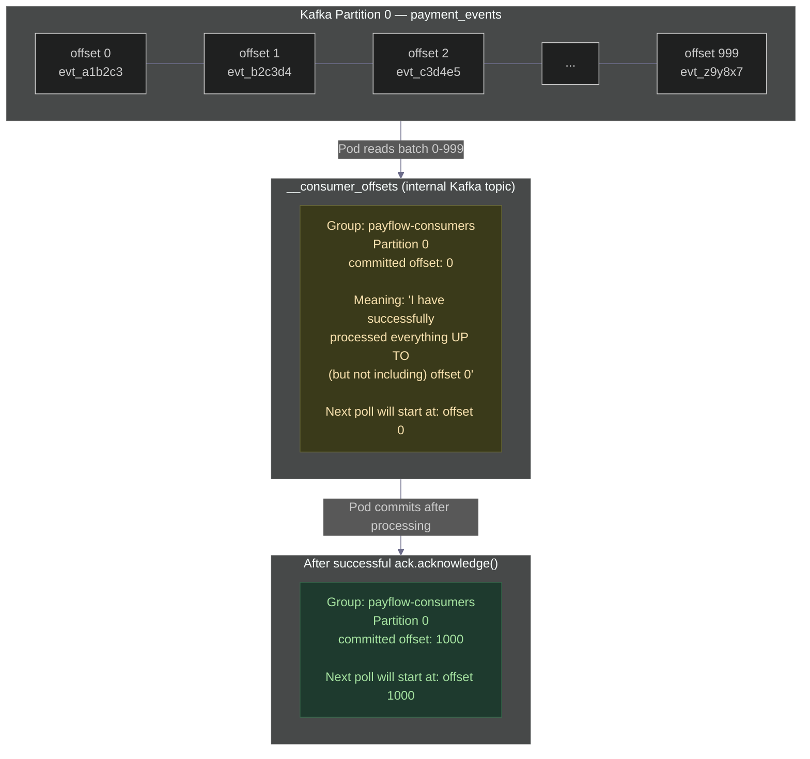
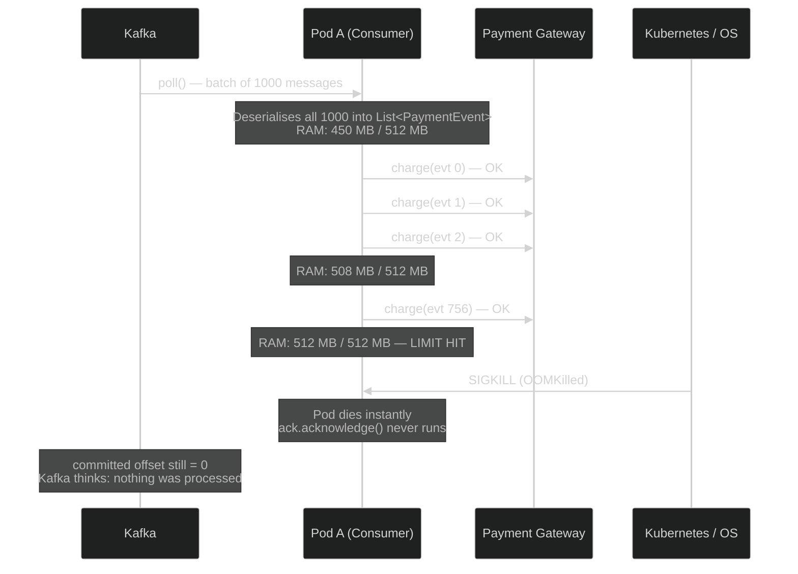
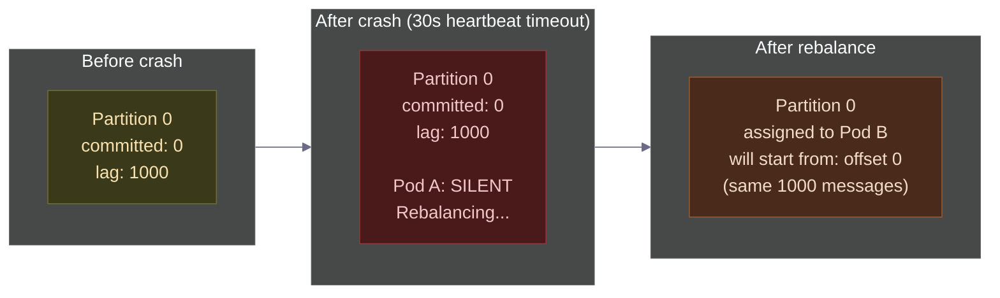
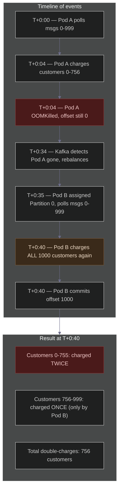
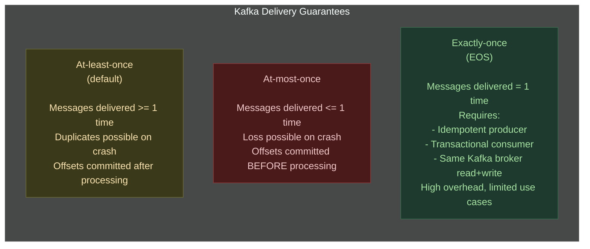
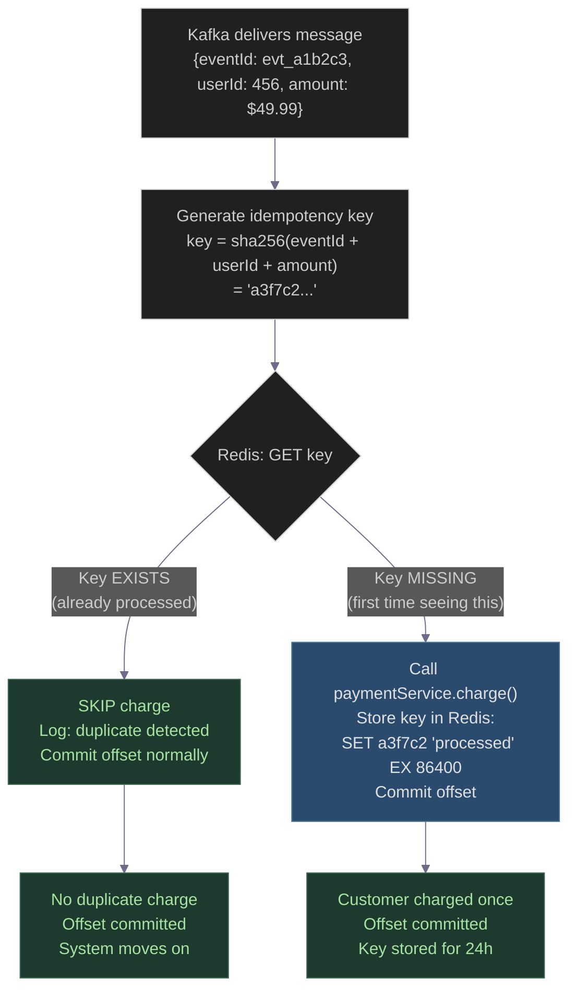
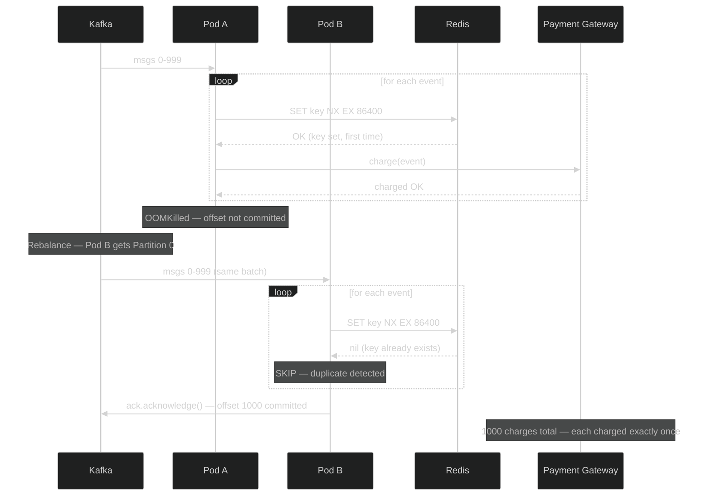
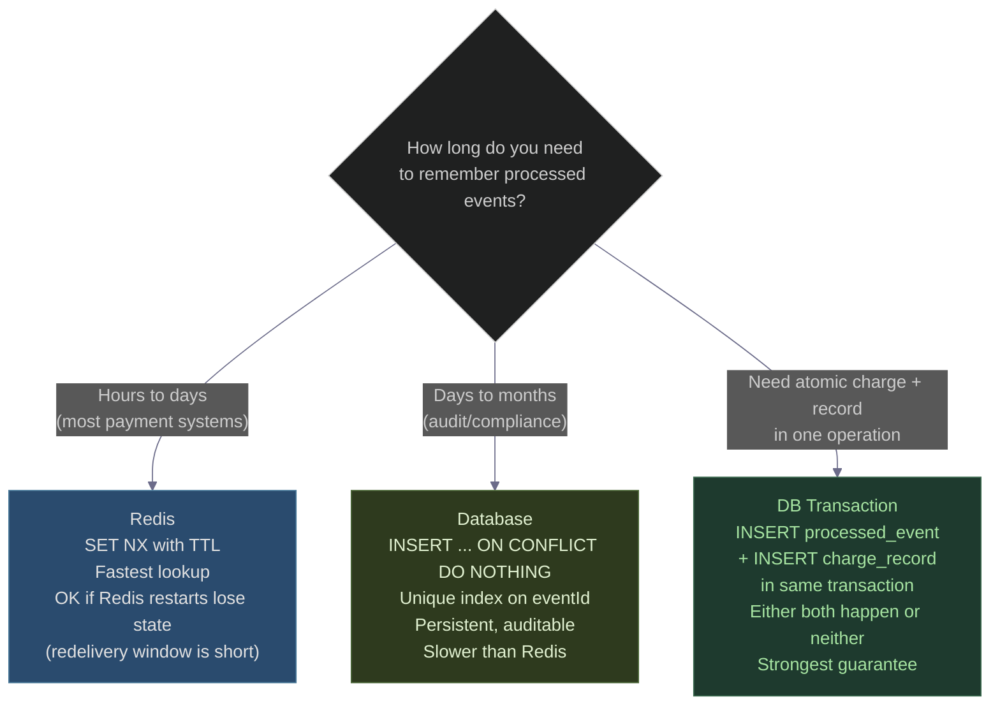
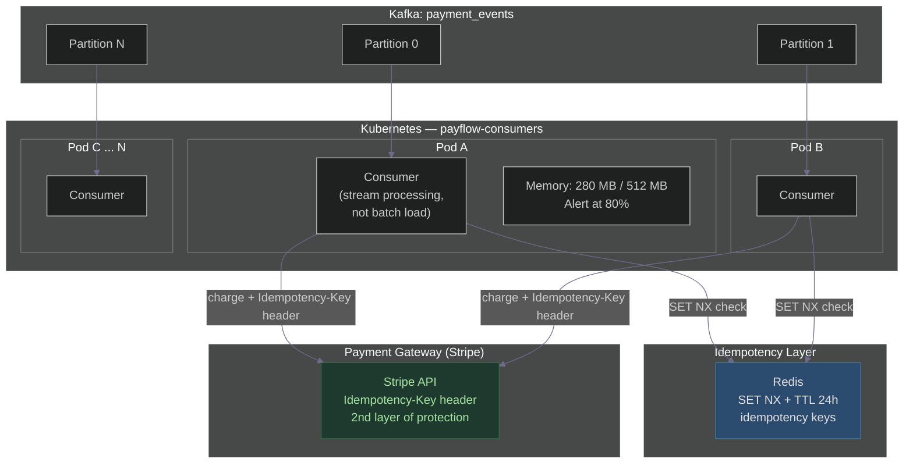

# The Kafka OOM Crash That Charged 1000 Customers Twice
### Day 49 of 50 - System Design Interview Preparation Series

**By Sunchit Dudeja**

---

> *"I processed the messages. The charges went through. Then the pod crashed. And Kafka sent every single one of those messages again."*

This is the story of a silent guarantee that most engineers don't think about until it's too late. Kafka promises **at-least-once delivery** — not exactly-once. If your consumer crashes before committing offsets, every message it processed will be redelivered to the next consumer. If those messages trigger a payment charge, that charge will happen twice.

One pod crash. One missing `commitSync()`. 1000 customers charged twice. A fraud flag from the payment gateway. And a very long night.

> **Excalidraw diagram (dark background):** [day47-kafka-duplicate-charge-crash.excalidraw](./day47-kafka-duplicate-charge-crash.excalidraw) — open at [excalidraw.com](https://excalidraw.com)

---

## The Setup: PayFlow's Payment Consumer

PayFlow processes payment events from Kafka. Each event represents a customer completing a purchase:

```json
{
  "eventId": "evt_a1b2c3",
  "userId": "user_456",
  "amount": 49.99,
  "currency": "USD",
  "cardToken": "tok_visa_xxxx4242",
  "orderId": "ord_789"
}
```

The consumer group `payflow-consumers` has 10 pods, each reading from `payment_events`. Rahul, a junior developer, wrote the consumer six months ago and it has been working fine:

```java
@KafkaListener(topics = "payment_events", groupId = "payflow-consumers")
public void consume(List<ConsumerRecord<String, PaymentEvent>> records,
                    Acknowledgment ack) {
    for (ConsumerRecord<String, PaymentEvent> record : records) {
        PaymentEvent event = record.value();
        paymentService.charge(event);   // calls payment gateway
    }
    ack.acknowledge();   // commit offsets AFTER processing all records
}
```

The logic is simple: process all records in the batch, then commit. This is textbook Kafka consumer code. The problem isn't the logic — it's what happens when the pod dies between the `charge()` call and the `ack.acknowledge()`.

---

## What Kafka's Offset Commit Actually Does

Before we get to the crash, let's understand exactly what committing an offset means — because this is the thing most engineers have a fuzzy mental model of.



**The critical detail:** The committed offset is a bookmark. It says "everything before this offset has been handled." If the pod crashes before moving that bookmark, Kafka assumes none of it was handled — and will redeliver everything from the last committed position.

Kafka has no visibility into your payment gateway. It cannot know that `paymentService.charge()` already succeeded. All it can see is the offset bookmark.

---

## The Crash: Scene by Scene

### The pod's memory climbs

PayFlow is running a Black Friday promotion. Traffic is 8× normal. Rahul's consumer was loading the full batch of 1000 records into memory before processing:

```java
// Rahul's consumer — loads entire batch into an in-memory list
List<PaymentEvent> events = records.stream()
    .map(r -> objectMapper.readValue(r.value(), PaymentEvent.class))
    .collect(Collectors.toList());  // all 1000 objects in RAM simultaneously

for (PaymentEvent event : events) {
    paymentService.charge(event);
}
ack.acknowledge();
```

Each `PaymentEvent` object, after deserialisation, holds the full order context — items, address, card metadata — about 200 KB per object. 1000 objects × 200 KB = 200 MB just for the batch. Add the running JVM overhead and the pod hits its 512 MB limit.



### What Kubernetes sees

```
NAME            READY   STATUS      RESTARTS   AGE
payflow-pod-3   0/1     OOMKilled   0          4m12s
```

Kubernetes marks the pod as `OOMKilled`. The container is restarted (or a new pod takes its place). But here's what Kubernetes does **not** do: tell Kafka that 756 charges already went through.

### What Kafka sees



After the heartbeat timeout (default 30 seconds), the Kafka Group Coordinator triggers a rebalance. Pod B is assigned Partition 0 and told to start reading from offset 0 — because that's the last committed position. It fetches the same 1000 messages and calls `paymentService.charge()` for every single one.

---

## The Double Charge



---

## The Fallout

Within the hour:

**Customer support** receives 756 tickets:

```
Subject: I was charged twice for my order
Body: I just got two notifications from my bank for the same order.
      One at 12:04 AM and another at 12:05 AM. Both for $49.99.
      Please refund immediately.
```

**The payment gateway** flags PayFlow:

```
ALERT: Chargeback rate anomaly detected
Merchant: PayFlow (merchant_id: pf_8821)
Expected chargeback rate: < 1%
Observed chargeback rate: 18.4% (last 60 minutes)
Action: Account under review — new charges may be held
```

At 18.4% chargeback rate, PayFlow is now in the payment gateway's fraud review queue. If it crosses 20%, charges are blocked entirely — meaning the real customers trying to pay right now will also fail.

**The PagerDuty alert fires:**

```
[CRITICAL] Payment gateway chargeback rate: 18.4%
[CRITICAL] Customer support ticket volume: +756 in 60 minutes
[WARNING]  Kafka consumer lag: 0 (caught up — but damage done)
```

Rahul gets the call at 1 AM.

---

## The Midnight Call

**Rahul:** "Meera, something's wrong. Customers are getting charged twice. The Kafka lag is zero — the consumer caught up — but the support queue is on fire."

**Meera:** "Did any pods crash in the last hour?"

**Rahul:** "Yes, pod-3 was OOMKilled at 12:04 AM."

**Meera:** "And you're committing offsets after processing the full batch?"

**Rahul:** "Yes, that's what the docs say — process everything, then acknowledge."

**Meera:** "That's correct. But you're calling the payment gateway inside the loop before committing. When the pod died, the charges had gone through but the offset hadn't moved. Kafka redelivered everything to the next pod."

**Rahul:** "So Kafka sent the same messages twice because I didn't commit in time?"

**Meera:** "That's exactly what happened. And this isn't a bug — it's a guarantee. Kafka guarantees at-least-once delivery. It will **never** lose a message. But it will **sometimes** deliver it more than once. Your consumer has to be ready for that. It has to be idempotent."

---

## Why This Is a Guarantee, Not a Bug



At-least-once is the right default for most systems — you never lose a payment event. But it means your consumer **must** handle receiving the same message more than once without performing the side effect twice.

This property is called **idempotency**: applying the same operation multiple times produces the same result as applying it once.

```
Idempotent:     SET user.name = "Alice"  →  result is the same no matter how many times you run it
Not idempotent: charge(user, $49.99)     →  each call creates a new charge
```

A payment charge is not idempotent. Calling it twice charges twice. Rahul needed to **make it idempotent** by wrapping it with a deduplication check.

---

## The Fix: Idempotency Key

The solution is to store a record of what you've already processed, keyed by something unique to the message, and check that record before taking action.



Here's Meera's updated consumer code:

```java
@Service
public class PaymentConsumer {

    @Autowired private PaymentService paymentService;
    @Autowired private RedisTemplate<String, String> redisTemplate;
    @Autowired private ObjectMapper objectMapper;

    private static final Duration IDEMPOTENCY_TTL = Duration.ofHours(24);
    private static final String KEY_PREFIX = "payment:processed:";

    @KafkaListener(topics = "payment_events", groupId = "payflow-consumers")
    public void consume(List<ConsumerRecord<String, PaymentEvent>> records,
                        Acknowledgment ack) {
        for (ConsumerRecord<String, PaymentEvent> record : records) {
            processWithIdempotency(record.value());
        }
        ack.acknowledge();   // commit only after all records handled safely
    }

    private void processWithIdempotency(PaymentEvent event) {
        String idempotencyKey = buildKey(event);

        // SET key value EX ttl NX  — atomic: set ONLY if Not eXists
        Boolean isNew = redisTemplate.opsForValue()
            .setIfAbsent(idempotencyKey, "processed", IDEMPOTENCY_TTL);

        if (Boolean.FALSE.equals(isNew)) {
            // Key already existed — this message was already processed
            log.warn("Duplicate message detected, skipping. eventId={} userId={}",
                event.getEventId(), event.getUserId());
            return;
        }

        try {
            paymentService.charge(event);
        } catch (Exception e) {
            // Charge failed — delete the key so it can be retried
            redisTemplate.delete(idempotencyKey);
            throw e;   // rethrow to prevent offset commit for this record
        }
    }

    private String buildKey(PaymentEvent event) {
        // Key must be deterministic and unique per logical operation
        // Using eventId alone is sufficient if your producer guarantees uniqueness
        // Adding userId + amount as extra safety for corrupted eventId edge cases
        return KEY_PREFIX + event.getEventId()
             + ":" + event.getUserId()
             + ":" + event.getAmount();
    }
}
```

**Why `setIfAbsent` (SET NX)?** This is an atomic Redis operation. It sets the key only if it doesn't already exist. If two pods somehow race to process the same event simultaneously (during a rebalance), only one will get `true` back — the other will see `false` and skip. No double charge even under concurrent redelivery.

---

## What Happens on Redelivery Now



The second pod processes the entire batch in milliseconds — every `setIfAbsent` returns `nil` (key already exists), every event is skipped, the offset is committed, and no customer sees a duplicate charge.

---

## The Three Root Causes (Addressing All of Them)

The crash exposed three separate issues. Fixing only the idempotency key fixes the symptom. Rahul and Meera addressed all three:

### Root cause 1: Loading entire batch into memory

```java
// BEFORE — 1000 objects in RAM at once
List<PaymentEvent> events = records.stream()
    .map(r -> objectMapper.readValue(r.value(), PaymentEvent.class))
    .collect(Collectors.toList());

// AFTER — process one record at a time, GC can collect as you go
for (ConsumerRecord<String, PaymentEvent> record : records) {
    PaymentEvent event = objectMapper.readValue(record.value(), PaymentEvent.class);
    processWithIdempotency(event);
    // event goes out of scope, eligible for GC before next iteration
}
```

### Root cause 2: No idempotency on the charge call

Covered above — Redis `SET NX` idempotency key with 24-hour TTL.

### Root cause 3: No memory limit alarm

```yaml
# Kubernetes pod spec — before: no resources block
resources:
  requests:
    memory: "256Mi"
    cpu: "500m"
  limits:
    memory: "512Mi"    # already existed — but no alerting
    cpu: "1000m"

# Prometheus alert Meera added
- alert: PodMemoryPressure
  expr: |
    container_memory_working_set_bytes{container="payflow-consumer"}
    / container_spec_memory_limit_bytes{container="payflow-consumer"} > 0.80
  for: 2m
  labels:
    severity: warning
  annotations:
    summary: "Pod memory > 80% of limit — OOMKill risk"
    description: "Pod {{ $labels.pod }} is at {{ $value | humanizePercentage }} memory"
```

Now the team gets a warning alert when any pod crosses 80% memory — before it reaches 100% and gets killed.

---

## Choosing Your Idempotency Store

Redis is not the only option. The right store depends on your requirements:



**Redis** is the right default for payment consumers: sub-millisecond lookup, TTL-based expiry, and `SET NX` is atomic. If Redis restarts and loses the key, the worst case is a rare duplicate in the window between crash and TTL expiry — which you can detect via your payment gateway's deduplication (most gateways support an idempotency key header).

**Database with unique constraint** is better when you need a permanent audit trail:

```sql
CREATE TABLE processed_payment_events (
    event_id     VARCHAR(64) PRIMARY KEY,
    user_id      BIGINT NOT NULL,
    amount       DECIMAL(10,2) NOT NULL,
    processed_at TIMESTAMP NOT NULL DEFAULT NOW()
);

-- In your consumer (pseudocode):
INSERT INTO processed_payment_events (event_id, user_id, amount)
VALUES ($eventId, $userId, $amount)
ON CONFLICT (event_id) DO NOTHING;

-- Check rows_affected:
-- 1 = first time, proceed to charge
-- 0 = duplicate, skip
```

---

## Passing the Idempotency Key to the Payment Gateway

Most production payment gateways (Stripe, Braintree, Adyen) support an **idempotency key header** natively. This is a second layer of protection:

```java
// Stripe example — idempotency key passed in the API request header
RequestOptions options = RequestOptions.builder()
    .setIdempotencyKey(event.getEventId())  // Stripe deduplicates on their side too
    .build();

Charge charge = Charge.create(params, options);
```

With this in place, even if your Redis check somehow fails and both pods call the gateway, Stripe sees the same idempotency key twice and returns the original charge result for the second call rather than creating a new charge. You now have **two layers** of protection:

1. Your Redis check (catches duplicates before they hit the gateway)
2. The gateway's idempotency key (catches anything that slips through)

---

## The Updated Consumer Architecture



---

## Kafka's Exactly-Once Semantics (EOS): When to Use It

You might be wondering: doesn't Kafka support exactly-once delivery? Why not just use that?

It does — but with significant constraints:

```yaml
# Exactly-once requires ALL of the following:
producer:
  enable.idempotence: true          # deduplicates producer retries
  transactional.id: "payflow-txn"   # enables transactions

consumer:
  isolation.level: read_committed   # only read committed transaction data
  # Must read AND write to Kafka in the same transaction
  # e.g.: read from payment_events, write to payments_processed

limitation:
  - "EOS only guarantees exactly-once between Kafka topics"
  - "The moment you call an external API (payment gateway), you're outside Kafka"
  - "No transaction can span Kafka + external HTTP call"
  - "For external side effects, idempotency key is the only correct solution"
```

**The rule:** Kafka's exactly-once semantics work for **Kafka-to-Kafka** pipelines (stream processing, topology transforms). The moment you talk to an external system — a payment gateway, a database, an email service — you must implement idempotency yourself. There is no other way.

---

## Rahul's Updated Runbook

```yaml
# Kafka Consumer Safety Checklist — PayFlow
# Updated after Black Friday OOM incident

memory_management:
  - "Never collect the full batch into List<T> in memory"
  - "Process records one at a time — let GC collect as you go"
  - "Set JVM heap: -Xmx400m for a 512m container limit"
  - "Alert at 80% memory usage, not 100%"

idempotency:
  rule: "Every non-idempotent side effect MUST have an idempotency check"
  non_idempotent_operations:
    - "Payment charges"
    - "Email / SMS sends"
    - "External API calls that mutate state"
    - "Database inserts (use ON CONFLICT DO NOTHING)"
  implementation:
    primary: "Redis SET NX with TTL matching your redelivery window"
    secondary: "Pass eventId as Idempotency-Key header to payment gateway"
    key_format: "PREFIX:eventId:userId:amount"
    ttl: "24h (must be longer than max rebalance + retry window)"

offset_commit:
  - "Always commit AFTER processing, not before"
  - "at-least-once: correct default — never lose a message"
  - "at-most-once: only if losing messages is acceptable (rare)"
  - "exactly-once: only for Kafka-to-Kafka, not external calls"

on_crash_recovery:
  - "OOMKill = offset not committed = redelivery guaranteed"
  - "Idempotency key prevents duplicate side effects"
  - "Monitor pod restarts: alert if restarts > 2 in 10 minutes"

testing:
  - "Write a test that kills the consumer mid-batch and verifies no duplicate charges"
  - "Load test with realistic event sizes — not just event count"
  - "Simulate rebalance during processing and verify idempotency key prevents duplicates"
```

---

## The Five Questions Every Interviewer Wants You to Answer

**Q1: Kafka delivers the same message twice. How?**

A: By design. Kafka's default guarantee is at-least-once. If a consumer processes a message but crashes before committing the offset, the next consumer assigned to that partition will re-read from the last committed offset and reprocess those messages. This is not a bug — it's the correct behaviour to prevent message loss.

**Q2: What is an offset commit and why does it matter?**

A: An offset commit writes a bookmark to Kafka's internal `__consumer_offsets` topic saying "I have successfully processed everything up to this offset." If a consumer crashes before committing, the bookmark doesn't move, and the next consumer starts from the old position. Committing before processing (at-most-once) risks losing messages. Committing after processing (at-least-once) risks duplicates on crash. The right choice is at-least-once + idempotency.

**Q3: What is idempotency and why does a Kafka consumer need it?**

A: An operation is idempotent if applying it multiple times produces the same result as applying it once. A payment charge is not idempotent — calling it twice charges twice. A Kafka consumer that triggers external side effects (charges, emails, DB writes) must wrap those calls with a deduplication check so that redelivered messages don't re-execute the side effect.

**Q4: How do you implement idempotency in a payment consumer?**

A: Generate a deterministic key from the event (e.g., `sha256(eventId + userId + amount)`). Before the charge, do `Redis SET NX key "processed" EX 86400`. If the key was already set (returns `nil`/`false`), skip the charge. If it wasn't set (returns `OK`/`true`), proceed. This is atomic — even if two pods race on the same message during a rebalance, only one will succeed the `SET NX`.

**Q5: Why can't you use Kafka's exactly-once semantics for payment charges?**

A: Kafka's EOS guarantees exactly-once delivery between Kafka topics within a transactional batch. It cannot coordinate with external systems. A payment gateway call is an HTTP request outside Kafka's transaction boundary. There is no distributed transaction that spans Kafka and Stripe. For external side effects, idempotency key is the only correct pattern.

---

## The Architect's Golden Rules

| Rule | Why |
|------|-----|
| Treat every Kafka message as potentially a duplicate | At-least-once is the default; design for it from day one |
| Idempotency key before every non-idempotent side effect | OOMKill, network partition, rebalance — all cause redelivery |
| `SET NX` in Redis, not `GET` then `SET` | Atomic check-and-set prevents race conditions during rebalance |
| Pass idempotency key to the payment gateway too | Two layers of protection against duplicate charges |
| Stream records, don't batch-load into memory | Loading 1000 objects at once is how you cause the OOM in the first place |
| Alert at 80% memory, not 100% | At 100% the pod is already dead |
| Test crash-and-redelivery explicitly | Happy-path tests don't cover OOM crashes mid-batch |

---

## The 30-Second Takeaway

> *Kafka never loses your messages. It will deliver them at least once — and sometimes twice.*
>
> *Every Kafka consumer that touches the outside world (payments, emails, APIs) must be idempotent. Store a processed key in Redis before the side effect. Check for it on every message. Design for the crash — because the crash will come.*

---

## Connecting to Previous Days

| Day | Topic | Why It's Related |
|-----|-------|-----------------|
| [Day 27](./Day27_Two_Phase_Commit.md) | Two-phase commit | Why distributed transactions across Kafka + payment gateway are impractical |
| [Day 34](./Day34_Kafka_Partition_Assignment_And_Rebalancing.md) | Kafka rebalancing | The rebalance is what triggers redelivery after the crash |
| [Day 39](./Day39_Outbox_Pattern_Reliable_Messaging.md) | Outbox pattern | Alternative to at-least-once: write to DB + outbox atomically, then publish |
| [Day 46](./Day46_Kafka_Message_Ordering_Partitions_Architects_Know.md) | Kafka ordering | Ordering + idempotency together: the full picture of safe Kafka consumers |

---

## Day 49 Action Items

1. **Audit your Kafka consumers.** Find every place a consumer calls an external API or writes to a database. Does it have an idempotency check? If not — that's a ticking time bomb.

2. **Simulate an OOM crash.** In staging, set the pod memory limit artificially low, send a large batch, and verify that after the pod is killed and a new one picks up, no duplicate side effects occur.

3. **Design challenge.** Your email service consumes from a Kafka topic and sends welcome emails. The consumer crashes mid-batch. Design the idempotency check. What is the key? Where do you store it? What TTL? What happens if Redis itself goes down?

---

*— Sunchit Dudeja*
*Day 49 of 50: System Design Interview Preparation Series*
