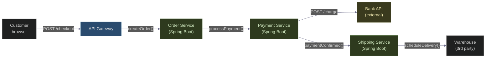
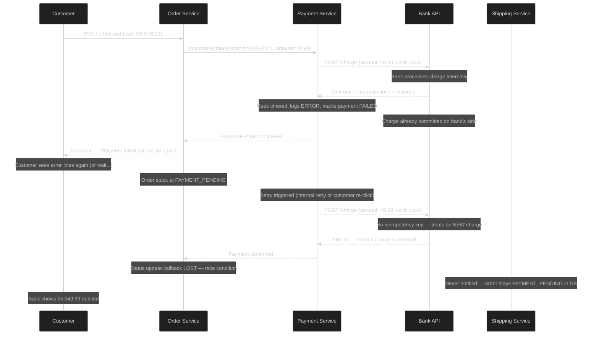
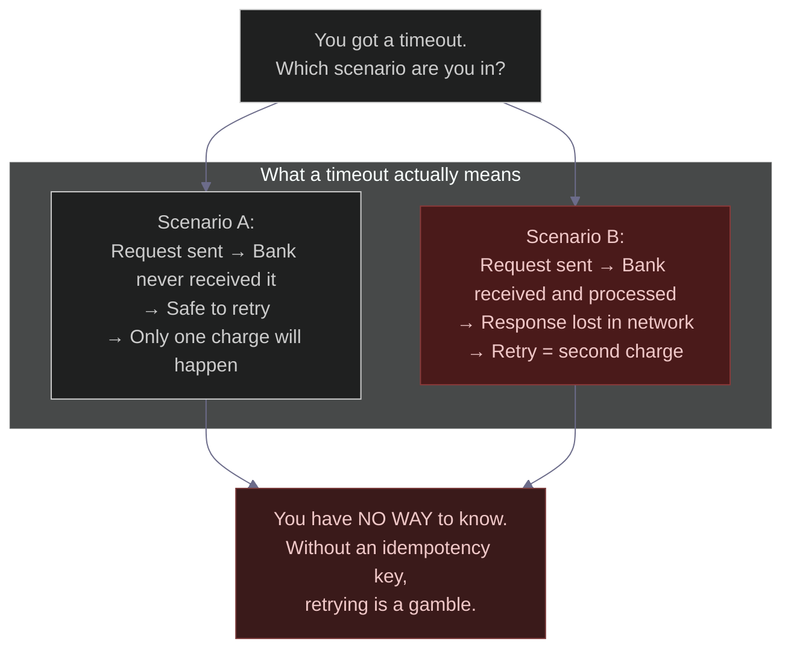
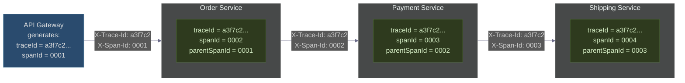
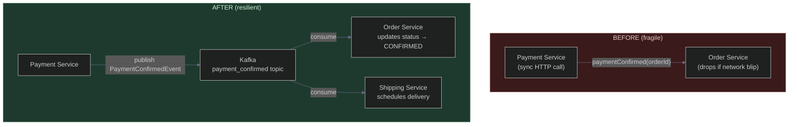
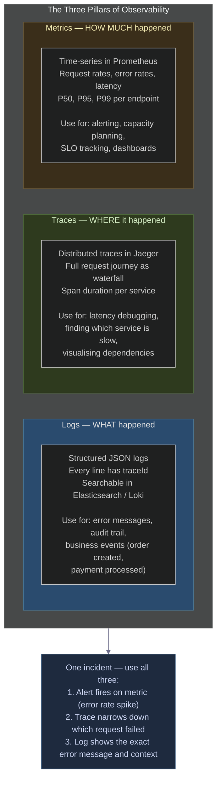

# One Request. A Thousand Logs. Zero Answers.
### Day 50 of 50 - System Design Interview Preparation Series

**By Sunchit Dudeja**

---

> *"I can just look at each service's logs and correlate them manually. We have orderId in every log line."*
>
> This sentence turns a 5-minute bug fix into a 5-hour treasure hunt — and on a bad day, it turns a double-charge incident into a complete blind spot that nobody finds until the customer calls.

We made it to Day 50. And I saved this one for last because it's the problem that makes every other problem worse. You can have the best architecture in the world — Kafka, idempotency keys, circuit breakers, the works — and one missing field in your logs will make debugging any incident feel like defusing a bomb in the dark.

The field is called a **trace ID**. Without it, you are not debugging — you are guessing.

---

## The Setup: E-Shop's Three-Service Architecture

E-Shop has three services talking to each other to complete a purchase:



**Neha**, a junior developer, has instrumented logging in each service:

```java
// Order Service
log.info("Order created: {}", orderId);

// Payment Service
log.info("Payment processed for order: {}", orderId);

// Shipping Service
log.info("Shipping scheduled for order: {}", orderId);
```

She thinks: *"We have `orderId` in every log. We can grep by it across services. That's enough to debug anything."*

It is enough — until it isn't.

---

## The Incident: Payment Pending, Bank Already Charged

A customer emails support on a Tuesday morning:

> *"My order #ORD-8821 has been showing 'Payment Pending' for 2 hours. But my bank already sent me a notification that I was charged. What's happening?"*

Neha pulls up the logs.

**Order Service logs:**

```
10:00:01.123  INFO  Order created: ORD-8821
10:00:01.890  INFO  Order status updated: ORD-8821 → PAYMENT_PENDING
```

**Payment Service logs:**

```
10:00:01.950  INFO  Payment initiated for order: ORD-8821
10:00:02.456  ERROR Payment failed for order: ORD-8821 (reason: timeout)
10:00:07.512  INFO  Payment retry for order: ORD-8821
10:00:08.103  INFO  Payment processed for order: ORD-8821
```

**Shipping Service logs:**

```
(nothing for ORD-8821)
```

**Database:**

```sql
SELECT status FROM orders WHERE id = 'ORD-8821';
-- Result: PAYMENT_PENDING  ← never updated to CONFIRMED

SELECT * FROM payments WHERE order_id = 'ORD-8821';
-- Result: TWO rows
-- payment_1: status=FAILED, amount=49.99, created_at=10:00:02.456
-- payment_2: status=SUCCESS, amount=49.99, created_at=10:00:08.103
```

The customer's bank shows **two debits of $49.99** at 10:00:02 and 10:00:08.

Neha stares at the logs for 30 minutes. She has the orderId. She has the timestamps. She has four different log files open in four terminal tabs. But she cannot answer the most basic question: **what actually happened between 10:00:02 and 10:00:08?**

She cannot tell:
- Did the first timeout actually reach the bank?
- Why didn't the order status update to `CONFIRMED` after the retry succeeded?
- Was the retry the same payment or a new one?
- Where exactly in the sequence did the Shipping Service get skipped?

She calls **Arjun**, her senior architect.

---

## The Architect's Diagnosis

**Neha:** "Arjun, I have logs with `orderId` in every service but I still can't piece together what happened. The payment timed out, retried, succeeded — but the order is still `PAYMENT_PENDING` and the customer was charged twice."

**Arjun:** "Two problems. The first is the missing trace — without a single ID that follows the request across every service call, you can't see the full story. The second is the retry wasn't idempotent — the bank got charged twice because the retry didn't tell the bank 'this is the same payment, not a new one'."

**Neha:** "I thought `orderId` was enough to correlate logs."

**Arjun:** "`orderId` tells you *which order* was involved. It doesn't tell you *which request attempt* caused each log line. When the payment service retried, was it the same HTTP request that timed out, or a new one triggered by the Order Service? You can't tell. That's the gap. Let me show you what you're missing."

---

## What Actually Happened (The Full Story)

Without a trace ID, Neha could see the events but not the causality. Here's what really happened:



The two problems compound each other:

1. **No idempotency key** on the payment API call → bank processes the retry as a brand-new charge → customer charged twice
2. **No trace ID** → Neha can't see this sequence, can't tell it was a duplicate charge, spends 3 hours guessing

---

## Problem 1: The Non-Idempotent Retry

Let's look at Neha's Payment Service code:

```java
// Neha's original code — no idempotency key
public PaymentResult processPayment(String orderId, BigDecimal amount, String cardToken) {
    try {
        BankResponse response = bankClient.charge(cardToken, amount);  // no idempotency
        updatePaymentStatus(orderId, "SUCCESS");
        return PaymentResult.success(response.getTransactionId());
    } catch (TimeoutException e) {
        log.error("Payment failed for order: {} (reason: timeout)", orderId);
        updatePaymentStatus(orderId, "FAILED");
        throw new PaymentException("Timeout", e);
    }
}
```

When the bank call times out, the code has no way to know if the bank **received and processed** the request before the timeout, or **never received** it. The timeout happens at the HTTP layer — the bank's processing is independent.



The fix is an idempotency key — a unique value per **payment attempt** that the bank uses to deduplicate:

```java
public PaymentResult processPayment(String orderId, BigDecimal amount, String cardToken) {
    // Idempotency key is tied to the order, not the retry attempt
    // Same orderId = same key = bank treats retries as the same operation
    String idempotencyKey = "payment:" + orderId;

    try {
        BankResponse response = bankClient.charge(
            cardToken,
            amount,
            idempotencyKey   // ← bank deduplicates on this
        );
        updatePaymentStatus(orderId, "SUCCESS");
        return PaymentResult.success(response.getTransactionId());

    } catch (TimeoutException e) {
        log.error("Payment timeout for order: {} — safe to retry with same key", orderId);
        // DO NOT mark as FAILED — we don't know if the bank processed it
        // Mark as PENDING and let the retry system resolve it
        updatePaymentStatus(orderId, "RETRY_PENDING");
        throw new RetryablePaymentException(idempotencyKey, e);
    }
}
```

Now when the retry fires with the same `idempotencyKey`, the bank's response is:

```json
{
  "status": "already_processed",
  "original_transaction_id": "txn_abc123",
  "amount": 49.99,
  "created_at": "2024-11-22T10:00:02.456Z"
}
```

The bank says: *"We already processed this. Here's the original transaction."* No second charge. One payment, regardless of how many retries.

---

## Problem 2: The Missing Trace ID

Even with idempotency fixed, Neha still has the debugging problem. When the next incident happens, she'll be back to the four-terminal-tab dance. This is where distributed tracing comes in.

### What a trace ID actually is

A trace ID is a single UUID generated at the **entry point** of a request — the API gateway — and propagated through every service call via HTTP headers. Every log line in every service for that request includes this ID.



**traceId** = the whole journey. Same value from entry to exit.
**spanId** = one hop in the journey. Each service call is a new span.
**parentSpanId** = which span called this one. This builds the tree.

### What Neha's logs look like without vs with tracing

**Without trace ID (what Neha had):**

```
# Order Service
10:00:01.123  INFO  Order created: ORD-8821
10:00:01.890  INFO  Order status → PAYMENT_PENDING: ORD-8821

# Payment Service
10:00:01.950  INFO  Payment initiated for order: ORD-8821
10:00:02.456  ERROR Payment failed for order: ORD-8821 (timeout)
10:00:07.512  INFO  Payment retry for order: ORD-8821
10:00:08.103  INFO  Payment processed for order: ORD-8821

# Questions Neha CANNOT answer:
# - Did the retry come from Order Service or Payment Service's internal retry?
# - Is 10:00:07.512 the same request that timed out, or a new one?
# - Why did Shipping Service never get called?
# - Which thread/pod handled each log line?
```

**With trace ID + span ID (what Arjun implements):**

```
traceId=a3f7c2  spanId=0001  parentSpan=-       10:00:01.123  API Gateway       POST /checkout ORD-8821
traceId=a3f7c2  spanId=0002  parentSpan=0001     10:00:01.234  Order Service     Order created ORD-8821
traceId=a3f7c2  spanId=0003  parentSpan=0002     10:00:01.950  Payment Service   Payment initiated amount=49.99
traceId=a3f7c2  spanId=0003  parentSpan=0002     10:00:02.456  Payment Service   Bank API timeout — idempotencyKey=payment:ORD-8821
traceId=a3f7c2  spanId=0003  parentSpan=0002     10:00:02.457  Payment Service   Status set to RETRY_PENDING
traceId=a3f7c2  spanId=0002  parentSpan=0001     10:00:02.458  Order Service     PaymentException received — order stays PAYMENT_PENDING

# Gap: 5 seconds — retry scheduler fires

traceId=b9d1e4  spanId=0001  parentSpan=-        10:00:07.500  Retry Scheduler   Retry job for idempotencyKey=payment:ORD-8821
traceId=b9d1e4  spanId=0002  parentSpan=0001     10:00:07.512  Payment Service   Retry attempt — same idempotencyKey
traceId=b9d1e4  spanId=0002  parentSpan=0001     10:00:08.103  Payment Service   Bank returned: already_processed txn=txn_abc123
traceId=b9d1e4  spanId=0002  parentSpan=0001     10:00:08.104  Payment Service   Status → SUCCESS
traceId=b9d1e4  spanId=0003  parentSpan=0002     10:00:08.200  Order Service     Callback: paymentConfirmed ORD-8821

# BUG VISIBLE: callback to Order Service uses traceId b9d1e4
# But Order Service is looking for confirmation on request traceId a3f7c2
# Status update lost — race condition between the two traces
```

With trace IDs, Neha immediately sees:
- The retry was a **different trace** (`b9d1e4`) — triggered by the retry scheduler, not the original request
- The Order Service status update **missed** because it was waiting on the original trace's response
- The Shipping Service was never called because the Order Service never received the `paymentConfirmed` callback on the original trace

The root cause is now in plain sight: the retry system fires a new trace but the Order Service's state machine only listens for the confirmation on the original request context. The fix is architectural — the Order Service should listen for payment confirmation via an event (Kafka / webhook), not a synchronous callback on the original HTTP request.

---

## The Implementation: OpenTelemetry in 30 Minutes

Arjun implements distributed tracing using **OpenTelemetry** — the industry standard — with **Jaeger** as the UI.

### Step 1: Add OpenTelemetry to each service

```xml
<!-- pom.xml — same dependency in all three services -->
<dependency>
    <groupId>io.opentelemetry.instrumentation</groupId>
    <artifactId>opentelemetry-spring-boot-starter</artifactId>
    <version>2.9.0</version>
</dependency>
```

```yaml
# application.yml — each service
opentelemetry:
  service-name: order-service           # or payment-service, shipping-service
  exporter:
    otlp:
      endpoint: http://jaeger:4317      # Jaeger OTLP endpoint
  traces:
    sampler: always_on                  # 100% sampling — use probabilistic in prod
```

OpenTelemetry auto-instrumentation handles:
- Generating `traceId` and `spanId` automatically
- Propagating them via `traceparent` header (W3C Trace Context standard) on every outbound HTTP call
- Extracting them from incoming requests
- Injecting them into MDC so every log line automatically includes them

### Step 2: Logs automatically include trace context

```java
// With OpenTelemetry + Logback, every log line gets this for free:
// 2024-11-22 10:00:01.123 INFO  [order-service,a3f7c2...,0002] - Order created: ORD-8821
//                                           ^traceId    ^spanId

// Your existing log statements need NO changes:
log.info("Order created: {}", orderId);
// → automatically includes traceId, spanId, service name in structured output
```

Add this to `logback-spring.xml` to include trace context in every log line:

```xml
<configuration>
  <appender name="JSON" class="ch.qos.logback.core.ConsoleAppender">
    <encoder class="net.logstash.logback.encoder.LogstashEncoder">
      <provider class="io.opentelemetry.instrumentation.logback.appender.v1_0.OpenTelemetryAppender"/>
    </encoder>
  </appender>

  <root level="INFO">
    <appender-ref ref="JSON"/>
  </root>
</configuration>
```

Output format:

```json
{
  "timestamp": "2024-11-22T10:00:01.123Z",
  "level": "INFO",
  "service": "order-service",
  "traceId": "a3f7c2b1d4e5f6a7b8c9d0e1f2a3b4c5",
  "spanId": "0002a3b4c5d6e7f8",
  "message": "Order created: ORD-8821",
  "orderId": "ORD-8821"
}
```

Every log line. Every service. Same `traceId`. No manual work.

### Step 3: Add custom spans for important operations

OpenTelemetry auto-instruments HTTP calls, but you can add spans for business logic too:

```java
@Service
public class PaymentService {

    private final Tracer tracer = GlobalOpenTelemetry.getTracer("payment-service");

    public PaymentResult processPayment(String orderId, BigDecimal amount, String cardToken) {
        Span span = tracer.spanBuilder("payment.charge")
            .setAttribute("order.id", orderId)
            .setAttribute("payment.amount", amount.toString())
            .setAttribute("payment.idempotency_key", "payment:" + orderId)
            .startSpan();

        try (Scope scope = span.makeCurrent()) {
            BankResponse response = bankClient.charge(cardToken, amount, "payment:" + orderId);
            span.setAttribute("payment.transaction_id", response.getTransactionId());
            span.setStatus(StatusCode.OK);
            return PaymentResult.success(response.getTransactionId());

        } catch (TimeoutException e) {
            span.recordException(e);
            span.setAttribute("payment.outcome", "timeout_retry_pending");
            span.setStatus(StatusCode.ERROR, "Bank timeout");
            throw new RetryablePaymentException("payment:" + orderId, e);

        } finally {
            span.end();
        }
    }
}
```

### Step 4: Jaeger shows the full trace as a waterfall

What Neha now sees in Jaeger for the incident:

```mermaid
%%{init: {'theme': 'dark', 'themeVariables': {
  'primaryTextColor': '#cdd6f4',
  'lineColor': '#6c6c8a'
}}}%%
gantt
    title Trace a3f7c2 — ORD-8821 (original failed request)
    dateFormat  x
    axisFormat %Lms

    section API Gateway
    POST /checkout                :done, 0, 50

    section Order Service
    createOrder()                 :done, 50, 200
    callPaymentService()          :crit, 200, 1400

    section Payment Service
    processPayment()              :crit, 210, 1390
    bankClient.charge() [TIMEOUT] :crit, 220, 1380

    section Bank API
    Request received              :done, 250, 280
    Charge committed internally   :done, 280, 350
    Response lost (network)       :crit, 350, 1380
```

```mermaid
%%{init: {'theme': 'dark', 'themeVariables': {
  'primaryTextColor': '#cdd6f4',
  'lineColor': '#6c6c8a'
}}}%%
gantt
    title Trace b9d1e4 — ORD-8821 (retry — 5s later)
    dateFormat  x
    axisFormat %Lms

    section Retry Scheduler
    retry job fires               :done, 0, 30

    section Payment Service
    processPayment() retry        :done, 30, 620
    bankClient.charge() [OK]      :done, 40, 600
    status → SUCCESS              :done, 600, 620

    section Order Service
    paymentConfirmed callback     :crit, 620, 700
    status update LOST            :crit, 700, 720
```





Neha sees the two traces side by side. The bug is obvious: the retry fires as an isolated job (`traceId b9d1e4`) and the Order Service callback from that retry never updates the order status — because the Order Service is expecting the callback on a different request context. The fix is clear: decouple the payment confirmation from the HTTP request lifecycle using an event.

---

## The Architectural Fix: Event-Driven Confirmation

The synchronous callback pattern (`Payment Service → Order Service HTTP call`) is fragile. Any network hiccup between them drops the status update. Arjun replaces it with an event:



```java
// Payment Service — publishes event instead of calling Order Service directly
@Service
public class PaymentService {

    @Autowired private KafkaTemplate<String, PaymentConfirmedEvent> kafkaTemplate;

    public void onPaymentSuccess(String orderId, String transactionId) {
        PaymentConfirmedEvent event = PaymentConfirmedEvent.builder()
            .orderId(orderId)
            .transactionId(transactionId)
            .traceId(MDC.get("traceId"))   // propagate trace into the event
            .timestamp(Instant.now())
            .build();

        kafkaTemplate.send("payment_confirmed", orderId, event);
        log.info("PaymentConfirmedEvent published for order: {}", orderId);
    }
}

// Order Service — consumes the event, updates status
@KafkaListener(topics = "payment_confirmed")
public void onPaymentConfirmed(PaymentConfirmedEvent event, Acknowledgment ack) {
    MDC.put("traceId", event.getTraceId());   // restore trace context in consumer

    orderRepository.updateStatus(event.getOrderId(), "CONFIRMED");
    log.info("Order confirmed: {} txn: {}", event.getOrderId(), event.getTransactionId());
    ack.acknowledge();
}
```

Now the order status update and shipping notification are both handled by durable Kafka events. A network blip between services doesn't lose the confirmation — it just delays it until the consumer retries.

---

## The Observability Stack: Logs, Traces, Metrics Together

Distributed tracing is one pillar. The full observability picture is three:



**The golden signal workflow:**

```
1. Prometheus alert: "Payment error rate > 1% for 5 minutes"
      ↓
2. Grafana dashboard: Which endpoint? /payment/charge — spikes at 10:00:02
      ↓
3. Jaeger: Find traces with status=ERROR for payment-service in that window
      → Find traceId a3f7c2
      ↓
4. Elasticsearch: Search traceId=a3f7c2 across all services
      → See full sequence: Order → Payment → Bank timeout → retry → Shipping skipped
      ↓
5. Root cause in < 5 minutes. Not 3 hours.
```

---

## The Alerts Arjun Adds

```yaml
# Prometheus alert rules

- alert: PaymentTimeoutWithNoRetry
  expr: |
    sum(rate(payment_bank_timeout_total[5m])) > 0
    AND
    sum(rate(payment_retry_success_total[5m])) == 0
  for: 2m
  labels:
    severity: critical
  annotations:
    summary: "Payment timeouts with no successful retries"
    description: "Bank timeouts are occurring but retries are not succeeding. Customers may be charged without order confirmation."

- alert: OrderStuckPaymentPending
  expr: |
    sum(orders_by_status{status="PAYMENT_PENDING"}) > 10
  for: 5m
  labels:
    severity: warning
  annotations:
    summary: "More than 10 orders stuck in PAYMENT_PENDING"
    description: "Orders may have been paid but not confirmed. Check payment_confirmed Kafka topic lag."

- alert: TraceIdMissingInLogs
  expr: |
    sum(rate(log_lines_without_trace_id_total[5m])) > 0
  for: 1m
  labels:
    severity: warning
  annotations:
    summary: "Log lines missing traceId detected"
    description: "A service is logging without trace context — debugging will be impaired."
```

---

## Before vs After: The Full Comparison

| Scenario | Without Tracing | With Tracing |
|----------|-----------------|--------------|
| Payment timeout → bank charged → retry | 3 hour manual log correlation | 5 min — two traces visible in Jaeger |
| Find which service caused a latency spike | grep timestamps across 4 log files | Jaeger waterfall — slowest span highlighted |
| Correlate a Kafka consumer failure to the original HTTP request | Impossible — different log files, different threads | traceId propagated into Kafka event headers |
| Debug a race condition between two concurrent requests | Nearly impossible | Two separate traceIds — clearly distinct in Jaeger |
| Alert on "payment timed out but never retried" | Manual log analysis after the fact | Prometheus alert fires in 2 minutes |
| Onboard a new engineer to debug an incident | 45-minute walkthrough of which logs to check | Open Jaeger, search traceId — self-explanatory |

---

## The Five Questions Every Interviewer Wants You to Answer

**Q1: What is a trace ID and why do you need one?**

A: A trace ID is a UUID generated at the system's entry point and propagated through every service call via HTTP headers. Every log line in every service includes it. Without it, you can only see what happened within one service — not how a request flowed across many. With it, you can reconstruct the full story of any request across any number of services by searching one field in your log aggregation system.

**Q2: What is the difference between a trace and a span?**

A: A trace is the entire end-to-end journey of one request — from the API gateway to the final service call and back. A span is one unit of work within that trace — one HTTP call, one database query, one Kafka publish. A trace is a tree of spans. Each span has a duration, a parent span ID (who called it), and attributes (metadata like `order.id`, `http.status_code`). Together they give you a waterfall view of where time was spent.

**Q3: How do you propagate a trace ID across an HTTP call and a Kafka message?**

A: For HTTP, use the `traceparent` header (W3C Trace Context standard): `traceparent: 00-<traceId>-<spanId>-01`. Every outbound HTTP call sets this header; every service extracts it on the incoming request. For Kafka, store the traceId as a message header: `record.headers().add("traceparent", traceId.getBytes())`. The consumer extracts it and puts it into MDC before processing.

**Q4: Why was the retry in this story a double charge, and how do you fix it?**

A: The bank API received the first payment request, processed it successfully, but the HTTP response was lost due to a network timeout. The payment service saw a timeout exception and retried — but sent the same charge request without an idempotency key. The bank treated it as a new charge. The fix is to generate an idempotency key tied to the order (not the request attempt) and pass it to the bank API. On retry, the bank sees the same key and returns the original transaction result instead of creating a new charge.

**Q5: What are the three pillars of observability and when do you use each?**

A: Logs (what happened — error messages, business events, audit trail), traces (where it happened — full request journey, which service is slow, which dependency failed), and metrics (how much happened — request rates, error rates, P95 latency, SLO tracking). In practice: metrics alert you that something is wrong, traces show you which request and service is involved, and logs give you the exact error message and context. All three together let you go from alert to root cause in minutes rather than hours.

---

## Neha's Updated Engineering Standards

```yaml
# E-Shop Observability Standards — updated post incident

distributed_tracing:
  mandatory: true
  standard: "W3C Trace Context (traceparent header)"
  library: "OpenTelemetry Java SDK auto-instrumentation"
  backend: "Jaeger (OTLP)"
  propagation:
    http: "traceparent header on all outbound calls (automatic with OTel)"
    kafka: "traceparent stored in message headers"
    async_jobs: "pass original traceId when scheduling retry jobs"

structured_logging:
  format: "JSON"
  required_fields:
    - traceId        # mandatory — alert fires if missing
    - spanId         # mandatory
    - service        # mandatory
    - orderId        # where applicable
    - userId         # where applicable
  forbidden:
    - "log.info(String.format(...))" # use structured args
    - "log.error(e.getMessage())"   # always log full stack trace

idempotency:
  rule: "Every external API call that mutates state must include an idempotency key"
  payment_key_format: "payment:{orderId}"
  on_timeout: "mark as RETRY_PENDING — never mark as FAILED without confirmation"
  on_retry: "same idempotency key — bank/gateway deduplicates"

event_driven_confirmation:
  rule: "Status updates that cross service boundaries use Kafka events, not sync HTTP callbacks"
  reason: "Sync callbacks are lost on network blip; Kafka events are durable"
  topics:
    - payment_confirmed
    - order_confirmed
    - shipping_scheduled
```

---

## The Architect's Golden Rules for Distributed Tracing

| Rule | Why |
|------|-----|
| Generate traceId at the edge, propagate everywhere | One ID per request — no exceptions |
| Use W3C Trace Context (`traceparent` header) | Industry standard — works with every observability tool |
| Every log line must include traceId | Without this, tracing is useless |
| Add idempotency key to every external API call | Timeouts are unavoidable — retries must be safe |
| On timeout, mark as RETRY_PENDING, not FAILED | You don't know if the operation succeeded |
| Decouple confirmations with Kafka events | Sync HTTP callbacks are lost on network blip |
| Alert on orders stuck in PAYMENT_PENDING | Catch the symptom before the customer notices |
| Sample traces in production | 100% tracing is expensive — use 1–10% probabilistic sampling with 100% for errors |

---

## The 30-Second Takeaway

> *Without a trace ID, you have logs — but you don't have answers. You have timestamps in four different files, and the story of what really happened lives in the gaps between them.*
>
> *A trace ID stitches those gaps. One search in Jaeger and you see the entire request: which service was slow, which call failed, which retry fired, which confirmation was lost. Five minutes to root cause instead of five hours.*
>
> *Instrument it on day one. You will always be glad you did — and you will never miss the days when you were grepping log files at 3 AM.*

---

## Connecting to Previous Days

| Day | Topic | Why It's Related |
|-----|-------|-----------------|
| [Day 33](./Day33_Distributed_Tracing_IDs_Complete_Guide.md) | Distributed Tracing IDs — complete guide | Deep dive on traceId generation and propagation patterns |
| [Day 39](./Day39_Outbox_Pattern_Reliable_Messaging.md) | Outbox pattern | Reliable event publishing — same principle as the Kafka confirmation fix |
| [Day 46](./Day46_Kafka_Message_Ordering_Partitions_Architects_Know.md) | Kafka ordering | Kafka headers for traceId propagation |
| [Day 49](./Day49_Kafka_OOM_Crash_Duplicate_Charge_Idempotency.md) | Idempotency on Kafka consumers | The same idempotency principle applied to payment gateway calls |

---

## Day 50 — Final Action Items

1. **Check your logs right now.** Pick any recent log line in any of your services. Does it contain a traceId? Does that traceId appear in the logs of the downstream services it called? If not — that's your first task.

2. **Audit every external API call.** Find every place your code calls a payment gateway, email provider, or any external service that mutates state. Does it pass an idempotency key? Does it handle timeouts by marking as RETRY_PENDING rather than FAILED?

3. **The 50-day challenge.** You have now covered 50 system design concepts — from capacity estimation to distributed tracing, from Kafka ordering to connection pools, from saga patterns to bloom filters. Pick three of these topics, explain them to a colleague without looking at your notes, and see which ones still need work. The ones you can't explain clearly are the ones to revisit.

---

## Thank You

Day 1 we talked about why system design matters. Day 50, we are talking about the thing that makes every other system design decision debuggable.

The engineers who build robust systems are not the ones who avoid failures — failures are inevitable. They are the ones who have built systems where, when something goes wrong at 2 AM, they can find the answer in 5 minutes and not 5 hours.

That is what observability gives you. That is what the last 50 days have been building toward.

---

*— Sunchit Dudeja*
*Day 50 of 50: System Design Interview Preparation Series*
*Thank you for following along.*
