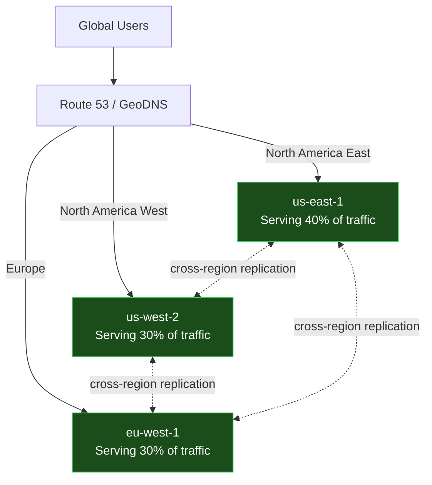
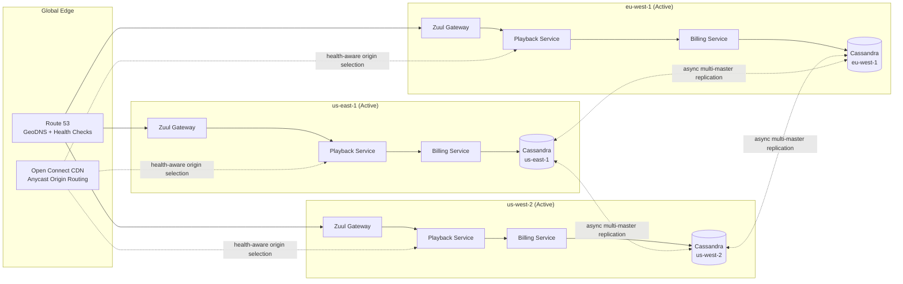

# Day 52 — The Day Netflix Killed an Entire AWS Region
## Chaos Kong: How to Find the Bugs That Only Appear When a Region Dies

> **Series:** System Design Interview Preparation Series  
> **Difficulty:** Senior / Staff / Principal  
> **Core Concept:** Multi-Region Resilience, Disaster Recovery, Region Failover  
> **Prerequisite:** Day 51 — Chaos Engineering & Chaos Monkey

---

## 🎬 The Story

It is a Tuesday morning at Netflix HQ. The Chaos Engineering team is preparing to run something they have been preparing for three weeks. Not Chaos Monkey — that kills individual pods. Not Chaos Gorilla — that kills an Availability Zone.

Today they run **Chaos Kong**.

> Chaos Kong simulates the failure of an **entire AWS region**. Not one data center. Not one availability zone. The whole region — `us-east-1`, with thousands of EC2 instances, dozens of RDS clusters, and the primary infrastructure that serves the majority of Netflix's North American traffic — gets logically taken offline.

The hypothesis written on the whiteboard:

> *"If `us-east-1` goes offline, Netflix continues to serve 100% of traffic from `us-west-2` and `eu-west-1` with no customer-visible impact. Video playback continues. Billing continues. Recommendations continue."*

The team has spent months preparing for this. Multi-region deployments. Cross-region replication. Failover playbooks. Auto-scaling configured in every region. Everything looks ready on paper.

Then they push the button.

```
14:02:00  Chaos Kong activated for us-east-1
14:02:03  Route 53 health checks flipping to UNHEALTHY
14:02:10  Traffic shifting to us-west-2 and eu-west-1
14:02:15  us-west-2 traffic up 4x normal
14:02:22  P95 latency climbing... 180ms → 320ms → 580ms
14:02:31  Customer support: "Users reporting video errors"
14:02:45  Billing dashboard shows: writes stopped
14:03:00  CDN edge cache misses spiking
14:03:15  Engineering manager: "ABORT. ABORT NOW."
```

The kill switch is pulled. Traffic is restored to `us-east-1`. The exercise is over in under 90 seconds.

The engineering team sits in a stunned silence in the war room.

**They thought they had a multi-region architecture. What they actually had was a single-region architecture with a backup region that had never served real traffic.**

This is the story of what Chaos Kong found — and why every multi-region system has the same hidden bugs until something like Kong forces them out.

---

## 🧠 What Is Chaos Kong?

Chaos Kong is the most aggressive member of Netflix's Simian Army. It builds on the lessons of its smaller siblings:

```
┌────────────────────┬─────────────────────────────────────────┐
│ Tool               │ Failure Scope                           │
├────────────────────┼─────────────────────────────────────────┤
│ Chaos Monkey       │ Single pod / EC2 instance               │
│ Chaos Gorilla      │ Single Availability Zone (e.g. us-east-1a) │
│ Chaos Kong         │ Entire AWS Region (e.g. us-east-1)      │
└────────────────────┴─────────────────────────────────────────┘
```

The blast radius is enormous:
- **Region** = 3 to 6 Availability Zones
- **Availability Zone** = 1 or more data centers
- **Data center** = thousands of servers

When Kong simulates a region failure, it is not just turning off servers. It is asking the entire global infrastructure: *can you function when one of the three legs of your tripod disappears?*

### Why "Simulate" Rather Than Actually Kill?

You cannot really turn off `us-east-1` — AWS will not let you, and even if they did, you would impact other tenants. Chaos Kong works by:

1. **Marking all health checks in `us-east-1` as failing** — Route 53 detects this and stops routing traffic there
2. **Blocking traffic at the load balancer layer** so no real requests reach `us-east-1` services
3. **Disabling cross-region replication endpoints** so failover regions cannot rely on `us-east-1` data
4. **Keeping monitoring intact** so engineers can still see what is happening

To the rest of the system, `us-east-1` may as well be gone.

---

## 💥 The Three Bugs Chaos Kong Found

Each of these bugs had existed for **months**. None were caught in staging. None were caught in code review. All were caught the moment real production traffic hit a region that had never served real production load before.

---

### 🐛 Bug 1: Zuul API Gateway — Stale Routing Configuration

**What was supposed to happen:**  
When traffic shifts to `us-west-2`, Zuul (Netflix's edge API gateway) receives the incoming request, looks up the correct backend service endpoint, and routes the request.

**What actually happened:**  
Zuul's routing rules — which microservice owns which URL path — were stored in a local YAML configuration file that was deployed alongside each Zuul instance. The deployment pipeline pushed the same code to every region, but the **routing rules file was updated by a different team via a separate ops process**, and that process only ran in `us-east-1`.

In `us-west-2`, Zuul had routing rules from **8 months ago**.

- The `playback` service had been renamed to `playback-v2` — `us-west-2` Zuul still routed to the old name → DNS resolution failed
- A new `download-manager` service had been added → `us-west-2` Zuul had no rule for it → 404 errors
- A path-rewrite rule for legacy iOS clients was missing → older devices couldn't authenticate

```
What us-east-1 saw:
  GET /api/playback/start  →  routes to  playback-v2.internal  ✓

What us-west-2 saw:
  GET /api/playback/start  →  routes to  playback.internal     ✗ (renamed 8 months ago)
                                          ↓
                                    NXDOMAIN — no such service
                                          ↓
                                    503 Service Unavailable
```

**Why staging missed it:**  
Staging in `us-west-2` always had the same config deployment as `us-east-1` because nobody had ever exercised the secondary region in production scale. The drift only began once the manual ops process diverged — and it diverged silently for 8 months.

**The fix:**  
Move all routing configuration from local files to a centralized configuration store (Netflix uses an internal version of Consul) with **mandatory cross-region replication**. Every Zuul instance in every region pulls from the same source of truth. A deployment is considered successful only when the config has been verified in **all** regions.

```java
@Component
public class ZuulRoutingConfig {

    @Autowired
    private ConsulClient consul;

    @Scheduled(fixedDelay = 30_000)
    public void refreshRoutingRules() {
        List<RoutingRule> rules = consul.kv()
            .getValues("zuul/routing/global")
            .getValue();

        if (rules == null || rules.isEmpty()) {
            log.error("Routing rules empty — refusing to update");
            metricsClient.increment("zuul.config.refresh.failed");
            return;
        }

        Set<String> requiredServices = Set.of("playback-v2", "download-manager", "billing");
        Set<String> configuredServices = rules.stream()
            .map(RoutingRule::getServiceName)
            .collect(Collectors.toSet());

        if (!configuredServices.containsAll(requiredServices)) {
            Set<String> missing = Sets.difference(requiredServices, configuredServices);
            log.error("Critical services missing from routing config: {}", missing);
            alertOncall("Zuul routing config drift detected: " + missing);
            return;
        }

        this.activeRules = rules;
    }
}
```

---

### 🐛 Bug 2: Billing Service — The Silent Database Migration

This is the bug that made the war room go silent.

**What was supposed to happen:**  
A user finishes watching an episode. The playback service emits an event. The billing service consumes it, looks up the user's plan, and records an entry in `watch_history` for usage analytics and contractual rights management (Netflix pays content providers based on viewing data).

**What actually happened:**  
6 months earlier, the billing team had added a new column to the `watch_history` table:

```sql
ALTER TABLE watch_history 
  ADD COLUMN content_provider_id VARCHAR(64) NOT NULL DEFAULT 'unknown';
```

The migration was applied to the `us-east-1` database. But the deployment pipeline had a manual step for the `us-west-2` and `eu-west-1` databases — and that step was missed.

In `us-west-2`, the table still had the old schema. The billing service running in `us-west-2` was code from after the migration, expecting the new column. When it tried to INSERT:

```sql
INSERT INTO watch_history (user_id, content_id, watched_at, content_provider_id)
VALUES (?, ?, ?, ?);
```

The database returned: `ERROR: column "content_provider_id" of relation "watch_history" does not exist`.

**Here is the critical part — the part that makes this bug a horror story:**

The billing service's INSERT logic was wrapped in a try/catch. The exception was caught. Logged at DEBUG level. And then — *because writing watch history was considered "non-critical for the playback experience"* — silently swallowed.

```java
public void recordWatchEvent(WatchEvent event) {
    try {
        watchHistoryRepo.insert(event);
    } catch (Exception e) {
        log.debug("Failed to record watch event", e);
        // Continue. Watch history is non-critical for playback.
    }
}
```

The result: for the **30 seconds Chaos Kong was active**, no watch history was recorded in `us-west-2`. Had Kong run longer, this would have continued silently — no errors visible to operations, no customer-facing impact, just **30 minutes, then 30 hours, then 30 days of missing data**.

That data is contractually significant. Netflix pays content providers based on viewing minutes. Missing viewing minutes means underpaying rights holders — which means breach of contract, audits, and legal exposure that nobody on the engineering team would have known about until the next quarterly rights reconciliation.

**Why staging missed it:**  
Staging `us-west-2` was always populated with synthetic data, not migrated from production. The schema in staging was always whatever the latest migration scripts produced. Only the actual production database in `us-west-2` had the missing migration — and nobody had run anything against it in 6 months.

**The fix:**

1. **Track migrations in the database itself**, not in the deployment pipeline:

```sql
CREATE TABLE schema_migrations (
    migration_id   VARCHAR(64) PRIMARY KEY,
    applied_at     TIMESTAMP NOT NULL,
    applied_by     VARCHAR(128) NOT NULL,
    checksum       VARCHAR(64) NOT NULL
);
```

2. **At service startup**, verify all required migrations are present:

```java
@PostConstruct
public void verifySchema() {
    List<String> requiredMigrations = MigrationCatalog.requiredFor(this.getClass());

    List<String> appliedMigrations = jdbcTemplate.queryForList(
        "SELECT migration_id FROM schema_migrations",
        String.class
    );

    Set<String> missing = Sets.difference(
        new HashSet<>(requiredMigrations),
        new HashSet<>(appliedMigrations)
    );

    if (!missing.isEmpty()) {
        throw new IllegalStateException(
            "Service cannot start — missing migrations: " + missing +
            ". Run the migration before deploying."
        );
    }
}
```

3. **Never silently swallow data persistence failures**. Every failed write must increment a metric and emit a structured error log:

```java
public void recordWatchEvent(WatchEvent event) {
    try {
        watchHistoryRepo.insert(event);
        metricsClient.increment("watch_history.insert.success");
    } catch (Exception e) {
        metricsClient.increment("watch_history.insert.failure");
        log.error("CRITICAL: failed to record watch event for user={} content={}",
            event.getUserId(), event.getContentId(), e);
        deadLetterQueue.send(event);
    }
}
```

---

### 🐛 Bug 3: CDN Origin Fallback — The Routing Loop

**What was supposed to happen:**  
A user starts a video. The CDN (Netflix uses its own CDN called Open Connect) serves the video chunks from an edge cache. If a chunk is missing from the edge, the CDN fetches it from the origin server in the nearest healthy region.

**What actually happened:**  
The CDN edge node configuration had the origin server addresses **hardcoded** by region:

```yaml
# /etc/netflix/cdn/origins.yaml
origins:
  primary:
    region: us-east-1
    endpoint: origin-east.netflix.internal
    priority: 1
  fallback:
    region: us-east-1            ← !!!
    endpoint: origin-east-backup.netflix.internal
    priority: 2
```

The "fallback" origin pointed to a **different server in the same region**. Because when the config was written, the author was thinking about *individual server failure*, not *region failure*. Both `origin-east` and `origin-east-backup` were in `us-east-1`.

When Chaos Kong took down `us-east-1`:
- Edge node tries `origin-east.netflix.internal` → DNS resolves to dead region → timeout
- Edge node tries fallback `origin-east-backup.netflix.internal` → also in dead region → also timeout
- After timeout, edge node retries primary → still dead → fallback → still dead

For every cache miss, the edge node spent **30 seconds in a retry loop** before returning a 502 to the client. The client (Netflix app) interpreted the 502 as a transient network error and retried — which triggered another cache miss → another 30-second loop.

```
Client request: GET /chunks/episode_12_segment_47.mp4
                       ↓
              CDN edge (Tokyo) — cache MISS
                       ↓
              Try origin-east.netflix.internal
                       ↓
              [us-east-1 is DEAD]  → timeout (10s)
                       ↓
              Try origin-east-backup.netflix.internal
                       ↓
              [us-east-1 is DEAD]  → timeout (10s)
                       ↓
              Try origin-east.netflix.internal again
                       ↓
              [us-east-1 is DEAD]  → timeout (10s)
                       ↓
              502 Bad Gateway to client
                       ↓
              Client retries — same loop. Forever.
```

**Why staging missed it:**  
Staging CDN nodes used the same config file. Staging never had a region offline. The config had been "correct" for years because no region had ever actually failed.

**The fix:**

Replace hardcoded origin endpoints with **health-aware, multi-region routing**:

```yaml
origins:
  priority_list:
    - region: us-east-1
      endpoint: origin-east.netflix.internal
      health_check: /health
    - region: us-west-2
      endpoint: origin-west.netflix.internal
      health_check: /health
    - region: eu-west-1
      endpoint: origin-eu.netflix.internal
      health_check: /health

  routing_strategy: health_aware_round_robin
  health_check_interval: 5s
  unhealthy_threshold: 3
  retry_budget: 2          # never retry more than 2 origins per request
  fallback_behavior: serve_stale_from_cache
```

Even better — use **AWS Global Accelerator** or equivalent anycast routing so the CDN edge does not need to know about regions at all. It connects to a single global IP, and the network infrastructure routes to the nearest healthy origin.

---

## 🏗️ How to Architect for Chaos Kong From Day 1

Most companies do not have the luxury of multi-region infrastructure. But if you are building one, here is the architect's checklist that Netflix wishes they had followed from day one:

### 1. **Treat every region as equally important — not as "primary + backup"**

The "backup region" framing is the root cause of every Chaos Kong bug. A backup region that never serves real traffic accumulates configuration drift, schema drift, code drift, and capacity drift.

**Better model:** All regions are **active**. Traffic is split across them by geography (DNS routing based on user location). If one region fails, the others scale to absorb the load.



### 2. **All configuration in a replicated store, never in deployment files**

Every routing rule, feature flag, service endpoint, and operational toggle lives in a central config store (Consul, etcd, AWS Parameter Store with cross-region replication) — never in YAML files baked into deployment artifacts. Drift cannot happen if there is no place for it to drift to.

### 3. **All database migrations tracked in-database**

Every service that touches a database verifies the migration state at startup. If a required migration is missing, the service **refuses to start**. Better to fail loudly at boot than silently corrupt data for months.

### 4. **All inter-service connections use health-aware client libraries**

Service-to-service calls go through a client library (Netflix has Ribbon, now superseded by service mesh patterns) that:
- Discovers endpoints from the centralized config
- Health-checks them continuously
- Routes around failures within a single request lifecycle
- Reports failures to a central observability system

No service ever has a hardcoded IP, hostname, or region. Ever.

### 5. **No silent error swallowing — anywhere**

Every caught exception either:
- Retries with backoff
- Falls through to a documented fallback (with a metric)
- Sends to a dead letter queue
- Throws to the caller

There is no fourth option called "log it and move on." That is how Netflix lost 30 seconds of watch history — and how it could have lost 30 days.

---

## 🚨 The Architecture That Chaos Kong Forced Netflix to Build

After running Chaos Kong successfully for the first time (after ~2 years of preparation and fixes), Netflix landed on this architectural pattern, which they call **Global Multi-Region Active-Active**:



Key properties:

- **No primary, no backup** — every region serves real traffic continuously
- **Database = Cassandra** with cross-region replication. Eventual consistency was acceptable for Netflix's domain (watch history doesn't need millisecond consistency across continents)
- **CDN routing is health-aware** — origin selection adapts in real-time
- **Config in central store** — drift is impossible by design
- **Every region oversized** by ~50% so that any one region can absorb the load of another failing

---

## 🎯 The Architect's Golden Rules for Multi-Region Resilience

| Rule | Why |
|------|-----|
| **A region that never serves real traffic is not a backup** | It is an untested hypothesis disguised as infrastructure |
| **Configuration drift is the silent killer** | Manual ops processes will diverge across regions. Always. Use central stores |
| **Migrations must be region-aware and self-verifying** | Services should refuse to start if their schema is wrong |
| **Never swallow data persistence errors** | A silent write failure is worse than a noisy one |
| **Health checks must be at every layer** | DNS, load balancer, CDN, service-to-service, database — all health-aware |
| **Test the failover regularly** | Chaos Kong, GameDay, DiRT — whatever you call it, run it |
| **No hardcoded endpoints** | Hostnames, IPs, region names — all must come from a discovery service |
| **Active-active beats active-passive** | If you have to "promote" a backup, you have already failed |

---

## 🧪 Running Your Own Chaos Kong

You probably do not run at Netflix's scale. But you can still run a smaller version of this exercise:

### Step 1 — Define the steady state

```yaml
chaos_kong_steady_state:
  - metric: global_request_success_rate
    threshold: ">= 99.0%"
    window: 5m
  - metric: orders_per_minute
    threshold: ">= 80% of baseline"
    window: 5m
```

### Step 2 — Identify the target region

Pick a region. Schedule the exercise during business hours. Notify the on-call team. Pre-position senior engineers in the war room.

### Step 3 — Take the region offline (gradually)

Don't kill it instantly. Start with 10% of traffic blocked, then 25%, 50%, 75%, 100%. Each step lasts long enough to observe metrics.

```bash
# Step 1: Block 10% of traffic to target region
aws route53 change-traffic-policy \
  --policy-id $POLICY \
  --weight-target-region 0.9

# Wait 5 minutes, observe dashboards

# Step 2: Block 25%
aws route53 change-traffic-policy \
  --policy-id $POLICY \
  --weight-target-region 0.75

# ...continue gradually
```

### Step 4 — Document every anomaly

Every metric that deviates from steady state becomes a ticket. Even if it does not breach the SLO — *especially* if it does not breach the SLO but is heading in a worrying direction.

### Step 5 — Have the kill switch ready

If anything breaches the SLO, immediately restore traffic. The goal is learning, not heroics. A 30-second exercise that surfaces a bug is more valuable than a 30-minute exercise that causes an outage.

---

## 🎤 Interview Questions

**Q1: What is the difference between Chaos Monkey and Chaos Kong?**
> Chaos Monkey terminates individual pods or instances within a single service. Its blast radius is small — one pod out of dozens or hundreds. Chaos Kong simulates the failure of an entire AWS region — thousands of instances across dozens of services, including the data plane. Monkey tests local resilience. Kong tests global architecture.

**Q2: Why doesn't staging catch the bugs Chaos Kong finds?**
> Staging environments are typically uniform — the same config, schema, and code are deployed to all staging regions because there's no incentive for them to drift. In production, individual regions accumulate drift over time: manual ops in one region that don't happen in another, missed migrations, hardcoded endpoints that "always worked." These drifts are invisible until real production traffic hits the under-exercised region. Staging cannot simulate years of organizational drift.

**Q3: How would you design a system to survive a full region failure?**
> Three core principles: (1) Active-active architecture where every region serves real traffic continuously, never a "primary-backup" model where the backup is untested. (2) All configuration, service discovery, and migrations come from centralized stores with mandatory cross-region replication. (3) Health-aware routing at every layer — DNS, CDN, load balancers, service-to-service — so failures are routed around in real time without manual failover. The architectural goal is that "a region failing" produces no incident, just a metric blip.

**Q4: A senior engineer suggests storing CDN origin endpoints in a configuration file deployed with each CDN edge node. What's your concern?**
> Configuration files baked into deployments are perfect targets for drift. Different teams own different things; manual processes update them out of band; staging looks fine because everything matches. The moment one region's config diverges, you've created a latent multi-region bug that only Chaos Kong-style testing will find. Centralize the configuration in a replicated store and have edge nodes pull from it dynamically with health checks.

**Q5: Your team has implemented "if write fails, log and continue" in a non-critical write path. What questions do you ask?**
> First — define "non-critical." Non-critical from whose perspective? Engineering? Product? Legal? Watch history was "non-critical for playback" but extremely critical for content provider royalty payments. Second — what is the metric for these silent failures? If you can't see them on a dashboard, you can't detect them. Third — what is the recovery path? If the write was important to someone, the data needs to go somewhere recoverable (dead letter queue, event log, retry). "Log and continue" is data loss with extra steps.

---

## 🚀 The Takeaway

> *"A backup region that has never served real production traffic is not a backup — it is an untested hypothesis."*

Chaos Kong is not about breaking things for fun. It is about confronting a question that every multi-region architecture eventually has to answer:

**"If our biggest region disappeared right now, would we survive? Or would we discover, on the worst possible day, that what we thought was resilience was just hope?"**

The architects who run Chaos Kong are not the ones who like chaos. They are the ones who refuse to use hope as an engineering strategy.

Every bug Chaos Kong found at Netflix existed for months. Every one of them would have surfaced eventually — at 3 AM, during an actual AWS regional incident, with engineers being woken up and customers watching things break in real time.

Running Chaos Kong meant they surfaced on a Tuesday at 2 PM, with senior engineers awake, dashboards prepared, and the entire incident response team in the same room.

That is what it means to design for failure.

---

## 📖 Related Reading

- **Day 51** — Chaos Engineering & Chaos Monkey (foundation of this post)
- **Day 6** — Design For Failure
- **Day 42** — Blue-Green Deployment: Zero Downtime
- **Day 44** — Capacity Estimation for Black Friday

---

*Day 52 · System Design Interview Preparation Series · How to Think Like an Architect · [YouTube](https://www.youtube.com/@CodeWithSunchitDudeja) · [Instagram](https://www.instagram.com/sunchitdudeja/)*
