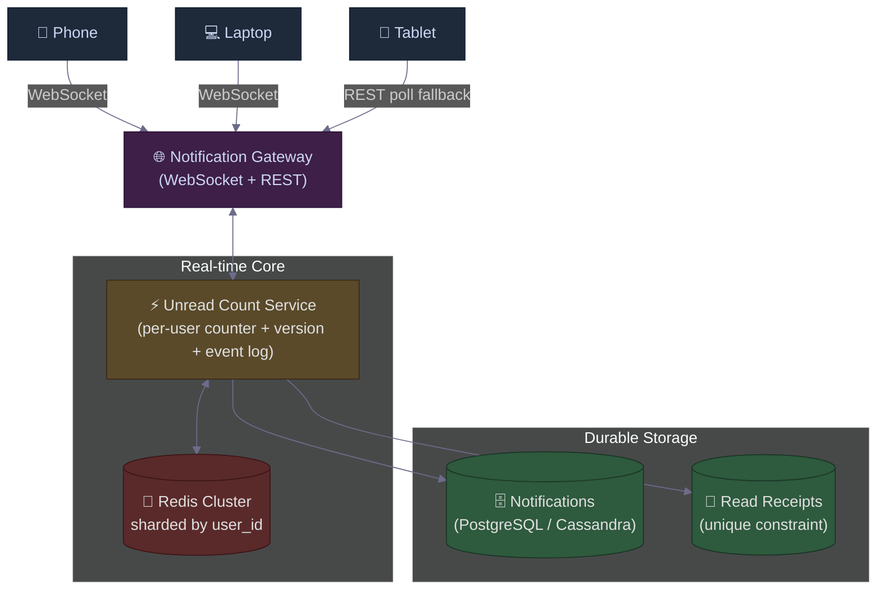

# Real-Time Notifications with "Mark as Read": Broadcast the Result, Not the Action
### Day 55 of 50 - System Design Interview Preparation Series

**By Sunchit Dudeja**

---

## 🎯 The Core Idea

Build a notification system for a social app (likes, comments, mentions). Users see notifications across **multiple devices** — phone, laptop, tablet. When a user marks a notification as read on **one** device, **every other device** must reflect that — in real time.

The naive instinct is to broadcast each individual `read` event to every device. That instinct **does not scale**, **breaks under retries**, **ignores offline devices**, and **falls apart on out-of-order delivery**.

The architect's move is one sentence:

> **Don't broadcast the action ("notification #123 was read"). Broadcast the result ("unread count = 6, version = 124"). Devices fetch details on demand.**

This is the same principle behind app-icon badges, email unread counters, and Slack's tab indicator. The trick is in the **versioning** and **offline sync** that make it correct.

---

## 🧠 Why You Should Care

This is one of the most common follow-up questions in a system design interview after **"Design Instagram"**, **"Design Twitter"**, or **"Design WhatsApp"**. The interviewer is not testing your knowledge of WebSockets. They are testing whether you understand **fan-out**, **idempotency**, **out-of-order delivery**, and **offline reconciliation** — four concepts that show up in every real distributed system.

A senior candidate who answers *"I'll broadcast a read event to every device"* loses the round in 30 seconds.

> **Companion reads:**
> - [Day 17 — Instagram's 7-Layer Architecture](./Day17_Instagram_Like_System_Architecture.md) — the fan-out problem at scale.
> - [Day 33 — Distributed Tracing IDs](./Day33_Distributed_Tracing_IDs_Complete_Guide.md) — version numbers as a tracing primitive.
> - [Day 48 — Idempotency Key That Lied](./Day48_Idempotency_The_Key_That_Lied.md) — the retry pattern this design depends on.

---

## ❌ The Developer Mistake — What Not to Do

The typical junior answer:

> *"When a user marks a notification as read, update `is_read = true` in the DB and broadcast the event to all that user's connected devices."*

Sounds reasonable. It fails for **four independent reasons**, and any one of them is fatal at scale.

| # | Failure | Why it kills you |
|---|---------|------------------|
| 1 | **Fan-out explosion** | 5 devices × 10 reads/sec × 1M active users = **50M messages/sec**. Your WebSocket fleet melts. |
| 2 | **Out-of-order delivery** | Device A receives `read(#5)` after `read(#10)`. Without sequence numbers, the UI gets confused. |
| 3 | **No idempotency** | A retried `read` event decrements the unread count **twice**. Now your counter is negative. |
| 4 | **Offline devices** | A tablet that was offline for 2 hours **misses every event** in that window. It comes back showing wrong state. |

Each one is survivable. **All four together is a "your app shows the wrong unread count on every device" bug** — the single worst UX failure for a notification system.

---

## 🏛️ The Architect's Approach (High-Level Design)



**The three architectural moves:**

| Move | What it does | Why it matters |
|------|--------------|----------------|
| **1. Aggregate state, not events** | Track a single `unread_count` per user, not a stream of read events | Broadcasts shrink from `O(reads × devices)` to `O(state changes × devices)` |
| **2. Version every change** | Monotonic `version` per user, incremented on every read or new notification | Devices can detect missed updates and request sync |
| **3. Short event log for replay** | Keep last 100 events per user in Redis (`version → notification_id`) | Offline devices catch up by asking "what changed since v120?" |

---

## 🔧 How It Works — Step by Step

### 🔹 Step 1 — A new notification arrives

```text
External service (Like / Comment / Mention) calls:
   POST /internal/notify  { user_id, type, source_actor_id }

Server actions:
   1. INSERT into notifications  (is_read = false)
   2. Redis (atomic Lua script):
        INCR  unread_count:{user_id}        → 7
        INCR  version:{user_id}             → 123
        ZADD  event_log:{user_id} 123 {notif_id}
   3. Broadcast over WebSocket to all devices of user_id:
```

```json
{
  "type": "unread_update",
  "version": 123,
  "unread_count": 7,
  "new_notification": { "id": "uuid", "type": "like", "preview": "..." }
}
```

### 🔹 Step 2 — User marks a notification as read

```text
Device sends:
   POST /notifications/{id}/read

Server actions:
   1. INSERT INTO read_receipts (user_id, notification_id, read_at, version)
      ON CONFLICT DO NOTHING       ← THE IDEMPOTENCY GUARANTEE
   2. If the insert succeeded (= state actually changed):
        UPDATE notifications SET is_read = true WHERE id = ...
        Redis (atomic Lua script):
           DECR  unread_count:{user_id}     → 6
           INCR  version:{user_id}          → 124
           ZADD  event_log:{user_id} 124 {notif_id}
   3. Broadcast to ALL devices of user_id:
```

```json
{
  "type": "unread_update",
  "version": 124,
  "unread_count": 6
}
```

**Notice what's NOT in that message.** No `notification_id`. No `action`. No `timestamp`. Just **two numbers**. That's the whole point. Every device updates its **badge** from this single broadcast. If a device needs to update a specific item in its list UI, it fetches the list lazily.

> **Result payload size: ~40 bytes.** Action payload size: 100s of bytes per device per event. Multiply by 1M users and you see why this matters.

### 🔹 Step 3 — A device reconnects after being offline

```text
Device sends:
   WS_CONNECT { user_id, last_known_version: 120 }

Server lookup in Redis:
   current_version    = 124
   current_unread     = 6
   event_log (121 → 124) → [
     { v:121, notif_id: A, action: "new" },
     { v:122, notif_id: B, action: "new" },
     { v:123, notif_id: A, action: "read" },
     { v:124, notif_id: B, action: "read" }
   ]
```

```json
{
  "type": "sync",
  "current_version": 124,
  "unread_count": 6,
  "changes": [
    { "notification_id": "A", "action": "read" },
    { "notification_id": "B", "action": "read" }
  ]
}
```

The device applies the delta locally and is now in sync. **Total bandwidth: a few hundred bytes for two hours of offline time.**

### 🔹 Step 4 — Handling out-of-order delivery

WebSocket reconnects, NAT shuffles, multi-region replication delays — messages **will** arrive out of order. The device protects itself with a simple rule:

```text
Device maintains: last_applied_version

On receiving a message with version v:
   if v <= last_applied_version:
        ignore (stale or duplicate)
   elif v == last_applied_version + 1:
        apply, last_applied_version = v
   elif v >  last_applied_version + 1:
        we missed updates → call /sync with last_applied_version
```

The server's broadcast is **best-effort**. The `/sync` endpoint is the **source of truth**. The combination gives you both **low latency** (push) and **correctness** (pull-on-gap).

---

## 📊 Data Models

### 🗄️ Persistent Store (PostgreSQL / Cassandra)

**`notifications` table:**

| Field | Type | Notes |
|-------|------|-------|
| `id` | uuid (PK) | Notification ID |
| `user_id` | uuid (indexed) | Recipient |
| `type` | string | `like` / `comment` / `mention` |
| `source_actor_id` | uuid | Who triggered it |
| `payload` | jsonb | Render-time metadata |
| `created_at` | timestamp | |
| `is_read` | bool | Updated on first read |

**`read_receipts` table — the idempotency anchor:**

| Field | Type | Notes |
|-------|------|-------|
| `user_id` | uuid | PK part 1 |
| `notification_id` | uuid | PK part 2 |
| `read_at` | timestamp | |
| `version` | bigint | The version assigned when this read landed |

> **The unique constraint `(user_id, notification_id)` is the entire idempotency story.** `INSERT ... ON CONFLICT DO NOTHING` lets the database itself decide whether this is a duplicate.

### ⚡ In-Memory Store (Redis, sharded by `user_id`)

```text
unread_count:{user_id}    → integer (current unread)
version:{user_id}         → integer (monotonic counter)
event_log:{user_id}       → sorted set, score = version, value = notif_id|action
                            (capped at last 100 entries)
```

All three keys are mutated atomically in a single **Lua script** per state change — so no two requests can interleave and corrupt the counter.

```lua
-- mark_read.lua
local user_id = KEYS[1]
local notif_id = ARGV[1]
local already_read = redis.call('SISMEMBER', 'read_set:' .. user_id, notif_id)
if already_read == 1 then
    return 0  -- duplicate, no-op
end
redis.call('SADD', 'read_set:' .. user_id, notif_id)
local new_count = redis.call('DECR', 'unread_count:' .. user_id)
local new_version = redis.call('INCR', 'version:' .. user_id)
redis.call('ZADD', 'event_log:' .. user_id, new_version, notif_id .. '|read')
redis.call('ZREMRANGEBYRANK', 'event_log:' .. user_id, 0, -101)  -- cap at 100
return new_version
```

---

## 🛡️ Idempotency — The Detail Most Engineers Miss

A device retries when the network blips. The same `POST /notifications/{id}/read` lands twice. Without idempotency, your unread count goes **negative**.

The defense is layered:

1. **Database** — `read_receipts` has `UNIQUE(user_id, notification_id)`. A second insert fails. The application code interprets the failure as "already done, no-op."
2. **Redis** — the Lua script checks a `read_set` for membership before decrementing. Even if two app servers race on the same request, only one wins the SADD.
3. **API contract** — the response is the same `{ version, unread_count }` whether the call was the first or the tenth. Clients cannot distinguish "I did it" from "it was already done." That is the definition of idempotency.

> **Rule of thumb:** *If your "mark as read" handler can corrupt state when called twice, you have not designed a real notification system. You have designed a demo.*

---

## 📈 Scaling Considerations

| Aspect | The architect's move |
|--------|---------------------|
| **1M+ active users** | Shard Redis by `user_id` (Redis Cluster, consistent hashing or rendezvous). See [Day 28](./Day28_Consistent_Hashing_Resharding.md) and [Day 54](./Day54_Rendezvous_Hashing_Highest_Random_Weight.md). |
| **Event log size** | Cap at 100 events per user in Redis. Anything older → query `read_receipts` table. |
| **Broadcast fan-out** | Send only `{version, unread_count}` (~40 bytes). 5 devices × 10 reads/sec × 1M users = 50M broadcasts/sec × 40B = **2 GB/s** — manageable. With full event payloads it was **100×** higher. |
| **Read receipts table** | Write-heavy. Use Cassandra or DynamoDB with `(user_id, notification_id)` as composite key. |
| **WebSocket fleet** | Stateless gateway; sticky sessions only for the WebSocket itself. State lives in Redis. |
| **Fallback for legacy devices** | Poll `/notifications/state` every 30s. Same response shape. |
| **Cross-region** | Pin a user to a "home region" for Redis writes. Async-replicate read receipts to the durable store for global durability. |

---

## 🟣 The Simpler Version — Explain It Like the Reader Has 2 Minutes

Strip away the Redis, the Lua, the WebSockets. The architect's solution in plain English:

### The wrong way

> **"Every time someone marks a notification as read, tell each of their devices about that exact notification."**

With 5 devices and 1 million users marking 10 notifications a second, that's **50 million messages per second** — for information that fits in a **single number**. And offline devices miss everything.

### The right way

> **"Don't broadcast the action. Broadcast the result."**

Think of the **red badge on an app icon**. That number is all most devices need. So:

1. User reads a notification on their phone.
2. Phone tells the server: *"mark #123 as read."*
3. Server updates one number: unread count drops from `7 → 6`. It also bumps a version counter (`123 → 124`).
4. Server sends **one tiny message** to all the user's devices: *"unread count is now 6, version is 124."*
   → **No mention of #123. No event. Just two numbers.**
5. Each device updates its badge.
6. If a device needs to know which exact notifications are unread (because the user opened the list), it **fetches the list when asked** — not on every change.

### What about offline devices?

When a tablet comes back online after 2 hours, it tells the server: *"I last saw version 120."* The server replies: *"Here are the 4 things that changed between version 120 and 124."* The tablet catches up in **one round trip**.

### The one-line summary

> 🎯 **Don't broadcast the action. Broadcast the result. Push the minimum, pull the rest on demand.**

That single sentence is the **mental model**. The rest of this blog is just the engineering details that make it correct.

---

## ⚖️ Junior vs Architect — Side by Side

| Junior approach | Architect approach |
|-----------------|---------------------|
| Broadcasts `"notification #123 was read"` to every device | Broadcasts `{version, unread_count}` — two numbers |
| Each device tracks read/unread state of every notification | Devices track **one number** (unread count) and fetch details lazily |
| Retries break the counter | Idempotent via DB unique constraint + Redis Lua script |
| Messages can arrive out of order and corrupt UI | Version numbers let devices **detect** gaps and **call sync** |
| Offline devices miss updates forever | Offline devices reconnect with `last_known_version` and replay the delta |
| Unread count stored only in DB → slow real-time updates | Hot path uses Redis (in-memory); DB is the durable backup |
| `O(reads × devices)` broadcast volume | `O(state-changes × devices)` — orders of magnitude less |

---

## 💬 How to Talk About It in an Interview

When asked *"Design a real-time notification system with mark-as-read across devices,"* a strong answer goes:

> "The instinct is to broadcast every read event to every device — but that's `O(reads × devices)` and falls apart at scale. I'd flip it: maintain an authoritative **unread count** and a **monotonic version number** per user in Redis. Every state change — new notification or mark-as-read — atomically updates the count, bumps the version, and appends to a short event log. The broadcast to every connected device is just `{version, unread_count}` — about 40 bytes. Devices that need the full list fetch it lazily.
>
> Idempotency comes from a unique constraint on `(user_id, notification_id)` in the read-receipts table — a duplicate `mark read` is a database no-op. Out-of-order delivery is handled by the version number: if a device sees a version more than one ahead of its last applied, it calls `/sync` with its `last_known_version` and gets the delta from the event log. The same `/sync` endpoint handles offline reconnects — the device tells the server where it left off, and the server replays what changed.
>
> Three architectural levers make this work: **aggregate state instead of events**, **version every change**, and **push the minimum, pull the rest on demand**."

That paragraph signals you understand:
- The **fan-out problem** (the reason for aggregation),
- **Idempotency** (the reason for unique constraints),
- **Out-of-order delivery** (the reason for versions),
- **Offline reconciliation** (the reason for the event log),
- **Push vs pull trade-offs** (the reason for the broadcast payload shape).

That is the **architect-level answer** — the one that wins the round.

---

## 🧾 Quick Recap

- **The trap:** Broadcasting every read event to every device is `O(reads × devices)` — it doesn't scale, it breaks under retries, and it ignores offline devices.
- **The principle:** **Don't broadcast the action. Broadcast the result.** Push `{version, unread_count}`. Devices pull the details when they need them.
- **The four moves:**
  1. **Aggregate state** — track a single counter per user, not a stream of events.
  2. **Version every change** — monotonic counter so devices can detect gaps.
  3. **Short event log** — last 100 changes per user in Redis for offline replay.
  4. **Idempotent writes** — unique constraint on `(user_id, notification_id)`; same response on retries.
- **The math:** broadcast payload shrinks from ~hundreds of bytes per device per event → **~40 bytes per device per state change**.
- **The mental model:** **push the minimum, pull the rest on demand.**

Every real-time system with multiple clients eventually rediscovers this pattern. The lucky ones learn it from a blog. The unlucky ones learn it from a 3 AM page when their broadcast fleet melts.

---

*If this saved you from designing a notification system that broadcasts itself into oblivion — share it with the next engineer who says "let's send a WebSocket event for every change."* 🎯
