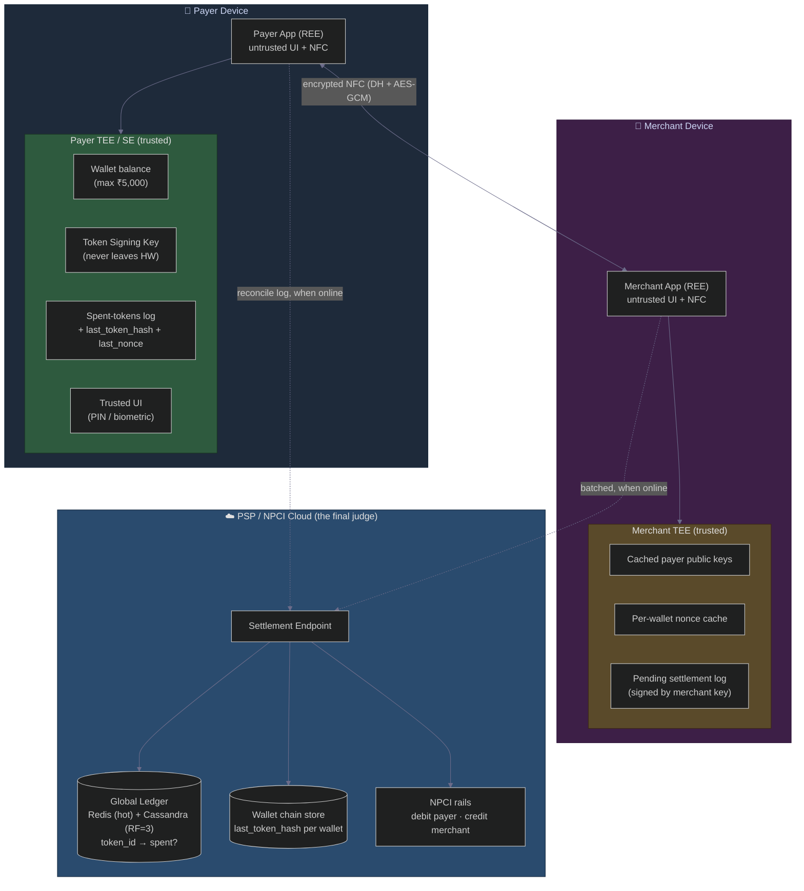
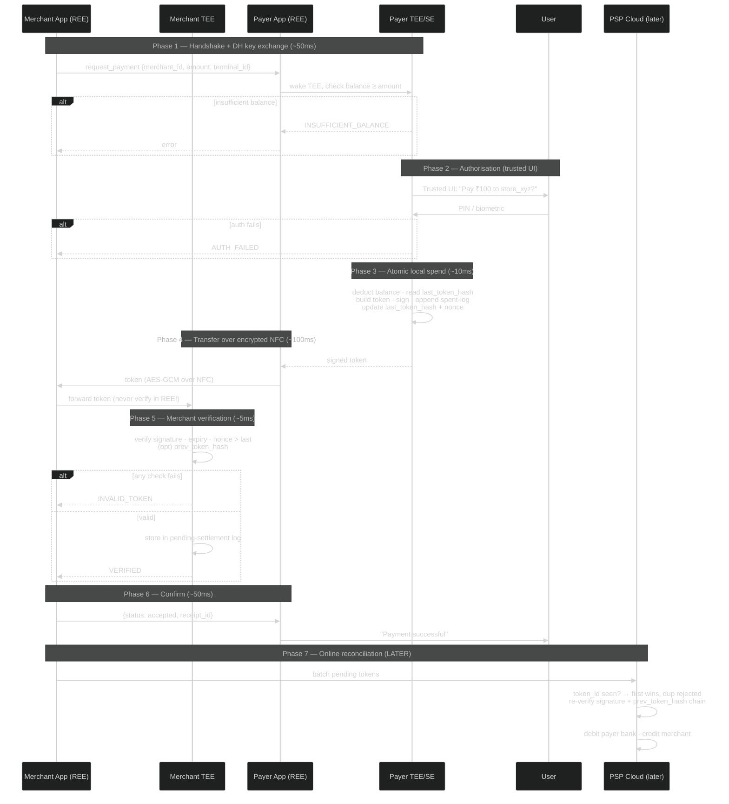
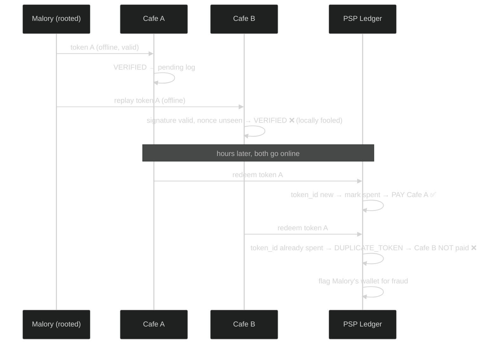
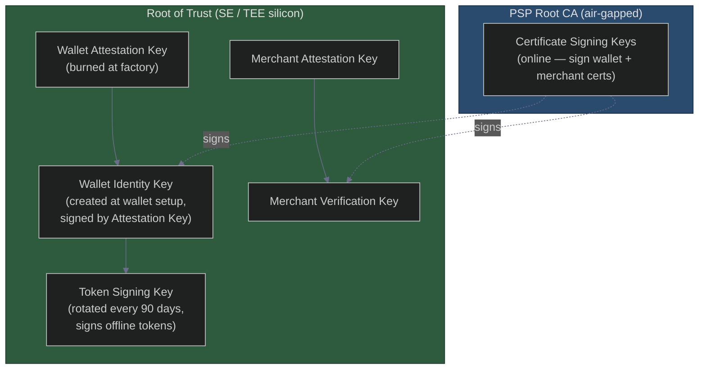

# A Senior Architect's Deep Dive into UPI Lite's Offline Payment Core — Two Phones Tap, Money Moves, No Internet
### Day 63 of 50 - System Design Interview Preparation Series

**By Sunchit Dudeja**

---

## 🎯 The Core Idea

You've read about **Secure Elements (SE)**, **Trusted Execution Environments (TEE)**, token chains, and risk-based limits. Now let me walk you through the *actual* offline exchange — the moment two phones tap and a payment happens **without any internet**. I'll write this the way I'd design it for the **National Payments Corporation of India (NPCI)** or any large-scale payment rail.

This is not a theory document. This is the production architecture that balances **security, user experience, and cost** — and the trade-offs are the whole point.

The architect's one-sentence framing:

> **The payer's device holds the real "money" (a balance inside the TEE). The merchant's device only holds *promises* (signed tokens). The cloud is the final judge. Offline speed comes from *deferring* the expensive part — the global double-spend check — until later.**

Offline payments are not "online payments minus the network." They are a different security model: you trade a **global, synchronous** guarantee for a **local, hardware-rooted** one, and you cap the blast radius with money limits.

> **Companion reads:**
> - [Day 6 — Design for Failure](./Day6_Design_For_Failure.md) — graceful degradation when the network is gone.
> - [Day 27 — Two-Phase Commit](./Day27_Two_Phase_Commit.md) — why true distributed atomicity is expensive (and why we *avoid* it offline).
> - [Day 35 — Distributed Systems Failure Modes](./Day35_Distributed_Systems_Failure_Modes_HLD.md) — the failure landscape this design lives in.
> - [Day 48 — The Idempotency Key That Lied](./Day48_Idempotency_The_Key_That_Lied.md) — first-write-wins dedup, the heart of reconciliation.
> - [Day 49 — Kafka OOM Duplicate Charge](./Day49_Kafka_OOM_Crash_Duplicate_Charge_Idempotency.md) — what double-spend looks like in a payments backend.
> - [Day 28 — Consistent Hashing](./Day28_Consistent_Hashing_Resharding.md) — how the global ledger shards `token_id` lookups at scale.

---

## 🧠 Why You Should Care

"Design an offline payment system" is a brutal interview question because it removes the one crutch every junior leans on: **the database is always reachable**. Take that away and you're forced to reason about:

- **Where trust physically lives** — REE (untrusted app) vs TEE (hardware-isolated) vs SE (tamper-resistant silicon).
- **Double-spend without a global lock** — how do you stop the same rupee being spent twice when neither party is online?
- **Bounded risk** — you *cannot* make offline perfectly safe, so you make the maximum loss small and provable.
- **Eventual reconciliation** — the cloud corrects reality later, and the design must survive the gap.

A senior answer names the trust boundary first (*"the balance lives in the TEE, the app never touches it"*), then defers the global check (*"first redemption wins at settlement"*), then caps the loss (*"₹5,000 wallet, 5-minute token expiry"*).

---

## 🏛️ The Core Architecture at a Glance

Here's the whole system on one whiteboard. Every component has a purpose — no layer is accidental.



| Layer | Holds | Trust level |
|-------|-------|-------------|
| **Payer REE app** | UI, NFC plumbing | ❌ Untrusted — assume compromised |
| **Payer TEE/SE** | Real balance, signing key, spent log | ✅ Hardware root of trust |
| **Merchant REE app** | UI, NFC plumbing | ❌ Untrusted |
| **Merchant TEE** | Cached public keys, nonce cache, pending tokens | ✅ Isolated verification |
| **PSP/NPCI cloud** | Global ledger, wallet chains, bank rails | ✅ The final judge |

> **Key insight for junior architects:** the payer device holds the *money*; the merchant device holds *promises*; the cloud is the *judge*. Speed comes from deferring the judgment.

> 🎨 **Companion diagram:** [`day63-upi-lite-offline-payment.excalidraw`](./day63-upi-lite-offline-payment.excalidraw) — the same architecture as a hand-drawn whiteboard (open in Excalidraw / the VS Code Excalidraw extension).

---

## 🛡️ The Threat Model — What We Are Protecting Against

A secure system is only as good as its threat model. Here's exactly what I assumed when designing this flow.

| Threat | Description | How the architecture handles it |
|--------|-------------|---------------------------------|
| **Double-spending** | Same token spent at two offline merchants | Local destruction in TEE **+** global ledger reconciliation (first-redemption-wins) |
| **Token forgery** | Fake token without a valid TEE | Tokens signed with a hardware-protected private key (SE/TEE); merchant verifies the signature |
| **Replay attack** | Record a legit token, replay it elsewhere | Unique `nonce` + `timestamp` per token; ledger and merchant nonce-cache reject duplicates |
| **Man-in-the-middle (NFC)** | Intercept/modify token in transit | NFC channel encrypted with a session key; token is signed, so any modification invalidates the signature |
| **Device theft** | Thief makes offline payments | Small wallet cap (₹5,000), remote lock/wipe, fraud reporting, daily limits |
| **TEE compromise** | Voltage glitching / fault injection | Extremely expensive; banks insure small losses; low value makes it unattractive |
| **Merchant fraud** | Merchant claims a payment that never happened | Merchant must present a valid signed token from the payer's TEE; payer's TEE also logs spent tokens for disputes |

> **What we explicitly do *not* defend against:** a nation-state attacker with a chip-decapping lab. We accept that, because the maximum per-wallet loss is ₹5,000. **That is a deliberate economic trade-off, not an oversight.**

---

## 🧾 The Anatomy of an Offline Payment Token (the "Digital Note")

Every offline payment is a cryptographically signed token, designed to be **self-verifiable without contacting a central server**. Here's the structure (simplified):

```json
{
  "version": 2,
  "token_type": "upi_lite_offline",
  "token_id": "0x7a3f...c2d1",
  "amount": 100,
  "currency": "INR",
  "payer": {
    "wallet_id": "upi_lite_wallet_abc123",
    "key_id": "key_rotation_2025_02"
  },
  "payee": {
    "merchant_id": "store_xyz",
    "terminal_id": "terminal_01"
  },
  "timestamp": "2025-06-10T14:30:00.123Z",
  "nonce": 892734,
  "prev_token_hash": "sha256(previous_token_bytes)",
  "expiry": "2025-06-10T14:35:00Z",
  "signature": "base64_ecdsa_signature_over_all_fields"
}
```

| Field | Why it exists |
|-------|---------------|
| `token_id` | Globally unique (UUID v4 + entropy) — the dedup key at settlement |
| `prev_token_hash` | **Chains tokens.** Each token references the hash of the previous token from this wallet. The cloud stores the last known hash per wallet, so a user cannot "fork" their balance |
| `nonce` | Replay defense — merchant records the highest nonce seen; lower nonces are rejected |
| `expiry` | Short lifetime (~5 min) so a stale/stolen token can't be used much later |
| `signature` | ECDSA/Ed25519 signature generated **inside** the TEE; the private key never leaves the hardware. The public key is registered with the PSP at wallet creation |

> The token **never** contains the user's bank account number — only a `wallet_id` that is meaningless outside the PSP.

**Why the chain matters:** a simple `token_id` lets the cloud catch *exact* duplicates. The `prev_token_hash` chain lets the cloud catch *forks* — a tampered device that tries to spend from two divergent balance histories. The chain must be linear; a branch is proof of fraud.

---

## 🔧 The Step-by-Step Secure Exchange (Architect's Walkthrough)

Here's the exact flow — tap to paid — with error branches and timeouts, because that's where most designs fail.



### Phase 0 — Pre-conditions (already happened)

- User created a UPI Lite wallet online and loaded up to **₹5,000**.
- The PSP downloaded a **wallet certificate** (public key of the wallet's TEE) into the device's TEE.
- The merchant registered and obtained a **merchant certificate**.
- Both devices have NFC enabled and are within ~4 cm.

### Phase 1 — Handshake & capability exchange (~50 ms)

The merchant app broadcasts `{ "action": "request_payment", "merchant_id": "store_xyz", "amount": 100, "terminal_id": "t1" }`. The payer app wakes its TEE, which checks the balance is ≥ ₹100.

> **Architect's note:** the balance check happens *inside* the TEE so a malicious app cannot lie about the balance.

### Phase 2 — User authorisation (user-dependent)

The TEE displays a **trusted UI window** it owns — not the Android/iOS window manager. Malware **cannot overlay it**. User enters PIN/biometric; the TEE verifies against the credential stored inside the TEE/SE. **The main OS never sees the PIN.** Failure → `AUTH_FAILED`.

### Phase 3 — Token generation & local spend (~10 ms)

After auth, the TEE does three things **atomically**:

1. Deducts ₹100 from the local balance.
2. Reads `last_token_hash` and builds the token (`prev_token_hash = last_token_hash`, `nonce = last_nonce + 1`).
3. Signs the token with the private key, appends it to the **spent-tokens log**, and updates `last_token_hash = sha256(token_bytes)` and `last_nonce++`.

> Atomicity here is everything: if the deduction commits but the log update doesn't (power loss), the TEE must roll back so the balance is never wrong. This is a *local* two-phase discipline — the cheap cousin of [Day 27's 2PC](./Day27_Two_Phase_Commit.md).

### Phase 4 — Token transfer over NFC (~100 ms)

TEE returns the token to the REE app → app sends it over the **encrypted NFC channel**. The two devices ran an anonymous **Diffie-Hellman** exchange during the handshake and use **AES-GCM** — preventing eavesdropping and tampering. The merchant app **immediately forwards the token to its own TEE**.

> **Never verify tokens in the REE.** A compromised merchant app would happily accept fakes.

### Phase 5 — Merchant-side verification (~5 ms)

The merchant TEE verifies: signature valid (payer public key, possibly cached); `expiry` in the future; `nonce` greater than any seen from this wallet; and optionally `prev_token_hash` against a cached value. Pass → store in the **pending settlement log** (encrypted, signed by the merchant key) → `VERIFIED`. Any failure → `INVALID_TOKEN`.

### Phase 6 — Confirmation (~50 ms)

Merchant app sends `{ "status": "accepted", "receipt_id": "merchant_receipt_123" }`. Payer sees "Payment successful."

### Phase 7 — The critical online reconciliation (later, when online)

This is where double-spend is actually *prevented*:

1. Merchant/acquirer **batches** pending tokens (e.g., hourly) to the PSP settlement endpoint.
2. The PSP does the **global double-spend check**: look up `token_id` in the global ledger (Redis hot / Cassandra durable). **Not seen → first time → mark spent → settle. Already seen → `DUPLICATE_TOKEN` → second merchant is *not* paid.**
3. PSP re-verifies the signature (crypto is cheap) and validates `prev_token_hash` against the wallet's stored chain. Mismatch → reject (tampering / out-of-order).
4. On success, debit the payer's bank account (via NPCI) and credit the merchant.

### Phase 8 — Payer wallet reconciliation (when payer goes online)

The app uploads its spent-tokens log. The PSP compares it to the global ledger; if the device claims a token the ledger doesn't recognise (possible forgery), the PSP rejects the log and flags the user. The PSP then sends back the wallet's **official balance**, and the TEE updates its local balance to match — correcting any drift from offline spends later reversed by fraud detection.

---

## 💥 The Double-Spend Attack — How the Architecture Responds

Let me simulate an attack to show the design's resilience.

**Scenario:** Malory has a rooted phone. She spends ₹100 at **Cafe A** (offline) — her TEE generates token A and deducts ₹100. Using a custom app, she tries to spend the *same* token A again at **Cafe B** before either cafe goes online.



**Why she fails:**

- The TEE **atomically destroys/advances** state after spending; it won't regenerate token A, because the signing key and the spend logic live inside the TEE.
- She can *replay* the captured token to Cafe B, and Cafe B's TEE — never having seen `token_id` before — **might** accept it locally. That's expected. **Local acceptance is not payment.**
- The **real defence is the global ledger**: at settlement, the **first redemption wins**, the second gets `DUPLICATE_TOKEN`, and Cafe B is not paid. This is exactly the [first-write-wins idempotency of Day 48](./Day48_Idempotency_The_Key_That_Lied.md).
- Malory's wallet is **flagged**; the PSP refuses to reload it until she pays back the loss, or the bank blocks her.

**What if Malory uses hardware fault injection** to make the TEE generate a valid token *without* deducting the balance? That attack costs **> ₹10 lakh in equipment** for a maximum gain of ₹5,000. We accept this risk — a classic **economic security trade-off**.

---

## 🚑 Failure Modes & Mitigations (the Ops Runbook)

| Failure mode | Detection | Mitigation |
|--------------|-----------|------------|
| NFC handshake fails | Timeout after 2 s | Retry 3×; fall back to **dynamic QR** encoding the same request |
| Payer TEE crashes mid-generation | No token returned | "Payment failed — try again"; balance **unchanged** because the atomic op didn't complete |
| Merchant TEE verification times out | No response in 1 s | Reject token; payer retries |
| Token corrupted in transfer | Signature verification fails | Both devices log error; auto-retry |
| Payer offline permanently (lost device) | Wallet offline 7 days | PSP marks wallet **dormant**; recovery via support + KYC |
| PSP backend down at settlement | HTTP 5xx | Merchant retries with **exponential backoff** (max 24 h); tokens kept locally ([Day 53](./Day53_Uber_Retry_Storm_Exponential_Backoff_Circuit_Breaker.md)) |
| Global ledger node fails | Read/write timeout | **Quorum** (Cassandra RF=3) — writes succeed despite one node down |

> Notice the pattern: **the device never loses money on a crash, and the merchant never gets paid for a duplicate.** Those two invariants are the whole safety story.

---

## 🔑 The Cryptographic Key Hierarchy (Where Trust Really Lives)

You cannot design offline payments without understanding key management. Here's the hierarchy.



- **Token Signing Key never leaves the TEE.** Not even the PSP knows it — the PSP only holds the public key.
- **Wallet Identity Key** authenticates the wallet to the PSP during top-ups; also TEE-protected.
- **Attestation Keys** are injected at the factory (Goodix, NXP, Qualcomm) and are globally verifiable — they *prove* the key really sits inside a legitimate TEE.

When the merchant verifies a token it uses the wallet's **public key**, obtained by: (a) caching from a prior online interaction, (b) an online API lookup if reachable, or (c) a certificate chain ending in the **PSP root CA hardcoded in the merchant TEE**. For pure offline, the `nonce` + `expiry` freshness checks are what carry the weight.

---

## 📊 Performance & Scalability Numbers

The SLAs I had to meet, and what the field delivered:

| Metric | Target | Field result |
|--------|--------|--------------|
| End-to-end offline txn (tap → confirm) | < 1 s | **400–800 ms** |
| Token generation (in TEE) | < 20 ms | 8–12 ms |
| Token verification (merchant TEE) | < 10 ms | 3–5 ms |
| Global ledger lookup (online redemption) | p99 < 50 ms | 30–40 ms (Cassandra) |
| Wallet reconciliation latency (after online) | < 5 s | 2–3 s |

How we hit these numbers:

- **Lean TEE code** — no unnecessary crypto inside the secure world.
- **Ed25519 signatures** (fast, small) instead of RSA.
- **Redis hot path** for the global ledger, Cassandra as the durable backup, `token_id` sharded by [consistent hashing (Day 28)](./Day28_Consistent_Hashing_Resharding.md).

---

## ❌ Junior vs Architect — What Juniors Get Wrong

| Junior approach | Architect correction |
|-----------------|----------------------|
| "Store the wallet balance in the REE database." | No — the REE is **untrusted**. Balance lives in the TEE; all mutations are signed by the TEE. |
| "A simple counter prevents replay." | A counter is fine — but the merchant must persist the last-seen `nonce` in a **tamper-proof** store (merchant TEE). |
| "We don't need expiry on tokens." | Without expiry, a stolen token works months later. Set expiry to **5–10 min**. |
| "The cloud can just trust the merchant's log." | No — the cloud **re-verifies the signature and the wallet chain**. Merchant logs can be forged. |
| "Use symmetric keys for token signing." | Symmetric keys force the merchant to know the payer's key — huge risk. Use **asymmetric** (public/private). |
| "Offline payments can scale to any amount." | No — keep **per-txn and daily limits low**. Offline is inherently riskier. |

---

## ⚖️ The Architect's Decision Log

| Decision | Alternative | Why chosen |
|----------|-------------|------------|
| **Use TEE** (not just software crypto) | Software encryption + cloud verification | Hardware root of trust is essential for offline security |
| **Token chain** (`prev_token_hash`) | Simple `token_id` + cloud lookup | Chain lets you detect **balance forks** offline |
| **Merchant-side TEE verification** | Verify in merchant REE app | REE can be compromised; TEE isolates verification |
| **Global ledger + first-win reconciliation** | Consensus among merchants (blockchain) | Simpler, lower latency, good enough with low limits |
| **No PIN for small amounts** | PIN every transaction | UX wins; small, bounded risk accepted |

---

## 🟣 The Simpler Version — Explain It Like the Reader Has 2 Minutes

> **Your phone's secure chip is a sealed wallet with real cash inside it. When you tap to pay, the chip checks your PIN on a screen that malware can't fake, takes the cash out, writes a signed IOU note (the token), and hands it to the shop over a private NFC whisper. The shop's own secure chip checks the signature and pockets the note. Neither phone needs internet. Later, when the shop goes online, it takes all its notes to the bank. The bank pays whoever shows up *first* with each note — and if someone tries the same note twice, the second one bounces. The whole trick is: the cash leaves your chip instantly and safely, but the *bank decides who actually gets paid* later. And because the wallet only ever holds ₹5,000, even a clever thief can't steal much.**

### The one-line summary

> 🎯 **Offline payment = local hardware-rooted spend now, global first-write-wins settlement later, with a small money cap so the worst case is cheap.**

---

## 💬 How to Talk About It in an Interview

When asked *"Design an offline payment system like UPI Lite,"* a strong answer goes:

> "First I fix the **trust boundary**: the real balance and the signing key live inside the **TEE/SE**, never in the app — the app is untrusted. The user authorises on a **trusted UI** the OS can't overlay, and the TEE atomically deducts the balance and signs a **token** carrying `token_id`, `nonce`, `expiry`, and a `prev_token_hash` chain.
>
> The token moves over an **encrypted NFC** channel (DH + AES-GCM), and the **merchant's TEE** — not its app — verifies the signature, expiry, and nonce. That's the offline half.
>
> I do **not** try to prevent double-spend at tap time, because there's no global lock offline. Instead the merchant batches tokens to the PSP later, and the **global ledger does first-redemption-wins on `token_id`** — exactly an idempotency check. The second redemption gets `DUPLICATE_TOKEN` and isn't paid; the cheating wallet is flagged.
>
> I bound the risk with a **₹5,000 wallet cap, 5-minute token expiry, and daily limits**, so even a TEE fault-injection attack costs more than it can ever steal. The cloud reconciles the device balance when it reconnects.
>
> Three levers: **trust in hardware, defer the global double-spend check to settlement, and cap the blast radius with money limits.**"

That paragraph signals you understand **trust boundaries, cryptographic design, eventual reconciliation, and economic security trade-offs** — the four things an interviewer grades here.

---

## 🧾 Quick Recap

- **Payer holds money (TEE balance), merchant holds promises (signed tokens), cloud is the judge.**
- The **REE is untrusted** — balance, keys, and PIN verification all live in the **TEE/SE**.
- The **token** is a self-verifiable signed note: `token_id` (dedup), `nonce` (replay), `expiry` (freshness), `prev_token_hash` (anti-fork chain).
- Offline exchange: handshake → trusted-UI auth → **atomic local spend** → encrypted NFC transfer → **merchant-TEE verify** → confirm.
- **Double-spend is caught at settlement**, not at tap — **first redemption wins**, duplicates rejected ([Day 48](./Day48_Idempotency_The_Key_That_Lied.md)).
- **Never verify tokens in the REE**; never store balance in the REE.
- Bound the risk: **₹5,000 cap, short expiry, daily limits** — make the worst case cheap.
- Reconcile the device balance with the official cloud balance whenever the payer comes online.

---

## 🎬 Final Words — The Beauty of Imperfect Security

Perfect security is a myth, especially offline. The elegance of UPI Lite is that it **accepts small, bounded risks in exchange for a frictionless experience**. The system doesn't try to be a bank vault — it's a digital wallet for your pocket change.

When you tap your phone to buy a chai, you're not thinking about token chains or nonces. You're thinking, *"it just works."* That's the sign of good architecture: the complexity is hidden, the failure modes are graceful, and the security is **just enough for the threat model**.

Remember: **trade-offs are not failures — they are the essence of engineering.** 🎯

---

*If this changed how you think about offline systems, share it with the next engineer who insists "you can't move money without the network."* 🎯
