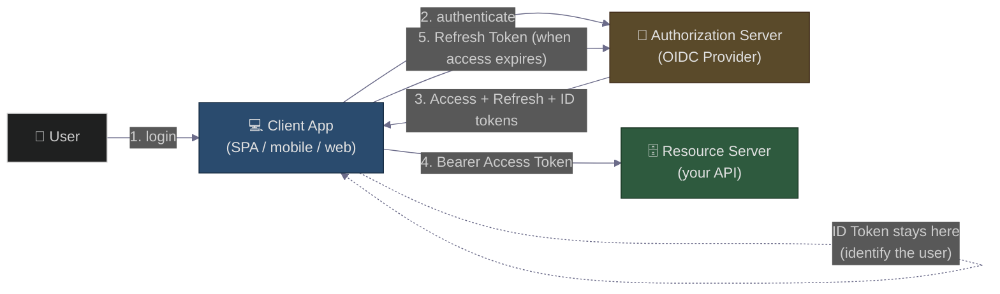
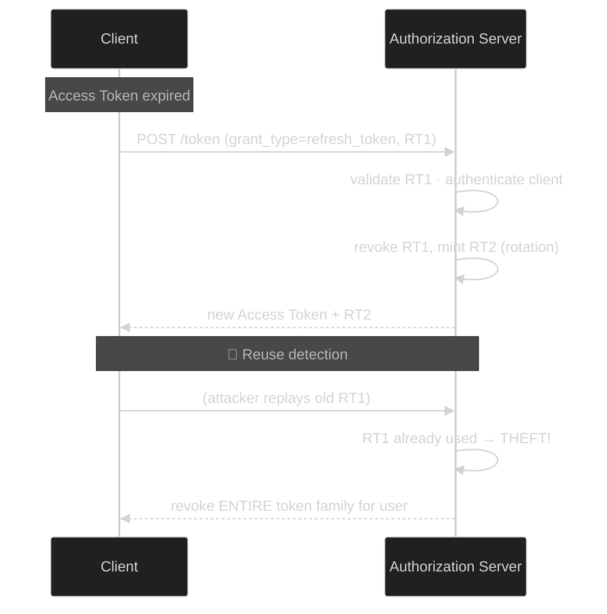
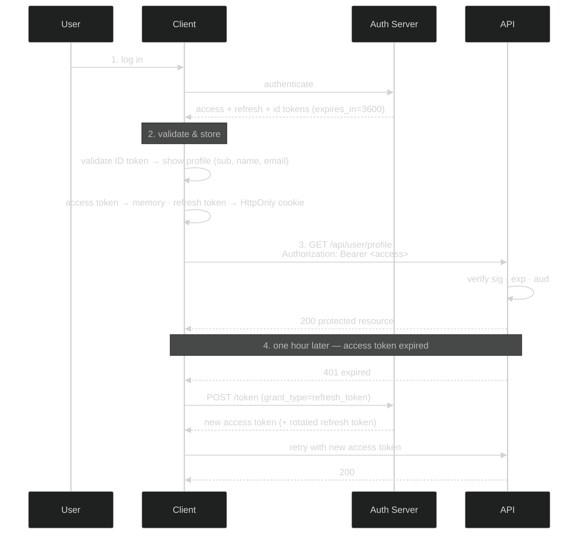

# Access vs Refresh vs ID Token: The Three Tokens Every Architect Confuses (And How to Get Them Right)
### Day 66 of 50 - System Design Interview Preparation Series

**By Sunchit Dudeja**

---

## 🎯 The Core Idea

You're designing a modern app. Users log in, stay logged in, and call APIs securely. You've heard of OAuth 2.0 and OpenID Connect (OIDC), and you know tokens are involved. Then the authorization server hands you **three** of them — an **Access Token**, a **Refresh Token**, and an **ID Token** — and the confusion sets in.

Which goes where? Which one do you cache? Which one must **never** leave the client?

The whole thing collapses into one sentence:

> **OAuth 2.0 answers "what are you *allowed to do*" (authorization → Access Token); OpenID Connect adds "*who are you*" (authentication → ID Token); and the Refresh Token answers "how do you *stay logged in* without re-entering your password." Three tokens, three audiences, three jobs — and mixing them up is the source of most auth bugs.**

The junior treats all three as "the login thing." The architect knows each has a distinct **audience** (who consumes it), a distinct **purpose**, and a distinct **lifespan** — and designs every component around *which token it's supposed to receive*.

> **Companion reads:**
> - [Day 63 — UPI Lite Offline Payments](./Day63_UPI_Lite_Offline_Payments_TEE_Double_Spend.md) — signed tokens, `audience`, `nonce`/replay defense, and expiry — the same cryptographic ideas applied to payments.
> - [Day 29 — Forward vs Reverse Proxy](./Day29_Forward_Reverse_Proxy.md) — the API gateway / reverse proxy is often where Access Tokens get validated.
> - [Day 15 — Redis Single-Threaded Magic](./Day15_Redis_Single_Threaded_Magic.md) — where you store the revocation list / refresh-token state.
> - [Day 37 — Optimizing Cache Hit Rate](./Day37_Optimizing_Cache_High_Hit_Rate_Distributed_Systems.md) — why you cache the JWKS public keys, not the tokens.

---

## 🧠 Why You Should Care

"Walk me through OAuth 2.0 and where each token goes" is a staple of senior backend and security interviews — and it separates people who've *wired up* a login button from people who *understand the trust model*. The candidate who says *"there's a token, you send it to the API"* gets a polite nod. The candidate who says *"the Access Token is for the resource server, the ID Token is for the client and must never be used as an API credential, and refresh-token rotation with reuse detection is what limits theft"* gets the offer.

This question grades four things:

- **Separation of concerns** — identity vs authorization vs session continuity.
- **Audience awareness** — every token has exactly one intended consumer.
- **Token storage** — memory vs `HttpOnly` cookie vs (never) `localStorage`.
- **Theft mitigation** — short lifetimes, rotation, reuse detection, binding (DPoP).

---

## 🏛️ The Architecture at a Glance

Three actors, three tokens. Get the mental model first:

| Token | Consumed by | Primary purpose | Typical lifespan |
|-------|-------------|-----------------|------------------|
| **Access Token** | Resource Server (API) | Authorize API access | Short (15–60 min) |
| **Refresh Token** | Authorization Server | Obtain new Access Tokens | Long (days–months) |
| **ID Token** | Client Application | Verify user identity | Short (minutes–hours) |



> **The one rule that prevents most mistakes:** trace each arrow and ask *"what is this endpoint's intended token?"* The API only ever sees the **Access Token**. The auth server only ever sees the **Refresh Token**. The **ID Token never moves** — it's consumed by the client that received it.

---

## 🔑 Access Token — "The Key to the API"

A credential the client presents to a **resource server (API)** to prove it's authorized to act on a user's behalf. It answers: **"What is this caller allowed to do?"**

| Characteristic | Description |
|----------------|-------------|
| **Short-lived** | 15–60 min — minimizes the damage window if leaked |
| **Bearer token** | Anyone holding it can use it (so bind it with DPoP if you can) |
| **Stateless** | API validates signature + claims; no server-side lookup needed |
| **Audience** | The API(s) it's valid for (`aud`) |
| **Format** | Usually a JWT, sometimes an opaque random string |

**Contains:** `scope` (permissions), `exp` (expiry), `aud` (target API), and a client/user identifier.

**Where it goes** — in the HTTP header, never the URL:

```text
Authorization: Bearer <access_token>
```

| ✅ Do | ❌ Don't |
|-------|---------|
| Send in the `Authorization: Bearer` header | Put it in a URL query param (it lands in logs) |
| Validate signature, `iss`, `aud`, `exp` **on every request** | Store it in `localStorage` |
| Keep it in memory on the client | Use it to *identify* the user (that's the ID Token's job) |

> **Security:** the short lifetime is a *feature*, not an annoyance — it's the blast-radius cap. Validate the signature against the provider's **JWKS** public keys (which you cache — [Day 37](./Day37_Optimizing_Cache_High_Hit_Rate_Distributed_Systems.md)), never log the raw token, and consider **token binding (DPoP)** so a stolen token can't be replayed from another device — the same replay-defense instinct as the `nonce` in [Day 63's offline tokens](./Day63_UPI_Lite_Offline_Payments_TEE_Double_Spend.md).

---

## 🔄 Refresh Token — "The Long-Lived Session Manager"

A longer-lived credential the client exchanges **with the authorization server** to get a fresh Access Token *without* making the user log in again. It answers: **"How do I stay logged in?"**

| Characteristic | Description |
|----------------|-------------|
| **Long-lived** | Days, weeks, or months |
| **Revocable** | Server can kill it any time (logout, suspicious activity) |
| **Audience** | The authorization server only |
| **Used sparingly** | Only when the Access Token expires |
| **Single-use (best practice)** | On rotation, the old one is revoked and a new one issued |

**Why it exists:** without it, users would re-authenticate every 15–60 minutes — miserable UX, especially on mobile and SPAs. The Refresh Token is the **security ↔ convenience balance**: short-lived access creds (safe) + a long-lived way to renew them (convenient).



| Best practice | Why |
|---------------|-----|
| **Rotation** | Every use mints a new RT and revokes the old — shrinks the theft window (OAuth 2.1 default) |
| **Secure storage** | Browser apps: `HttpOnly` + `Secure` + `SameSite` cookie — JS can't read it |
| **Reuse detection** | If the *same* RT is used twice, an attacker and the real client are racing → **revoke the whole family** |
| **Client authentication** | Confidential clients must authenticate when redeeming a RT |

> **Where the state lives:** rotation + reuse detection means the auth server must remember which refresh tokens are valid — typically a fast store like **Redis** ([Day 15](./Day15_Redis_Single_Threaded_Magic.md)) keyed by token family.

---

## 🪪 ID Token — "The Proof of Identity"

A signed **JWT** issued by the OpenID Provider during an OIDC authentication flow. It answers: **"Who is this user, and how/when did they authenticate?"** Its audience is the **client application — never the API.**

| Standard claim | Meaning |
|----------------|---------|
| `sub` | Subject — unique, stable user identifier |
| `iss` | Issuer — which auth server minted it |
| `aud` | Audience — the **client ID** of your app |
| `iat` | Issued-at timestamp |
| `exp` | Expiry |
| `auth_time` | When the user actually authenticated |
| `nonce` | Replay protection (binds the token to *this* login request) |

| ✅ Do | ❌ Don't |
|-------|---------|
| Use it to identify the user **in the client** | Send it to a resource server as an authorization credential |
| Validate its signature + claims (`iss`, `aud`, `exp`, `nonce`) | Use it for API access |
| Cache profile info (`name`, `email`) to skip extra calls | Treat an Access Token as a user profile |

> **Why the distinction is non-negotiable:** **ID Token = identity (who you are); Access Token = authorization (what you can do).** Use an ID Token to call an API and the API rightly rejects it (wrong `aud`, not an access credential). Use an Access Token to identify a user and you'll find it has no standardized identity claims. These are the two most common OAuth mistakes in the wild.

---

## 📊 Comparison at a Glance

| Aspect | Access Token | Refresh Token | ID Token |
|--------|--------------|---------------|----------|
| **Protocol** | OAuth 2.0 | OAuth 2.0 | OpenID Connect |
| **Intended consumer** | Resource Server (API) | Authorization Server | Client App |
| **Purpose** | Authorize API access | Get new Access Tokens | Verify user identity |
| **Lifespan** | Short (15–60 min) | Long (days–months) | Short (min–hours) |
| **Format** | JWT or opaque | Often opaque | Always JWT |
| **Cacheable?** | Yes (memory only) | Yes (securely) | Yes (user info) |
| **Send to API?** | ✅ Yes | ❌ No | ❌ No |
| **Revocable?** | Usually not (by design) | ✅ Yes | Usually not |

---

## 🔧 Real-World Example: The Complete Flow



The login response the client receives:

```json
{
  "access_token": "eyJhbGciOiJSUzI1NiIs...",
  "refresh_token": "a1b2c3d4e5f6...",
  "id_token": "eyJhbGciOiJSUzI1NiIs...",
  "expires_in": 3600,
  "token_type": "Bearer"
}
```

- **ID Token** → validate, extract `sub`/`name`/`email`, render the profile, cache it. **Stays on the client.**
- **Access Token** → memory, sent as `Authorization: Bearer` on API calls.
- **Refresh Token** → `HttpOnly` cookie, used only to renew the Access Token.

When the Access Token expires, the client posts the Refresh Token to `/token`; the server validates it, issues a new Access Token (and a rotated Refresh Token), and revokes the old one if rotation is on.

---

## ❌ What Juniors Get Wrong (And Architects Get Right)

| Mistake | Architect's correction |
|---------|------------------------|
| "I'll use the ID Token to call my API." | ID Tokens are **identity**, not authorization. APIs take **Access Tokens**. |
| "I'll store the Access Token in `localStorage`." | Bearer tokens are stealable from JS. Use **memory** (SPA) or **HttpOnly cookies** (web). |
| "Skip refresh tokens — just make Access Tokens long-lived." | Long-lived access creds = huge attack surface. **Short access + refresh** is the standard. |
| "I'll use the Access Token to identify the user." | Access Tokens have **authorization** claims, not standardized identity claims. |
| "Refresh Tokens don't need rotation." | **Rotation + reuse detection** (OAuth 2.1) is what limits theft. |
| "I'll cache the Access Token for performance." | Fine — **in memory only**, never persistent storage. |
| "My API accepts Access and ID Tokens interchangeably." | The API must check token type/audience and **reject ID Tokens**. |

---

## 🟣 The Simpler Version — Explain It Like the Reader Has 2 Minutes

> **Think of visiting a secure office building. When you check in at the front desk (the authorization server) after proving who you are, you get three things. A photo ID badge (the ID Token) — it tells *people inside* who you are, but it won't open any doors; you keep it on you and never hand it over. A temporary keycard (the Access Token) that opens specific doors (the APIs) for a short while — you tap it at each door, and if you lose it, it expires fast so it's nearly useless to a thief. And a renewal slip (the Refresh Token) you keep locked in your bag; when your keycard stops working, you quietly take the slip back to the front desk and get a fresh keycard without proving your identity all over again. The front desk even invalidates your old slip each time and raises an alarm if someone tries to reuse a spent one. Three items, three jobs — and you never use the badge to open a door or the keycard to say who you are.**

### The one-line summary

> 🎯 **Access Token = what you can do (→ API); ID Token = who you are (→ client, never the API); Refresh Token = how you stay logged in (→ auth server, rotated). Different audiences, different jobs — never swap them.**

---

## 💬 How to Talk About It in an Interview

When asked *"explain OAuth 2.0 / OIDC tokens and where each goes"*:

> "OAuth 2.0 is about **authorization**, OIDC adds **authentication** on top. After login the authorization server returns three tokens with three different audiences.
>
> The **Access Token** goes to the **API** in the `Authorization: Bearer` header — it's short-lived (15–60 min), usually a JWT carrying scopes, and the API validates its signature, issuer, audience, and expiry statelessly on every request. The short lifetime caps the blast radius if it leaks.
>
> The **ID Token** is a JWT for the **client only** — it proves identity (`sub`, `name`, `auth_time`, `nonce`) and must **never** be sent to an API as a credential. Using an ID Token to call an API, or an Access Token to identify a user, are the two classic mistakes.
>
> The **Refresh Token** goes to the **authorization server** to mint new Access Tokens without re-login. It's long-lived and revocable, stored in an `HttpOnly` cookie, with **rotation + reuse detection** — if a spent refresh token is replayed, the server revokes the whole family.
>
> So the design rule is: every component receives exactly one kind of token, matched to its audience — identity, authorization, and session continuity kept separate."

That answer signals **separation of concerns, audience awareness, secure storage, and theft mitigation** — exactly what this question grades.

---

## 🧾 Quick Recap

- **Three tokens, three audiences:** Access → API, ID → client, Refresh → auth server.
- **Access Token** = "what can you do" — short-lived, `Authorization: Bearer`, memory-only, validate every request.
- **ID Token** = "who are you" — always a JWT, for the client, **never** sent to an API.
- **Refresh Token** = "stay logged in" — long-lived, revocable, `HttpOnly` cookie, **rotation + reuse detection**.
- **Never** swap them: ID Token ≠ API credential; Access Token ≠ user profile.
- Validate signatures against cached **JWKS** keys ([Day 37](./Day37_Optimizing_Cache_High_Hit_Rate_Distributed_Systems.md)); keep refresh state in **Redis** ([Day 15](./Day15_Redis_Single_Threaded_Magic.md)).
- Same crypto instincts as [Day 63](./Day63_UPI_Lite_Offline_Payments_TEE_Double_Spend.md): signed tokens, `aud`, `nonce`, short expiry.

---

## 🎬 Final Words

The power of OAuth 2.0 + OIDC is the **separation of concerns**: identity, authorization, and session continuity each get their own token, their own audience, and their own lifecycle. The vulnerabilities almost always come from collapsing that separation — an ID Token used as an API key, an Access Token in `localStorage`, a refresh token that never rotates.

When you design your next auth flow, ask four questions: *Which token is this component supposed to receive? What's its intended audience? How do I handle expiry gracefully? Have I implemented refresh-token rotation?* Get them right and your system is both secure and delightful. Get them wrong and you'll be debugging a breach at 2 AM. 🎯

---

*If this finally untangled the three tokens for you, share it with the next engineer about to drop an Access Token into `localStorage`.* 🎯
