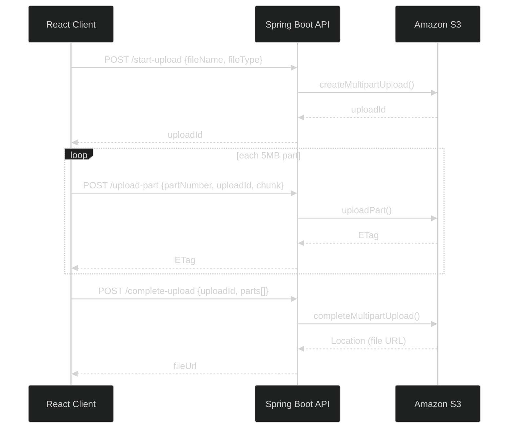

# Build S3 Multipart Upload End-to-End — Java Spring Boot Backend, React Frontend, and the Architect's Production Notes
### Day 67 of 50 - System Design Interview Preparation Series

**By Sunchit Dudeja**

---

## 🎯 The Core Idea

Uploading a 100 MB — or 5 TB — file in a single HTTP request is a recipe for timeouts, memory explosions, and "start over from zero" when the network hiccups at 99%. **Amazon S3 Multipart Upload** fixes this by splitting the file into parts, uploading each independently, and letting S3 assemble the final object server-side.

> **Mental model:** You're not uploading one giant blob — you're shipping a crate in labeled boxes. Each box has a part number and an ETag receipt. S3 is the warehouse that puts the boxes back together in order.

[Day 20](./Day20_S3_Multipart_Upload_Architecture.md) covered the **architect's view** — presigned URLs, direct client→S3 upload, parallel parts, resume. **This day is the build:** a working **Java Spring Boot** + React implementation you can run locally, with honest notes on what you'd change for production.

---

## 🧠 Why You Should Care

"How would you upload a 2 GB video reliably?" shows up in system design interviews *and* in real backend work. The candidate who says *"multipart upload to S3, 5–100 MB parts, parallel uploads, complete with ordered ETags"* passes. The one who ships a single `PUT` with a 30-minute timeout does not.

This tutorial gives you the **three S3 API calls** every implementation revolves around:

1. `CreateMultipartUpload` → get an `uploadId`
2. `UploadPart` (× N) → get an `ETag` per part
3. `CompleteMultipartUpload` → S3 stitches parts into the final object

---

## 📋 Prerequisites

Before you start, ensure you have:

- An **AWS account** with IAM user credentials (access key + secret)
- **Java 17+** and **Maven** (or Gradle) installed
- **Node.js** (for the React frontend only)
- Basic knowledge of **Java**, **Spring Boot**, and **React**

---

## 📑 Table of Contents

1. [How It Works](#-how-it-works)
2. [Step 1: Set Up AWS S3](#-step-1-how-to-set-up-aws-s3)
3. [Step 2: Java Spring Boot Backend](#-step-2-how-to-set-up-aws-s3-backend-with-java-spring-boot)
4. [Step 3: React Frontend](#-step-3-how-to-set-up-the-frontend-with-react)
5. [Testing](#-testing)
6. [Architect's Production Notes](#-architects-production-notes)
7. [Junior vs Architect](#-junior-vs-architect--side-by-side)
8. [Interview Sound Bite](#-how-to-talk-about-it-in-an-interview)
9. [Quick Recap](#-quick-recap)

> **Companion reads:** [Day 20 — S3 Multipart Upload Architecture](./Day20_S3_Multipart_Upload_Architecture.md) · [Day 14 — Spring Boot Performance](./Day14_SpringBoot_Performance.md)

---

## 🔧 How It Works

A large file is divided into smaller **parts/chunks**. Each part is uploaded independently to Amazon S3. Once all parts are uploaded, S3 **combines** them into the final object.

**Example:** Uploading a 100 MB file in 5 MB parts → **20 parts**. Each part gets a unique part number and an **ETag**. Order is preserved so S3 can reassemble correctly.



**Benefits:** retries per part, pause/resume, fault tolerance on unstable networks. Learn more in the [official S3 multipart upload docs](https://docs.aws.amazon.com/AmazonS3/latest/userguide/mpuoverview.html).

---

## ☁️ Step 1: How to Set Up AWS S3

### How to Create an S3 Bucket

1. Log into the **AWS Management Console**.
2. Navigate to the **S3** service.
3. Click **Create bucket** and note the bucket name.
4. For this tutorial, **uncheck "Block all public access"** (demo only — we'll use a bucket policy for read access).
5. Leave other settings as default and create the bucket.

> **Production warning:** never make buckets public in production. Use **presigned URLs** or **CloudFront with signed cookies** instead ([Day 20](./Day20_S3_Multipart_Upload_Architecture.md)).

### How to Configure S3 Bucket Policy

Allow users to read object URLs (for the "View Uploaded File" link after upload):

1. Click the bucket name → **Permissions** tab.
2. **Bucket Policy** → **Edit**.
3. Paste (replace `your-bucket-name`):

```json
{
  "Version": "2012-10-17",
  "Statement": [
    {
      "Effect": "Allow",
      "Principal": "*",
      "Action": "s3:GetObject",
      "Resource": "arn:aws:s3:::your-bucket-name/*"
    }
  ]
}
```

| Field | Meaning |
|-------|---------|
| `Version` | Policy language version |
| `Statement` | One or more allow/deny rules |
| `Effect` | `Allow` or `Deny` |
| `Principal` | Who it applies to (`*` = everyone — demo only) |
| `Action` | `s3:GetObject` = read objects |
| `Resource` | ARN of bucket/objects |

Click **Save changes**.

---

## ☕ Step 2: How to Set Up AWS S3 Backend with Java Spring Boot

### Project Structure

```text
s3-multipart-upload/
├── pom.xml
├── src/main/java/com/example/s3upload/
│   ├── S3MultipartUploadApplication.java
│   ├── config/
│   │   ├── AwsS3Config.java
│   │   └── CorsConfig.java
│   ├── controller/
│   │   └── S3UploadController.java
│   └── dto/
│       ├── StartUploadRequest.java
│       ├── UploadPartRequest.java
│       ├── CompleteUploadRequest.java
│       └── UploadedPart.java
└── src/main/resources/
    └── application.properties
```

### Create the Project

```bash
curl https://start.spring.io/starter.zip \
  -d type=maven-project \
  -d language=java \
  -d bootVersion=3.3.0 \
  -d baseDir=s3-multipart-upload \
  -d groupId=com.example \
  -d artifactId=s3-multipart-upload \
  -d name=s3-multipart-upload \
  -d packageName=com.example.s3upload \
  -d javaVersion=17 \
  -d dependencies=web \
  -o s3-multipart-upload.zip

unzip s3-multipart-upload.zip && cd s3-multipart-upload
```

### `pom.xml` — Add AWS SDK for Java v2

Add inside `<dependencies>`:

```xml
<dependency>
    <groupId>software.amazon.awssdk</groupId>
    <artifactId>s3</artifactId>
    <version>2.25.60</version>
</dependency>
```

| Dependency | Role |
|------------|------|
| `spring-boot-starter-web` | REST API (from Spring Initializr) |
| `software.amazon.awssdk:s3` | AWS S3 client — multipart upload APIs |

### `application.properties`

```properties
server.port=3001

aws.access-key=${AWS_ACCESS_KEY}
aws.secret-key=${AWS_SECRET_KEY}
aws.region=${AWS_REGION:us-east-1}
aws.s3.bucket=${S3_BUCKET}
```

Set environment variables before running (or use your IDE run config):

```bash
export AWS_ACCESS_KEY=your-access-key
export AWS_SECRET_KEY=your-secret-key
export AWS_REGION=your-region
export S3_BUCKET=your-bucket-name
```

> **Never commit credentials to git.** Use env vars or a secrets manager in production.

### `AwsS3Config.java`

```java
package com.example.s3upload.config;

import org.springframework.beans.factory.annotation.Value;
import org.springframework.context.annotation.Bean;
import org.springframework.context.annotation.Configuration;
import software.amazon.awssdk.auth.credentials.AwsBasicCredentials;
import software.amazon.awssdk.auth.credentials.StaticCredentialsProvider;
import software.amazon.awssdk.regions.Region;
import software.amazon.awssdk.services.s3.S3Client;

@Configuration
public class AwsS3Config {

    @Value("${aws.access-key}")
    private String accessKey;

    @Value("${aws.secret-key}")
    private String secretKey;

    @Value("${aws.region}")
    private String region;

    @Bean
    public S3Client s3Client() {
        return S3Client.builder()
                .region(Region.of(region))
                .credentialsProvider(StaticCredentialsProvider.create(
                        AwsBasicCredentials.create(accessKey, secretKey)))
                .build();
    }
}
```

### `CorsConfig.java`

Lets the React app on port 3000 call the API on port 3001.

```java
package com.example.s3upload.config;

import org.springframework.context.annotation.Bean;
import org.springframework.context.annotation.Configuration;
import org.springframework.web.servlet.config.annotation.CorsRegistry;
import org.springframework.web.servlet.config.annotation.WebMvcConfigurer;

@Configuration
public class CorsConfig {

    @Bean
    public WebMvcConfigurer corsConfigurer() {
        return new WebMvcConfigurer() {
            @Override
            public void addCorsMappings(CorsRegistry registry) {
                registry.addMapping("/**")
                        .allowedOrigins("http://localhost:3000")
                        .allowedMethods("GET", "POST", "PUT", "DELETE", "OPTIONS")
                        .allowedHeaders("*");
            }
        };
    }
}
```

### DTOs

**`StartUploadRequest.java`**

```java
package com.example.s3upload.dto;

public record StartUploadRequest(String fileName, String fileType) {}
```

**`UploadPartRequest.java`**

```java
package com.example.s3upload.dto;

public record UploadPartRequest(
        String fileName,
        int partNumber,
        String uploadId,
        String fileChunk   // base64-encoded bytes from the React client
) {}
```

**`UploadedPart.java`**

```java
package com.example.s3upload.dto;

import com.fasterxml.jackson.annotation.JsonProperty;

public record UploadedPart(
        @JsonProperty("ETag") String eTag,
        @JsonProperty("PartNumber") int partNumber
) {}
```

**`CompleteUploadRequest.java`**

```java
package com.example.s3upload.dto;

import java.util.List;

public record CompleteUploadRequest(
        String fileName,
        String uploadId,
        List<UploadedPart> parts
) {}
```

### `S3UploadController.java` — The Three Endpoints

```java
package com.example.s3upload.controller;

import com.example.s3upload.dto.*;
import org.springframework.beans.factory.annotation.Value;
import org.springframework.http.ResponseEntity;
import org.springframework.web.bind.annotation.*;
import software.amazon.awssdk.core.sync.RequestBody;
import software.amazon.awssdk.services.s3.S3Client;
import software.amazon.awssdk.services.s3.model.*;

import java.util.Base64;
import java.util.Map;

@RestController
public class S3UploadController {

    private final S3Client s3Client;

    @Value("${aws.s3.bucket}")
    private String bucket;

    public S3UploadController(S3Client s3Client) {
        this.s3Client = s3Client;
    }

    /** Route 1 — Initialize multipart upload */
    @PostMapping("/start-upload")
    public ResponseEntity<Map<String, String>> startUpload(
            @RequestBody StartUploadRequest request) {

        CreateMultipartUploadResponse response = s3Client.createMultipartUpload(
                CreateMultipartUploadRequest.builder()
                        .bucket(bucket)
                        .key(request.fileName())
                        .contentType(request.fileType())
                        .build());

        return ResponseEntity.ok(Map.of("uploadId", response.uploadId()));
    }

    /** Route 2 — Upload one part */
    @PostMapping("/upload-part")
    public ResponseEntity<Map<String, String>> uploadPart(
            @RequestBody UploadPartRequest request) {

        byte[] chunkBytes = Base64.getDecoder().decode(request.fileChunk());

        UploadPartResponse response = s3Client.uploadPart(
                UploadPartRequest.builder()
                        .bucket(bucket)
                        .key(request.fileName())
                        .uploadId(request.uploadId())
                        .partNumber(request.partNumber())
                        .contentLength((long) chunkBytes.length)
                        .build(),
                RequestBody.fromBytes(chunkBytes));

        return ResponseEntity.ok(Map.of("ETag", response.eTag()));
    }

    /** Route 3 — Complete multipart upload */
    @PostMapping("/complete-upload")
    public ResponseEntity<Map<String, String>> completeUpload(
            @RequestBody CompleteUploadRequest request) {

        var completedParts = request.parts().stream()
                .map(p -> CompletedPart.builder()
                        .partNumber(p.partNumber())
                        .eTag(p.eTag())
                        .build())
                .toList();

        CompleteMultipartUploadResponse response = s3Client.completeMultipartUpload(
                CompleteMultipartUploadRequest.builder()
                        .bucket(bucket)
                        .key(request.fileName())
                        .uploadId(request.uploadId())
                        .multipartUpload(CompletedMultipartUpload.builder()
                                .parts(completedParts)
                                .build())
                        .build());

        return ResponseEntity.ok(Map.of("fileUrl", response.location()));
    }
}
```

| Endpoint | S3 API | Returns |
|----------|--------|---------|
| `POST /start-upload` | `createMultipartUpload` | `{ "uploadId": "..." }` |
| `POST /upload-part` | `uploadPart` | `{ "ETag": "..." }` |
| `POST /complete-upload` | `completeMultipartUpload` | `{ "fileUrl": "https://..." }` |

### `S3MultipartUploadApplication.java`

```java
package com.example.s3upload;

import org.springframework.boot.SpringApplication;
import org.springframework.boot.autoconfigure.SpringBootApplication;

@SpringBootApplication
public class S3MultipartUploadApplication {

    public static void main(String[] args) {
        SpringApplication.run(S3MultipartUploadApplication.class, args);
    }
}
```

### Running the Server

```bash
./mvnw spring-boot:run
```

Server runs on **http://localhost:3001** (same port as the React client expects).

---

## ⚛️ Step 3: How to Set Up the Frontend with React

The frontend splits the file into chunks, uploads each part via the API, then completes the multipart upload. **No changes needed** — the Java backend exposes the same three endpoints with the same JSON contract.

### Initialize React Project

```bash
npx create-react-app s3-multipart-upload-frontend
cd s3-multipart-upload-frontend
npm install axios
```

### Create `src/components/FileUpload.js`

```javascript
import React, { useState } from "react";
import axios from "axios";

const CHUNK_SIZE = 5 * 1024 * 1024; // 5MB
const API_BASE = "http://localhost:3001";

const FileUpload = () => {
  const [file, setFile] = useState(null);
  const [fileUrl, setFileUrl] = useState("");
  const [progress, setProgress] = useState(0);

  const handleFileChange = (e) => {
    setFile(e.target.files[0]);
    setFileUrl("");
    setProgress(0);
  };

  const handleFileUpload = async () => {
    if (!file) return;

    const fileName = file.name;
    const fileType = file.type;
    let uploadId = "";
    const parts = [];

    try {
      const startUploadResponse = await axios.post(`${API_BASE}/start-upload`, {
        fileName,
        fileType,
      });
      uploadId = startUploadResponse.data.uploadId;

      const totalParts = Math.ceil(file.size / CHUNK_SIZE);

      for (let partNumber = 1; partNumber <= totalParts; partNumber++) {
        const start = (partNumber - 1) * CHUNK_SIZE;
        const end = Math.min(start + CHUNK_SIZE, file.size);
        const fileChunk = file.slice(start, end);

        const arrayBuffer = await fileChunk.arrayBuffer();
        const fileChunkBase64 = btoa(
          new Uint8Array(arrayBuffer).reduce(
            (data, byte) => data + String.fromCharCode(byte),
            ""
          )
        );

        const uploadPartResponse = await axios.post(`${API_BASE}/upload-part`, {
          fileName,
          partNumber,
          uploadId,
          fileChunk: fileChunkBase64,
        });

        parts.push({
          ETag: uploadPartResponse.data.ETag,
          PartNumber: partNumber,
        });

        setProgress(Math.round((partNumber / totalParts) * 100));
      }

      const completeUploadResponse = await axios.post(
        `${API_BASE}/complete-upload`,
        { fileName, uploadId, parts }
      );

      setFileUrl(completeUploadResponse.data.fileUrl);
      alert("File uploaded successfully");
    } catch (error) {
      console.error("Error uploading file:", error);
      alert("Upload failed — check console");
    }
  };

  return (
    <div>
      <input type="file" onChange={handleFileChange} />
      <button disabled={!file} onClick={handleFileUpload}>
        Upload
      </button>
      {progress > 0 && <p>Progress: {progress}%</p>}
      <hr />
      {fileUrl && (
        <a href={fileUrl} target="_blank" rel="noopener noreferrer">
          View Uploaded File
        </a>
      )}
    </div>
  );
};

export default FileUpload;
```

### App Component — `src/App.js`

```javascript
import React from "react";
import FileUpload from "./components/FileUpload";

function App() {
  return (
    <div className="App">
      <h1>Large File Upload with S3 Multipart Upload</h1>
      <FileUpload />
    </div>
  );
}

export default App;
```

### Start the Frontend

```bash
npm start
```

Opens **http://localhost:3000**.

---

## 🧪 Testing

1. Start the Spring Boot server (`./mvnw spring-boot:run`).
2. Start the React app (`npm start`).
3. Select a large file (e.g. 50–100 MB) and click **Upload**.
4. Open **DevTools → Network** and watch:

| Phase | Endpoint | What you see |
|-------|----------|--------------|
| **Initialize** | `POST /start-upload` | Returns `uploadId` |
| **Part upload** | `POST /upload-part` (× N) | One request per 5 MB chunk; each returns an `ETag` |
| **Complete** | `POST /complete-upload` | Sends all `{ ETag, PartNumber }` pairs; returns `fileUrl` |

Click **View Uploaded File** to open the S3 object URL.

---

## 🏗️ Architect's Production Notes

This tutorial **works** and teaches the S3 API. For production, an architect would change several things:

| Tutorial choice | Production upgrade | Why |
|-----------------|-------------------|-----|
| Chunks flow **client → API → S3** | **Presigned URLs** — client uploads **directly to S3** | Backend doesn't become a bandwidth/memory bottleneck ([Day 20](./Day20_S3_Multipart_Upload_Architecture.md)) |
| **Sequential** part uploads | **Parallel** uploads (e.g. 4–6 concurrent) | 4× faster on good networks |
| Public bucket `GetObject` policy | **Private bucket** + presigned GET or CloudFront | Security |
| Static AWS keys in config | **IAM role** (EC2/ECS/EKS) — `DefaultCredentialsProvider` | No long-lived keys on disk |
| No abort on failure | `abortMultipartUpload` on error | Orphaned parts cost money |
| No resume | Persist `uploadId` + completed parts in **DB/Redis** | Resume after browser refresh |
| Base64 over JSON | **Presigned PUT** with raw binary body | ~33% smaller payloads |
| Single controller class | **Service layer** + validation + metrics | Testability ([Day 14](./Day14_SpringBoot_Performance.md)) |

> **The interview answer:** "I'd use multipart upload with 5–100 MB parts, parallel uploads via presigned URLs so data never touches my API servers, track completed part ETags client-side for resume, and call `CompleteMultipartUpload` when done — with `AbortMultipartUpload` on timeout."

---

## ❌ Junior vs Architect — Side by Side

| Junior approach | Architect approach |
|-----------------|---------------------|
| Single `PUT` for the whole file | **Multipart** with sized parts |
| Proxy all bytes through the API server | **Presigned URLs** — direct client→S3 |
| Upload parts one at a time | **Parallel** part uploads with a concurrency limit |
| Public S3 bucket | Private bucket + signed URLs |
| AWS keys in `application.properties` | **IAM role** + `DefaultCredentialsProvider` |
| Lose progress on refresh | **Resume** with stored `uploadId` + part ETags |
| Ignore failed multipart uploads | **`abortMultipartUpload`** + lifecycle rules for orphans |

---

## 💬 How to Talk About It in an Interview

> "For large files I'd use **S3 multipart upload**. The client calls `CreateMultipartUpload` to get an `uploadId`, splits the file into 5–100 MB parts, and uploads each with `UploadPart` — ideally **in parallel** via **presigned URLs** so my API never proxies the bytes. Each part returns an ETag. When all parts are done, `CompleteMultipartUpload` with the ordered `{ PartNumber, ETag }` list assembles the object. If the upload fails or the user abandons it, I'd call `AbortMultipartUpload` to avoid orphaned parts. This gives per-part retry, pause/resume, and no single-request timeout — the same pattern Dropbox and Netflix use at scale."

---

## 🧾 Quick Recap

- **Three S3 calls:** `createMultipartUpload` → `uploadPart` (× N) → `completeMultipartUpload`.
- Each part needs a **part number** (1-based) and returns an **ETag** receipt.
- **5 MB** is the practical minimum part size (except the last part).
- This tutorial: **Spring Boot API** (AWS SDK for Java v2) + **React client** that chunks and uploads sequentially.
- **Production:** presigned URLs, parallel parts, private bucket, IAM roles, resume, abort on failure — see [Day 20](./Day20_S3_Multipart_Upload_Architecture.md).
- Test in the browser **Network tab** — you'll see `start-upload` → many `upload-part` → `complete-upload`.

---

## 🎬 Conclusion

You've built a working S3 multipart upload pipeline in **Java** — initialize, upload parts, complete. This is the foundation behind every large-file upload in the cloud. Enhance it with progress tracking, parallel uploads, presigned URLs, and resumable state — and you'll have production-grade file upload architecture.

The next time someone says "just POST the file to your API," ask them what happens at 1.8 GB when the connection drops. That question separates a tutorial upload from an architect's design. 🎯

---

*Architecture deep-dive (presigned URLs, parallel upload, resume):* [Day 20 — S3 Multipart Upload Architecture](./Day20_S3_Multipart_Upload_Architecture.md)
