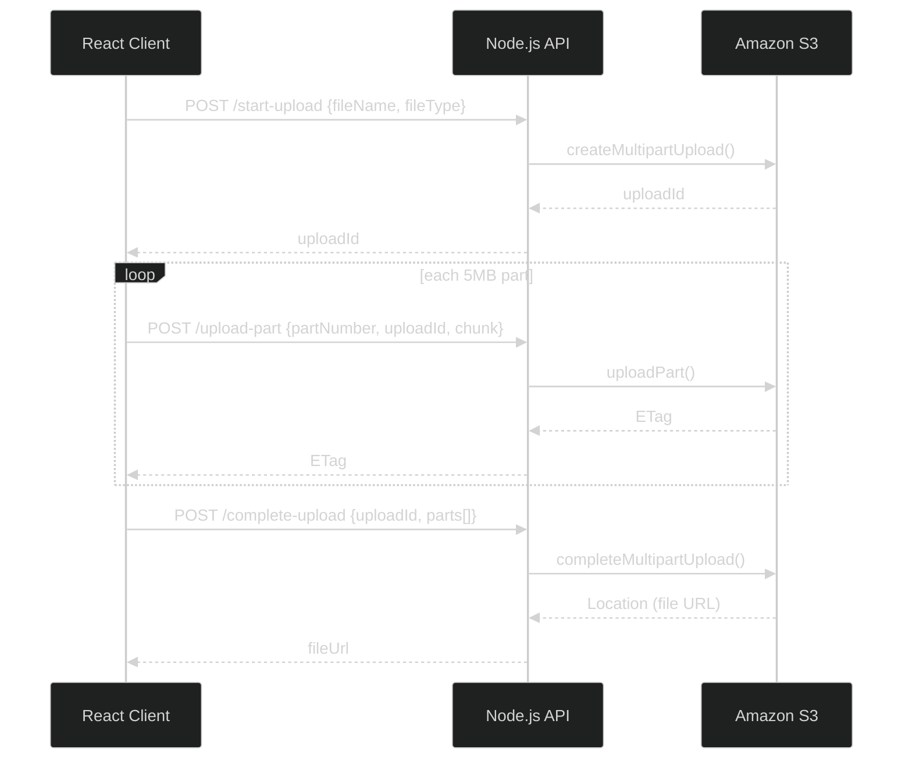

# Build S3 Multipart Upload End-to-End — Node.js Backend, React Frontend, and the Architect's Production Notes
### Day 67 of 50 - System Design Interview Preparation Series

**By Sunchit Dudeja**

---

## 🎯 The Core Idea

Uploading a 100 MB — or 5 TB — file in a single HTTP request is a recipe for timeouts, memory explosions, and "start over from zero" when the network hiccups at 99%. **Amazon S3 Multipart Upload** fixes this by splitting the file into parts, uploading each independently, and letting S3 assemble the final object server-side.

> **Mental model:** You're not uploading one giant blob — you're shipping a crate in labeled boxes. Each box has a part number and an ETag receipt. S3 is the warehouse that puts the boxes back together in order.

[Day 20](./Day20_S3_Multipart_Upload_Architecture.md) covered the **architect's view** — presigned URLs, direct client→S3 upload, parallel parts, resume. **This day is the build:** a working Node.js + React implementation you can run locally, with honest notes on what you'd change for production.

---

## 🧠 Why You Should Care

"How would you upload a 2 GB video reliably?" shows up in system design interviews *and* in real backend work. The candidate who says *"multipart upload to S3, 5–100 MB parts, parallel uploads, complete with ordered ETags"* passes. The one who ships a single `PUT` with a 30-minute timeout does not.

This tutorial gives you the **three S3 API calls** every implementation revolves around:

1. `CreateMultipartUpload` → get an `uploadId`
2. `UploadPart` (× N) → get an `ETag` per part
3. `CompleteMultipartUpload` → S3 stitches parts into the final object

---

## 📋 Prerequisites

Before you start, ensure you have:

- An **AWS account** with IAM user credentials (access key + secret)
- **Node.js** installed on your development machine
- Basic knowledge of **JavaScript**, **React**, and **Node.js**

---

## 📑 Table of Contents

1. [How It Works](#-how-it-works)
2. [Step 1: Set Up AWS S3](#-step-1-how-to-set-up-aws-s3)
3. [Step 2: Node.js Backend](#-step-2-how-to-set-up-aws-s3-backend-with-nodejs)
4. [Step 3: React Frontend](#-step-3-how-to-set-up-the-frontend-with-react)
5. [Testing](#-testing)
6. [Architect's Production Notes](#-architects-production-notes)
7. [Junior vs Architect](#-junior-vs-architect--side-by-side)
8. [Interview Sound Bite](#-how-to-talk-about-it-in-an-interview)
9. [Quick Recap](#-quick-recap)

> **Companion read:** [Day 20 — S3 Multipart Upload Architecture (Dropbox & Netflix pattern)](./Day20_S3_Multipart_Upload_Architecture.md)

---

## 🔧 How It Works

A large file is divided into smaller **parts/chunks**. Each part is uploaded independently to Amazon S3. Once all parts are uploaded, S3 **combines** them into the final object.

**Example:** Uploading a 100 MB file in 5 MB parts → **20 parts**. Each part gets a unique part number and an **ETag**. Order is preserved so S3 can reassemble correctly.



**Benefits:** retries per part, pause/resume, fault tolerance on unstable networks. Learn more in the [official S3 multipart upload docs](https://docs.aws.amazon.com/AmazonS3/latest/userguide/mpuoverview.html).

---

## ☁️ Step 1: How to Set Up AWS S3

### How to Create an S3 Bucket

1. Log into the **AWS Management Console**.
2. Navigate to the **S3** service.
3. Click **Create bucket** and note the bucket name.
4. For this tutorial, **uncheck "Block all public access"** (demo only — we'll use a bucket policy for read access).
5. Leave other settings as default and create the bucket.

> **Production warning:** never make buckets public in production. Use **presigned URLs** or **CloudFront with signed cookies** instead ([Day 20](./Day20_S3_Multipart_Upload_Architecture.md)).

### How to Configure S3 Bucket Policy

Allow users to read object URLs (for the "View Uploaded File" link after upload):

1. Click the bucket name → **Permissions** tab.
2. **Bucket Policy** → **Edit**.
3. Paste (replace `your-bucket-name`):

```json
{
  "Version": "2012-10-17",
  "Statement": [
    {
      "Effect": "Allow",
      "Principal": "*",
      "Action": "s3:GetObject",
      "Resource": "arn:aws:s3:::your-bucket-name/*"
    }
  ]
}
```

| Field | Meaning |
|-------|---------|
| `Version` | Policy language version |
| `Statement` | One or more allow/deny rules |
| `Effect` | `Allow` or `Deny` |
| `Principal` | Who it applies to (`*` = everyone — demo only) |
| `Action` | `s3:GetObject` = read objects |
| `Resource` | ARN of bucket/objects |

Click **Save changes**.

---

## 🖥️ Step 2: How to Set Up AWS S3 Backend with Node.js

### Initialize a Node.js Project

```bash
mkdir s3-multipart-upload
cd s3-multipart-upload
npm init -y
```

### Install Required Packages

```bash
npm install express dotenv multer aws-sdk cors
```

> **Note:** `cors` is used in the server code — include it in `npm install`.

### Create `app.js`

Full server file — all upload logic in one place for simplicity.

#### Imports and Configuration

```javascript
const cors = require("cors");
const express = require("express");
const AWS = require("aws-sdk");
const dotenv = require("dotenv");
const multer = require("multer");

const multerUpload = multer();
dotenv.config();

const app = express();
const port = 3001;
```

| Package | Role |
|---------|------|
| `cors` | Lets the React app (port 3000) call the API (port 3001) |
| `express` | Web framework |
| `aws-sdk` | AWS S3 client |
| `dotenv` | Loads `.env` credentials |
| `multer` | Parses multipart form data for file chunks |

#### Middleware and AWS Configuration

```javascript
app.use(cors());

AWS.config.update({
  accessKeyId: process.env.AWS_ACCESS_KEY,
  secretAccessKey: process.env.AWS_SECRET_KEY,
  region: process.env.AWS_REGION,
});

const s3 = new AWS.S3();
app.use(express.json({ limit: "50mb" }));
app.use(express.urlencoded({ limit: "50mb", extended: true }));
```

#### Route 1 — Start / Initialize Upload

```javascript
app.post("/start-upload", async (req, res) => {
  const { fileName, fileType } = req.body;

  const params = {
    Bucket: process.env.S3_BUCKET,
    Key: fileName,
    ContentType: fileType,
  };

  try {
    const upload = await s3.createMultipartUpload(params).promise();
    res.send({ uploadId: upload.UploadId });
  } catch (error) {
    res.status(500).send(error);
  }
});
```

Returns an **`uploadId`** — required for every subsequent `uploadPart` and `completeMultipartUpload` call.

#### Route 2 — Upload Part

```javascript
app.post("/upload-part", multerUpload.single("fileChunk"), async (req, res) => {
  const { fileName, partNumber, uploadId, fileChunk } = req.body;

  const params = {
    Bucket: process.env.S3_BUCKET,
    Key: fileName,
    PartNumber: parseInt(partNumber, 10),
    UploadId: uploadId,
    Body: Buffer.from(fileChunk, "base64"),
  };

  try {
    const uploadParts = await s3.uploadPart(params).promise();
    res.send({ ETag: uploadParts.ETag });
  } catch (error) {
    res.status(500).send(error);
  }
});
```

Each part returns an **ETag** — a receipt S3 needs at completion time. **Part numbers must be 1-based and sequential** in the final `Parts` array.

#### Route 3 — Complete Upload

```javascript
app.post("/complete-upload", async (req, res) => {
  const { fileName, uploadId, parts } = req.body;

  const params = {
    Bucket: process.env.S3_BUCKET,
    Key: fileName,
    UploadId: uploadId,
    MultipartUpload: {
      Parts: parts,
    },
  };

  try {
    const complete = await s3.completeMultipartUpload(params).promise();
    res.send({ fileUrl: complete.Location });
  } catch (error) {
    res.status(500).send(error);
  }
});
```

`parts` is an array of `{ ETag, PartNumber }` — one entry per uploaded chunk, sorted by `PartNumber`.

#### Start the Server

```javascript
app.listen(port, () => {
  console.log(`Server running on port ${port}`);
});
```

### Environment Variables

Create `.env` in the project root:

```env
AWS_ACCESS_KEY=your-access-key
AWS_SECRET_KEY=your-secret-key
AWS_REGION=your-region
S3_BUCKET=your-bucket-name
```

> **Never commit `.env` to git.** Add it to `.gitignore`.

### Running the Server

```bash
node app.js
```

Server runs on **http://localhost:3001**.

---

## ⚛️ Step 3: How to Set Up the Frontend with React

The frontend splits the file into chunks, uploads each part via the API, then completes the multipart upload.

### Initialize React Project

```bash
npx create-react-app s3-multipart-upload-frontend
cd s3-multipart-upload-frontend
npm install axios
```

### Create `src/components/FileUpload.js`

```javascript
import React, { useState } from "react";
import axios from "axios";

const CHUNK_SIZE = 5 * 1024 * 1024; // 5MB
const API_BASE = "http://localhost:3001";

const FileUpload = () => {
  const [file, setFile] = useState(null);
  const [fileUrl, setFileUrl] = useState("");
  const [progress, setProgress] = useState(0);

  const handleFileChange = (e) => {
    setFile(e.target.files[0]);
    setFileUrl("");
    setProgress(0);
  };

  const handleFileUpload = async () => {
    if (!file) return;

    const fileName = file.name;
    const fileType = file.type;
    let uploadId = "";
    const parts = [];

    try {
      const startUploadResponse = await axios.post(`${API_BASE}/start-upload`, {
        fileName,
        fileType,
      });
      uploadId = startUploadResponse.data.uploadId;

      const totalParts = Math.ceil(file.size / CHUNK_SIZE);

      for (let partNumber = 1; partNumber <= totalParts; partNumber++) {
        const start = (partNumber - 1) * CHUNK_SIZE;
        const end = Math.min(start + CHUNK_SIZE, file.size);
        const fileChunk = file.slice(start, end);

        const arrayBuffer = await fileChunk.arrayBuffer();
        const fileChunkBase64 = btoa(
          new Uint8Array(arrayBuffer).reduce(
            (data, byte) => data + String.fromCharCode(byte),
            ""
          )
        );

        const uploadPartResponse = await axios.post(`${API_BASE}/upload-part`, {
          fileName,
          partNumber,
          uploadId,
          fileChunk: fileChunkBase64,
        });

        parts.push({
          ETag: uploadPartResponse.data.ETag,
          PartNumber: partNumber,
        });

        setProgress(Math.round((partNumber / totalParts) * 100));
      }

      const completeUploadResponse = await axios.post(
        `${API_BASE}/complete-upload`,
        { fileName, uploadId, parts }
      );

      setFileUrl(completeUploadResponse.data.fileUrl);
      alert("File uploaded successfully");
    } catch (error) {
      console.error("Error uploading file:", error);
      alert("Upload failed — check console");
    }
  };

  return (
    <div>
      <input type="file" onChange={handleFileChange} />
      <button disabled={!file} onClick={handleFileUpload}>
        Upload
      </button>
      {progress > 0 && <p>Progress: {progress}%</p>}
      <hr />
      {fileUrl && (
        <a href={fileUrl} target="_blank" rel="noopener noreferrer">
          View Uploaded File
        </a>
      )}
    </div>
  );
};

export default FileUpload;
```

| Constant / function | Role |
|---------------------|------|
| `CHUNK_SIZE` | 5 MB per part (S3 minimum is 5 MB except the last part) |
| `handleFileChange` | Stores selected file in state |
| `handleFileUpload` | `start-upload` → loop `upload-part` → `complete-upload` |
| `parts[]` | Collects `{ ETag, PartNumber }` for the final call |

### App Component — `src/App.js`

```javascript
import React from "react";
import FileUpload from "./components/FileUpload";

function App() {
  return (
    <div className="App">
      <h1>Large File Upload with S3 Multipart Upload</h1>
      <FileUpload />
    </div>
  );
}

export default App;
```

### Start the Frontend

```bash
npm start
```

Opens **http://localhost:3000**.

---

## 🧪 Testing

1. Start the Node.js server (`node app.js`).
2. Start the React app (`npm start`).
3. Select a large file (e.g. 50–100 MB) and click **Upload**.
4. Open **DevTools → Network** and watch:

| Phase | Endpoint | What you see |
|-------|----------|--------------|
| **Initialize** | `POST /start-upload` | Returns `uploadId` |
| **Part upload** | `POST /upload-part` (× N) | One request per 5 MB chunk; each returns an `ETag` |
| **Complete** | `POST /complete-upload` | Sends all `{ ETag, PartNumber }` pairs; returns `fileUrl` |

Click **View Uploaded File** to open the S3 object URL.

### Full Code on GitHub

Reference implementation: [Multipart file uploads with React and Node.js](https://github.com/search?q=s3+multipart+upload+react+nodejs&type=repositories) — search or host your own fork from this tutorial.

---

## 🏗️ Architect's Production Notes

This tutorial **works** and teaches the S3 API. For production, an architect would change several things:

| Tutorial choice | Production upgrade | Why |
|-----------------|-------------------|-----|
| Chunks flow **client → Node → S3** | **Presigned URLs** — client uploads **directly to S3** | Backend doesn't become a bandwidth/memory bottleneck ([Day 20](./Day20_S3_Multipart_Upload_Architecture.md)) |
| **Sequential** part uploads | **Parallel** uploads (e.g. 4–6 concurrent) | 4× faster on good networks |
| Public bucket `GetObject` policy | **Private bucket** + presigned GET or CloudFront | Security |
| AWS keys on the server | **IAM role** (EC2/ECS/Lambda) — no long-lived keys | Credential hygiene |
| No abort on failure | `abortMultipartUpload` on error | Orphaned parts cost money |
| No resume | Persist `uploadId` + completed parts in **localStorage/DB** | Resume after browser refresh |
| `aws-sdk` v2 | **AWS SDK v3** (`@aws-sdk/client-s3`) | Smaller bundle, modular imports |
| Base64 over JSON | **Binary** `uploadPart` body or presigned PUT | ~33% smaller payloads |

> **The interview answer:** "I'd use multipart upload with 5–100 MB parts, parallel uploads via presigned URLs so data never touches my API servers, track completed part ETags client-side for resume, and call `CompleteMultipartUpload` when done — with `AbortMultipartUpload` on timeout."

---

## ❌ Junior vs Architect — Side by Side

| Junior approach | Architect approach |
|-----------------|---------------------|
| Single `PUT` for the whole file | **Multipart** with sized parts |
| Proxy all bytes through the API server | **Presigned URLs** — direct client→S3 |
| Upload parts one at a time | **Parallel** part uploads with a concurrency limit |
| Public S3 bucket | Private bucket + signed URLs |
| Lose progress on refresh | **Resume** with stored `uploadId` + part ETags |
| Ignore failed multipart uploads | **`abortMultipartUpload`** + lifecycle rules for orphans |

---

## 💬 How to Talk About It in an Interview

> "For large files I'd use **S3 multipart upload**. The client calls `CreateMultipartUpload` to get an `uploadId`, splits the file into 5–100 MB parts, and uploads each with `UploadPart` — ideally **in parallel** via **presigned URLs** so my API never proxies the bytes. Each part returns an ETag. When all parts are done, `CompleteMultipartUpload` with the ordered `{ PartNumber, ETag }` list assembles the object. If the upload fails or the user abandons it, I'd call `AbortMultipartUpload` to avoid orphaned parts. This gives per-part retry, pause/resume, and no single-request timeout — the same pattern Dropbox and Netflix use at scale."

---

## 🧾 Quick Recap

- **Three S3 calls:** `createMultipartUpload` → `uploadPart` (× N) → `completeMultipartUpload`.
- Each part needs a **part number** (1-based) and returns an **ETag** receipt.
- **5 MB** is the practical minimum part size (except the last part).
- This tutorial: **Node.js API** + **React client** that chunks and uploads sequentially.
- **Production:** presigned URLs, parallel parts, private bucket, resume, abort on failure — see [Day 20](./Day20_S3_Multipart_Upload_Architecture.md).
- Test in the browser **Network tab** — you'll see `start-upload` → many `upload-part` → `complete-upload`.

---

## 🎬 Conclusion

You've built a working S3 multipart upload pipeline — initialize, upload parts, complete. This is the foundation behind every large-file upload in the cloud. Enhance it with progress tracking, parallel uploads, presigned URLs, and resumable state — and you'll have production-grade file upload architecture.

The next time someone says "just POST the file to your API," ask them what happens at 1.8 GB when the connection drops. That question separates a tutorial upload from an architect's design. 🎯

---

*Architecture deep-dive (presigned URLs, parallel upload, resume):* [Day 20 — S3 Multipart Upload Architecture](./Day20_S3_Multipart_Upload_Architecture.md)
