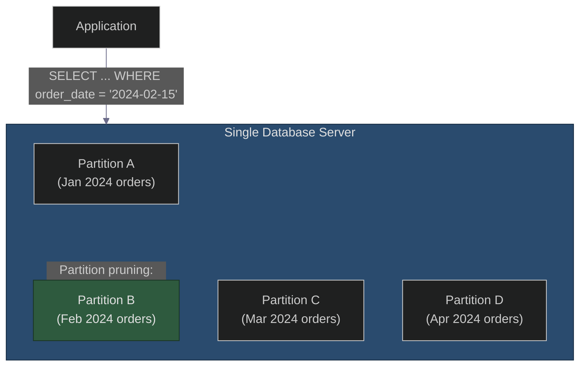
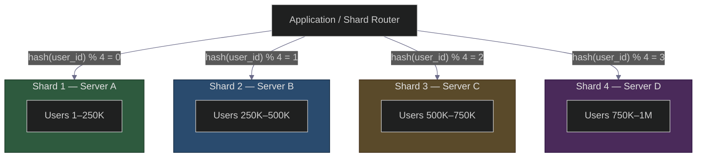
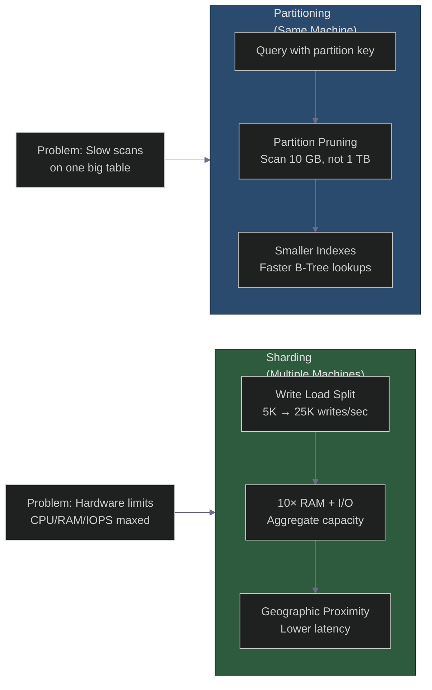

# Sharding vs Partitioning: The Architect's Definitive Guide
### Day 68 of 50 - System Design Interview Preparation Series

**By Sunchit Dudeja**

---

## 🎯 The Core Idea

This is one of the most confused topics in system design. Many developers use these terms interchangeably, but the difference is critical when you're designing a system that needs to scale.

Let me clear this up with a single, foundational truth:

> **Sharding is a type of Partitioning. All Sharding is Partitioning, but not all Partitioning is Sharding.**

Think of **Partitioning** as the parent category (the "how do we split data?"), and **Sharding** as a specific child (the "how do we split data across multiple machines?").

> **Companion reads:**
> - [Day 64 — Database Sharding Strategies](./Day64_Database_Sharding_Strategies.md) — range, hash, directory sharding and the resharding nightmare.
> - [Day 28 — Consistent Hashing](./Day28_Consistent_Hashing_Resharding.md) — adding/removing shards without remapping everything.
> - [Day 30 — Database Replication](./Day30_Database_Replication_AWS_Architecture.md) — replicas scale reads; sharding scales writes.
> - [Day 38 — Primary Key Strategies](./Day38_Primary_Key_Strategies_SQL_vs_NoSQL.md) — why auto-increment IDs break when you shard.
> - [Day 65 — LSM Trees vs B-Trees](./Day65_LSM_Trees_vs_B_Trees.md) — how storage engines benefit from smaller physical chunks.

---

## 1. The Core Distinction (One Sentence)

| Concept | Definition |
|---------|------------|
| **Partitioning** | Splitting a large logical dataset into smaller, more manageable physical chunks — these chunks can live on the same server or different servers. |
| **Sharding** | Splitting a large dataset across multiple, independent database servers/nodes (horizontal scaling). It is a **distributed form of partitioning**. |

### The Simple Analogy

| | |
|---|---|
| **Partitioning** | You have a 1,000-page encyclopedia. You split it into 10 volumes (A–B, C–D, etc.). They all sit on the **same bookshelf**. |
| **Sharding** | You have a 1,000-page encyclopedia. You put Volume 1 in your home, Volume 2 at your office, and Volume 3 at your friend's house. To read the whole book, you have to **visit multiple locations**. |

---

## 2. Visualizing the Difference

### Partitioning (Multiple Partitions, Single Database Instance)

Data is split, but resides on **one machine**.

### Sharding (Multiple Partitions, Multiple Database Instances)

Data is split across **multiple, independent machines**.

---

## 3. Detailed Comparison Matrix

| Aspect | Partitioning | Sharding |
|--------|--------------|----------|
| **Definition** | Splitting a table/database into smaller pieces. | Splitting a database across multiple servers. |
| **Scope** | Can be within a single database instance. | Always across multiple database instances/nodes. |
| **Primary Goal** | Improve maintainability, query performance (e.g., faster scans on smaller data), and data management (e.g., archiving old partitions). | Achieve horizontal scalability (handle more writes, more data, more users). |
| **Where data lives** | Same physical machine (or same cluster, but logically grouped). | Different physical machines (or different nodes in a cluster). |
| **Query Complexity** | Low. The database automatically handles routing. You just write SQL. | High. The application or proxy must know which shard to query. |
| **Transaction Support** | Full ACID transactions (within the same DB). | Cross-shard transactions are complex (often require 2PC or eventual consistency). |
| **Joins** | Joins work normally across partitions. | Joins across shards are extremely expensive or impossible. |
| **Cost** | No extra server cost. | Higher cost (multiple servers, networking, operational overhead). |

---

## 4. Types of Partitioning (The "How" of Splitting)

Before you shard, you must partition. Here are the common strategies:

### A. Horizontal Partitioning (Row-based)

Split rows of a table across multiple partitions.

**Example:** Users table → Partition A has IDs 1–1000, Partition B has IDs 1001–2000.

> **Sharding is a type of Horizontal Partitioning done across servers.**

### B. Vertical Partitioning (Column-based)

Split a table by columns. Move infrequently used columns to a separate table.

**Example:** Users table → `User_Profile` (name, email) and `User_Private` (password_hash, SSN).

> Sharding rarely does this; it's usually done within the same database.

### C. Functional Partitioning (By Domain)

Split by different business domains.

**Example:** User data goes to Users DB, Orders to Orders DB, Payments to Payments DB.

---

## 5. Types of Sharding (The "Where" of Distribution)

When you decide to shard (distribute partitions across servers), you need a **shard key** to decide where data goes.

| Strategy | How it Works | Pros | Cons |
|----------|--------------|------|------|
| **Range-based Sharding** | Split by a continuous range (e.g., `user_id < 100k` → Shard 1, `100k < user_id < 200k` → Shard 2). | Easy to query by range. Good for time-series data. | "Hot spots" (recent data might go to one shard). Needs a lookup table to map ranges. |
| **Hash-based Sharding** | Apply a hash function to the shard key (e.g., `hash(user_id) % N`). | Distributes data evenly. Predictable. | Range queries become expensive (need to query all shards). Adding a node requires rehashing (unless using Consistent Hashing). |
| **Consistent Hashing** | A special hashing technique where nodes are placed on a ring. Each data item is assigned to the nearest node clockwise. | Nodes can be added/removed with minimal data redistribution (O(1/N) reshuffling). | Complex to implement. Still has range-query issues. |
| **Directory-based Sharding** | A lookup service (like ZooKeeper) maintains a map of which data lives on which shard. | Very flexible. Easy to move data. | The lookup service becomes a potential bottleneck and a single point of failure. |

> Deep dive on sharding strategies: [Day 64](./Day64_Database_Sharding_Strategies.md). Consistent hashing mechanics: [Day 28](./Day28_Consistent_Hashing_Resharding.md).

---

## 6. Real-World Examples

| System | Partitioning? | Sharding? | How? |
|--------|---------------|-----------|------|
| **PostgreSQL** (single node) | ✅ Yes (table partitioning) | ❌ No | Partition tables by date or range for easier archiving. All on one server. |
| **MySQL Cluster** | ✅ Yes | ✅ Yes (via sharding) | Users are hashed across multiple MySQL instances. |
| **MongoDB** | ✅ Yes (chunks) | ✅ Yes (by shard key) | Uses range-based sharding by default, with hashed option. |
| **Cassandra** | ✅ Yes (partitions) | ✅ Yes (shards called "vNodes") | Uses consistent hashing to distribute partitions across nodes. |
| **Elasticsearch** | ✅ Yes (shards) | ✅ Yes (shards across nodes) | Each index is split into primary shards that are distributed across a cluster. |
| **Oracle RAC** | ✅ Yes | ❌ No (shared-disk architecture) | Partitions exist, but all nodes access the same data storage. |

---

## 7. What Junior Developers Get Wrong (And Architects Get Right)

| Mistake | Architect's Correction |
|---------|------------------------|
| "Sharding and Partitioning are the same thing." | No. Partitioning is the general concept of splitting data. Sharding is a specific implementation of horizontal partitioning across servers. |
| "I'll just shard my database from day one." | Don't over-engineer. Start with a single, well-partitioned database. Add sharding only when you hit write limits (typically after millions of users). Partitioning solves performance; sharding solves scaling. |
| "My queries will still work after sharding." | No. Cross-shard joins and transactions become painful. Design your data model around the shard key (e.g., all queries must include the `user_id`). |
| "I can use any column as a shard key." | No. Choose a shard key that: (a) is used in most queries, (b) distributes data evenly, (c) doesn't change frequently. A bad shard key kills performance. |
| "Partitioning is only for large datasets." | No. Partitioning also helps with data management (e.g., dropping old partitions is instant), index rebuilding, and parallel scans. |
| "I'll use auto-increment IDs as my shard key." | Bad idea. Hot spots if you use range-based sharding (all new IDs go to the last shard). Use UUIDs, or hash the auto-increment ID. |

---

## 8. The Architect's Decision Framework

### When to Partition (single DB)

- You have 10–100 million rows and queries are getting slow.
- You need to archive old data (e.g., drop partitions for 2020).
- You have maintenance windows and want faster index rebuilds.

**Verdict:** Almost always start with partitioning.

### When to Shard (distributed across nodes)

- Your write throughput exceeds what a single master DB can handle.
- You have > 1–2 TB of data and backup/restore times are unacceptable.
- You need to scale geographically (users in Asia write to Asia DB).

**Verdict:** Only shard when you have proven that partitioning + vertical scaling (buying a bigger server) is no longer cost-effective.

> **Architect's Golden Rule:** *"Partition for maintenance, Shard for scale. Don't shard until you have to."*

---

## 9. How Partitioning Improves Performance (Less Work per Query)

Partitioning improves performance by reducing the amount of data the database engine must physically scan or manipulate for a given query. It relies on the **physics of a single machine**.

### Mechanism A: Partition Pruning (The "Skip" Strategy)

This is the biggest performance win. The query planner looks at your `WHERE` clause. If it sees the partition key, it completely ignores all other partitions and only scans the relevant one.

| Scenario | What Happens |
|----------|--------------|
| **Without Partitioning** | `SELECT * FROM orders WHERE order_date = '2024-01-01'` → Scans the entire 1 TB table (takes 5 minutes). |
| **With Partitioning (by date)** | Same query → The planner knows `order_date='2024-01-01'` lives only in the "Jan 2024" partition (which is 10 GB). It scans only 10 GB (takes 5 seconds). |

### Mechanism B: Smaller Indexes (Faster B-Tree Traversal)

When you split a table, the indexes on that partition are physically smaller. A B-Tree index with 1 million entries is much faster to traverse (fewer disk seeks) than a B-Tree with 1 billion entries. The index fits in memory more easily.

### Mechanism C: Data Locality & Cache Efficiency

By keeping related data together (e.g., all orders for a specific month on the same partition), you increase the likelihood that the data you need is already in the database buffer pool (cache), reducing expensive disk I/O.

### Mechanism D: Parallel Scans (Same Server)

Modern databases can use multiple CPU cores to scan different partitions within the same server simultaneously for a single query (e.g., scanning 4 partitions in parallel across 4 CPU cores).

> **Crucial Limitation:** Partitioning does **not** increase the total write throughput of the server. If your CPU is maxed at 100% or your disk IOPS are saturated, partitioning won't help. The server's physical hardware is still the bottleneck.

---

## 10. How Sharding Improves Performance (More Total Workforce)

Sharding improves performance by adding more physical machines to the system. It relies on **horizontal scaling**.

### Mechanism A: Linear Write Scalability (The "Split the Load" Strategy)

In a single database, all writes go to the same disk and same CPU. With sharding, writes are distributed.

**Example:** 1 server can handle 5,000 writes/sec. If you shard across 5 servers, you can now handle roughly 25,000 writes/sec. The total system throughput scales linearly with the number of shards.

### Mechanism B: Massive Aggregate I/O and RAM

By distributing data across 10 machines, you now have 10× the available RAM and 10× the disk I/O bandwidth.

A complex `COUNT(*)` or aggregation query can be executed in parallel across all shards (scatter-gather), effectively utilizing the combined CPU power of 10 machines.

### Mechanism C: Reduced Lock Contention

In a single database, multiple writers compete for locks on the same table/row. In a sharded system, if User A's data lives on Shard 1 and User B's on Shard 2, they never compete for locks. This reduces contention and improves latency.

### Mechanism D: Geographic Proximity

You can place shards closer to users (e.g., a US shard and an EU shard). Queries from European users hit the EU database, drastically reducing network latency — something a single partitioned database cannot do.

---

## 11. The Crucial "How" Comparison (Side-by-Side)

| Performance Aspect | How Partitioning Improves It | How Sharding Improves It |
|--------------------|------------------------------|--------------------------|
| **Read Speed (Single Query)** | Reduces the scan size (pruning). The query looks at 1 TB instead of 10 TB. | Increases CPU power for that query (if parallelized across shards). |
| **Write Speed (Throughput)** | Does not help. All writes still go to the same single master disk and CPU. | Increases write capacity. Different writes go to different disks and different CPUs on different servers. |
| **Index Performance** | Makes the index physically smaller, so lookups take fewer disk reads. | Makes the index distribution wider, but each shard holds a smaller total index, reducing memory pressure. |
| **Data Loading (ETL)** | Can load data into different partitions in parallel on the same server. | Can load data into different shards in parallel on different servers (much faster overall). |
| **Caching** | Hot partitions stay in memory, cold partitions stay on disk. | Total cache memory is multiplied (10 servers = 10× the RAM). |

---

## 12. The "Sneaky" Performance Wins: Partitioning Helps Maintenance

Partitioning also improves performance **indirectly** through maintenance:

| Operation | Without Partitioning | With Partitioning |
|-----------|---------------------|-------------------|
| **Dropping Old Data** | `DELETE FROM table WHERE date < '2020-01-01'` might take hours and cause massive transaction log bloat, slowing down the system. | `DROP PARTITION` is a metadata operation that happens in **milliseconds**. |
| **Rebuilding Indexes** | Locks the entire table. | You can rebuild an index on a single partition without locking the entire table, reducing downtime. |

---

## 13. The "How" Visualization

### The One-Sentence Architect's Takeaway

> **"Partitioning improves performance by changing the algorithm (less data to scan), while Sharding improves performance by changing the hardware (more CPUs, RAM, and disks)."**

Both reduce the overall work, but **Partitioning reduces the work per query**, whereas **Sharding increases the total capacity for work**. Good architectures use Partitioning first (it's free in most databases), and reach for Sharding only when Partitioning + a bigger server can no longer keep up.

---

## 14. Summary Table (The Cheat Sheet)

| Feature | Partitioning | Sharding |
|---------|--------------|----------|
| **Parent/Child** | Parent (General concept) | Child (Specific type of horizontal partitioning) |
| **Servers** | Same server | Multiple servers |
| **Purpose** | Performance, maintenance, archiving | Horizontal scalability (write throughput) |
| **Complexity** | Low (handled by DB) | High (handled by app/proxy) |
| **Cross-partition Query** | Easy (SQL works) | Hard (needs fan-out, scatter-gather) |
| **Transactions** | ACID supported | Cross-shard ACID is hard (2PC, eventual consistency) |
| **When to Use** | Almost always (good practice) | Only when scaling limits are hit |

---

## 🟣 The Simpler Version — Explain It Like the Reader Has 2 Minutes

> **Partitioning is splitting a big book into chapters on one bookshelf — you still go to one library, but you only open the chapter you need. Sharding is putting each chapter in a different library across town — you need a map (shard key) to know which library to visit, and reading the whole book means driving everywhere. Partitioning makes each trip faster (less to read). Sharding lets more people read and write at the same time (more libraries, more librarians). Start with chapters on one shelf. Only open new libraries when one building can't hold the crowd.**

### The one-line summary

> 🎯 **Partitioning is how you organize your data. Sharding is how you distribute your data. One is the blueprint; the other is the deployment.**

---

## 💬 How to Talk About It in an Interview

When asked *"What's the difference between partitioning and sharding?"*:

> "Partitioning is the general technique of splitting a large dataset into smaller chunks — it can happen within a single database server. Sharding is a specific form of horizontal partitioning where those chunks are distributed across **multiple independent database servers** for horizontal scale.
>
> I'd almost always start with **table partitioning** on a single DB — partition pruning makes queries faster, `DROP PARTITION` makes archiving instant, and indexes stay smaller. That costs nothing extra.
>
> I'd only move to **sharding** when I've exhausted vertical scaling and partitioning — when write throughput or total storage exceeds what one primary can handle. At that point, the shard key becomes the most important design decision: it must match my query patterns, distribute load evenly, and avoid cross-shard joins.
>
> The golden rule: **partition for maintenance, shard for scale**. Don't shard until you have to."

---

## 🧾 Quick Recap

- **All sharding is partitioning; not all partitioning is sharding.**
- Partitioning = split data (same or different servers). Sharding = split data **across multiple servers**.
- Three partitioning types: **horizontal** (rows), **vertical** (columns), **functional** (domain).
- Four sharding strategies: **range**, **hash**, **consistent hashing**, **directory-based**.
- Partitioning improves performance by **doing less work per query** (pruning, smaller indexes, cache locality).
- Sharding improves performance by **adding more machines** (write throughput, aggregate RAM/I/O, reduced lock contention).
- Partitioning does **not** increase write throughput on a single server.
- **Partition first, shard last** — after vertical scaling, replicas, and caching are exhausted.

---

## 🎬 Final Words

Partitioning is how you organize your data. Sharding is how you distribute your data. One is the blueprint; the other is the deployment. Good architects start with partitioning and use sharding as a controlled, deliberate scaling lever.

The next time someone says "let's shard the database," ask: **"Have we partitioned and vertically scaled first? And what's the shard key?"** That question separates someone who knows the vocabulary from someone who has lived through a resharding weekend. 🎯

---

*If this cleared up a confusion you've had for years, pass it to the next engineer who uses "partition" and "shard" in the same sentence without knowing the difference.* 🎯
