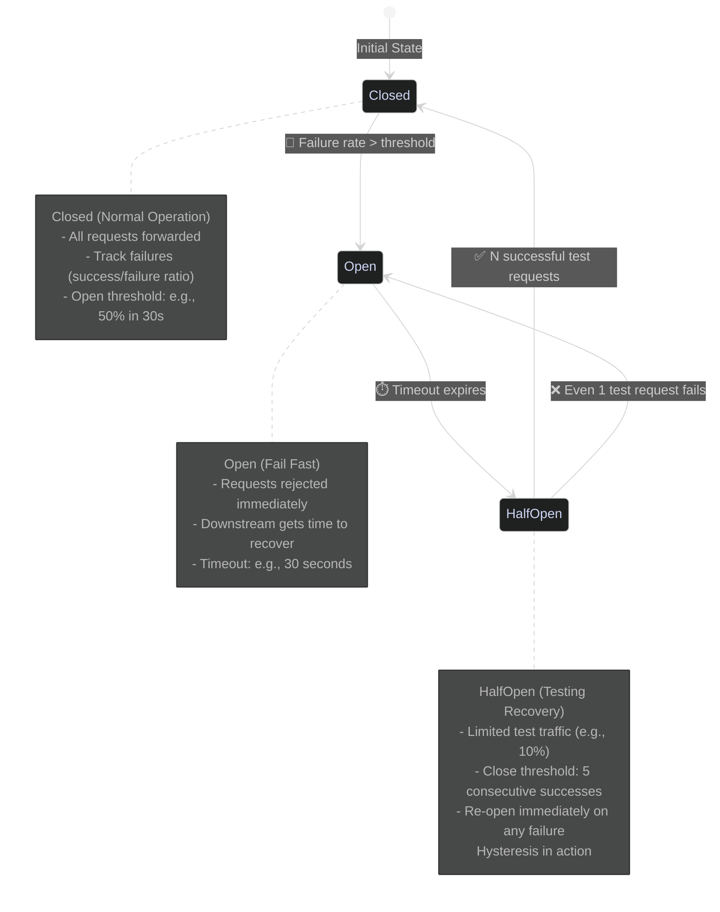
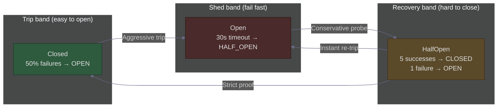
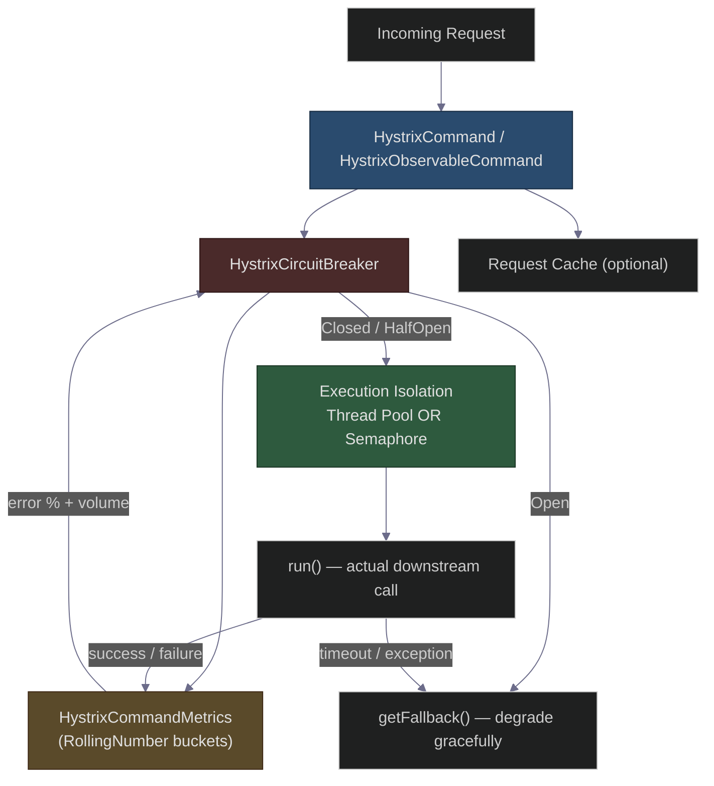
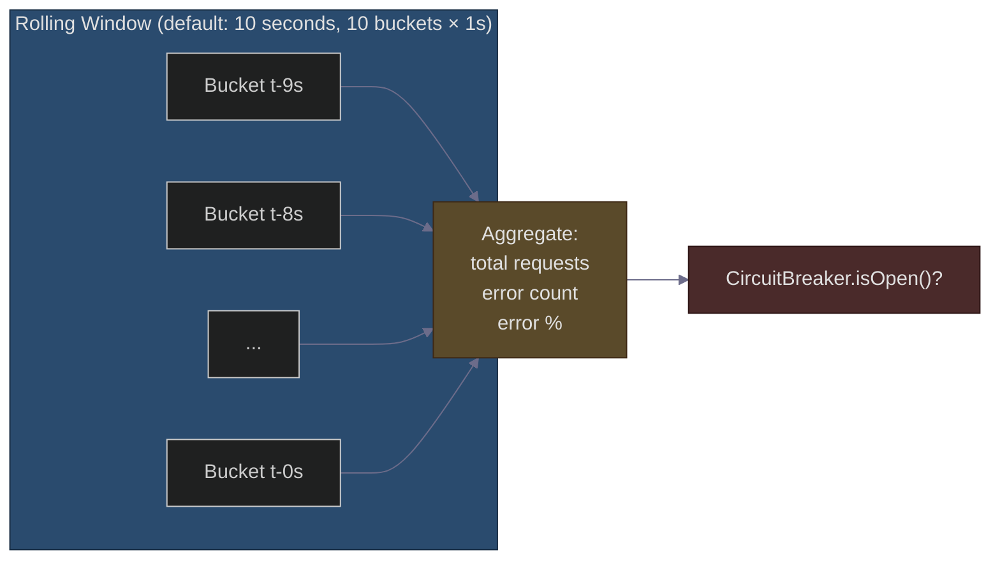
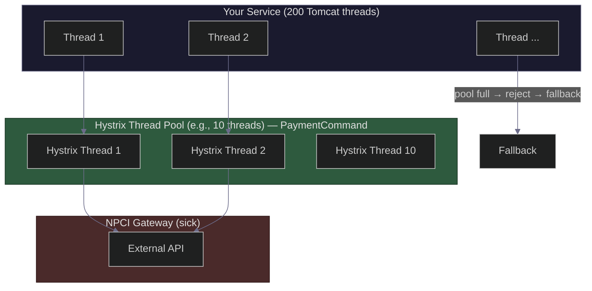
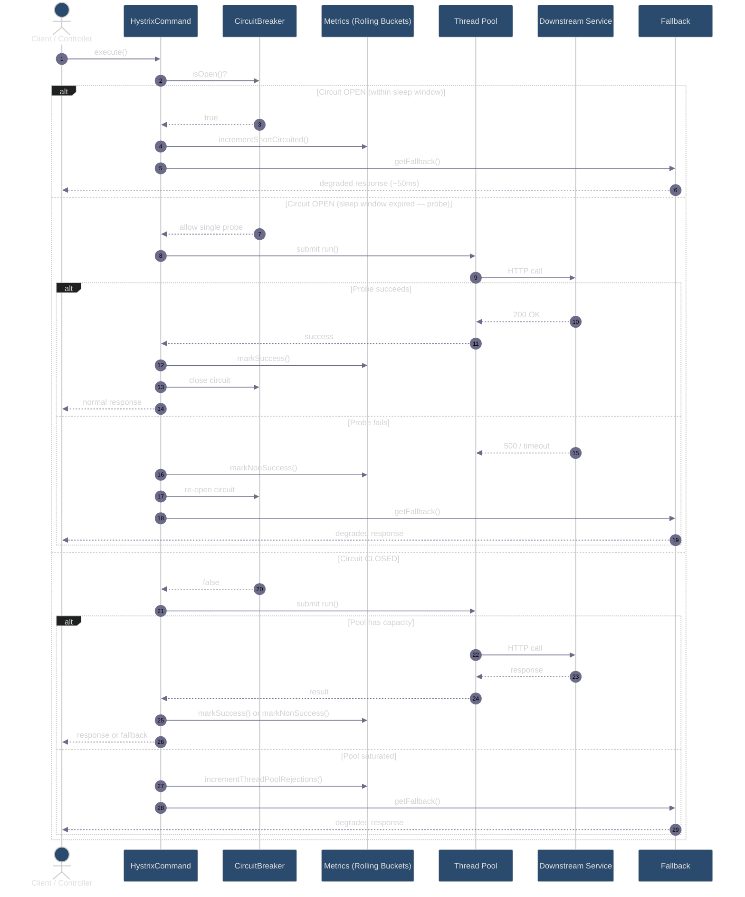

# Hystrix Internals: Circuit Breaker State Machine & Hysteresis
### Day 71 of 50 - System Design Interview Preparation Series

**By Sunchit Dudeja**

*An Architect's Deep Dive — From State Diagrams to Rolling Metrics Buckets*

---

## 📑 Table of Contents

1. [Introduction: Beyond "Use a Circuit Breaker"](#-introduction-beyond-use-a-circuit-breaker)
2. [High-Level Circuit Breaker Diagram (HLD)](#high-level-circuit-breaker-diagram-hld)
3. [Simple Explanation: One-Liner per State](#simple-explanation-one-liner-per-state)
4. [The Hysteresis in This Diagram](#the-hysteresis-in-this-diagram)
5. [Why Hysteresis Matters at Scale](#why-hysteresis-matters-at-scale)
6. [Hystrix Internals: How Netflix Actually Built It](#hystrix-internals-how-netflix-actually-built-it)
7. [The Metrics Engine: Rolling Time Windows](#the-metrics-engine-rolling-time-windows)
8. [Thread Pool Isolation vs Semaphore Isolation](#thread-pool-isolation-vs-semaphore-isolation)
9. [End-to-End Request Flow Inside Hystrix](#end-to-end-request-flow-inside-hystrix)
10. [Hystrix vs Resilience4j: What Changed After Maintenance Mode](#hystrix-vs-resilience4j-what-changed-after-maintenance-mode)
11. [Simple Code Representation (Conceptual)](#simple-code-representation-conceptual)
12. [Production Configuration Cheat Sheet](#production-configuration-cheatsheet)
13. [What Junior Developers Get Wrong (And Architects Get Right)](#what-junior-developers-get-wrong-and-architects-get-right)
14. [How to Talk About It in an Interview](#-how-to-talk-about-it-in-an-interview)
15. [Quick Recap](#-quick-recap)
16. [Final Words](#-final-words)

---

## 🎯 Introduction: Beyond "Use a Circuit Breaker"

In [Day 13](./Day13_Circuit_Breaker_Pattern.md), we saw how PhonePe's circuit breaker saved 50,000 payments from cascading failure. In [Day 53](./Day53_Uber_Retry_Storm_Exponential_Backoff_Circuit_Breaker.md), we paired circuit breakers with retry discipline.

But in a system design interview, **"I'll add a circuit breaker"** is table stakes. What separates a senior engineer from an architect is answering:

- *What exactly trips the breaker — error count, error rate, or latency?*
- *Why three states instead of two?*
- *What is hysteresis, and why does one failure in HalfOpen send you back to Open?*
- *How did Hystrix implement this under the hood — thread pools, rolling windows, bulkheads?*

This post goes **inside the machine**. We start with the HLD state diagram every interviewer expects, then peel back Hystrix's internals: the rolling metrics buckets, the implicit HalfOpen probe, and the asymmetric thresholds that prevent **flapping**.

> 🎨 **Companion diagram:** [`day71-hystrix-circuit-breaker-hysteresis.excalidraw`](./day71-hystrix-circuit-breaker-hysteresis.excalidraw) — state machine + Hystrix internals as a whiteboard sketch (open in Excalidraw / VS Code Excalidraw extension).

> **Companion reads:**
> - [Day 13 — Circuit Breaker Pattern](./Day13_Circuit_Breaker_Pattern.md) — PhonePe cascade failure and Resilience4j config.
> - [Day 35 — Distributed Systems Failure Modes](./Day35_Distributed_Systems_Failure_Modes_HLD.md) — where circuit breakers sit in the failure landscape.
> - [Day 53 — Uber Retry Storm](./Day53_Uber_Retry_Storm_Exponential_Backoff_Circuit_Breaker.md) — circuit breaker + exponential backoff together.
> - [Day 47 — Database Connection Pool](./Day47_Database_Connection_Pool_Biggest_Blunder.md) — why bulkhead isolation matters alongside breakers.

---

## High-Level Circuit Breaker Diagram (HLD)

Every architect draws this state machine in the first 60 seconds of a resilience discussion:



### What This Diagram Is Really Saying

| Transition | Meaning for the downstream service |
|------------|-------------------------------------|
| **Closed → Open** | "Stop hammering the sick dependency. Fail fast locally." |
| **Open → HalfOpen** | "Cool-down over. Send a controlled probe." |
| **HalfOpen → Closed** | "Dependency looks healthy again. Resume full traffic." |
| **HalfOpen → Open** | "Still broken. Back to fail-fast immediately." |

The circuit breaker is not a retry mechanism. It is a **load-shedding valve** — and the three states exist so recovery is **deliberate**, not accidental.

---

## Simple Explanation: One-Liner per State

| State | What It Does | Transition Trigger |
|-------|--------------|-------------------|
| **Closed** | Normal operation. All requests flow through. | Failure rate exceeds threshold (e.g., 50% in 30s) → **Open** |
| **Open** | Fail fast. All requests rejected instantly (fallback). | Timeout expires (e.g., 30s) → **HalfOpen** |
| **HalfOpen** | Limited test traffic. Checks if downstream recovered. | N consecutive successes (e.g., 5) → **Closed**; **any** failure → **Open** |

### The Asymmetric Rules Are Intentional

Notice how **closing** the circuit requires **proof** (multiple successes), but **opening** it again requires only **one** failure in HalfOpen. That is not a bug — it is **hysteresis**.

---

## The Hysteresis in This Diagram

**Hysteresis** (borrowed from control systems and electrical engineering) means the system uses **different thresholds for turning ON vs turning OFF**. The goal: prevent **rapid toggling** (flapping) between Closed and Open when the downstream service is intermittently unhealthy.

| Action | Threshold | Why asymmetric? |
|--------|-----------|-----------------|
| **Closed → Open** | 50% failure rate | Trip early when pain is widespread |
| **Open → HalfOpen** | Timeout (30s) | Give downstream time to drain queues / restart pods |
| **HalfOpen → Closed** | 5 consecutive successes | Require sustained proof of recovery |
| **HalfOpen → Open** | Even 1 failure | One failed probe = still sick; don't flood it again |



**Without hysteresis:** a service at 49% failure rate hovers near the threshold. The breaker opens → one success → closes → fails again → opens. Your users see alternating "queued" and "timeout" responses. Your downstream never gets a clean recovery window.

**With hysteresis:** Open state **holds** for 30 seconds. HalfOpen sends **limited** probes. Close only after **sustained** success. The breaker acts like a thermostat with a dead band — not a light switch flickering in the wind.

---

## Why Hysteresis Matters at Scale

Consider a payment gateway recovering from an outage:

```
WITHOUT HYSTERESIS (flapping):
10:00:00  Closed  → 50% errors  → Open
10:00:05  Open    → 1 success probe  → Closed   ← too eager!
10:00:06  Closed  → flood of traffic  → gateway OOMs again
10:00:07  Open    → users confused
10:00:12  Open    → 1 success  → Closed
... repeats for 20 minutes ...

WITH HYSTERESIS:
10:00:00  Closed  → 50% errors  → Open
10:00:00–10:00:30  Open: all requests get instant fallback (50ms)
10:00:30  HalfOpen: 10% test traffic, need 5 consecutive successes
10:00:35  4 successes, 1 failure  → back to Open (still sick)
10:01:05  HalfOpen again...
10:01:20  5 consecutive successes  → Closed (confident recovery)
```

At 50,000 RPS, flapping isn't a UX annoyance — it's a **retry storm amplifier** that prevents the downstream from ever stabilizing.

---

## Hystrix Internals: How Netflix Actually Built It

**Netflix Hystrix** (2012–2018, now in maintenance mode) was the reference implementation that popularized circuit breakers in JVM microservices. Resilience4j, Sentinel, and Istio's outlier detection all inherited its ideas.

Understanding Hystrix internals is still interview gold because it shows **how abstractions map to code**.

### Core Components



| Component | Responsibility |
|-----------|----------------|
| **HystrixCommand** | Wraps a single dependency call. Defines `run()`, `getFallback()`, and properties. |
| **HystrixCircuitBreaker** | Per-command singleton. Reads metrics. Decides Open / Closed / probe. |
| **HystrixCommandMetrics** | Rolling window counters: successes, failures, timeouts, thread pool rejections, short-circuits. |
| **Execution Isolation** | Thread pool (default) or semaphore — the **bulkhead** that limits concurrent calls. |
| **HystrixRequestCache** | De-duplicates identical in-flight requests (optional, per command key). |

### Hystrix Circuit Breaker Properties (The Knobs)

| Property | Default | What it controls |
|----------|---------|------------------|
| `circuitBreaker.enabled` | `true` | Master switch |
| `circuitBreaker.requestVolumeThreshold` | `20` | Minimum requests in rolling window before tripping is **allowed** |
| `circuitBreaker.errorThresholdPercentage` | `50` | Error % that trips Closed → Open |
| `circuitBreaker.sleepWindowInMilliseconds` | `5000` | How long Open holds before allowing a probe (→ HalfOpen) |
| `circuitBreaker.forceOpen` | `false` | Ops override — always fail fast |
| `circuitBreaker.forceClosed` | `false` | Ops override — never trip (dangerous) |

> **Interview detail:** Hystrix will **not** trip on 3 failures out of 3 requests. It waits until `requestVolumeThreshold` (default 20) is met. This prevents tripping on cold-start noise.

### Hystrix HalfOpen: The Single-Probe Model

Hystrix does not expose an explicit `HALF_OPEN` enum. Instead:

1. Circuit is **Open** — `isOpen()` returns true → short-circuit to fallback.
2. After `sleepWindowInMilliseconds`, the **next** request is allowed through as a **single probe**.
3. Probe **succeeds** → circuit **closes**, metrics reset.
4. Probe **fails** → circuit **re-opens**, sleep window resets.

Modern Resilience4j makes HalfOpen explicit with `permittedNumberOfCallsInHalfOpenState` and configurable success thresholds (e.g., 5 consecutive successes). **Know both models in an interview.**

---

## The Metrics Engine: Rolling Time Windows

Hystrix does not store "last 10 requests" as a simple list. It uses a **circular buffer of time buckets** — the same pattern used in rate limiters and sliding-window counters.



### What Gets Counted as a Failure?

| Event | Counts toward error %? |
|-------|------------------------|
| Thrown exception from `run()` | ✅ Yes |
| Timeout (`HystrixTimeoutException`) | ✅ Yes |
| Thread pool rejection | ✅ Yes (pool saturated) |
| Successful response | ❌ No — increments success |
| Short-circuited (breaker Open) | Tracked separately — does **not** call downstream |
| Fallback execution | Tracked as fallback, not a downstream failure |

**Architect's insight:** Short-circuited requests protect the downstream but still increment the `shortCircuited` counter in metrics — useful for dashboards and alerting.

### The Trip Decision (Pseudocode from Hystrix Source Logic)

```java
// Simplified from HystrixCircuitBreaker.isOpen() logic
boolean shouldTrip(HystrixCommandMetrics metrics) {
    HealthCounts health = metrics.getHealthCounts(); // rolling window snapshot

    if (health.getTotalRequests() < requestVolumeThreshold) {
        return false; // not enough data — stay Closed
    }

    if (health.getErrorPercentage() < errorThresholdPercentage) {
        return false; // error rate acceptable — stay Closed
    }

    return true; // TRIP → Open
}
```

---

## Thread Pool Isolation vs Semaphore Isolation

Hystrix's second superpower (after the circuit breaker) is the **bulkhead pattern** — limiting how many concurrent calls hit a dependency.



| Isolation Strategy | How it works | Best for |
|--------------------|--------------|----------|
| **Thread Pool** (default) | Each command group gets a dedicated thread pool. Caller thread submits work and waits (with timeout). | Network I/O, blocking calls, heavy dependencies |
| **Semaphore** | Limits concurrent executions via a counter — no extra threads. Caller thread executes directly. | In-memory calls, low-latency, already async/reactive |

| Property | Thread Pool | Semaphore |
|----------|-------------|-----------|
| `coreSize` / `maxConcurrentRequests` | 10 threads | 10 concurrent |
| Timeout support | ✅ Yes | ⚠️ Limited — runs on caller thread |
| Bulkhead from caller threads | ✅ Strong | ⚠️ Weaker |
| Overhead | Higher (thread context switch) | Lower |

> **Interview line:** "Circuit breaker stops calls when the dependency is **sick**. Bulkhead stops calls when the dependency is **slow** but not yet tripped. You need both."

---

## End-to-End Request Flow Inside Hystrix



---

## Hystrix vs Resilience4j: What Changed After Maintenance Mode

Netflix put Hystrix in **maintenance mode** in 2018. **Resilience4j** is the modern JVM choice (used in Day 13's examples). The state machine is the same; the implementation differs.

| Aspect | Hystrix | Resilience4j |
|--------|---------|--------------|
| **Status** | Maintenance mode | Actively maintained |
| **Architecture** | Separate thread pool per command (heavy) | Lightweight, functional, composable |
| **HalfOpen** | Implicit single probe | Explicit state with configurable permitted calls |
| **Close threshold** | 1 probe success | Configurable (e.g., 5 consecutive successes) |
| **Metrics window** | 10 × 1-second buckets | Count-based or time-based sliding window |
| **Spring integration** | `@HystrixCommand` (deprecated) | `@CircuitBreaker` + `@Retry` + `@Bulkhead` |
| **Reactive support** | RxJava 1.x native | Reactor / Vavr integration |

**What to say in 2026 interviews:** "I'd implement with **Resilience4j** or a service mesh outlier detection policy today, but I explain the behavior using **Hystrix terminology** because it's the lingua franca of circuit breaker design."

---

## Simple Code Representation (Conceptual)

This Python-style pseudocode captures the **hysteresis-aware** state machine from the HLD — closer to Resilience4j's explicit HalfOpen than Hystrix's single probe, but ideal for whiteboard interviews:

```python
import time

class CircuitBreaker:
    def __init__(self):
        self.state = "CLOSED"
        self.failure_count = 0
        self.success_count = 0
        self.request_count = 0
        self.last_trip_time = None

        # Hysteresis thresholds
        self.TRIP_THRESHOLD = 0.50       # 50% failure → Open
        self.MIN_REQUESTS = 20           # Hystrix-style volume gate
        self.TIMEOUT_SECONDS = 30        # Stay Open for 30s
        self.CLOSE_THRESHOLD = 5         # 5 consecutive successes → Closed
        self.HALF_OPEN_TRAFFIC_RATIO = 0.10  # 10% test traffic in HalfOpen

    def call(self, request):
        if self.state == "OPEN":
            if self._timeout_expired():
                self.state = "HALF_OPEN"
                self.success_count = 0
            else:
                return self._fallback_response()  # fail fast

        if self.state == "HALF_OPEN":
            if not self._is_test_request():       # shed 90% of traffic
                return self._fallback_response()

        try:
            response = self._execute(request)
            self._on_success()
            return response
        except Exception:
            self._on_failure()
            return self._fallback_response()

    def _on_success(self):
        self.request_count += 1
        if self.state == "HALF_OPEN":
            self.success_count += 1
            if self.success_count >= self.CLOSE_THRESHOLD:
                self.state = "CLOSED"
                self._reset_counters()
        else:
            self.failure_count = max(0, self.failure_count - 1)  # optional decay

    def _on_failure(self):
        self.request_count += 1
        self.failure_count += 1

        if self.state == "HALF_OPEN":
            # Hysteresis: ONE failure → immediate re-trip
            self.state = "OPEN"
            self.last_trip_time = time.time()
            self.success_count = 0
        elif self._failure_rate() > self.TRIP_THRESHOLD and self.request_count >= self.MIN_REQUESTS:
            self.state = "OPEN"
            self.last_trip_time = time.time()

    def _failure_rate(self):
        if self.request_count == 0:
            return 0.0
        return self.failure_count / self.request_count

    def _timeout_expired(self):
        return time.time() - self.last_trip_time >= self.TIMEOUT_SECONDS

    def _is_test_request(self):
        import random
        return random.random() < self.HALF_OPEN_TRAFFIC_RATIO

    def _fallback_response(self):
        return {"status": "DEGRADED", "message": "Service temporarily unavailable"}

    def _execute(self, request):
        raise NotImplementedError

    def _reset_counters(self):
        self.failure_count = 0
        self.success_count = 0
        self.request_count = 0
```

### Java Equivalent (Resilience4j — Production)

```java
@CircuitBreaker(name = "paymentGateway", fallbackMethod = "fallbackPayment")
@Bulkhead(name = "paymentGateway", type = Bulkhead.Type.THREADPOOL)
@TimeLimiter(name = "paymentGateway")
public PaymentResponse processPayment(PaymentRequest request) {
    return paymentGateway.charge(request);
}
```

```yaml
resilience4j.circuitbreaker:
  instances:
    paymentGateway:
      slidingWindowType: TIME_BASED
      slidingWindowSize: 30                    # 30-second window
      minimumNumberOfCalls: 20                   # Hystrix volume threshold equivalent
      failureRateThreshold: 50
      waitDurationInOpenState: 30s
      permittedNumberOfCallsInHalfOpenState: 10  # explicit HalfOpen probes
      automaticTransitionFromOpenToHalfOpenEnabled: true
      slowCallRateThreshold: 80                  # trip on latency, not just errors
      slowCallDurationThreshold: 2s
```

---

## Production Configuration Cheat Sheet

| Scenario | Closed → Open | Open duration | HalfOpen → Closed | Fallback strategy |
|----------|---------------|---------------|-------------------|-------------------|
| **Payment gateway** | 50% errors, min 20 calls | 30s | 5 consecutive successes | Queue + "Payment pending" |
| **Recommendation service** | 50% errors OR 80% slow calls | 10s | 3 successes | Default/static recommendations |
| **Internal auth service** | 30% errors (critical path) | 60s | 10 successes | Cached token / read-only mode |
| **Third-party weather API** | 70% errors | 5min | 1 success (Hystrix-style) | Stale cache |

### Metrics to Alert On (Hystrix Dashboard Legacy)

| Metric | Alert when | Why |
|--------|------------|-----|
| `shortCircuited` rate | > 0 sustained | Breaker is open — users getting fallbacks |
| `threadPoolRejected` | > 0 | Bulkhead full — dependency slow, not yet tripped |
| `errorPercentage` | > 30% trending | Early warning before trip |
| `latencyP99` | > SLA | Trip on slow calls, not just 500s |

---

## What Junior Developers Get Wrong (And Architects Get Right)

| Mistake | Architect's Fix |
|---------|-----------------|
| "Circuit breaker = retry." | Breaker **stops** calls. Retries **repeat** calls. Use both, but never retry into an Open circuit. |
| "3 failures should trip the breaker." | Use **volume threshold + error rate** over a window. 3/3 failures on startup shouldn't trip production. |
| "HalfOpen sends all traffic to test." | HalfOpen is **limited** probe traffic (10% or N permitted calls). Flooding a recovering service re-triggers the outage. |
| "One success in HalfOpen means we're healthy." | **Hysteresis:** require N consecutive successes to close. One success after an outage often means luck, not recovery. |
| "Circuit breaker replaces timeouts." | Timeouts tell you a call is slow. Breakers tell you a **dependency is systematically failing**. You need timeouts **inside** the breaker. |
| "Hystrix is what I'd deploy today." | Explain Hystrix **internals**, implement with **Resilience4j** or mesh outlier detection. Shows historical depth + modern judgment. |
| "Same config for every dependency." | Payment gateway: aggressive trip, long open window. Recommendations: lenient trip, stale cache fallback. **Per-dependency tuning.** |

---

## The One-Sentence Architect's Summary

> "The Circuit Breaker pattern protects downstream services by using three states (Closed → Open → HalfOpen) with **asymmetric thresholds** — preventing constant toggling (hysteresis) and allowing graceful recovery; Hystrix implemented this with **rolling metrics buckets**, **bulkhead thread pools**, and an implicit single-probe HalfOpen that modern libraries like Resilience4j made explicit and configurable."

---

## 💬 How to Talk About It in an Interview

When asked *"Explain circuit breaker internals"* or *"What is hysteresis in a circuit breaker?"*:

> "I'd draw three states: Closed, Open, and HalfOpen. Closed tracks failure rate over a sliding window — in Hystrix that's ten one-second buckets aggregating error percentage, and it won't trip until a minimum request volume is met, default 20 calls.
>
> When error rate exceeds 50%, the circuit Opens and all calls short-circuit to fallback — fail fast in about 50 milliseconds instead of waiting 30 seconds for a timeout. After a sleep window — 30 seconds in production for a payment dependency — it transitions to HalfOpen and sends limited probe traffic.
>
> The hysteresis is in the asymmetric thresholds: tripping requires 50% failures, but closing requires multiple consecutive successes — say five — while a single failed probe immediately re-opens. That dead band prevents flapping when the downstream is intermittently healthy.
>
> Under the hood, Hystrix also isolates dependencies with dedicated thread pools — the bulkhead — so a slow payment gateway can't exhaust all Tomcat threads. Today I'd use Resilience4j with explicit HalfOpen configuration and slow-call rate thresholds, but the state machine and hysteresis logic are identical."

---

## 🧾 Quick Recap

- **Three states:** Closed (forward), Open (fail fast), HalfOpen (probe recovery).
- **Hysteresis:** different thresholds for open vs close — prevents flapping.
- **Closed → Open:** error rate + minimum volume (Hystrix: 50%, min 20 requests).
- **Open → HalfOpen:** sleep window timeout (give downstream recovery time).
- **HalfOpen → Closed:** N consecutive successes (strict proof).
- **HalfOpen → Open:** even **one** failure (immediate re-trip).
- **Hystrix internals:** rolling time buckets, per-command metrics, thread pool bulkheads, implicit single-probe HalfOpen.
- **Modern stack:** Resilience4j — explicit HalfOpen, slow-call tripping, composable with retry/bulkhead.
- **Pair with:** timeouts, bulkheads, fallbacks, and disciplined retry (never into an Open circuit).

---

## 🎬 Final Words

Day 13 taught you **why** circuit breakers exist. Day 71 teaches you **how they think**.

The state diagram is the easy part. The architect's job is tuning the hysteresis band for each dependency, choosing bulkhead isolation so slowness doesn't become a outage, and wiring metrics so you see `shortCircuited` spike **before** users flood your support channel.

Hystrix may be in maintenance mode, but its internals shaped a decade of resilience engineering. Learn the buckets, the bulkheads, and the asymmetric thresholds — then implement them in whatever library your stack uses today. 🎯

---

*This blog post is part of the **System Design from an Architect's Perspective** series. For more deep dives, follow the series and learn how to think like an architect — not just a developer.*

*If this made circuit breaker hysteresis click, share it with the next engineer who thinks '3 failures = trip' is production-ready.* 🎯
