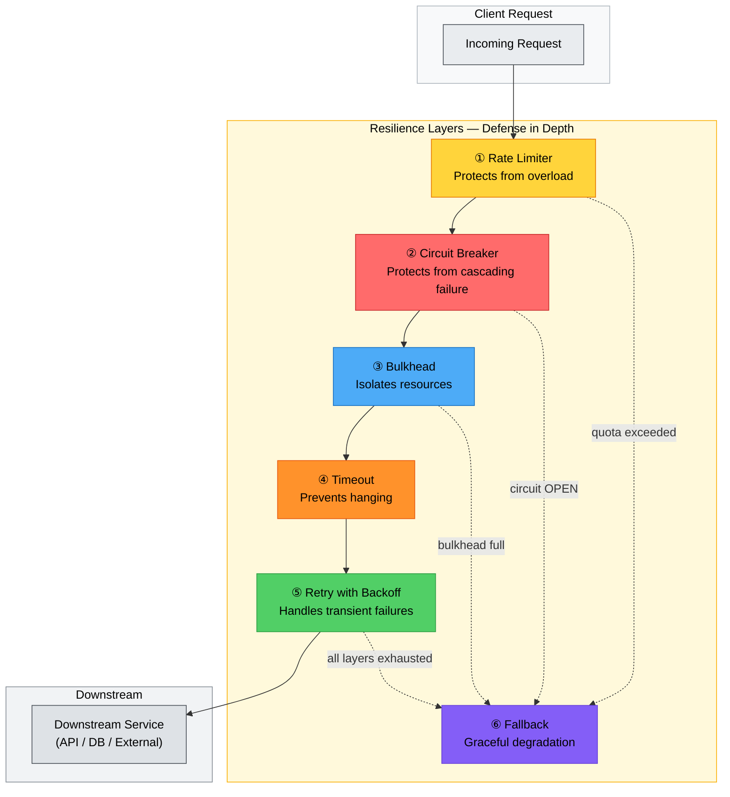
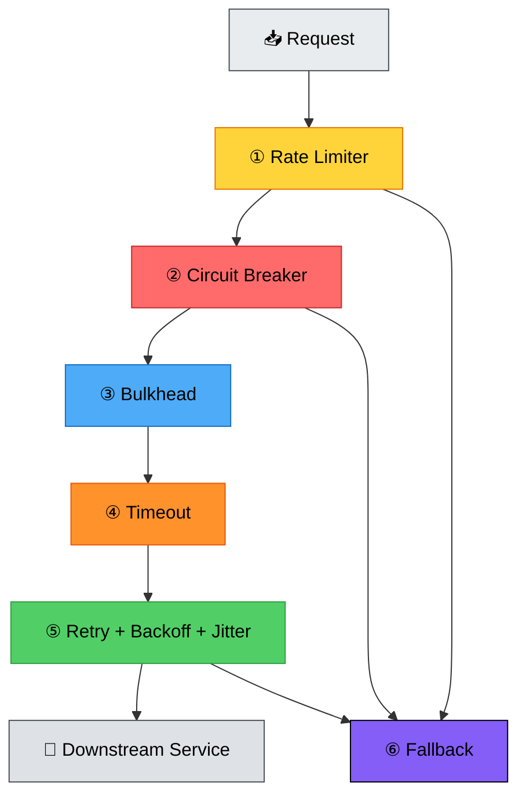
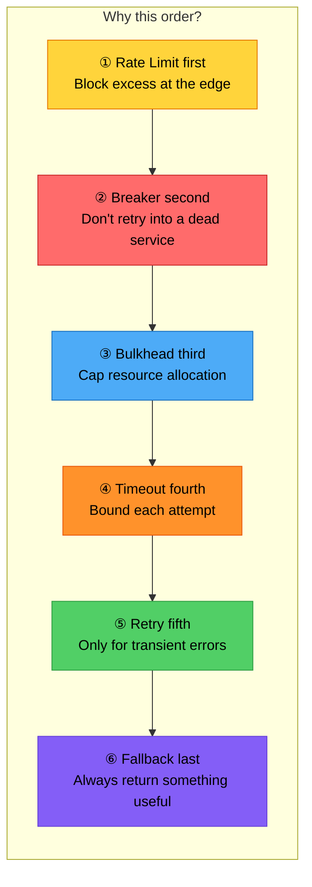
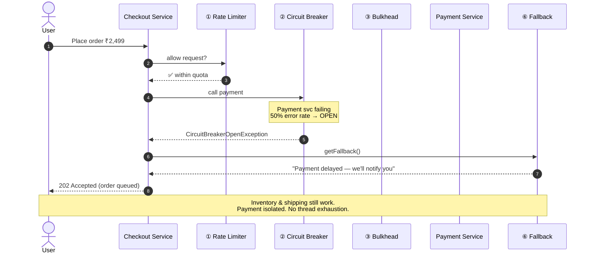
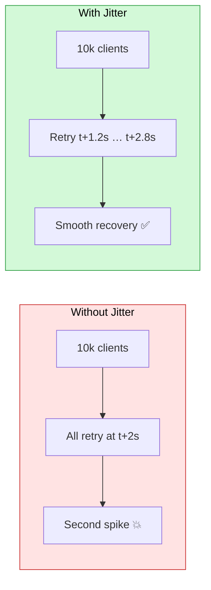

# The Resilience Stack: Layered Defense for Distributed Systems
### Day 72 of 50 - System Design Interview Preparation Series

**By Sunchit Dudeja**

*An Architect's Guide — Why One Pattern Is Never Enough*

---

## 📑 Table of Contents

1. [Introduction: Why One Pattern Is Never Enough](#-introduction-why-one-pattern-is-never-enough)
2. [The Architect's Golden Rule](#the-architects-golden-rule)
3. [The Resilience Stack Diagram (Numbered)](#the-resilience-stack-diagram-numbered)
4. [Layer-by-Layer Breakdown](#layer-by-layer-breakdown)
5. [Why This Order Matters](#why-this-order-matters)
6. [The Trade-Offs: What Each Layer Costs](#the-trade-offs-what-each-layer-costs)
7. [End-to-End Flow: E-Commerce Checkout Example](#end-to-end-flow-e-commerce-checkout-example)
8. [The Hysteresis Factor Across Layers](#the-hysteresis-factor-across-layers)
9. [Code Implementation: The Combined Resilience Stack](#code-implementation-the-combined-resilience-stack)
10. [Production Stack with Resilience4j (Java)](#production-stack-with-resilience4j-java)
11. [Bonus: Retry with Jitter (Avoiding Thundering Herd)](#bonus-retry-with-jitter-avoiding-thundering-herd)
12. [The Architect's Checklist](#the-architects-checklist)
13. [What Junior Developers Get Wrong (And Architects Get Right)](#what-junior-developers-get-wrong-and-architects-get-right)
14. [How to Talk About It in an Interview](#-how-to-talk-about-it-in-an-interview)
15. [Quick Recap](#-quick-recap)
16. [Final Words](#-final-words)

---

## 🎯 Introduction: Why One Pattern Is Never Enough

Imagine building a house in a hurricane zone. You wouldn't install only a strong front door. You'd add reinforced walls, storm shutters, a solid roof, and a backup generator. Each layer protects against a **different** threat.

Distributed systems face the same storm — constantly:

| Failure type | Example |
|--------------|---------|
| Network blips | Packet loss between AZs |
| Service crashes | Payment pod OOM during deploy |
| Resource exhaustion | Thread pool saturated by slow DB |
| Traffic spikes | Flash sale, bot traffic, retry storm |
| Slow dependencies | External API p99 jumps from 200ms to 30s |
| Transient errors | 503 during rolling restart |

A single pattern handles **one** failure mode — and introduces **new** risks. Retry without backoff causes **retry storms**. Circuit breakers without bulkheads still exhaust threads on **slow** (not failed) dependencies. Timeouts without fallbacks return **500** instead of degraded UX.

The architect's answer is **layered defense**: combine Rate Limiter, Circuit Breaker, Bulkhead, Timeout, Retry with Backoff, and Fallback — each compensating for the weaknesses of the others.

> 🎨 **Companion diagram:** [`day72-resilience-stack-layered-defense.excalidraw`](./day72-resilience-stack-layered-defense.excalidraw) — numbered resilience stack as a whiteboard sketch (open in Excalidraw / VS Code Excalidraw extension).

> **Companion reads:**
> - [Day 13 — Circuit Breaker Pattern](./Day13_Circuit_Breaker_Pattern.md) — PhonePe cascade failure and fail-fast fundamentals.
> - [Day 53 — Uber Retry Storm](./Day53_Uber_Retry_Storm_Exponential_Backoff_Circuit_Breaker.md) — why retry + breaker must be paired correctly.
> - [Day 57 — Rate Limiting Algorithms](./Day57_Rate_Limiting_Algorithms_Fixed_Window_Boundary_Bug.md) — token bucket and sliding window at the edge.
> - [Day 71 — Hystrix Internals & Hysteresis](./Day71_Hystrix_Internals_Circuit_Breaker_Hysteresis.md) — circuit breaker state machine deep dive.

---

## The Architect's Golden Rule

> **"Resilience is not a single pattern — it's a layered defense. Combine multiple patterns (Rate Limiter + Circuit Breaker + Bulkhead + Timeout + Retry + Fallback) to create a system that gracefully handles any failure scenario without cascading."**

There is no silver bullet. There is a **stack** — and the order matters.

---

## The Resilience Stack Diagram (Numbered)

Each layer is numbered in **processing order**: a request passes through every layer before reaching the downstream service. Text is styled **black** on colored backgrounds for readability in docs, slides, and light-themed renderers.



### Vertical Stack View (Interview Whiteboard)



---

## Layer-by-Layer Breakdown

| # | Pattern | Primary Purpose | What It Handles | Failure Mode |
|---|---------|-----------------|-----------------|--------------|
| **①** | **Rate Limiter** | Throttle incoming requests | Overload, DoS, API quota exhaustion | Too many requests hitting the system at once |
| **②** | **Circuit Breaker** | Fail fast to prevent cascading failures | Repeated failures, service unavailability | Downstream is systematically broken |
| **③** | **Bulkhead** | Isolate resources per tenant/service | Thread/connection/memory exhaustion | One noisy neighbor consumes all resources |
| **④** | **Timeout** | Abort operations that take too long | Slow responses, deadlocks, stuck calls | Dependency hangs indefinitely |
| **⑤** | **Retry with Backoff** | Retry transient failures with increasing delays | Network blips, rolling restarts, 503s | Transient (non-permanent) failures |
| **⑥** | **Fallback** | Provide alternative response on failure | Complete failure, degradation | Primary path unreachable or errored |

Each layer is **defense in depth**. They work together — not in isolation.

---

## Why This Order Matters



| Order | Rationale |
|-------|-----------|
| **① Rate Limiter first** | Shed load at the edge before consuming threads, connections, or downstream capacity. Protects everything downstream — including your own breakers from noise. |
| **② Circuit Breaker second** | If the dependency is **already sick**, fail fast. Don't allocate bulkhead slots, don't wait for timeouts, don't retry into a graveyard. |
| **③ Bulkhead third** | Even when the circuit is Closed, a **slow** dependency can exhaust resources. Bulkhead caps concurrent calls per dependency/tenant. |
| **④ Timeout fourth** | Every attempt — including retries — needs a hard ceiling. Without timeouts, threads block forever. |
| **⑤ Retry fifth** | Retries belong **inside** the breaker (only when Closed) and **outside** the timeout (each attempt is bounded). Handles blips the earlier layers can't predict. |
| **⑥ Fallback last** | When any layer gives up — rate limited, circuit open, bulkhead full, timeout exhausted, retries failed — return a **degraded but useful** response. |

> **Critical rule from Day 53:** Never retry when the circuit is **Open**. Retry amplifies load; the breaker's job is to **stop** that amplification.

---

## The Trade-Offs: What Each Layer Costs

| Pattern | Benefit | Cost | Risk if Misconfigured |
|---------|---------|------|------------------------|
| **Rate Limiter** | Protects from overload | Slight latency; threshold tuning | Too low → false 429s; too high → ineffective |
| **Circuit Breaker** | Prevents cascade | State tracking memory/CPU; complexity | Too sensitive → flapping; too lenient → cascade |
| **Bulkhead** | Isolates failures | Thread/connection overhead; limits | Too low → starvation; too high → no isolation |
| **Timeout** | Prevents hanging | Per-operation tuning required | Too low → premature aborts; too high → resource waste |
| **Retry + Backoff** | Handles transients | Added latency; retry overhead | Too aggressive → retry storm; no jitter → thundering herd |
| **Fallback** | Graceful degradation | Stale data; fallback maintenance | Wrong fallback → user confusion or financial risk |

**Architect's reality check:** There is no free lunch. Every layer adds complexity. The goal is **controlled trade-offs**, not perfection.

---

## End-to-End Flow: E-Commerce Checkout Example

Checkout calls three downstream services: **Inventory**, **Payment**, **Shipping**.



**If Payment Service is down:**

1. **Rate Limiter** passes — user is within quota.
2. **Circuit Breaker** trips Open after repeated failures — fail fast (~50ms).
3. No bulkhead slots wasted on doomed calls. No 30s timeouts. No retry storm.
4. **Fallback** returns: *"Payment processing delayed — we'll notify you."*

**Result:** Checkout continues for other users. Inventory and shipping stay healthy. Payment failure is **contained**.

---

## The Hysteresis Factor Across Layers

[Hysteresis](./Day71_Hystrix_Internals_Circuit_Breaker_Hysteresis.md) — different thresholds for entering vs exiting a protective state — appears in **multiple** layers:

| Layer | Hysteresis Implementation |
|-------|---------------------------|
| **Rate Limiter** | Burst tolerance (e.g., 20 tokens) before throttling kicks in |
| **Circuit Breaker** | Trip at 50% failures; close only after 5 consecutive successes |
| **Retry with Backoff** | Delays increase: 1s → 2s → 4s → 8s — prevents constant hammering |
| **Bulkhead** | Queue absorbs brief bursts before rejection |

Hysteresis prevents **thrashing** — the wasteful toggling between states that destabilizes systems under load.

---

## Code Implementation: The Combined Resilience Stack

Conceptual Python showing all six layers composed. Production systems use libraries (Resilience4j, Polly, Envoy) — but interviews expect you to explain **composition**:

```python
import asyncio
import time
import random
import threading
from concurrent.futures import ThreadPoolExecutor


# ---------- ① Rate Limiter ----------
class RateLimiter:
    def __init__(self, requests_per_second=10, burst=20):
        self.rate = requests_per_second
        self.burst = burst
        self.tokens = burst
        self.last_refill = time.time()
        self.lock = threading.Lock()

    def allow(self):
        with self.lock:
            self._refill()
            if self.tokens >= 1:
                self.tokens -= 1
                return True
            return False

    def _refill(self):
        now = time.time()
        elapsed = now - self.last_refill
        self.tokens = min(self.burst, self.tokens + elapsed * self.rate)
        self.last_refill = now


# ---------- ② Circuit Breaker ----------
class CircuitBreakerOpenError(Exception):
    pass


class CircuitBreaker:
    def __init__(self, trip_threshold=0.50, timeout_seconds=30, close_threshold=5):
        self.state = "CLOSED"
        self.failure_count = 0
        self.success_count = 0
        self.total_requests = 0
        self.last_trip_time = None
        self.TRIP_THRESHOLD = trip_threshold
        self.TIMEOUT_SECONDS = timeout_seconds
        self.CLOSE_THRESHOLD = close_threshold
        self.lock = threading.Lock()

    def call(self, fn, *args, **kwargs):
        with self.lock:
            if self.state == "OPEN":
                if self._timeout_expired():
                    self.state = "HALF_OPEN"
                else:
                    raise CircuitBreakerOpenError("Circuit is OPEN")
            if self.state == "HALF_OPEN" and random.random() > 0.10:
                raise CircuitBreakerOpenError("Circuit is OPEN (probe mode)")

        try:
            result = fn(*args, **kwargs)
            self._record_success()
            return result
        except Exception:
            self._record_failure()
            raise

    def _record_success(self):
        with self.lock:
            if self.state == "HALF_OPEN":
                self.success_count += 1
                if self.success_count >= self.CLOSE_THRESHOLD:
                    self.state = "CLOSED"
                    self.failure_count = self.success_count = 0

    def _record_failure(self):
        with self.lock:
            self.failure_count += 1
            if self.state == "HALF_OPEN":
                self.state = "OPEN"
                self.last_trip_time = time.time()
            elif self.failure_count / max(1, self.total_requests) >= self.TRIP_THRESHOLD:
                self.state = "OPEN"
                self.last_trip_time = time.time()

    def _timeout_expired(self):
        return time.time() - self.last_trip_time > self.TIMEOUT_SECONDS


# ---------- ③ Bulkhead ----------
class BulkheadFullError(Exception):
    pass


class Bulkhead:
    def __init__(self, max_concurrent=10):
        self.semaphore = threading.Semaphore(max_concurrent)
        self.executor = ThreadPoolExecutor(max_workers=max_concurrent)

    def call(self, fn, *args, **kwargs):
        if not self.semaphore.acquire(blocking=False):
            raise BulkheadFullError("Bulkhead full")
        try:
            return self.executor.submit(fn, *args, **kwargs).result(timeout=30)
        finally:
            self.semaphore.release()


# ---------- ④ Timeout + ⑤ Retry with Jitter ----------
class RetryWithBackoff:
    def __init__(self, max_retries=3, base_delay=1, max_delay=30):
        self.max_retries = max_retries
        self.base_delay = base_delay
        self.max_delay = max_delay

    async def call(self, fn):
        last_exc = None
        for attempt in range(self.max_retries):
            try:
                return await asyncio.wait_for(fn(), timeout=5)  # ④ Timeout per attempt
            except Exception as e:
                last_exc = e
                if attempt == self.max_retries - 1:
                    break
                delay = min(self.base_delay * (2 ** attempt), self.max_delay)
                delay *= 0.5 + random.random()  # Jitter
                await asyncio.sleep(delay)
        raise last_exc


# ---------- ⑥ Fallback ----------
class Fallback:
    def __init__(self, fallback_data):
        self.fallback_data = fallback_data

    def get(self):
        return self.fallback_data


# ---------- Combined Chain ----------
class ResilienceChain:
    def __init__(self):
        self.rate_limiter = RateLimiter()
        self.circuit_breaker = CircuitBreaker()
        self.bulkhead = Bulkhead()
        self.retry = RetryWithBackoff()
        self.fallback = Fallback({"status": "DEGRADED", "message": "Service unavailable"})

    async def call(self, fn):
        if not self.rate_limiter.allow():
            return self.fallback.get()

        try:
            return self.circuit_breaker.call(
                lambda: self.bulkhead.call(lambda: asyncio.run(self.retry.call(fn)))
            )
        except (CircuitBreakerOpenError, BulkheadFullError, Exception):
            return self.fallback.get()
```

---

## Production Stack with Resilience4j (Java)

In production, compose annotations instead of hand-rolling:

```java
@RateLimiter(name = "checkout")
@CircuitBreaker(name = "payment", fallbackMethod = "paymentFallback")
@Bulkhead(name = "payment", type = Bulkhead.Type.THREADPOOL)
@Retry(name = "payment")
@TimeLimiter(name = "payment")
public CompletableFuture<PaymentResponse> processPayment(PaymentRequest request) {
    return CompletableFuture.supplyAsync(() -> paymentGateway.charge(request));
}

public CompletableFuture<PaymentResponse> paymentFallback(PaymentRequest request, Exception e) {
    return CompletableFuture.completedFuture(
        PaymentResponse.pending(request.getTransactionId(),
            "Payment delayed — we'll notify you shortly.")
    );
}
```

```yaml
resilience4j:
  ratelimiter:
    instances:
      checkout:
        limitForPeriod: 100
        limitRefreshPeriod: 1s
        timeoutDuration: 0

  circuitbreaker:
    instances:
      payment:
        slidingWindowSize: 30
        minimumNumberOfCalls: 20
        failureRateThreshold: 50
        waitDurationInOpenState: 30s
        permittedNumberOfCallsInHalfOpenState: 5

  bulkhead:
    instances:
      payment:
        maxConcurrentCalls: 25
        maxWaitDuration: 500ms

  timelimiter:
    instances:
      payment:
        timeoutDuration: 5s

  retry:
    instances:
      payment:
        maxAttempts: 3
        waitDuration: 1s
        enableExponentialBackoff: true
        exponentialBackoffMultiplier: 2
        enableRandomizedWait: true          # Jitter
        retryExceptions:
          - java.io.IOException
          - org.springframework.web.client.HttpServerErrorException
        ignoreExceptions:
          - io.github.resilience4j.circuitbreaker.CallNotPermittedException
```

> **Order of execution in Resilience4j:** Aspects compose based on annotation order and configured `@Order`. Rule of thumb: **RateLimiter → CircuitBreaker → Bulkhead → TimeLimiter → Retry**. Test with integration tests — don't assume.

---

## Bonus: Retry with Jitter (Avoiding Thundering Herd)

When a downstream service fails, every client retrying at the **exact same interval** creates a second wave of overload — the **thundering herd**.

### Without Jitter (Bad)

```python
delay = base_delay * (2 ** attempt)  # 1s, 2s, 4s, 8s...
# 10,000 clients all retry at t+1s, t+2s, t+4s → second outage
```

### With Jitter (Good)

```python
import random

delay = min(base_delay * (2 ** attempt), max_delay)
delay = delay * (0.5 + random.random())  # spread across 50%–150% of base
# Retries distributed → downstream gets breathing room
```



**AWS, Google, and Netflix** all recommend **full jitter**: `delay = random(0, min(max_delay, base * 2^attempt))`.

---

## The Architect's Checklist

| Layer | Check |
|-------|-------|
| **① Rate Limiter** | Client-side **and** server-side? Per-user and per-service limits? |
| **② Circuit Breaker** | Hysteresis configured (different open vs close thresholds)? Metrics on `shortCircuited`? |
| **③ Bulkhead** | Separate pools per dependency/tenant? Not sharing one pool for everything? |
| **④ Timeout** | Connection, read, and total timeouts set **per operation**? |
| **⑤ Retry** | Exponential backoff + jitter? Max attempts capped? No retry on 4xx or Open circuit? |
| **⑥ Fallback** | Returns useful degraded data (cached prices, queued status)? Not a generic 500? |
| **Monitoring** | Each layer emits metrics — rate limited, tripped, rejected, timed out, retried, fallback? |

---

## What Junior Developers Get Wrong (And Architects Get Right)

| Mistake | Architect's Correction |
|---------|------------------------|
| "We'll just retry until it works." | Without backoff + jitter, retries cause a **retry storm** that prevents recovery. |
| "We added a Circuit Breaker — we're done." | Breakers don't handle overload or slow dependencies alone. You need the **full stack**. |
| "One timeout for all calls." | Payment (5s), recommendations (500ms), and file upload (60s) need **different** SLAs. |
| "We have unlimited resources — no bulkhead needed." | Unlimited doesn't exist. Bulkheads prevent **noisy neighbor** collapse. |
| "Static fallback for everything." | Fallback data must be **maintained** — stale prices in checkout are worse than an error. |
| "Rate limiting is only for public APIs." | Internal services need limits too — one runaway batch job can cascade. |
| "Retry goes before Circuit Breaker." | Breaker must gate retries. **Never retry into an Open circuit.** |

---

## The One-Sentence Architect's Summary

> "Resilience is not a single silver bullet — it's a carefully orchestrated stack of patterns (Rate Limiter + Circuit Breaker + Bulkhead + Timeout + Retry + Fallback), each addressing a specific failure mode while compensating for the weaknesses of the others, creating a system that fails gracefully and recovers quickly."

---

## 💬 How to Talk About It in an Interview

When asked *"How do you make a microservice resilient?"* or *"Design fault tolerance for a payment service"*:

> "I don't pick one pattern — I design a resilience stack. At the edge, a rate limiter protects from overload and abuse. Next, a circuit breaker with hysteresis fail-fast when the payment gateway is systematically down — so we don't waste threads or retry into a sick dependency.
>
> Inside the breaker, a bulkhead caps concurrent payment calls so a slow gateway can't exhaust our entire thread pool. Each attempt has a tight timeout — connection and read — and transient failures get exponential backoff with jitter, never synchronized retries.
>
> If every layer exhausts, fallback returns a queued payment status instead of a 500. I'd implement this with Resilience4j in Java, metric each layer separately, and tune thresholds per dependency — payment is stricter than recommendations.
>
> The golden rule: resilience is layered defense, not a checkbox."

---

## 🧾 Quick Recap

- **Six layers:** Rate Limiter → Circuit Breaker → Bulkhead → Timeout → Retry → Fallback.
- **Order matters:** shed load → fail fast → isolate resources → bound time → retry transients → degrade gracefully.
- **No silver bullet:** each pattern fixes one failure mode and introduces trade-offs.
- **Hysteresis everywhere:** burst tokens, asymmetric breaker thresholds, backoff + jitter.
- **Never retry into an Open circuit** — breaker and retry must be composed correctly.
- **Jitter prevents thundering herd** — spread retries across time.
- **Fallback is last resort** — but must return **useful** degraded data.
- **Production:** Resilience4j / Envoy / service mesh — compose, measure, tune per dependency.

---

## 🎬 Final Words

Day 13 taught you the circuit breaker. Day 71 taught you its internals. Day 72 zooms out to the **full stack** — because no production system survives on one pattern alone.

The next time someone says *"we'll add retry logic,"* ask: *"What's the timeout? Where's the breaker? What happens when retries fail?"* That question separates a developer patching errors from an architect designing for failure.

Build the stack. Number the layers. Count the trade-offs. Then sleep through the next deploy. 🎯

---

*This blog post is part of the **System Design from an Architect's Perspective** series. For more deep dives, follow the series and learn how to think like an architect — not just a developer.*

*If this made the resilience stack click, pass it to the next engineer who's about to ship `retry(3)` with no breaker, no jitter, and no fallback.* 🎯
