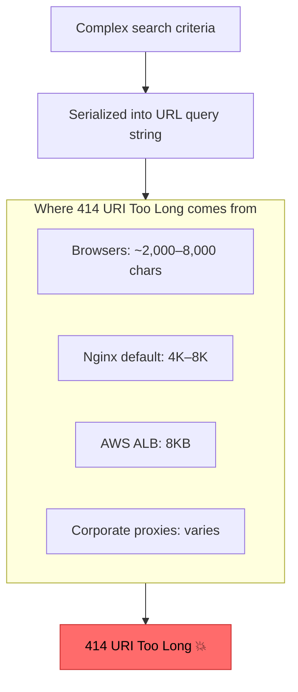
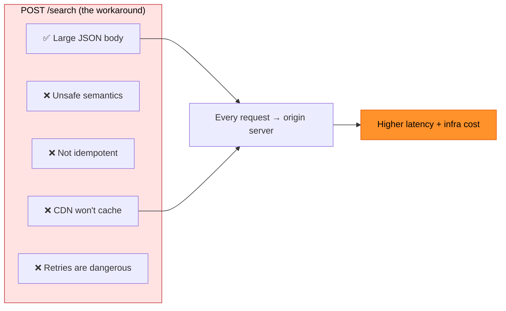
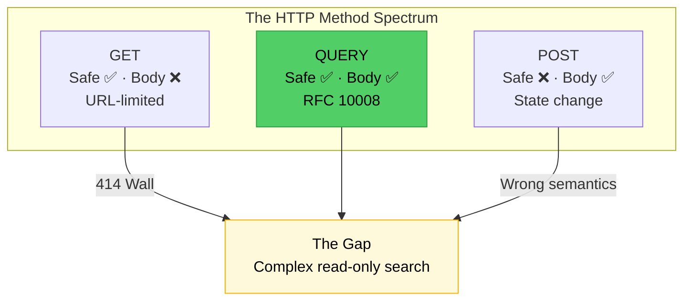
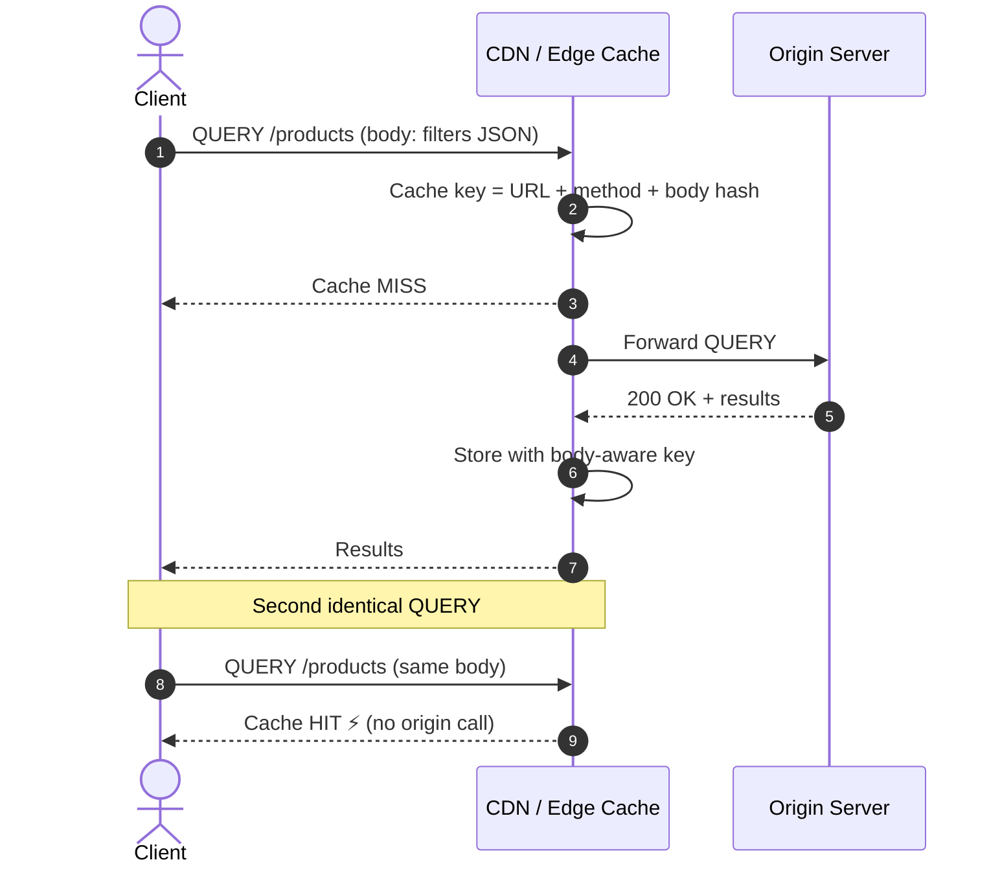
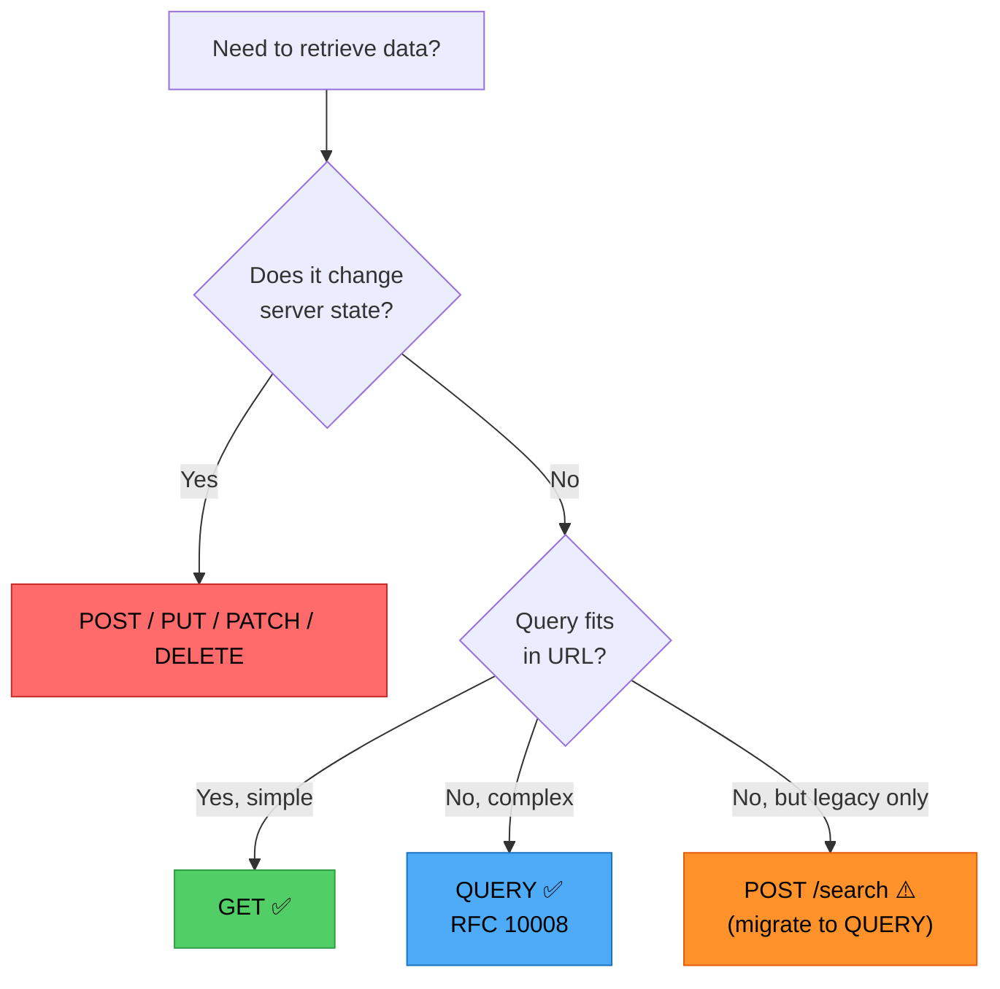

# The Missing Middle: How the New HTTP QUERY Method Solves the Search Dilemma
### Day 73 of 50 - System Design Interview Preparation Series

**By Sunchit Dudeja**

*An Architect's Guide to RFC 10008 — Safe Search with Request Bodies*

---

## 📑 Table of Contents

1. [Introduction: A New Era for HTTP](#-introduction-a-new-era-for-http)
2. [The Foundation: Core HTTP Verbs Review](#the-foundation-core-http-verbs-review)
3. [The 414 Wall: Why GET Cannot Scale](#the-414-wall-why-get-cannot-scale)
4. [Semantic Purity: The Hidden Cost of the POST Workaround](#semantic-purity-the-hidden-cost-of-the-post-workaround)
5. [Introducing QUERY: The Missing Middle](#introducing-query-the-missing-middle)
6. [GET vs POST vs QUERY: The Architect's Comparison](#get-vs-post-vs-query-the-architects-comparison)
7. [RFC 10008 Deep Dive: Safe, Idempotent, Cacheable](#rfc-10008-deep-dive-safe-idempotent-cacheable)
8. [Accept-Query: Server-Driven Format Discovery](#accept-query-server-driven-format-discovery)
9. [Caching QUERY Responses: The Performance Win](#caching-query-responses-the-performance-win)
10. [Content-Location & Location: Indirect Results](#content-location--location-indirect-results)
11. [When to Use QUERY (Decision Framework)](#when-to-use-query-decision-framework)
12. [Implementation Examples](#implementation-examples)
13. [What Junior Developers Get Wrong (And Architects Get Right)](#what-junior-developers-get-wrong-and-architects-get-right)
14. [How to Talk About It in an Interview](#-how-to-talk-about-it-in-an-interview)
15. [Quick Recap](#-quick-recap)
16. [Final Words](#-final-words)

---

## 🎯 Introduction: A New Era for HTTP

The HTTP protocol is undergoing its most significant **semantic expansion** in years. For nearly the entirety of modern web history, developers navigated a rigid set of core verbs to manage data flow — and when those verbs didn't fit, we **bent** them.

Complex search — filters, sorting, pagination, date ranges, nested conditions, arrays — is a **read-only** operation. Yet for decades, architects had only two imperfect tools:

- **GET** — semantically correct, but URL-length limited.
- **POST** — body-friendly, but semantically **unsafe** (implies state change).

After decades of architectural compromise, **[RFC 10008](https://www.rfc-editor.org/rfc/rfc10008.html)** — *The HTTP QUERY Method*, published **June 2026** — finally codifies the missing middle.

> **GET was too small. POST was the wrong meaning. QUERY is the missing middle.**

> 🎨 **Companion diagram:** [`day73-http-query-method-rfc10008.excalidraw`](./day73-http-query-method-rfc10008.excalidraw) — GET vs POST vs QUERY decision flow (open in Excalidraw / VS Code Excalidraw extension).

> **Companion reads:**
> - [Day 24 — API Protocol Decision Framework](./Day24_API_Protocol_Decision_Framework.md) — REST, GraphQL, gRPC in the broader protocol landscape.
> - [Day 29 — Forward vs Reverse Proxy](./Day29_Forward_Reverse_Proxy.md) — why proxies matter for GET bodies and cache behavior.
> - [Day 70 — Load Balancing Layers](./Day70_Load_Balancing_Layers_Sequence_Breakdown.md) — CDN caching sits at the edge of this story.

---

## The Foundation: Core HTTP Verbs Review

To appreciate what QUERY changes, recall the four verbs that defined web CRUD for decades:

| Method | Purpose | Safe? | Idempotent? | Body? |
|--------|---------|-------|-------------|-------|
| **GET** | Fetch a representation of a resource | ✅ Yes | ✅ Yes | ❌ No (by convention) |
| **POST** | Submit data / create / trigger processing | ❌ No | ❌ No | ✅ Yes |
| **PUT** | Replace or update a resource | ❌ No | ✅ Yes | ✅ Yes |
| **DELETE** | Remove a resource | ❌ No | ✅ Yes | ⚠️ Rare |

**Safe** = the request does not modify server state. **Idempotent** = repeating the request has the same effect as doing it once.

Search is **read-only**. It should be **safe** and ideally **idempotent**. GET satisfies semantics — until the query outgrows the URL.

---

## The 414 Wall: Why GET Cannot Scale

Modern applications ask "awkward questions" of their APIs:

```json
{
  "filters": {
    "status": ["ACTIVE", "PENDING", "REVIEW"],
    "categories": ["electronics", "home", "books"],
    "priceRange": { "min": 10, "max": 5000 },
    "dateRange": { "from": "2024-01-01", "to": "2026-06-30" }
  },
  "sort": [{ "field": "relevance", "order": "desc" }, { "field": "price", "order": "asc" }],
  "pagination": { "page": 1, "size": 50 },
  "include": ["reviews", "inventory", "seller"]
}
```

GET is the logical choice — search doesn't mutate state. But GET transmits parameters via the **URL query string**. When complexity scales, you hit hard limits:



| Layer | Typical URL limit |
|-------|-------------------|
| Internet Explorer (legacy) | ~2,048 chars |
| Chrome / Firefox / Safari | ~2,000–32,000 (varies) |
| Nginx | 4K–8K (configurable) |
| AWS ALB | 8,192 bytes |
| Load balancers / WAFs | Often stricter than browsers |

### The GET-Body Gamble (Don't Do This)

Some teams put search criteria in a **GET request body**. This is an architectural gamble:

| Problem | Reality |
|---------|---------|
| Proxy support | Many proxies **strip** GET bodies entirely |
| Framework support | Spring, Express, and others may **reject** GET + body as malformed |
| Cache semantics | Caches key on URL — body is invisible to standard cache logic |
| HTTP spec | GET body has **no defined semantics** in HTTP/1.1 |

**Architect's rule:** If your search payload doesn't fit comfortably in a URL, **don't force GET**. But don't reach for POST either — reach for **QUERY**.

---

## Semantic Purity: The Hidden Cost of the POST Workaround

To scale past the 414 Wall, the industry adopted a workaround: **`POST /search`**.

It works — until you measure what you sacrificed.



| POST-for-search problem | Architectural impact |
|-------------------------|----------------------|
| **Semantic inaccuracy** | POST is *unsafe* — HTTP semantics say you're changing server state. Monitoring, WAF rules, and audit logs treat it like a write. |
| **No CDN caching** | CDNs cache GET (and now QUERY). POST responses bypass the edge → every complex search hits origin. |
| **Retry risk** | POST is not idempotent. Automatic retries (load balancers, client SDKs) can **duplicate side effects** if the "search" accidentally triggers logging, billing, or rate-limit counters. |
| **Observability confusion** | Dashboards can't distinguish "create order" POST from "search orders" POST without custom routing rules. |

We spent years sacrificing **performance and semantic clarity** to bypass URL length constraints. QUERY ends that trade-off.

---

## Introducing QUERY: The Missing Middle

**[RFC 10008](https://www.rfc-editor.org/rfc/rfc10008.html)** defines the **QUERY** method — published June 2026, authored by J. Reschke (greenbytes), J.M. Snell (Cloudflare), and M. Bishop (Akamai).

> *"A QUERY requests that the request target process the enclosed content in a safe and idempotent manner and then respond with the result of that processing."*



QUERY separates **payload size** from **state-change intent**:

- **Request body** — like POST (JSON, SQL, form-encoded, GraphQL-style filters).
- **Safe + idempotent** — like GET (no state change, safe to retry).
- **Cacheable** — responses can be cached at CDN/edge (with body-aware cache keys).

---

## GET vs POST vs QUERY: The Architect's Comparison

| Method | Body Support | Semantic Intent | Idempotent | Cacheability |
|--------|--------------|-----------------|------------|--------------|
| **GET** | ❌ URL only | Safe retrieval | ✅ Yes | ✅ High (URL-based key) |
| **POST** | ✅ Yes | State change / unsafe | ❌ No | ❌ Generally none |
| **QUERY** | ✅ Yes | Safe retrieval / search | ✅ Yes | ✅ High (body + URL in cache key) |

### Side-by-Side Request

**GET (simple search — still fine):**
```http
GET /products?category=electronics&page=1&size=20 HTTP/1.1
Host: api.example.com
Accept: application/json
```

**POST (the old workaround — avoid for pure search):**
```http
POST /products/search HTTP/1.1
Host: api.example.com
Content-Type: application/json

{"filters": {"category": ["electronics", "home"], "priceRange": {"min": 10, "max": 5000}}, "sort": [...]}
```

**QUERY (the new standard):**
```http
QUERY /products HTTP/1.1
Host: api.example.com
Content-Type: application/json
Accept: application/json

{"filters": {"category": ["electronics", "home"], "priceRange": {"min": 10, "max": 5000}}, "sort": [{"field": "price", "order": "asc"}], "pagination": {"page": 1, "size": 50}}
```

---

## RFC 10008 Deep Dive: Safe, Idempotent, Cacheable

From the IANA HTTP Method Registry (updated by RFC 10008):

| Method Name | Safe | Idempotent | Specification |
|-------------|------|------------|---------------|
| **QUERY** | yes | yes | RFC 10008, Section 2 |

### What "Safe" Means for QUERY

The client does **not** request or expect any change to the **target resource's state**. The server may still create **ancillary resources** for result retrieval (via `Content-Location` / `Location` — see below), but the query itself is read-only.

### What "Idempotent" Means for QUERY

Repeating the same QUERY request produces the same logical result. Load balancers, client SDKs, and [retry policies](./Day72_Resilience_Stack_Layered_Defense.md) can **safely retry** on connection failure — unlike POST.

### Response Codes

| Code | Meaning |
|------|---------|
| **200 OK** | Query processed; results in response body |
| **4xx** | Bad query format, unsupported media type, etc. |
| **303 See Other** | Server redirects to a resource that holds results (for very large result sets) |

---

## Accept-Query: Server-Driven Format Discovery

RFC 10008 introduces the **`Accept-Query`** response header — servers advertise which query formats they support:

```http
HTTP/1.1 200 OK
Accept-Query: application/json, application/x-www-form-urlencoded, application/sql
Content-Type: application/json
```

Example from the RFC (SQL-style query body):

```http
QUERY /contacts HTTP/1.1
Host: example.org
Content-Type: application/x-www-form-urlencoded
Accept: application/json

select=surname,givenname,email&limit=10&match=%22email=*@example.*%22
```

Clients can probe support via **OPTIONS** or **HEAD** before sending a full QUERY payload — clean content negotiation for search formats.

---

## Caching QUERY Responses: The Performance Win

This is the **biggest infrastructure win** over POST-for-search.

From RFC 10008 Section 2.5:

> *"The response to a QUERY method is cacheable; a cache MAY use it to respond to subsequent QUERY requests."*

**Critical detail:** The cache key **includes the request body content** — not just the URL.



| Aspect | POST /search | QUERY /products |
|--------|--------------|-----------------|
| CDN cache | ❌ Bypassed | ✅ Cacheable |
| Cache key | N/A | URL + method + **body** |
| Origin load | Every request | Cache hits served at edge |
| Global latency | Higher | Lower for repeated queries |

Caches **MAY** normalize semantically equivalent bodies (e.g., reorder JSON keys) to improve hit rate — but clients can use `Cache-Control: no-transform` to opt out.

---

## Content-Location & Location: Indirect Results

For large or long-lived query results, RFC 10008 supports **indirect responses**:

```http
QUERY /contacts HTTP/1.1
Host: example.org
Content-Type: application/x-www-form-urlencoded

select=surname,givenname,email&limit=10&match=%22email=*@example.*%22
```

```http
HTTP/1.1 200 OK
Content-Type: application/json
Content-Location: /contacts/stored-results/17
Location: /contacts/stored-queries/42
```

| Header | Purpose |
|--------|---------|
| **Content-Location** | Identifies a resource holding **this specific result set** — fetch via GET |
| **Location** | Identifies a resource that re-runs the **same query** — GET returns fresh results for identical parameters |

**Flow:**
1. Client sends QUERY → gets results + `Content-Location`.
2. Client can `GET /contacts/stored-results/17` to re-fetch without resending the body.
3. Client can `GET /contacts/stored-queries/42` to re-execute the stored query.

For result sets too large to inline, a **303 See Other** redirect sends the client to the result resource directly.

---

## When to Use QUERY (Decision Framework)



| Use QUERY when | Stick with GET when |
|----------------|---------------------|
| Filters, sorts, pagination exceed URL limits | Simple key-value lookups (`?id=123`) |
| Nested JSON / GraphQL-style filter objects | Cacheable resource fetch by ID |
| Report builders, analytics dashboards | Browser address bar must reflect full query |
| AI-powered search with large context payloads | Hyperlinkable, shareable URLs are required |
| SQL or JSONPath in request body | Query is < ~1KB in query string |

### Adoption Reality (June 2026)

RFC 10008 is a **Proposed Standard**. Cloudflare and Akamai co-authored the spec — CDN-level support is expected before most application frameworks. Watch for:

- `curl --query` support
- Browser `fetch()` method extension
- Spring Boot / Express / FastAPI middleware
- API Gateway (Kong, AWS API Gateway) routing rules

**Architect's stance:** Design new search APIs with QUERY now. Run dual support (POST + QUERY) during migration. Don't break existing POST /search clients overnight.

---

## Implementation Examples

### curl

```bash
curl --request QUERY https://api.example.com/products \
  -H "Content-Type: application/json" \
  -H "Accept: application/json" \
  -d '{
    "filters": {"category": ["electronics"], "inStock": true},
    "sort": [{"field": "price", "order": "asc"}],
    "pagination": {"page": 1, "size": 50}
  }'
```

### JavaScript (fetch — when runtimes add QUERY support)

```javascript
const response = await fetch('https://api.example.com/products', {
  method: 'QUERY',
  headers: {
    'Content-Type': 'application/json',
    'Accept': 'application/json',
  },
  body: JSON.stringify({
    filters: { category: ['electronics'], inStock: true },
    sort: [{ field: 'price', order: 'asc' }],
    pagination: { page: 1, size: 50 },
  }),
});
```

### Spring Boot (conceptual controller — pending framework support)

```java
@RestController
@RequestMapping("/products")
public class ProductSearchController {

    @RequestMapping(method = HttpMethod.QUERY, consumes = MediaType.APPLICATION_JSON_VALUE)
    public ResponseEntity<ProductSearchResult> searchProducts(
            @RequestBody ProductSearchQuery query) {

        ProductSearchResult results = productService.search(query);

        return ResponseEntity.ok()
            .header("Accept-Query", "application/json")
            .body(results);
    }
}
```

### API Gateway routing (conceptual)

```yaml
# Kong / custom gateway — route QUERY like GET for cache plugins
routes:
  - name: product-search
    paths: ["/products"]
    methods: [QUERY]
    plugins:
      - name: proxy-cache
        config:
          cache_method: [QUERY]
          cache_body: true          # body-aware cache key
          content_type: [application/json]
```

---

## What Junior Developers Get Wrong (And Architects Get Right)

| Mistake | Architect's Correction |
|---------|------------------------|
| "POST /search is fine — everyone does it." | It works, but it's **semantically wrong** and **uncacheable**. QUERY is the standards-track fix. |
| "I'll put the search body in a GET request." | Proxies strip GET bodies. Use QUERY for body-based reads. |
| "QUERY and GET are interchangeable." | GET fetches a **representation of the URI**. QUERY asks the resource to **perform a query operation** with body-defined criteria. |
| "Caching QUERY works like GET." | Cache keys **include the body**. Two identical URLs with different bodies are different cache entries. |
| "QUERY means I can skip pagination." | Large result sets still need pagination. Use `Content-Location` for stored results. |
| "We can migrate tomorrow — no rush." | New APIs should ship QUERY-native. Dual-run POST during transition. CDN config takes time. |
| "GraphQL replaces the need for QUERY." | GraphQL is an **application protocol**. QUERY is an **HTTP semantic**. They solve different layers. |

---

## The One-Sentence Architect's Summary

> "RFC 10008's QUERY method is the missing middle — POST's body with GET's safe, idempotent, cacheable semantics — finally giving complex read-only search a first-class HTTP verb instead of the 414 Wall or the POST workaround."

---

## 💬 How to Talk About It in an Interview

When asked *"How would you design a complex product search API?"* or *"GET vs POST for search?"*:

> "For simple lookups, GET with query parameters is correct — cacheable, linkable, safe. But complex filters with nested JSON, arrays, and sort criteria hit the 414 URI Too Long wall across browsers, nginx, and load balancers. POST /search was the industry workaround, but POST is unsafe and not idempotent — CDNs won't cache it, and retries are risky.
>
> RFC 10008 standardizes QUERY — safe, idempotent, with a request body. Responses are cacheable with body-aware cache keys, so repeated dashboard searches can hit the CDN edge. I'd use QUERY for complex search, keep GET for simple reads, and reserve POST for actual writes. During migration, I'd dual-support POST /search and log QUERY adoption before deprecating the workaround."

---

## 🧾 Quick Recap

- **GET** = safe retrieval, URL-limited → hits **414 Wall** on complex search.
- **POST /search** = body-friendly but **unsafe**, **not cacheable**, wrong semantics.
- **QUERY (RFC 10008)** = safe + idempotent + body + **cacheable** — the missing middle.
- **`Accept-Query`** header lets servers advertise supported query formats.
- **Cache keys include request body** — not just URL.
- **`Content-Location` / `Location`** enable stored results and re-runnable queries.
- **Adoption is early (2026)** — design for QUERY, migrate from POST gradually.
- **Golden line:** GET was too small. POST was the wrong meaning. QUERY is the missing middle.

---

## 🎬 Final Words

For thirty years, every architect designing a search API faced the same bad choice: cram filters into a URL or lie to HTTP with POST. RFC 10008 doesn't just add a method — it **aligns capability with intent**.

The web is still a living standard. QUERY proves that when billions of developers share a protocol, consensus is slow — but not impossible. Design your next search endpoint as a first-class QUERY. Your CDN, your retry logic, and your semantic purity will thank you. 🎯

---

*This blog post is part of the **System Design from an Architect's Perspective** series. For more deep dives, follow the series and learn how to think like an architect — not just a developer.*

*Reference: [RFC 10008 — The HTTP QUERY Method](https://www.rfc-editor.org/rfc/rfc10008.html), IETF, June 2026.*

*If this clarified the search dilemma, pass it to the next engineer still shipping `POST /search` because 'that's how we've always done it.'* 🎯
