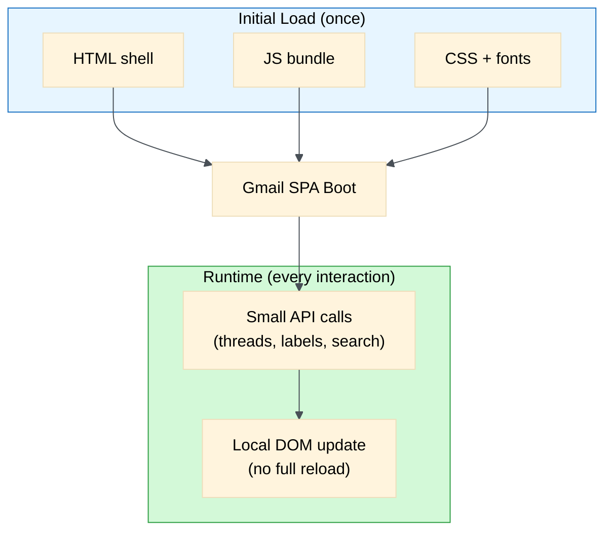
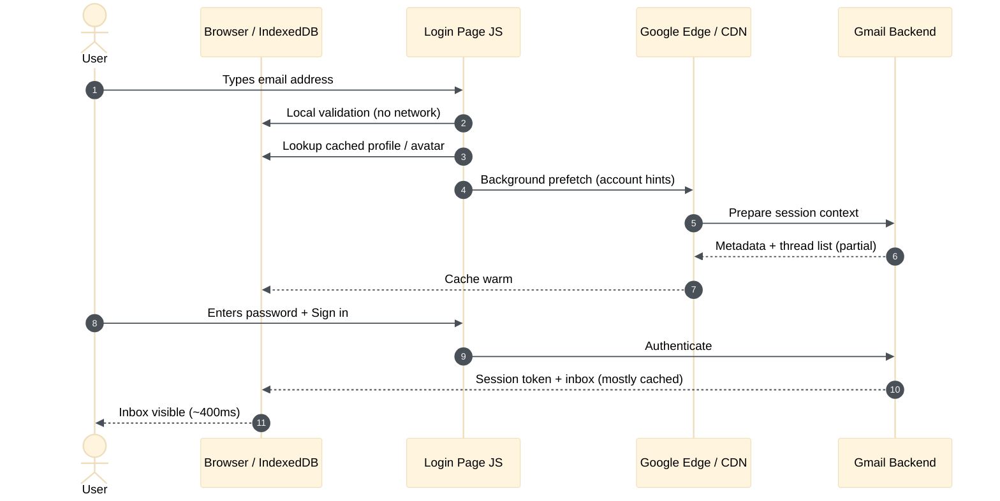
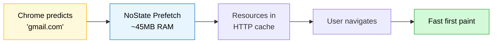
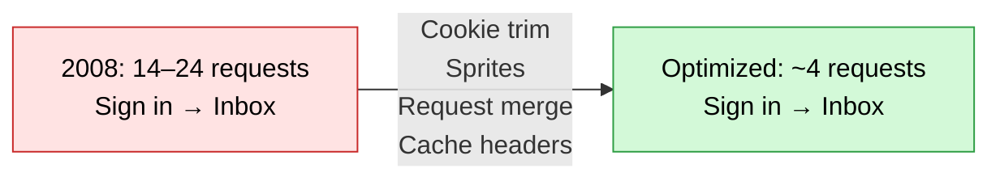
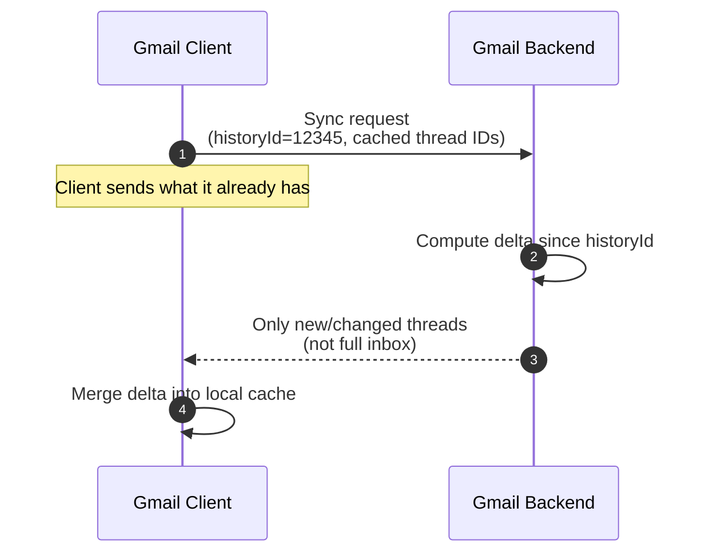
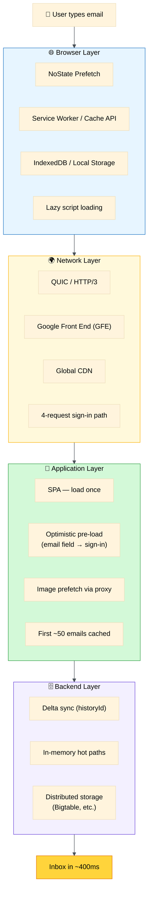

# Gmail Sign-in Mechanism: Optimistic Pre-Loading of Data
### Day 74 of 50 - System Design Interview Preparation Series

**By Sunchit Dudeja**

*How Google Loads Your Inbox in Under 400ms — And Why Optimism Is Dangerous*

---

## 📑 Table of Contents

1. [Introduction: The 400ms Miracle](#-introduction-the-400ms-miracle)
2. [Part 1: Gmail as a Single-Page Application](#part-1-gmail-as-a-single-page-application)
3. [Part 2: The Secret Weapon — Optimistic Pre-Loading](#part-2-the-secret-weapon--optimistic-pre-loading)
4. [Part 3: Chrome's NoState Prefetch — Browser-Level Boost](#part-3-chromes-nostate-prefetch--browser-level-boost)
5. [Part 4: Request Reduction — From 24 to 4](#part-4-request-reduction--from-24-to-4)
6. [Part 5: The Caching Strategy — Smart, Aggressive, and Safe](#part-5-the-caching-strategy--smart-aggressive-and-safe)
7. [Part 6: Why Optimistic Pre-Loading Is Dangerous](#part-6-why-optimistic-pre-loading-is-dangerous)
8. [Part 7: The Full Stack — All Pieces Together](#part-7-the-full-stack--all-pieces-together)
9. [When to Use Optimistic Pre-Loading](#when-to-use-optimistic-pre-loading)
10. [Summary: The Gmail Speed Stack](#summary-the-gmail-speed-stack)
11. [What Junior Developers Get Wrong (And Architects Get Right)](#what-junior-developers-get-wrong-and-architects-get-right)
12. [How to Talk About It in an Interview](#-how-to-talk-about-it-in-an-interview)
13. [Quick Recap](#-quick-recap)
14. [Final Words](#-final-words)

---

## 🎯 Introduction: The 400ms Miracle

You open a browser on a device you've never used before. You type `mail.google.com`. Within what feels like a heartbeat — often **under 400 milliseconds** — your entire inbox, with thousands of emails, labels, and conversations, is staring back at you.

How is this possible?

The answer isn't magic. It's a masterclass in system design — a carefully orchestrated combination of **optimistic pre-loading**, browser-level prefetching, aggressive caching, request optimization, and global edge infrastructure.

And at the heart of it all lies a powerful but dangerous pattern: **optimistic pre-loading**.

> *"Gmail's architecture eliminates many of the delays in reading mail by employing techniques like prefetching."*

> 🎨 **Companion diagram:** [`day74-gmail-optimistic-preloading-speed-stack.excalidraw`](./day74-gmail-optimistic-preloading-speed-stack.excalidraw) — the Gmail speed stack as a whiteboard sketch (open in Excalidraw / VS Code Excalidraw extension).

> **Companion reads:**
> - [Day 10 — Request Coalescing](./Day10_Request_Coalescing.md) — batching requests to reduce round trips.
> - [Day 37 — Optimizing Cache Hit Rate](./Day37_Optimizing_Cache_High_Hit_Rate_Distributed_Systems.md) — cache strategy fundamentals.
> - [Day 70 — Load Balancing Layers](./Day70_Load_Balancing_Layers_Sequence_Breakdown.md) — CDN and edge infrastructure in the path.
> - [Day 72 — The Resilience Stack](./Day72_Resilience_Stack_Layered_Defense.md) — why optimistic load must respect rate limits and bulkheads.

---

## Part 1: Gmail as a Single-Page Application

Before understanding how Gmail loads fast, understand **what Gmail is**.

Gmail is a **Single-Page Application (SPA)**. When you load Gmail, you're not loading individual pages for each email or folder. Instead:

1. The entire application loads **once** — a bare-bones HTML shell.
2. **JavaScript takes over** and dynamically renders content as you interact.
3. All subsequent actions happen via **API calls**, not full page reloads.

Gmail pioneered this model over a decade ago. Today SPAs are the norm — but Gmail **perfected** the performance implications first.

**Why this matters for speed:** Once the initial load completes, Gmail never reloads the entire page. Opening an email, searching, archiving — each requires only a small API call and a local DOM update. The heavy cost is paid **once** at sign-in.

---

## Part 2: The Secret Weapon — Optimistic Pre-Loading

**Optimistic pre-loading** is the practice of loading data **before** the user explicitly requests it, based on the prediction that they will need it.

Gmail takes this to an extreme.

### 2.1 Pre-Loading Starts at the Email Field

The moment you type your email address on the login page, Gmail's JavaScript begins working:

| Step | What happens | Network call? |
|------|--------------|---------------|
| **Local validation** | Browser checks syntax (missing `@`, etc.) | ❌ No |
| **Local storage lookup** | Account name/avatar from IndexedDB if you've logged in before | ❌ No |
| **Background pre-fetch** | Async requests prepare account metadata | ✅ Yes (speculative) |

By the time you finish typing your password, **much of your inbox data is already waiting** in the browser cache.

### 2.2 Image Prefetching — The "Invisible" Load

Gmail doesn't stop at text. It also **prefetches images** before you open an email:

- When you have an active Gmail session, Gmail prefetches images referenced in your inbox.
- Images are served through Google's CDN (`ci3.googleusercontent.com` — the image proxy).
- When you click an email, images are **already loaded** — the message renders instantly.

**Why proxy images?** Security (no direct tracker pixels), caching control, and consistent CDN delivery.

### 2.3 Pre-Loading the First 50 Emails

Gmail preloads your **first ~50 emails** in full. You can test this yourself:

1. Open Gmail in your browser.
2. Wait for the first batch of emails to load.
3. **Disconnect your internet.**
4. You can still open and read any of those preloaded emails in full.

This is optimistic pre-loading at its most aggressive — loading content you **might** read, just in case you do.

> **Architect's note:** The exact prefetch count and behavior can vary by client (web vs mobile) and settings (e.g., "Display images" preferences). The **pattern** — prefetch high-probability read-only content — is what matters for system design interviews.

---

## Part 3: Chrome's NoState Prefetch — Browser-Level Boost

Gmail's speed isn't only server-side. **Chrome** gives Google properties a head start through **NoState Prefetch**.

### What Is NoState Prefetch?

NoState Prefetch is a Chrome mechanism that pre-fetches resources **before** you navigate to a page:

| Aspect | Detail |
|--------|--------|
| Replaces | Older, memory-hungry **prerendering** |
| Memory cost | ~45 MB (much lighter than full prerender) |
| Behavior | Fetches HTML/CSS/JS — **does not execute** JavaScript or render |
| Trigger | Address bar prediction, resource hints, omnibox |

| Feature | What it does |
|---------|--------------|
| **Address bar prediction** | Chrome predicts you're about to type "gmail" and pre-fetches static assets |
| **Resource hints** | `<link rel="prefetch">` and similar hints tell the browser what to fetch early |
| **No execution** | Resources fetched but not run — saves CPU and memory vs full prerender |

**Result:** By the time you visit Gmail, HTML, CSS, and JS bundles may already be in Chrome's cache.

---

## Part 4: Request Reduction — From 24 to 4

In **2008**, the Gmail team performed a deep analysis of the sign-in sequence. They discovered:

> *"There were between fourteen and twenty-four HTTP requests required to load an inbox and display it."*

For context, a popular news site required ~180 requests. Gmail was already efficient — but the team knew they could do better.

### The Optimization Strategy

They attacked from three directions:

1. **Reduce** the number of requests.
2. Make more requests **cacheable**.
3. **Reduce the overhead** of each request.

| Optimization | What they did | Impact |
|--------------|---------------|--------|
| **Cookie reduction** | Eliminated or narrowed cookie scope | Smaller request headers |
| **Image spriting** | Consolidated icons into single meta-images | Fewer image requests |
| **Request combining** | Merged multiple API calls into one | Fewer round trips |
| **Cacheable assets** | Made static images fully browser-cacheable | Faster repeat loads |

> *"The result is that it now takes as few as four requests from the click of the 'Sign in' button to the display of your inbox."*

**Twenty-four requests down to four** — a **6× reduction**. This is the obsessive, layer-by-layer optimization that defines Google's engineering culture.

---

## Part 5: The Caching Strategy — Smart, Aggressive, and Safe

Gmail's caching balances **speed** with **security**.

### 5.1 Smart Caching

The Gmail Inbox experience (including Chrome extension patterns) reflects this philosophy:

| Technique | Effect |
|-----------|--------|
| **Core assets stored locally** | Trims network calls by up to **70%** on repeat visits |
| **Lazy script loading** | Heavy code deferred until after first paint |
| **Memory guard** | Caps RAM usage so low-end devices stay smooth |

### 5.2 Delta Updates — Don't Re-Load Everything

Instead of re-loading the entire inbox on every sync, Gmail uses **delta updates**:

1. The client sends what it already has (cache / local storage + `historyId`).
2. The server responds with **only the difference** since the last sync.
3. Bandwidth and latency drop dramatically.

Gmail's **History API** enables incremental synchronization using a monotonically increasing **`historyId`**. Same pattern you'll see in sync APIs everywhere: *send cursor, get delta*.

### 5.3 Cache Control for Security

Gmail uses cache headers to prevent security issues:

| Event | Behavior |
|-------|----------|
| **Active session** | Aggressive caching of read-only mail content |
| **Logout** | `Cache-Control: no-store` on authenticated pages |
| **Session kill** | Server invalidates session token immediately |

**The balance:** Cache aggressively for performance — but **never** cache sensitive authenticated content in a way that survives logout.

---

## Part 6: Why Optimistic Pre-Loading Is Dangerous

This is where the **architect's mindset** matters most.

Optimistic pre-loading is powerful but risky. Implemented carelessly, it corrupts your system:

| Risk | What happens | Real-world impact |
|------|--------------|-------------------|
| **Stale data** | Pre-loaded data outdated before access | Wrong information; cache invalidation nightmare |
| **Wasted resources** | Pre-load for users who never complete action | Wasted bandwidth, CPU, memory — at scale, millions of dollars |
| **Security vulnerabilities** | Authenticated data pre-loaded before session completes | Data leaks, session hijacking on shared devices |
| **State mutation** | Pre-load triggers side effects (e.g., mark-as-read) | Incorrect states; race conditions |
| **Memory overhead** | Too much pre-loaded on client | Slow on low-end devices |
| **Catastrophic overload** | Aggressive prefetch under traffic spike | Cascading failures across the fleet |

### How Gmail Mitigates These Risks

| Risk | Gmail's mitigation |
|------|-------------------|
| Stale data | Delta updates + real-time sync via `historyId` |
| Wasted resources | Pre-load only high-probability content (first ~50 emails, inbox images) |
| Security | `Cache-Control: no-store` on logout; session validation before sensitive data |
| State mutation | Pre-loading is **read-only** — no side effects before auth completes |
| Memory overhead | Memory guard caps client RAM usage |
| Overload | Global CDN + edge caching distributes prefetch load |

> **The Architect's Golden Rule for Optimistic Pre-Loading:**
>
> *"Optimistic pre-loading is the art of predicting user intent — loading data before it's requested to deliver instant experiences — but it must be used with caution, as pre-loading the wrong data or at the wrong time can corrupt system state, waste resources, and create security vulnerabilities."*

---

## Part 7: The Full Stack — All Pieces Together

---

## When to Use Optimistic Pre-Loading

| ✅ Use when | ❌ Avoid when |
|-------------|---------------|
| High-probability actions (sign-in, homepage, feed) | Low-probability optional flows |
| **Read-only** operations | State-mutating operations |
| Cacheable, relatively stable data | Frequently changing data |
| Low-cost operations | Expensive DB/API operations |
| Non-sensitive or post-auth data | Pre-auth sensitive data |

---

## Summary: The Gmail Speed Stack

| Layer | Technique | Impact |
|-------|-----------|--------|
| **Browser** | NoState Prefetch, Service Worker, Local Storage | Pre-fetches resources before navigation |
| **Network** | QUIC, Global CDN, GFE | Reduces handshake latency; serves from nearest edge |
| **Application** | Optimistic pre-load, smart caching, lazy loading | Loads data before requested; defers heavy code |
| **Backend** | Delta updates, in-memory caching, distributed storage | Only sends what changed; serves hot paths from RAM |

### The Bottom Line

Gmail's incredible speed isn't magic — it's decades of optimization across **every layer**:

- Optimistic pre-loading from the moment you type your email
- Chrome's NoState Prefetch before you navigate
- Request reduction from **24 → 4**
- Smart caching trimming network calls by up to **70%**
- Delta updates syncing only what changed
- Global edge infrastructure serving from the nearest location

But as an architect: **optimism is a double-edged sword**. Use it wisely, or it will corrupt your system.

---

## What Junior Developers Get Wrong (And Architects Get Right)

| Mistake | Architect's correction |
|---------|------------------------|
| "We'll pre-load everything just in case." | Pre-load only **high-probability** data — measure user behavior first. |
| "We'll pre-load data before authentication." | Pre-load **non-sensitive** data only; gate sensitive data behind auth. |
| "Pre-loading doesn't have side effects." | Assume it **could** — design **idempotent**, read-only pre-load operations. |
| "We'll cache everything forever." | Implement **TTL and invalidation** — stale data beats no data only when you know it. |
| "Pre-loading is always a performance win." | Measure **cost-benefit** — abandoned flows waste resources at scale. |
| "We don't need browser-level optimizations." | Prefetch, resource hints, and service workers are **free performance** — use them. |
| "SPA = fast automatically." | SPAs shift cost to **initial load** — Gmail optimizes that moment obsessively. |

---

## 💬 How to Talk About It in an Interview

When asked *"How would you design a fast login experience?"* or *"Explain optimistic pre-loading"*:

> "I'd use Gmail as the reference architecture. It's an SPA — pay the load cost once, then small API calls for every interaction. Before sign-in completes, I'd optimistically pre-fetch **read-only**, high-probability data — profile hints when the user types their email, and the first page of inbox threads after auth succeeds — but never mutate state during prefetch.
>
> On the network side, I'd minimize round trips aggressively — Gmail went from 24 requests to 4 via spriting, request combining, and cacheable assets. Sync uses **delta updates** with a cursor like historyId so clients only fetch what changed.
>
> At the browser layer, resource hints and prefetch warm static assets. The trade-off is always stale data, wasted bandwidth on abandoned flows, and security if you prefetch authenticated content too early — so I'd pair aggressive caching with strict logout cache headers and read-only prefetch semantics."

---

## 🧾 Quick Recap

- Gmail is an **SPA** — initial load is the bottleneck; everything after is incremental.
- **Optimistic pre-loading** starts at the email field — profile, threads, images before you ask.
- **~50 emails offline-readable** — proof of aggressive client-side prefetch.
- **NoState Prefetch** — Chrome fetches assets without executing JS (~45 MB).
- **24 → 4 requests** — cookie trim, sprites, merge, cache headers.
- **Delta sync via historyId** — send cursor, get only changes.
- **Security:** `Cache-Control: no-store` on logout; read-only prefetch.
- **Golden rule:** Predict intent, but pre-load **read-only**, **post-auth**, **high-probability** data only.

---

## 🎬 Final Words

Gmail taught the industry that **perceived speed** is a product feature — not an accident. Users don't care about your microservice diagram; they care that the inbox appears before they finish blinking.

Optimistic pre-loading is how you buy that perception. But the same technique that makes Gmail feel instant can bankrupt your CDN budget, leak data on a shared laptop, or mark emails read before the user opens them — if you get the boundaries wrong.

Study Gmail. Copy the patterns. Respect the risks. 🎯

---

*This blog post is part of the **System Design from an Architect's Perspective** series. For more deep dives, follow the series and learn how to think like an architect — not just a developer.*

*If this explained the 400ms inbox miracle, pass it to the next engineer about to `prefetch(allData)` with no auth gate and no delta sync.* 🎯
