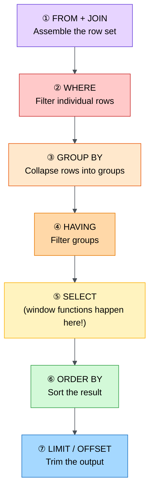
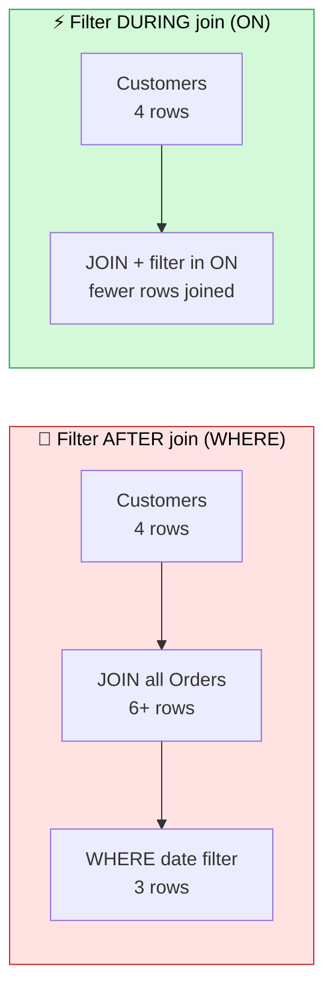
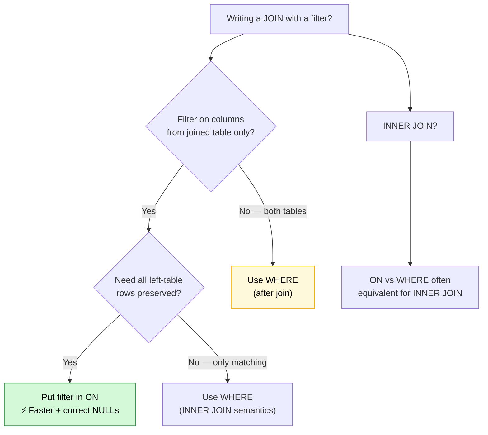
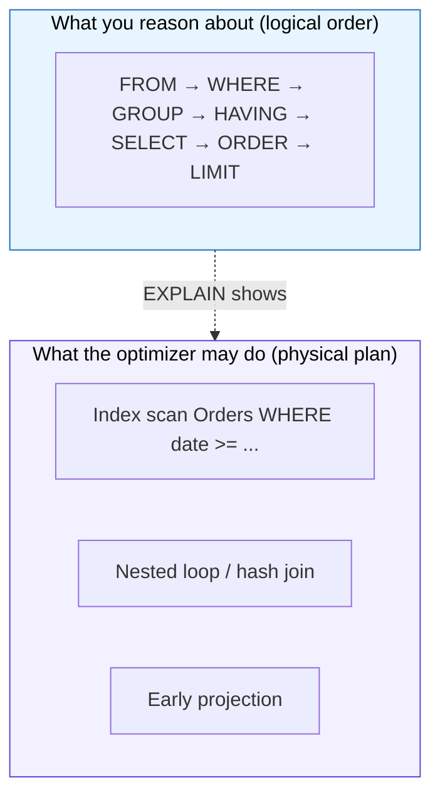

# SQL Order of Execution: Why Your JOIN Filter Placement Matters
### Day 75 of 50 - System Design Interview Preparation Series

**By Sunchit Dudeja**

*An Architect's Guide — Logical vs Physical Execution, and the WHERE vs ON Trap*

---

## 📑 Table of Contents

1. [Introduction: You Write SQL Top-to-Bottom — The Database Doesn't](#-introduction-you-write-sql-top-to-bottom--the-database-doesnt)
2. [The Logical Order of Execution (The Julia Evans Model)](#the-logical-order-of-execution-the-julia-evans-model)
3. [Why Order Matters: Aliases, Aggregates, and Window Functions](#why-order-matters-aliases-aggregates-and-window-functions)
4. [The Performance Trap: Filtering AFTER vs DURING the Join](#the-performance-trap-filtering-after-vs-during-the-join)
5. [Side-by-Side: JOIN + WHERE (Slow) vs JOIN + ON Filter (Fast)](#side-by-side-join--where-slow-vs-join--on-filter-fast)
6. [LEFT JOIN Semantics: Why ON and WHERE Are Not Interchangeable](#left-join-semantics-why-on-and-where-are-not-interchangeable)
7. [The Architect's Decision Framework](#the-architects-decision-framework)
8. [Physical vs Logical Execution — What the Optimizer Actually Does](#physical-vs-logical-execution--what-the-optimizer-actually-does)
9. [What Junior Developers Get Wrong (And Architects Get Right)](#what-junior-developers-get-wrong-and-architects-get-right)
10. [How to Talk About It in an Interview](#-how-to-talk-about-it-in-an-interview)
11. [Quick Recap](#-quick-recap)
12. [Final Words](#-final-words)

---

## 🎯 Introduction: You Write SQL Top-to-Bottom — The Database Doesn't

You write SQL like a story:

```sql
SELECT ...
FROM ...
WHERE ...
GROUP BY ...
ORDER BY ...
```

But the database engine **does not** execute it in that order. It follows a **logical processing pipeline** — and misunderstanding that pipeline causes two classes of bugs:

1. **Correctness bugs** — "Why can't I use this alias in WHERE?" / "Why did my LEFT JOIN drop rows?"
2. **Performance bugs** — "Why is this 10-second query joining millions of rows before filtering?"

This post covers both — starting with the canonical **order of execution** (popularized by educators like [Julia Evans](https://wizardzines.com/)), then diving into the architect-level insight from production: **where you put your filter in a JOIN changes both speed and semantics**.

> 🎨 **Companion diagram:** [`day75-sql-order-of-execution-join-filtering.excalidraw`](./day75-sql-order-of-execution-join-filtering.excalidraw) — execution order + WHERE vs ON pipeline (open in Excalidraw / VS Code Excalidraw extension).

> **Companion reads:**
> - [Day 7 — Databases: Developer vs Architect](./Day7_Databases_Developer_vs_Architect.md) — modeling access patterns, not just tables.
> - [Day 23 — Database Selection](./Day23_Database_Selection_System_Design.md) — when SQL vs NoSQL matters.
> - [Day 47 — Database Connection Pool](./Day47_Database_Connection_Pool_Biggest_Blunder.md) — slow queries exhaust pools at scale.
> - [Day 65 — LSM Trees vs B-Trees](./Day65_LSM_Trees_vs_B_Trees.md) — how storage engines scan and filter data.

---

## The Logical Order of Execution (The Julia Evans Model)

**SQL queries run in this order** — not the order you type them:



| Step | Clause | What the engine does |
|------|--------|----------------------|
| **①** | **FROM + JOIN** | Identify source tables. Perform joins. Build the **intermediate row set**. |
| **②** | **WHERE** | Filter **rows** from that intermediate set. No aggregates yet. |
| **③** | **GROUP BY** | Collapse rows into groups. Compute group keys. |
| **④** | **HAVING** | Filter **groups** (post-aggregation). `WHERE` filters rows; `HAVING` filters groups. |
| **⑤** | **SELECT** | Project columns, expressions, aggregates. **Window functions execute here.** |
| **⑥** | **ORDER BY** | Sort the final projection. Can reference SELECT aliases. |
| **⑦** | **LIMIT / OFFSET** | Return only N rows (pagination). |

> **Credit:** The "SQL runs in this order" mental model is widely taught by Julia Evans ([@b0rk](https://twitter.com/b0rk)) and appears in her SQL zines. It's the best single diagram for understanding *why* SQL behaves the way it does.

---

## Why Order Matters: Aliases, Aggregates, and Window Functions

### You Can't Use SELECT Aliases in WHERE

```sql
SELECT
    price * quantity AS total
FROM order_items
WHERE total > 100;   -- ❌ ERROR: "total" doesn't exist yet
```

**Why?** `WHERE` runs at step ②. `SELECT` (and the alias `total`) doesn't exist until step ⑤.

**Fix:** Repeat the expression, or use a subquery/CTE:

```sql
SELECT *
FROM (
    SELECT price * quantity AS total
    FROM order_items
) t
WHERE t.total > 100;   -- ✅ Subquery: SELECT already ran
```

### WHERE vs HAVING

```sql
SELECT department, COUNT(*) AS headcount
FROM employees
WHERE salary > 50000      -- ② filters ROWS before grouping
GROUP BY department
HAVING COUNT(*) > 10;     -- ④ filters GROUPS after aggregation
```

| Clause | Filters | When it runs |
|--------|---------|--------------|
| **WHERE** | Individual rows | Before `GROUP BY` |
| **HAVING** | Groups | After `GROUP BY` |

### Window Functions Run at SELECT Time

```sql
SELECT
    name,
    department,
    salary,
    RANK() OVER (PARTITION BY department ORDER BY salary DESC) AS dept_rank
FROM employees;
```

Window functions are evaluated at step ⑤ — **after** `WHERE` and `GROUP BY`, but **before** `ORDER BY`. That's why you **cannot** filter on `dept_rank` in the same query's `WHERE` clause — wrap in a subquery instead.

---

## The Performance Trap: Filtering AFTER vs DURING the Join

Here's where architects earn their salary.

When you write:

```sql
FROM Customers c
LEFT JOIN Orders o ON c.CustomerID = o.CustomerID
WHERE o.OrderDate >= '2026-05-05';
```

It **looks** like you're filtering early. But logically, the engine:

1. **Joins first** (step ①) — potentially millions of order rows attached to customers.
2. **Filters second** (step ②) — discards non-matching rows **after** the join explosion.



| Approach | When filter runs | Rows processed | Performance |
|----------|------------------|----------------|-------------|
| **WHERE after JOIN** | Step ② — after join | More rows joined, then discarded | 🐌 Slower |
| **AND in ON clause** | Step ① — during join | Fewer rows enter the pipeline | ⚡ Faster |

> 💡 **Note:** Filtering after the join means more rows are processed. Filtering during the join reduces data early → faster.

---

## Side-by-Side: JOIN + WHERE (Slow) vs JOIN + ON Filter (Fast)

### Sample Data

**Customers**

| CustomerID | Name |
|------------|------|
| 1 | Alice |
| 2 | Bob |
| 3 | Carol |
| 4 | David |

**Orders**

| OrderID | CustomerID | OrderDate |
|---------|------------|-----------|
| 101 | 1 | 2026-05-10 |
| 102 | 2 | 2026-04-01 |
| 103 | 1 | 2026-06-15 |
| 104 | 4 | 2026-05-20 |

---

### 🐌 Pattern A: Filter AFTER Join (`WHERE`)

```sql
SELECT c.Name, o.OrderID, o.OrderDate
FROM Customers c
LEFT JOIN Orders o ON c.CustomerID = o.CustomerID
WHERE o.OrderDate >= '2026-05-05'
   OR o.OrderDate IS NULL;
```

**Logical pipeline:**

| Step | What happens | Rows |
|------|--------------|------|
| ① FROM + JOIN | All customers left-joined to **all** their orders | 5 rows (Carol has NULL order) |
| ② WHERE | Keep orders after May 5 **or** NULL dates | 3 rows |
| ⑤ SELECT | Project Name, OrderID, OrderDate | 3 rows |

**Result:**

| Name | OrderID | OrderDate |
|------|---------|-----------|
| Alice | 101 | 2026-05-10 |
| Alice | 103 | 2026-06-15 |
| David | 104 | 2026-05-20 |

**Key points:**
- Join happens **first** with all orders (including April order for Bob).
- `WHERE` filters **after** the join.
- More data joined initially → then thrown away.

---

### ⚡ Pattern B: Filter DURING Join (`ON`)

```sql
SELECT c.Name, o.OrderID, o.OrderDate
FROM Customers c
LEFT JOIN Orders o ON c.CustomerID = o.CustomerID
                  AND o.OrderDate >= '2026-05-05';
```

**Logical pipeline:**

| Step | What happens | Rows |
|------|--------------|------|
| ① FROM + JOIN | Join customers to orders **matching date in ON** | 5 rows (non-matching orders never attach) |
| ⑤ SELECT | Project columns | 5 rows |

**Result:**

| Name | OrderID | OrderDate |
|------|---------|-----------|
| Alice | 101 | 2026-05-10 |
| Alice | 103 | 2026-06-15 |
| Bob | NULL | NULL |
| Carol | NULL | NULL |
| David | 104 | 2026-05-20 |

**Key points:**
- Filter condition is in the **`ON` clause** — applied **during** the join.
- Bob's April order **never joins** — less work for the engine.
- **All customers preserved** (LEFT JOIN) — Bob and Carol appear with NULLs.

---

## LEFT JOIN Semantics: Why ON and WHERE Are Not Interchangeable

This is the trap that causes **silent data bugs**, not just slow queries.

### The Dangerous Mistake

```sql
-- Looks like a LEFT JOIN. Behaves like an INNER JOIN.
SELECT c.Name, o.OrderID
FROM Customers c
LEFT JOIN Orders o ON c.CustomerID = o.CustomerID
WHERE o.OrderDate >= '2026-05-05';   -- ❌ Removes NULL rows!
```

**What happens:**
1. LEFT JOIN produces Carol with `OrderID = NULL`.
2. `WHERE o.OrderDate >= '2026-05-05'` evaluates to **UNKNOWN** for NULL dates.
3. NULL rows are **filtered out**. Carol disappears.

You've accidentally turned a **LEFT JOIN into an INNER JOIN**.

### The Fix

| Goal | Put filter in... |
|------|------------------|
| Filter the **joined table** but **keep** all left rows | `ON` clause |
| Filter the **final result set** (accept row loss) | `WHERE` clause |

```sql
-- Keep all customers; only attach recent orders
LEFT JOIN Orders o ON c.CustomerID = o.CustomerID
                  AND o.OrderDate >= '2026-05-05'   -- ✅

-- Keep only customers who have at least one recent order
LEFT JOIN Orders o ON c.CustomerID = o.CustomerID
WHERE o.OrderDate >= '2026-05-05'                  -- ✅ but INNER-like
```

---

## The Architect's Decision Framework



### Key Differences Summary

| Aspect | Filter AFTER join (`WHERE`) | Filter DURING join (`ON`) |
|--------|----------------------------|---------------------------|
| **When filter is applied** | Step ② — after join | Step ① — during join |
| **Data processed** | More rows joined first | Fewer rows joined |
| **Performance** | 🐌 Slower (usually) | ⚡ Faster (usually) |
| **LEFT JOIN row preservation** | May drop NULL rows | Preserves all left rows |
| **Best for** | Conditions involving **both** tables | Conditions on **joined table only** |

### The One-Sentence Best Practice

> **If you're only filtering on columns from the joined table and you need LEFT JOIN semantics, put the condition in the `ON` clause to filter early and preserve NULL rows.**

---

## Physical vs Logical Execution — What the Optimizer Actually Does

Everything above is the **logical** order — how SQL is *defined* to behave. Modern query optimizers (PostgreSQL, MySQL 8+, SQL Server, Oracle) may **reorder** operations physically:

| Logical step | Optimizer may... |
|--------------|------------------|
| WHERE before JOIN | **Predicate pushdown** — push filters under joins when equivalent |
| JOIN order | Reorder joins for lowest cost (cost-based optimizer) |
| INDEX use | Scan index instead of full table if filter is selective |



**Why logical order still matters:**

1. **Semantics** — LEFT JOIN + WHERE vs ON behavior is defined logically. Optimizer won't change meaning.
2. **Unreadable SQL** — If you rely on the optimizer to fix bad SQL, you're debugging execution plans in production at 3 AM.
3. **Interviews** — They test logical order, not your specific Postgres version's pushdown rules.

**Always run `EXPLAIN` (or `EXPLAIN ANALYZE`)** on slow queries. The plan reveals whether your filter was pushed down or whether you're joining before filtering.

```sql
EXPLAIN ANALYZE
SELECT c.Name, o.OrderID, o.OrderDate
FROM Customers c
LEFT JOIN Orders o ON c.CustomerID = o.CustomerID
                  AND o.OrderDate >= '2026-05-05';
```

---

## What Junior Developers Get Wrong (And Architects Get Right)

| Mistake | Architect's correction |
|---------|------------------------|
| "SQL runs top-to-bottom as written." | Logical order is **FROM → WHERE → GROUP → HAVING → SELECT → ORDER → LIMIT**. |
| "I'll use my SELECT alias in WHERE." | Aliases don't exist until SELECT runs — use a subquery or repeat the expression. |
| "LEFT JOIN + WHERE on joined column is fine." | You've probably turned it into an **INNER JOIN**. Use `ON` for joined-table filters. |
| "ON and WHERE are interchangeable." | **Semantically different** for OUTER JOINs. Performance differs too. |
| "The optimizer will fix my query." | Write logically correct, filter-early SQL. Use `EXPLAIN` to verify — don't hope. |
| "HAVING is just another WHERE." | `WHERE` filters **rows**. `HAVING` filters **groups** after aggregation. |
| "Window functions run before GROUP BY." | Window functions run at **SELECT** time — after WHERE and GROUP BY. |

---

## The One-Sentence Architect's Summary

> "SQL executes in a fixed logical order — FROM and JOIN first, SELECT and window functions much later — so filter placement in JOINs controls both performance (how many rows enter the pipeline) and correctness (whether LEFT JOIN NULLs survive)."

---

## 💬 How to Talk About It in an Interview

When asked *"How does SQL execute?"* or *"Why is my LEFT JOIN slow?"*:

> "SQL has a logical processing order different from how we write it. The engine starts with FROM and JOIN to build a row set, applies WHERE to filter rows, then GROUP BY and HAVING for aggregation, then SELECT where window functions also run, then ORDER BY and LIMIT.
>
> For JOIN performance, the critical insight is filter placement. If I filter a joined table in WHERE after a LEFT JOIN, I join all rows first and may accidentally drop NULL rows — converting my LEFT JOIN to INNER behavior. If I put the filter in the ON clause, I reduce rows during the join and preserve left-table rows. For INNER JOINs the optimizer often pushes predicates anyway, but for OUTER JOINs the semantic difference is real. I'd always verify with EXPLAIN ANALYZE on production-scale data."

---

## 🧾 Quick Recap

- **Logical order:** FROM+JOIN → WHERE → GROUP BY → HAVING → SELECT → ORDER BY → LIMIT.
- **Window functions** execute at SELECT time — not before.
- **SELECT aliases** aren't visible in WHERE — use subqueries.
- **WHERE** filters rows; **HAVING** filters groups.
- **Filter in ON** = during join → faster + preserves LEFT JOIN NULLs.
- **Filter in WHERE** = after join → more rows processed + may drop NULLs.
- **Best practice:** Joined-table-only filters on OUTER JOINs go in **ON**.
- **Always EXPLAIN** — logical reasoning + physical plan verification.

---

## 🎬 Final Words

You don't need to memorize every edge case of every SQL dialect. You need one mental model: **the pipeline**.

Data enters at FROM. Each step narrows or transforms it. By the time SELECT runs, the shape of your result is already decided. Window functions just decorate it. ORDER BY rearranges it. LIMIT throws most of it away.

The next time a query is slow, don't reach for an index first. Ask: **"Am I joining before I filter?"** That single question — rooted in order of execution — has saved more production databases than any clever index name.

Julia Evans put the pipeline on a postcard. Architects put it in every code review. 🎯

---

*This blog post is part of the **System Design from an Architect's Perspective** series. For more deep dives, follow the series and learn how to think like an architect — not just a developer.*

*Order-of-execution mental model credit: [Julia Evans](https://wizardzines.com/) / [@b0rk](https://twitter.com/b0rk).*

*If this clarified WHERE vs ON, pass it to the next engineer whose LEFT JOIN mysteriously lost half their rows.* 🎯
