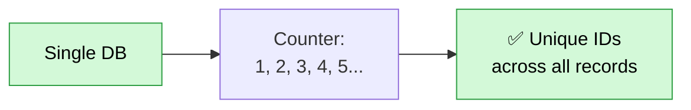
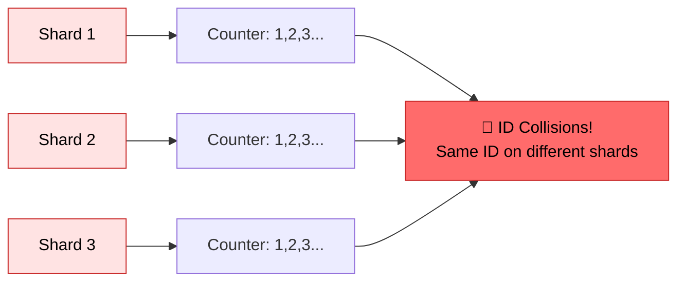
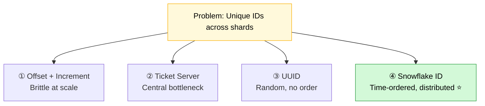
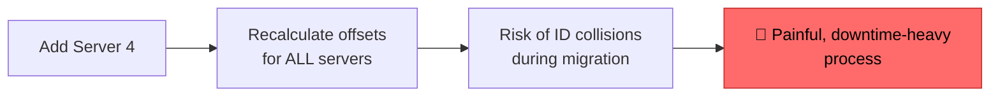
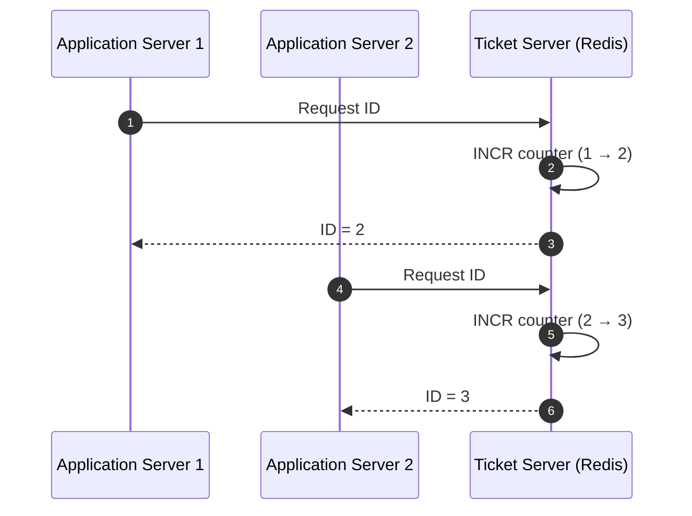
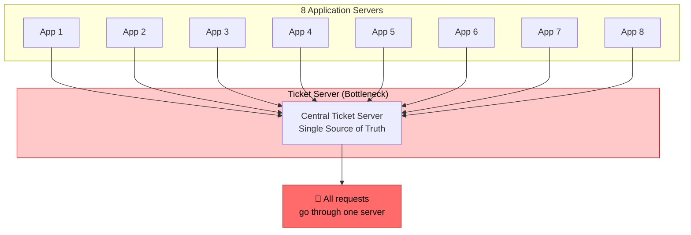
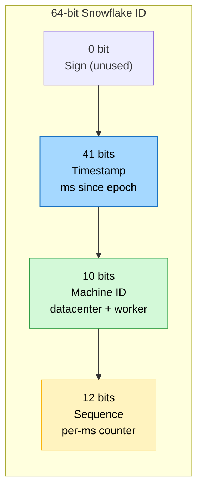
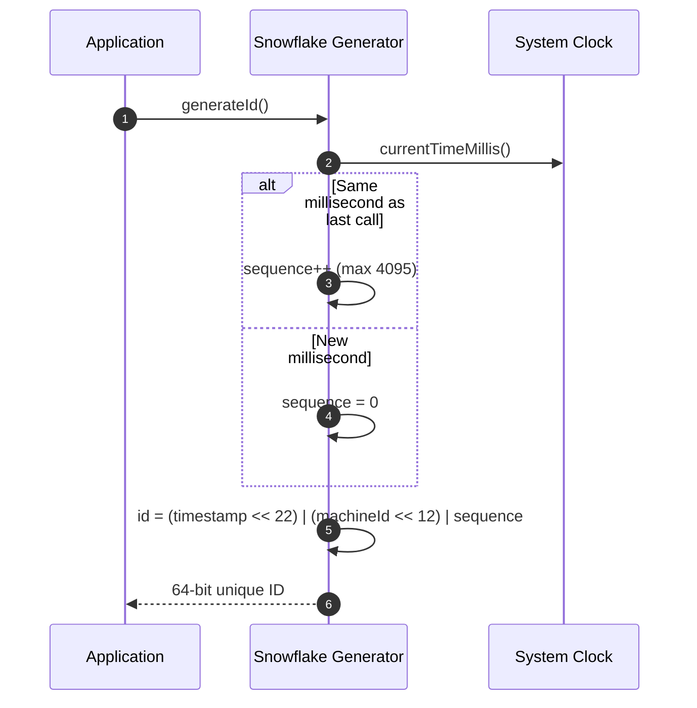
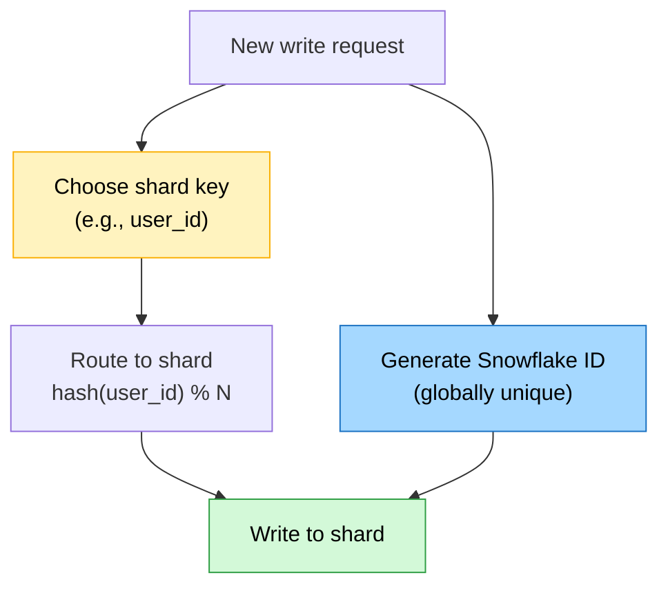

# Scale DB in Distributed Systems: The Unique ID Problem
### Day 76 of 50 - System Design Interview Preparation Series

**By Sunchit Dudeja**

*From Auto-Increment to Snowflake — Why Every Shard Needs Its Own ID Strategy*

---

## 📑 Table of Contents

1. [Introduction: The Question Behind Every Shard](#-introduction-the-question-behind-every-shard)
2. [Single Database: Auto-Increment Works](#single-database-auto-increment-works)
3. [Multiple Databases: Auto-Increment Breaks](#multiple-databases-auto-increment-breaks)
4. [The Four Solutions Architects Compare](#the-four-solutions-architects-compare)
5. [Solution 1: Offset + Increment Step (Brittle)](#solution-1-offset--increment-step-brittle)
6. [Solution 2: Ticket Server — Redis INCR (Centralized)](#solution-2-ticket-server--redis-incr-centralized)
7. [Solution 3: UUID (Decentralized, Random)](#solution-3-uuid-decentralized-random)
8. [Solution 4: Snowflake ID — Twitter's Time-Ordered Distributed ID](#solution-4-snowflake-id--twitters-time-ordered-distributed-id)
9. [Snowflake Bit Layout Deep Dive](#snowflake-bit-layout-deep-dive)
10. [Comparison Matrix: Which ID Strategy When?](#comparison-matrix-which-id-strategy-when)
11. [How IDs Connect to Sharding](#how-ids-connect-to-sharding)
12. [What Junior Developers Get Wrong (And Architects Get Right)](#what-junior-developers-get-wrong-and-architects-get-right)
13. [How to Talk About It in an Interview](#-how-to-talk-about-it-in-an-interview)
14. [Quick Recap](#-quick-recap)
15. [Final Words](#-final-words)

---

## 🎯 Introduction: The Question Behind Every Shard

You shard your database ([Day 64](./Day64_Database_Sharding_Strategies.md)). Reads scale. Writes scale. Storage scales. Then someone asks the question that stops the celebration:

> **"How do we generate unique primary keys across shards?"**

On a single database, `AUTO_INCREMENT` handles it. The database is the single source of truth — counter goes 1, 2, 3, 4, 5. Done.

The moment you split into **Shard 1**, **Shard 2**, and **Shard 3**, each shard runs its own counter. Shard 1 generates ID `1`. Shard 2 generates ID `1`. Shard 3 generates ID `1`.

**ID collisions.** Your distributed system is broken.

Scaling a database in distributed systems isn't just about splitting data — it's about **generating globally unique, collision-free identifiers without a central bottleneck**. This post walks through every approach architects evaluate — and why **Snowflake** became the industry default.

> 🎨 **Companion diagram:** [`day76-scale-db-distributed-unique-ids.excalidraw`](./day76-scale-db-distributed-unique-ids.excalidraw) — single DB → broken shards → Snowflake structure (open in Excalidraw / VS Code Excalidraw extension).

> **Companion reads:**
> - [Day 38 — Primary Key Strategies](./Day38_Primary_Key_Strategies_SQL_vs_NoSQL.md) — sequential SQL keys vs distributed NoSQL IDs.
> - [Day 64 — Database Sharding Strategies](./Day64_Database_Sharding_Strategies.md) — shard key choice and resharding nightmares.
> - [Day 28 — Consistent Hashing](./Day28_Consistent_Hashing_Resharding.md) — routing data across shards.
> - [Day 15 — Redis Single-Threaded Magic](./Day15_Redis_Single_Threaded_Magic.md) — why Redis works as a ticket server.

---

## Single Database: Auto-Increment Works



| Property | Single DB auto-increment |
|----------|--------------------------|
| **Uniqueness** | ✅ Guaranteed — one counter |
| **Ordering** | ✅ Monotonically increasing |
| **Coordination** | None — database handles it |
| **Scalability** | ❌ Single write primary — doesn't scale writes |

```sql
CREATE TABLE orders (
    id BIGINT PRIMARY KEY AUTO_INCREMENT,
    user_id BIGINT,
    amount DECIMAL(10,2)
);
-- IDs: 1, 2, 3, 4, 5 ... always unique, always ordered
```

**Works perfectly — until you need a second database.**

---

## Multiple Databases: Auto-Increment Breaks



| Shard | Generated IDs |
|-------|---------------|
| Shard 1 | 1, 2, 3, 4... |
| Shard 2 | 1, 2, 3, 4... |
| Shard 3 | 1, 2, 3, 4... |

**Three shards. Three rows with `id = 1`.** Merge them, query globally, or reference by ID alone — all broken.

This is the **foundational problem** of scaling databases in distributed systems. Every solution below exists to solve it.

---

## The Four Solutions Architects Compare



| Approach | Coordination | Ordered | Scalable | Complexity |
|----------|--------------|---------|----------|------------|
| Offset + Increment | None (config) | ✅ Yes | ❌ Brittle on resize | Low |
| Ticket Server (Redis) | Central server | ✅ Yes | ⚠️ Bottleneck | Medium |
| UUID v4 | None | ❌ Random | ✅ Yes | Low |
| **Snowflake** | None (per node) | ✅ Time-ordered | ✅ Yes | Medium |

---

## Solution 1: Offset + Increment Step (Brittle)

Give each server a unique **offset** and a shared **increment step** equal to the number of servers.

With 3 servers, increment = 3:

| Server | Offset | Generated IDs |
|--------|--------|-----------------|
| Server 1 | 1 | 1, 4, 7, 10, 13... |
| Server 2 | 2 | 2, 5, 8, 11, 14... |
| Server 3 | 3 | 3, 6, 9, 12, 15... |

No collisions. No central coordinator. Looks elegant — until you add Server 4.



| Problem | Why it hurts |
|---------|--------------|
| **Resize requires global reconfiguration** | Every server's offset and increment must change |
| **Migration window** | IDs generated during transition can collide |
| **No central authority** | Sounds good — until you need to coordinate the change |
| **Operational pain** | Adding/removing nodes = planned downtime |

**Verdict:** Works for a **fixed, never-changing** fleet. Falls apart in elastic cloud environments where nodes come and go.

---

## Solution 2: Ticket Server — Redis INCR (Centralized)

Centralize ID generation in a dedicated **Ticket Server** — typically Redis with atomic `INCR`.



```redis
INCR global_order_id
-- Returns: 1, then 2, then 3 ... atomically, no collisions
```

| Property | Ticket Server |
|----------|---------------|
| **Uniqueness** | ✅ Atomic INCR guarantees it |
| **Ordering** | ✅ Strictly monotonic |
| **Coordination** | Single Redis instance |
| **Latency** | +1 network hop per insert |
| **Availability** | Redis down = no new IDs |

### The Bottleneck Problem



**Flickr** popularized this pattern (with MySQL instead of Redis). It works — until you hit **millions of inserts per second** and one Redis instance becomes the ceiling.

**Mitigations:** Redis Cluster with multiple ticket keys, batch pre-allocation (reserve 1000 IDs at once), standby replicas with failover.

**Verdict:** Good for **moderate scale** with simple semantics. Becomes a **single point of failure and throughput bottleneck** at hyperscale.

---

## Solution 3: UUID (Decentralized, Random)

```java
UUID id = UUID.randomUUID();
// e.g., 550e8400-e29b-41d4-a716-446655440000
```

| Property | UUID v4 |
|----------|---------|
| **Uniqueness** | ✅ Probabilistic (122 random bits) |
| **Coordination** | ✅ None — generate locally |
| **Ordering** | ❌ Random — bad for B-tree indexes |
| **Size** | 128 bits (36 char string or 16 bytes) |

**The index problem:** Random UUIDs cause **index fragmentation** in B-tree databases (PostgreSQL, MySQL InnoDB). Every insert lands in a random page — more page splits, worse cache locality, slower writes at scale.

**Verdict:** Simple and decentralized. Avoid as a **primary key in SQL** at high write volume. Better in NoSQL where index structure differs ([Day 38](./Day38_Primary_Key_Strategies_SQL_vs_NoSQL.md)).

---

## Solution 4: Snowflake ID — Twitter's Time-Ordered Distributed ID

Twitter needed **billions of tweets** with unique, **time-ordered**, **decentralized** IDs. Auto-increment couldn't scale across data centers. UUIDs weren't ordered. The Ticket Server was a bottleneck.

**Snowflake** generates 64-bit IDs locally on each machine — no coordination, no network call, no collision.

> *A unique, time-ordered, distributed ID system used by Twitter.*

Adopted (with variations) by Discord, Instagram, Uber, and countless microservices.

---

## Snowflake Bit Layout Deep Dive

```
 0                   1                   2                   3
 0 1 2 3 4 5 6 7 8 9 0 1 2 3 4 5 6 7 8 9 0 1 2 3 4 5 6 7 8 9 0 1
├─┼─────────────────────────────────────────────────────────────┤
│0│  Timestamp (41 bits)  │ Machine ID │ Sequence Number        │
│ │  ms since custom epoch │  (10 bits) │    (12 bits)           │
└─┴───────────────────────┴────────────┴────────────────────────┘
  1        41 bits            10 bits         12 bits      = 64 bits
```



| Field | Bits | Range | Purpose |
|-------|------|-------|---------|
| **Sign** | 1 | 0 | Always 0 — keeps ID positive in signed 64-bit integers |
| **Timestamp** | 41 | ~69 years | Milliseconds since custom epoch (Twitter: 2010-11-04). **Time-ordered.** |
| **Machine ID** | 10 | 1,024 machines | Uniquely identifies the generating node (often 5 bits DC + 5 bits worker) |
| **Sequence** | 12 | 4,096/ms | Counter per machine per millisecond. Rolls to 0 each new ms. |

### Capacity Math (Interview Gold)

| Question | Answer |
|----------|--------|
| IDs per machine per second? | 4,096 × 1,000 = **~4 million/sec** |
| Total machines supported? | 2^10 = **1,024** |
| Timestamp lifespan? | 2^41 ms ≈ **69 years** |
| Total ID space? | 2^63 positive integers |

### Snowflake Generation Flow



```java
public class SnowflakeIdGenerator {
    private static final long EPOCH = 1288834974657L;  // Twitter epoch
    private static final long MACHINE_ID_BITS = 10L;
    private static final long SEQUENCE_BITS = 12L;

    private final long machineId;
    private long lastTimestamp = -1L;
    private long sequence = 0L;

    public synchronized long nextId() {
        long timestamp = System.currentTimeMillis();

        if (timestamp < lastTimestamp) {
            throw new RuntimeException("Clock moved backwards!");
        }

        if (timestamp == lastTimestamp) {
            sequence = (sequence + 1) & 4095;  // 12 bits = 4095 max
            if (sequence == 0) {
                timestamp = waitNextMillis(lastTimestamp);  // overflow — wait 1ms
            }
        } else {
            sequence = 0;
        }

        lastTimestamp = timestamp;

        return ((timestamp - EPOCH) << 22)
             | (machineId << 12)
             | sequence;
    }
}
```

### Snowflake Edge Cases (Architects Know These)

| Edge case | Mitigation |
|-----------|------------|
| **Clock skew backward** | Reject or wait — NTP drift can cause duplicate timestamps |
| **Sequence overflow in 1ms** | Block until next millisecond (4096 IDs/ms limit) |
| **Machine ID collision** | Assign IDs via config service / ZooKeeper / K8s StatefulSet ordinal |
| **Custom epoch** | Every implementation must use the **same epoch** across all nodes |

---

## Comparison Matrix: Which ID Strategy When?

| Strategy | Unique | Ordered | Decentralized | Index-friendly | Resize-safe | Best for |
|----------|--------|---------|---------------|----------------|-------------|----------|
| Auto-increment (single DB) | ✅ | ✅ | N/A | ✅ | N/A | Single-node only |
| Auto-increment (multi shard) | ❌ | ✅ | ✅ | ✅ | ✅ | **Never** |
| Offset + Increment | ✅ | ✅ | ✅ | ✅ | ❌ | Fixed server count |
| Ticket Server | ✅ | ✅ | ❌ | ✅ | ✅ | Moderate scale |
| UUID v4 | ✅ | ❌ | ✅ | ❌ | ✅ | NoSQL, low write volume |
| **Snowflake** | ✅ | ✅ | ✅ | ✅ | ✅ | **Hyperscale distributed** |
| ULID / UUID v7 | ✅ | ✅ | ✅ | ✅ | ✅ | Modern alternative to Snowflake |

> **Modern note:** **UUID v7** (RFC 9562, 2024) encodes a Unix timestamp in the high bits — giving time-ordering like Snowflake in a standard UUID format. Many new systems choose UUID v7 over custom Snowflake implementations.

---

## How IDs Connect to Sharding

Unique ID generation and sharding are **related but separate** decisions:



| Concept | Purpose |
|---------|---------|
| **Primary key (Snowflake)** | Globally unique identifier for the row |
| **Shard key (user_id)** | Determines **which shard** stores the row |
| **They are independent** | ID=9876543210 might live on Shard 3 because `hash(user_id) % 3 = 3` |

**Interview trap:** "We'll use Snowflake as the shard key." Usually wrong — Snowflake IDs are time-ordered, so sharding by Snowflake creates **hot spots on the latest shard**. Shard by **user_id** or **tenant_id** for even distribution ([Day 64](./Day64_Database_Sharding_Strategies.md)).

---

## What Junior Developers Get Wrong (And Architects Get Right)

| Mistake | Architect's correction |
|---------|------------------------|
| "Auto-increment works after sharding." | Each shard has its own counter — **ID collisions** guaranteed. |
| "We'll use UUID everywhere." | Random UUIDs **fragment B-tree indexes** at high write volume in SQL. |
| "Ticket Server scales forever." | Single Redis INCR is a **throughput bottleneck and SPOF** at hyperscale. |
| "Offset + increment is fine." | Adding/removing servers requires **global reconfiguration** and risks collisions. |
| "Snowflake and shard key are the same thing." | Primary key ≠ shard key. Shard by **user_id**, not timestamp-based ID. |
| "Snowflake never collides." | **Clock backward drift** or duplicate machine IDs can cause collisions — handle both. |
| "We don't need an ID strategy — we'll figure it out later." | ID strategy must be decided **before** sharding — migration is painful. |

---

## The One-Sentence Architect's Summary

> "Scaling a database across shards breaks auto-increment — architects choose between centralized ticket servers (simple but bottlenecked), offset schemes (brittle on resize), and decentralized time-ordered IDs like Snowflake (complex but hyperscale-ready)."

---

## 💬 How to Talk About It in an Interview

When asked *"How do you generate unique IDs in a sharded database?"*:

> "On a single database, auto-increment is fine. The moment we shard, each node has its own counter and IDs collide — so we need a distributed strategy.
>
> I'd rule out offset-plus-increment unless the server count is fixed forever — adding a node requires recalculating every offset. A Redis ticket server with INCR works for moderate scale but becomes a bottleneck and single point of failure at millions of writes per second.
>
> For hyperscale, I'd use Snowflake-style IDs: 41 bits of timestamp, 10 bits of machine ID, 12 bits of sequence — generated locally with no network call, roughly 4 million IDs per second per machine, time-ordered for index locality. I'd assign machine IDs via our config service, handle clock skew, and shard by user_id — not by the Snowflake ID itself — to avoid hot spots."

---

## 🧾 Quick Recap

- **Single DB:** auto-increment works — one counter, globally unique.
- **Multiple shards:** auto-increment **breaks** — same ID on different shards.
- **Offset + increment:** no collisions, but **brittle** when adding/removing nodes.
- **Ticket Server (Redis INCR):** simple, ordered, but **central bottleneck**.
- **UUID:** decentralized, but **random** — bad for SQL B-tree write performance.
- **Snowflake:** 64-bit = 41-bit timestamp + 10-bit machine + 12-bit sequence.
- **~4M IDs/sec/machine**, time-ordered, no coordination, hyperscale-ready.
- **Shard key ≠ primary key** — shard by `user_id`, not Snowflake ID.

---

## 🎬 Final Words

Every sharded system hits this wall. The junior engineer shards the database and assumes IDs will "just work." The architect designs the **ID strategy first** — because you can't bolt it on after a billion rows exist.

Snowflake isn't the only answer in 2026 — UUID v7, Sonyflake, and custom implementations all share the same insight: **generate locally, order by time, identify the machine, count within the millisecond.**

The single database counter was simple and correct. Distributed systems demand distributed thinking. Day 64 taught you how to split the data. Day 76 teaches you how to **name** it. 🎯

---

*This blog post is part of the **System Design from an Architect's Perspective** series. For more deep dives, follow the series and learn how to think like an architect — not just a developer.*

*If this clarified the shard ID problem, pass it to the next engineer about to `AUTO_INCREMENT` across three MySQL shards.* 🎯
