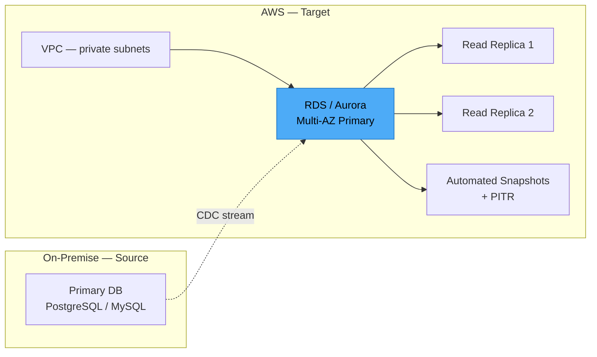
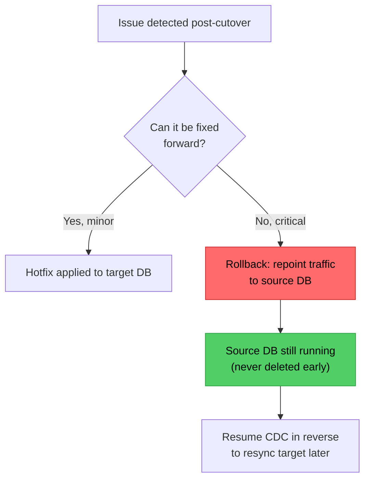
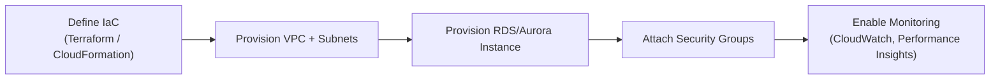
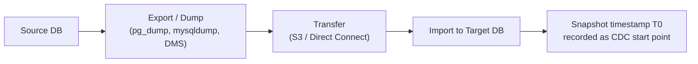
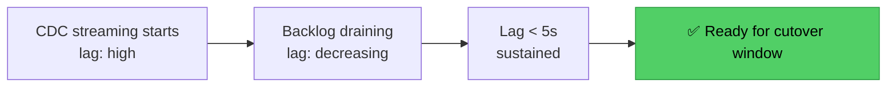
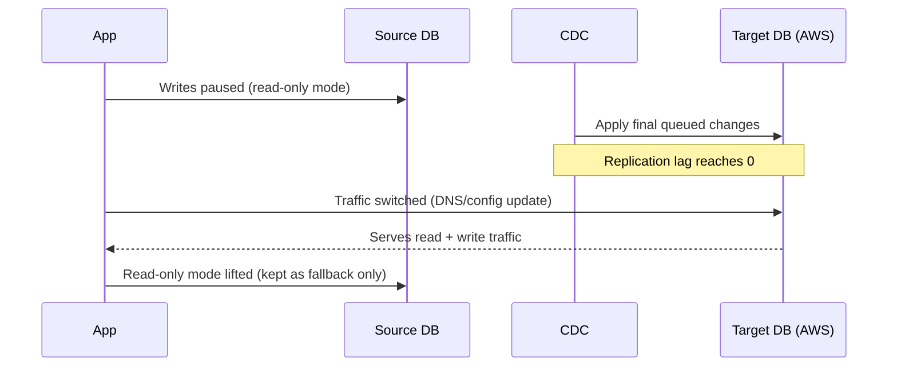
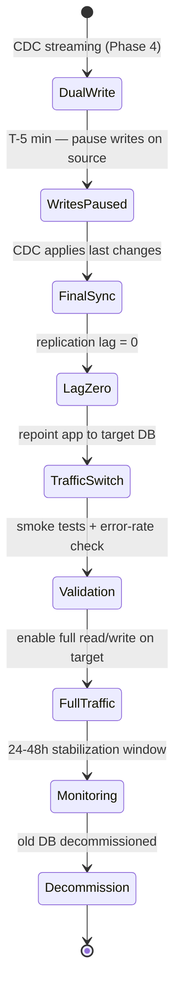

# Database Migration Strategy: From On-Premise to AWS
### Day 77 of 50 - System Design Interview Preparation Series

**By Sunchit Dudeja**

*A Senior Architect's Guide to Zero-Downtime Migration*

---

## 📑 Table of Contents

1. [Introduction: The Senior Staff Engineer Interview Question](#introduction-the-senior-staff-engineer-interview-question)
2. [The Big Picture: Migration Lifecycle](#the-big-picture-the-migration-lifecycle)
3. [Phase 1: Planning — The Architect's Foundation](#phase-1-planning--the-architects-foundation)
   - [1.1 Audit Current System](#11-audit-current-system)
   - [1.2 Define RPO and RTO](#12-define-rpo-and-rto)
   - [1.3 Choose Migration Strategy](#13-choose-the-migration-strategy)
   - [1.4 Design Target Architecture](#14-design-target-architecture)
   - [1.5 Plan Rollback Strategy](#15-plan-rollback-strategy)
   - [1.6 Set Up Monitoring](#16-set-up-monitoring)
4. [Phase 2: Infrastructure Setup](#phase-2-infrastructure-setup)
   - [2.1 Provision Target Environment](#21-provision-target-environment)
   - [2.2 Configure Networking & Security](#22-configure-networking--security)
   - [2.3 Validate Accessibility](#23-validate-accessibility)
5. [Phase 3: Full Data Sync](#phase-3-full-data-sync)
   - [3.1 Export Data (Snapshot)](#31-export-data-snapshot)
   - [3.2 Validate Data Integrity](#32-validate-data-integrity)
   - [3.3 The Problem: Changes During Snapshot](#33-the-problem-changes-during-snapshot)
6. [Phase 4: CDC Sync](#phase-4-cdc-sync)
   - [4.1 Enable Change Data Capture](#41-enable-change-data-capture)
   - [4.2 Monitor Replication Lag](#42-monitor-replication-lag)
7. [Phase 5: Cutover](#phase-5-cutover)
   - [5.1 The Cutover Sequence](#51-the-cutover-sequence)
   - [5.2 Step-by-Step Cutover](#52-step-by-step-cutover)
8. [The Complete Cutover Sequence Diagram](#the-complete-cutover-sequence-diagram)
9. [What Junior Developers Get Wrong (And Architects Get Right)](#what-junior-developers-get-wrong-and-architects-get-right)
10. [Quick Reference: Migration Checklist](#quick-reference-migration-checklist)
11. [The One-Sentence Architect's Takeaway](#the-one-sentence-architects-takeaway)

---

## Introduction: The Senior Staff Engineer Interview Question

*"It's a senior staff engineer interview, final round. You need to design the migration strategy for moving from on-premise to Amazon AWS. What answer are you going to give?"*

This is **the question** that separates a good developer from a senior architect. It's not about copying data — it's about **orchestrating a complex, zero-downtime operation** while managing risk, validating integrity, and protecting business continuity.

**The interviewer wants to see:**

| Skill | What They're Testing |
|---|---|
| System Thinking | Can you see the entire lifecycle, not just individual steps? |
| Risk Management | Do you plan for failures? Do you have a rollback strategy? |
| Technical Depth | Do you understand CDC, replication lag, and PITR? |
| Communication | Can you clearly explain a complex technical process? |
| Operational Excellence | Do you consider monitoring, validation, and post-migration optimization? |

> *"What are the steps involved? It's a must-know if you're a good developer."*

This walks through the complete migration strategy — the same one used in production for 1TB+ databases handling millions of transactions per day.

> **Companion reads:**
> - [Day 30 — Database Replication: AWS Architecture](./Day30_Database_Replication_AWS_Architecture.md) — the replica topology this migration's CDC stream depends on.
> - [Day 79 — Production Database Corruption: Incident Response](./Day79_Production_Database_Corruption_Incident_Response.md) — the rollback discipline (never delete the source early) comes from the same instincts.
> - [Day 61 — Hot vs Cold Standby, Failover, Cold Start](./Day61_Hot_vs_Cold_Standby_Failover_Cold_Start.md) — cutover is a controlled version of the same failover trade-off.

---

## The Big Picture: The Migration Lifecycle

```mermaid
flowchart TD
    subgraph Phase1["Phase 1: Planning"]
        A["1. Audit Current System"] --> B["2. Define RPO/RTO"]
        B --> C["3. Choose Migration Strategy"]
        C --> D["4. Design Target Architecture"]
        D --> E["5. Plan Rollback Strategy"]
        E --> F["6. Set Up Monitoring"]
    end

    subgraph Phase2["Phase 2: Infrastructure Setup"]
        G["7. Provision Target Environment"] --> H["8. Configure Networking & Security"]
        H --> I["9. Validate Accessibility"]
    end

    subgraph Phase3["Phase 3: Full Data Sync"]
        J["10. Export Data"] --> K["11. Import to Target"]
        K --> L["12. Validate Data Integrity"]
    end

    subgraph Phase4["Phase 4: CDC Sync"]
        M["13. Enable Change Data Capture"] --> N["14. Stream Changes"]
        N --> O["15. Monitor Replication Lag"]
    end

    subgraph Phase5["Phase 5: Cutover"]
        P["16. Pause Writes"] --> Q["17. Apply Last Changes"]
        Q --> R["18. Switch Traffic"]
        R --> S["19. New DB Live"]
        S --> T["20. Decommission Old DB"]
    end

    F --> G
    I --> J
    L --> M
    O --> P
    T --> U["✅ Migration Complete"]

    style P fill:#ff922b,color:#000,stroke:#e8590c
    style Q fill:#ff6b6b,color:#000,stroke:#c92a2a
    style R fill:#51cf66,color:#000,stroke:#2f9e44
    style S fill:#51cf66,color:#000,stroke:#2f9e44
    style U fill:#4dabf7,color:#000,stroke:#1971c2
```



Twenty steps, five phases — but the architecture underneath is one idea: **never rely on a single moment of "copy the data over." Sync continuously, validate constantly, and design the cutover so short that nobody outside the team notices it happened.**

---

## Phase 1: Planning — The Architect's Foundation

> *"The first phase is planning: audit the current system, define what needs to be done, decide who leads the project and how many people are involved, check legal formalities, create a migration strategy, design the target architecture, decide which database you're migrating to, and plan the rollback strategy."*

Planning is the most critical phase. A poorly planned migration is a disaster waiting to happen.

### 1.1 Audit Current System

| What to Audit | Why It Matters |
|---|---|
| Schema | Understand tables, relationships, indexes, constraints |
| Data volume | Estimate migration time and storage requirements |
| Access patterns | Identify critical queries that must perform well post-migration |
| Dependencies | Which applications/services rely on this database? |
| Downtime tolerance | What is the acceptable downtime window? |
| Compliance requirements | Legal and regulatory considerations |

*Example: a 1TB database with 500 tables and 100 microservice dependencies requires careful planning — a schema audit alone can surface dependencies nobody remembered existed.*

### 1.2 Define RPO and RTO

| Metric | Definition | Example |
|---|---|---|
| **RPO** (Recovery Point Objective) | How much data loss is acceptable? | 5 seconds — CDC keeps loss near-zero |
| **RTO** (Recovery Time Objective) | How long can the system be down? | 5 minutes — the cutover window |

> *"RPO and RTO are not technical decisions — they are business decisions."*

### 1.3 Choose the Migration Strategy

| Strategy | Downtime | Complexity | Risk | Best For |
|---|---|---|---|---|
| Big Bang | Hours | Low | High | Small systems, maintenance windows |
| CDC-Based Migration | Seconds | High | Low | Large databases, zero-downtime required |
| Blue-Green | Seconds | High | Low | Cloud-native applications |
| Expand-Contract | Seconds | Medium | Low | Schema evolution |
| Snapshot Restore | Hours | Medium | Medium | Non-production, test environments |

**The architect's choice:** for production systems, always use **CDC-based migration** with a gray-release cutover.

### 1.4 Design Target Architecture



**Key decisions:**

| Decision | Consideration | Recommendation |
|---|---|---|
| Database type | Workload characteristics | RDS/Aurora for relational, DynamoDB for NoSQL |
| Instance size | Current load + growth | Start at parity with source, scale up if needed |
| Multi-AZ | High availability | Always enable for production |
| Read replicas | Read-heavy workloads | Enable 1–2 replicas initially |
| Backup strategy | RPO requirements | Automated snapshots + PITR |

### 1.5 Plan Rollback Strategy

> *"Every migration must be reversible."*

**Rollback plan:**
- Keep the source database running throughout the migration.
- Never delete the source until the new system has been validated for 48 hours.
- Have a pre-tested rollback script ready.
- Test the rollback in a staging environment before you need it for real.

**If something goes wrong:**



### 1.6 Set Up Monitoring

| What to Monitor | How | Alert Threshold |
|---|---|---|
| Replication lag | CloudWatch / custom metrics | > 10 seconds |
| Apply rate | CDC tool metrics | < 100 ops/sec |
| Error count | Application logs, CDC logs | > 0 |
| Database performance | Query performance, CPU, memory, IOPS | CPU > 80% |
| Cutover progress | Custom dashboard | N/A |
| Data consistency | Checksum validation | Any mismatch |

---

## Phase 2: Infrastructure Setup

> *"Next is infrastructure setup: provision the target environment — could be AWS depending on your use case — configure networking and security (extremely important), and finally validate that the target is accessible from your current microservices."*

### 2.1 Provision Target Environment



**AWS example (Terraform):**

```hcl
resource "aws_db_instance" "target" {
  engine                        = "postgres"
  engine_version                 = "15.3"
  instance_class                 = "db.r6g.2xlarge"
  allocated_storage              = 2000
  storage_type                   = "gp3"
  storage_encrypted              = true
  multi_az                       = true
  backup_retention_period        = 30
  backup_window                  = "03:00-04:00"
  maintenance_window              = "sun:04:00-sun:05:00"
  skip_final_snapshot            = false
  deletion_protection            = true
  performance_insights_enabled   = true
  monitoring_interval             = 60

  tags = {
    Environment = "Production"
    Project     = "DatabaseMigration"
  }
}
```

### 2.2 Configure Networking & Security

| Security Aspect | Implementation | Why It Matters |
|---|---|---|
| Network isolation | VPC with private subnets, no public access | Prevents external attacks |
| Encryption in transit | TLS/SSL for all connections | Protects data during transfer |
| Encryption at rest | AWS KMS | Complies with security policies |
| Access control | IAM roles, security groups, least privilege | Limits blast radius |
| Audit logging | CloudTrail, VPC Flow Logs | Enables forensic analysis |
| Secrets management | AWS Secrets Manager | Secure credential storage |

### 2.3 Validate Accessibility

```bash
# Test connectivity from application servers
psql -h target-db.aws.com -U read_only_user -d test_db -c "SELECT 1"

# Test application connection
curl -X GET http://app-server/health/db

# Test read replica connectivity
psql -h replica-db.aws.com -U read_only_user -d test_db -c "SELECT 1"
```

**Validation checklist:**
- [ ] Application can connect to the target database
- [ ] Security groups allow the correct traffic
- [ ] Read replicas are accessible
- [ ] Backup snapshots can be created
- [ ] Monitoring agents are reporting metrics
- [ ] IAM roles have correct permissions
- [ ] Secrets Manager has correct credentials

---

## Phase 3: Full Data Sync

> *"Next is full data sync — export the data from your current tables and import it into the target, taking a snapshot of the existing data before migration, and finally validate the integrity: everything that existed at snapshot time actually made it onto the target."*

### 3.1 Export Data (Snapshot)



| Tool | Best For | Size Limit | Speed |
|---|---|---|---|
| `pg_dump` (PostgreSQL) | Small-to-medium databases | Up to ~100GB | Medium |
| `mysqldump` (MySQL) | Small-to-medium databases | Up to ~100GB | Medium |
| AWS DMS | Large databases, heterogeneous migrations | No practical limit | High |
| Custom export script | Special requirements | No practical limit | Varies |
| Snapshot + restore | Large databases (cloud-native) | No practical limit | High |

**Example — PostgreSQL export:**

```bash
# Export schema and data
pg_dump -h source-db -U postgres -F d -j 8 -f /export/ database_name

# Compress for transfer
tar -czf database_export.tar.gz /export/

# Transfer to AWS
aws s3 cp database_export.tar.gz s3://migration-bucket/

# Import on target
pg_restore -h target-db -U postgres -d database_name -j 8 /export/
```

### 3.2 Validate Data Integrity

| Method | What It Checks | Accuracy | Complexity |
|---|---|---|---|
| Row count | Number of rows per table | Basic | Low |
| Checksum | Aggregate checksum of all data | High | Medium |
| Sample data | Spot-check random rows | Medium | Low |
| Application smoke test | Functional validation | Highest | High |
| Schema comparison | Table structure, indexes, constraints | High | Medium |

```sql
-- Row count validation
SELECT 'source', COUNT(*) FROM source_table
UNION ALL
SELECT 'target', COUNT(*) FROM target_table;

-- Checksum validation
SELECT MD5(STRING_AGG(column1 || '|' || column2, ''))
FROM (SELECT * FROM source_table ORDER BY primary_key) AS s;
```

### 3.3 The Problem: Changes During Snapshot

> *"From the moment you took the snapshot of the source DB, something has continued to happen there. What do you do?"*

**The solution: Change Data Capture (CDC).** The snapshot is a photograph; production doesn't stop moving the moment the shutter clicks. Everything that changes after `T0` has to be streamed forward, not re-copied.

---

## Phase 4: CDC Sync

> *"You pass those changes to the target DB using CDC — Change Data Capture — which continuously streams ongoing changes onto the target, while you monitor replication lag until it reaches zero."*

### 4.1 Enable Change Data Capture

| Tool | Best For | Setup Complexity | Cost | Replication Lag |
|---|---|---|---|---|
| Debezium | PostgreSQL, MySQL, MongoDB | High | Open-source | < 1 second |
| AWS DMS | Cloud-native, homogeneous migrations | Medium | Pay-as-you-go | < 5 seconds |
| Striim | Enterprise, streaming data | High | Commercial | < 1 second |
| Custom triggers | Simple, low-volume systems | Low | Open-source | < 1 second |
| GoldenGate | Oracle, enterprise | High | Commercial | < 1 second |

**Example — Debezium configuration:**

```json
{
  "name": "migration-connector",
  "config": {
    "connector.class": "io.debezium.connector.postgresql.PostgresConnector",
    "database.hostname": "source-db",
    "database.port": "5432",
    "database.user": "debezium",
    "database.password": "password",
    "database.dbname": "mydb",
    "plugin.name": "pgoutput",
    "table.include.list": "public.*",
    "tombstones.on.delete": "false",
    "slot.name": "migration_slot",
    "heartbeat.interval.ms": "1000",
    "max.queue.size": "10000",
    "batch.size": "1000"
  }
}
```

### 4.2 Monitor Replication Lag



```sql
-- PostgreSQL: check replication lag
SELECT
    pid,
    application_name,
    client_addr,
    state,
    pg_wal_lsn_diff(pg_current_wal_lsn(), sent_lsn) AS send_lag,
    pg_wal_lsn_diff(pg_current_wal_lsn(), write_lsn) AS write_lag,
    pg_wal_lsn_diff(pg_current_wal_lsn(), flush_lsn) AS flush_lag,
    pg_wal_lsn_diff(pg_current_wal_lsn(), replay_lsn) AS replay_lag
FROM pg_stat_replication;

-- AWS DMS: check the ReplicationLag metric in CloudWatch — should stay < 5 seconds
```

**The goal:** wait until replication lag is *consistently* near zero (0–5 seconds, sustained — not a one-time dip) before planning the cutover.

---

## Phase 5: Cutover

> *"Plan for the cutover phase: pause writes on the source DB, apply the latest changes, switch traffic to the new DB, bring your microservices to life against it, and finally decommission the old DB. Your migration is done."*

### 5.1 The Cutover Sequence



### 5.2 Step-by-Step Cutover

**Step 1: Pause writes (5 minutes before cutover)**

```bash
# Make source database read-only
ALTER DATABASE mydb SET default_transaction_read_only = ON;

# Or at the application level:
# - Put app in maintenance mode
# - Redirect all writes to a queue
# - Stop all scheduled jobs
# - Disable application write endpoints
```

**Step 2: Apply last changes**

```sql
-- CDC applies the final batch of changes.
-- Monitor final lag until it reaches zero:
SELECT pg_wal_lsn_diff(pg_current_wal_lsn(),
       COALESCE(replay_lsn, '0/0')) AS lag_bytes
FROM pg_stat_replication;

-- When lag = 0, stop CDC (stop the Debezium connector or pause DMS replication)
```

**Step 3: Switch traffic**

```yaml
# Update application connection string, e.g.:
# - Option 1: Update DNS record (TTL should already be low)
# - Option 2: Update RDS Proxy target group
# - Option 3: Update application environment variables
# - Option 4: Update Kubernetes ConfigMap

# After the update:
# - Flush DNS caches
# - Rolling-restart application instances, or
# - Update environment variables with a restart
```

**Step 4: New DB live**

```bash
# Validate the new database is working:
# - Run smoke tests
# - Check application logs
# - Monitor error rates
# - Check query performance

# Then restore full write traffic:
# - Remove read-only mode from source
# - Scale application back up
# - Enable all endpoints
# - Resume scheduled jobs
```

**Step 5: Decommission the old DB**

```bash
# Wait 24-48 hours, monitoring app and DB metrics, confirming no issues.

# Then decommission:
# - Take a final backup of the old DB
# - Create a final snapshot
# - Shut down the old database
# - Archive logs (if required)
# - Remove from monitoring
# - Update documentation
```

---

## The Complete Cutover Sequence Diagram



The entire cutover — the only part of the migration where the system is genuinely fragile — is designed to fit inside a 5–15 minute window. Everything before it (Phases 1–4) exists to make that window as boring as possible.

---

## What Junior Developers Get Wrong (And Architects Get Right)

| Mistake | Architect's Correction |
|---|---|
| "We'll just take a backup and restore it." | That's a backup restore, not a migration — migration requires continuous sync and zero-downtime planning. |
| "We don't need CDC — we'll stop writes for the migration." | That's downtime. For production systems, zero-downtime is the requirement, not a nice-to-have. |
| "We'll skip the validation step." | Validation is mandatory — undetected data integrity issues break the application later, at a worse time. |
| "We'll cutover as soon as lag hits zero." | Wait for *consistent* zero lag over a sustained window — the first zero reading can be a momentary blip, not a steady state. |
| "We'll decommission the old DB right after cutover." | Never decommission immediately — keep the old DB as a fallback for 48 hours. |
| "We don't need a rollback strategy." | A migration without a rollback plan is a gamble, not an engineering decision. |
| "CDC is easy — we'll set it up in an hour." | CDC is complex — budget at least 2–3 days for setup and testing. |
| "We'll just use the default AWS settings." | Defaults may not meet your requirements — tune instance size, storage, and backups for your actual workload. |
| "The migration is done once traffic is switched." | The migration is done only after 48 hours of stable operation on the new system. |

---

## Quick Reference: Migration Checklist

**Pre-Migration (weeks before)**
- [ ] Audit current system (schema, volume, dependencies)
- [ ] Define RPO and RTO
- [ ] Choose migration strategy
- [ ] Design target architecture
- [ ] Plan rollback strategy (test it in staging!)
- [ ] Set up monitoring
- [ ] Run a full dry-run migration in staging
- [ ] Prepare a communication plan for stakeholders
- [ ] Secure budget and resources

**During Migration (day of)**
- [ ] Provision target environment
- [ ] Configure network & security
- [ ] Validate accessibility
- [ ] Full data sync (snapshot + import)
- [ ] Validate data integrity
- [ ] Enable CDC
- [ ] Monitor replication lag
- [ ] Wait for lag to reach zero consistently
- [ ] Schedule the cutover window with the team

**Cutover (5–15 minutes)**
- [ ] Pause writes on source
- [ ] Apply last changes (CDC catches up)
- [ ] Switch traffic to target
- [ ] Validate application functionality
- [ ] Monitor error rates
- [ ] Enable full writes

**Post-Migration (48 hours)**
- [ ] Keep old DB running as fallback
- [ ] Monitor performance (compare to baseline)
- [ ] Optimize slow queries
- [ ] Update documentation
- [ ] Run full smoke tests
- [ ] Decommission the old DB

---

## The One-Sentence Architect's Takeaway

> *"A successful database migration isn't about moving data — it's about orchestrating a zero-downtime operation with CDC, continuous validation, and a fail-safe rollback plan, so that when the switch happens, no user feels a thing."*

---

*Happy Learning!* 🎉

> *"A developer moves the data. An architect makes sure nobody notices it moved."*
