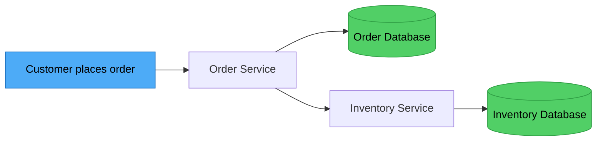
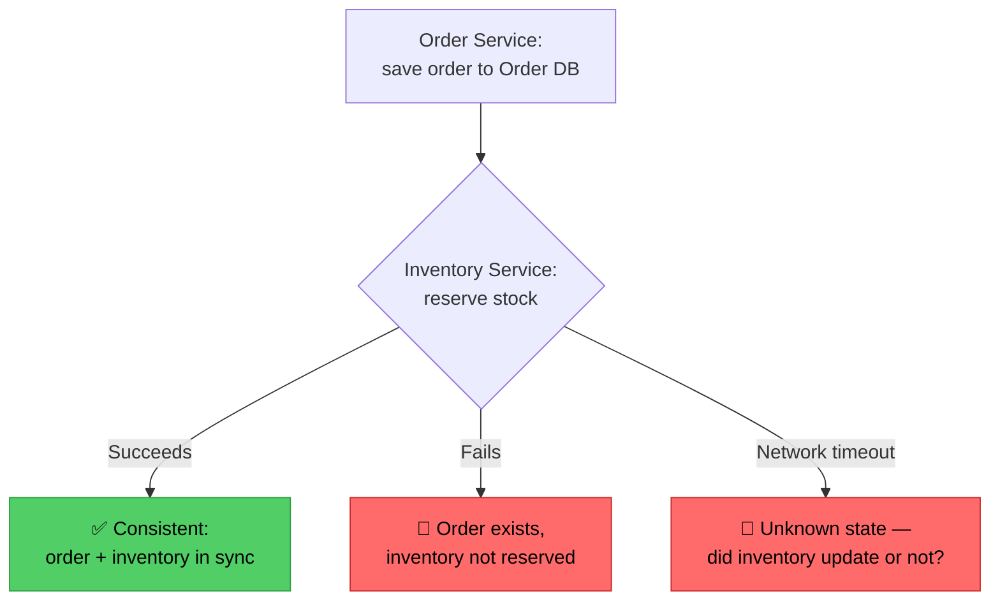
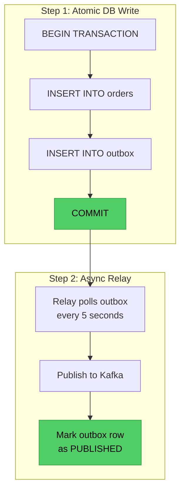
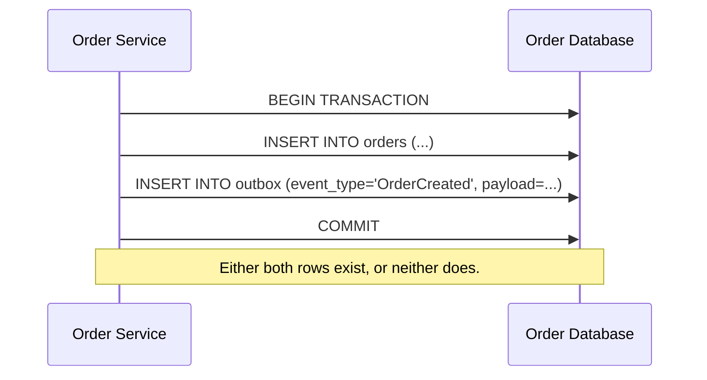
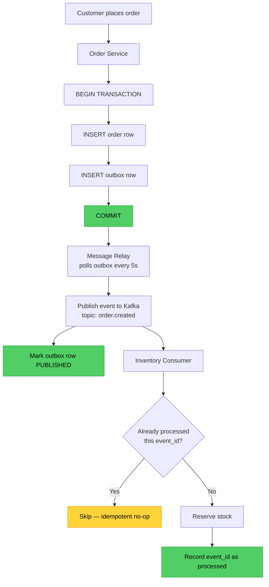
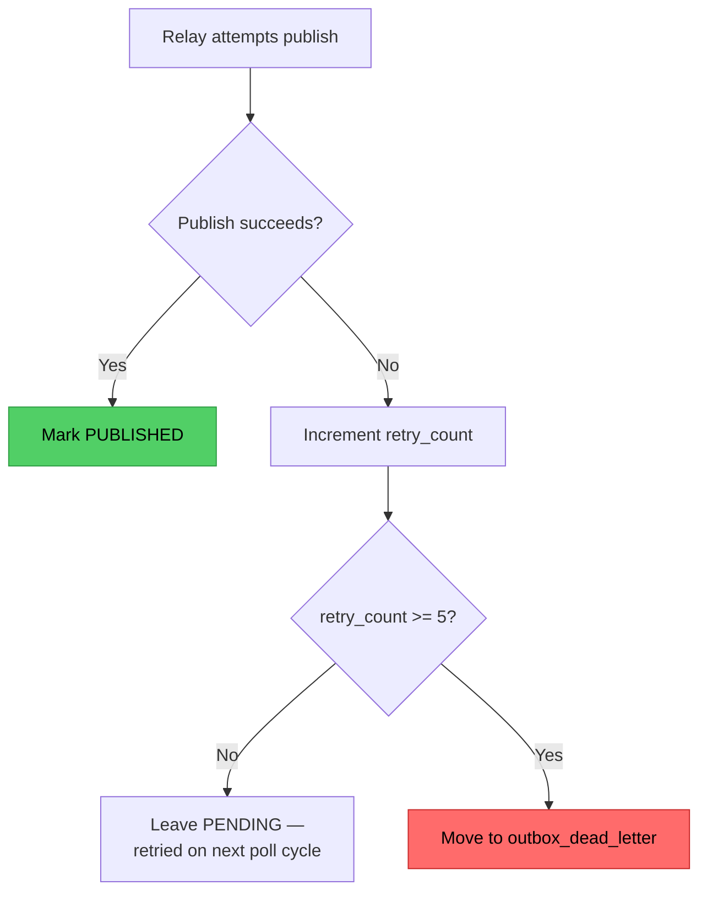
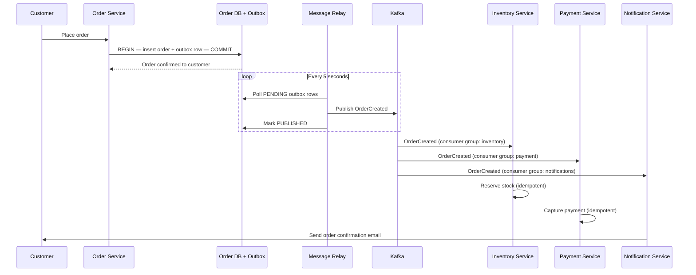

# The Outbox Pattern: Solving the Dual-Write Problem
### Day 78 of 50 - System Design Interview Preparation Series

**By Sunchit Dudeja**

*A Senior Architect's Guide to Reliable Event Publishing in Microservices*

---

## 📑 Table of Contents

1. [Introduction: The E-Commerce Order Problem](#introduction-the-e-commerce-order-problem)
2. [The Core Problem: Dual-Write Without Atomicity](#the-core-problem-dual-write-without-atomicity)
3. [The Solution: The Outbox Pattern](#the-solution-the-outbox-pattern)
4. [How the Outbox Pattern Works](#how-the-outbox-pattern-works)
5. [The Complete Workflow Diagram](#the-complete-workflow-diagram)
6. [Implementation Walkthrough](#implementation-walkthrough)
   - [Step 1: The Outbox Table Schema](#step-1-the-outbox-table-schema)
   - [Step 2: Writing to the Outbox (Atomic Transaction)](#step-2-writing-to-the-outbox-atomic-transaction)
   - [Step 3: The Message Relay (Kafka Consumer)](#step-3-the-message-relay-kafka-consumer)
   - [Step 4: Inventory Service Processing](#step-4-inventory-service-processing)
7. [Failure Handling & Retry Logic](#failure-handling--retry-logic)
8. [What Junior Developers Get Wrong (And Architects Get Right)](#what-junior-developers-get-wrong-and-architects-get-right)
9. [The Outbox Pattern vs Other Solutions](#the-outbox-pattern-vs-other-solutions)
10. [Real-World Example: Amazon Order Flow](#real-world-example-amazon-order-flow)
11. [Quick Reference: Implementation Checklist](#quick-reference-implementation-checklist)
12. [The One-Sentence Architect's Takeaway](#the-one-sentence-architects-takeaway)

---

## Introduction: The E-Commerce Order Problem

*"This question was asked in a Senior Staff Engineer System Design interview. You own an e-commerce website like Amazon, where customers regularly place orders. As soon as the order is placed, the call goes from your web client or mobile app to the order service. Inside the order service, the database gets updated with the order details, and the next call in that workflow goes to the inventory service."*



**The problem:** *"What happens if the inventory service can't be updated with the information that the order has been placed? You definitely don't want to roll back the entire order because of it."*

> **Companion read:** [Day 39 — Outbox Pattern: Reliable Messaging Without Distributed Transactions](./Day39_Outbox_Pattern_Reliable_Messaging.md) covers the same mechanism from the "DB + broker" angle. This entry walks the identical pattern through a full interview scenario — order/inventory dual-write, a complete Kafka relay implementation, dead-letter handling, and idempotent consumers — so treat the two as a matched pair: Day 39 for the core mechanism, this one for the production-grade implementation.

---

## The Core Problem: Dual-Write Without Atomicity

*"The problem arises because you have to write in two places — one in the inventory service, the other in the order service. Since both have separate tables, you cannot achieve atomicity across these two writes at the same instant of time."*



| Scenario | What Happens | Business Impact |
|---|---|---|
| Order saved, inventory update fails | Order exists in DB, inventory not reserved | Customer sees the order, but items may be oversold |
| Inventory update succeeds, order fails | Inventory updated, order not saved | Items reserved but no order exists |
| Network timeout | Order saved, inventory may or may not be updated | Inconsistent state, hard to debug |

**The root cause:**
- **Two separate writes** — the Order DB and Inventory DB are different databases.
- **No distributed transaction** — ACID transactions don't span services.
- **No rollback mechanism** — you can't cleanly revert the order if the inventory update fails.

> *"Since both have separate tables, you cannot achieve atomicity across these two writes at the same instant of time."*

---

## The Solution: The Outbox Pattern

*"To solve this, you use a technique called the outbox pattern, where along with writing the order to the orders table, you also insert the same event into an outbox table — in a single transaction."*

**What is the Outbox Pattern?** The Transactional Outbox Pattern solves the dual-write problem by turning two writes into one: the business row and the "intent to publish an event" row are written to the **same database, in the same transaction**.



**The core insight:** *"The database becomes the single source of truth. If the transaction commits, both the order and the event are persisted. If it rolls back, neither is saved."*

### Key Components

| Component | Responsibility |
|---|---|
| Sender service (Order Service) | Writes business data **and** the outbox event in the same DB transaction |
| Outbox table | Database table storing events waiting to be sent |
| Message relay | Reads events from the outbox and publishes them to the message broker (Kafka) |
| Message broker | Distributes events to downstream services |

---

## How the Outbox Pattern Works

*"The outbox table also has a column signifying whether the post-processing on it has been done or not."*

```sql
CREATE TABLE outbox (
    id UUID PRIMARY KEY,
    aggregate_type VARCHAR(255) NOT NULL,
    aggregate_id VARCHAR(255) NOT NULL,
    event_type VARCHAR(255) NOT NULL,
    payload JSONB NOT NULL,
    created_at TIMESTAMP NOT NULL DEFAULT NOW(),
    published_at TIMESTAMP,
    retry_count INT DEFAULT 0,
    status VARCHAR(50) DEFAULT 'PENDING'
);

-- Index for efficient polling
CREATE INDEX idx_outbox_published ON outbox(published_at)
    WHERE published_at IS NULL;
```

| Field | Purpose |
|---|---|
| `id` | Unique event identifier |
| `aggregate_type` | Which business entity (Order, User, Product) |
| `aggregate_id` | Specific entity ID |
| `event_type` | Type of event (`OrderCreated`, `OrderUpdated`) |
| `payload` | Actual event data (JSON) |
| `published_at` | `NULL` = not yet published, timestamp = published |
| `retry_count` | Number of delivery attempts |
| `status` | `PENDING` / `PUBLISHED` / `FAILED` |

**The atomic write** — both inserts below live inside one transaction boundary, so the database's own atomicity guarantee is doing all the work that a distributed transaction would otherwise have to fake:



**The message relay:** *"You bring in a synchronization process using Kafka, responsible for reading messages from the outbox table every five seconds, processing them, and finally pushing the information to inventory."*

---

## The Complete Workflow Diagram



---

## Implementation Walkthrough

### Step 1: The Outbox Table Schema

```sql
CREATE TABLE outbox (
    id UUID PRIMARY KEY DEFAULT gen_random_uuid(),
    aggregate_type VARCHAR(255) NOT NULL,
    aggregate_id VARCHAR(255) NOT NULL,
    event_type VARCHAR(255) NOT NULL,
    payload JSONB NOT NULL,
    created_at TIMESTAMP NOT NULL DEFAULT NOW(),
    published_at TIMESTAMP,
    retry_count INT DEFAULT 0,
    last_error TEXT,
    status VARCHAR(50) DEFAULT 'PENDING',
    partition_key VARCHAR(255) DEFAULT NULL
);

-- Indexes for performance
CREATE INDEX idx_outbox_published ON outbox(published_at)
    WHERE published_at IS NULL AND status = 'PENDING';

CREATE INDEX idx_outbox_retry ON outbox(retry_count, created_at)
    WHERE published_at IS NULL AND status = 'PENDING';

-- Dead-letter queue table
CREATE TABLE outbox_dead_letter (
    LIKE outbox INCLUDING ALL,
    moved_at TIMESTAMP DEFAULT NOW(),
    error_message TEXT
);
```

### Step 2: Writing to the Outbox (Atomic Transaction)

```java
@Service
@Transactional
public class OrderService {

    @Autowired
    private OrderRepository orderRepository;

    @Autowired
    private OutboxRepository outboxRepository;

    public Order placeOrder(OrderRequest request) {
        // 1. Create order object
        Order order = new Order();
        order.setCustomerId(request.getCustomerId());
        order.setTotal(request.getTotal());
        order.setItems(request.getItems());
        order.setStatus(OrderStatus.PENDING);

        // 2. Save order and outbox event in the SAME transaction
        Order savedOrder = orderRepository.save(order);

        // 3. Create outbox event
        OutboxEvent event = OutboxEvent.builder()
            .id(UUID.randomUUID())
            .aggregateType("Order")
            .aggregateId(savedOrder.getId().toString())
            .eventType("OrderCreated")
            .payload(JsonUtils.toJson(savedOrder))
            .status(OutboxStatus.PENDING)
            .build();

        outboxRepository.save(event);

        // 4. Transaction commits automatically —
        //    both order AND event are persisted atomically.
        return savedOrder;
    }
}
```

**Why this works:** both `orderRepository.save()` and `outboxRepository.save()` sit inside the same `@Transactional` boundary. If either fails, the entire transaction rolls back — the database guarantees atomicity, no distributed transaction protocol required.

### Step 3: The Message Relay (Kafka Consumer)

```java
@Component
public class OutboxRelay {

    @Autowired
    private OutboxRepository outboxRepository;

    @Autowired
    private KafkaTemplate<String, String> kafkaTemplate;

    @Scheduled(fixedDelay = 5000) // Every 5 seconds
    @Transactional
    public void processOutbox() {
        // Fetch pending events (limit to 100 to avoid overwhelming the broker)
        List<OutboxEvent> events = outboxRepository
            .findTop100ByStatusOrderByCreatedAtAsc(OutboxStatus.PENDING);

        for (OutboxEvent event : events) {
            try {
                kafkaTemplate.send(
                    "order.created",
                    event.getAggregateId(),
                    event.getPayload()
                );

                event.setPublishedAt(Instant.now());
                event.setStatus(OutboxStatus.PUBLISHED);
                outboxRepository.save(event);

            } catch (Exception e) {
                event.setRetryCount(event.getRetryCount() + 1);
                event.setLastError(e.getMessage());

                if (event.getRetryCount() >= 5) {
                    outboxRepository.moveToDeadLetter(event);
                } else {
                    outboxRepository.save(event);
                }
            }
        }
    }
}
```

### Step 4: Inventory Service Processing

```java
@Service
public class InventoryConsumer {

    @Autowired
    private InventoryService inventoryService;

    @KafkaListener(topics = "order.created", groupId = "inventory-group")
    public void processOrderCreated(ConsumerRecord<String, String> record) {
        String payload = record.value();
        Order order = JsonUtils.fromJson(payload, Order.class);

        try {
            for (OrderItem item : order.getItems()) {
                inventoryService.reserveStock(item.getProductId(), item.getQuantity());
            }
            // ✅ Success — commit offset
        } catch (InsufficientStockException e) {
            // Order cannot be fulfilled — could emit a compensating event
        } catch (Exception e) {
            // Retry later — Kafka will redeliver based on the consumer's retry policy
        }
    }
}
```

---

## Failure Handling & Retry Logic

**What happens when the relay fails to publish?**



### Retry Strategy

| Retry Count | Delay | Strategy |
|---|---|---|
| 1 | Immediate | Try again immediately |
| 2 | 5 seconds | Wait for next poll cycle |
| 3 | 5 seconds | Wait for next poll cycle |
| 4 | 5 seconds | Wait for next poll cycle |
| 5+ | — | Move to Dead-Letter Queue |

### Handling Duplicate Events

The outbox pattern gives you **at-least-once delivery** — never exactly-once. Consumers must be idempotent:

```java
@Service
public class IdempotentInventoryConsumer {

    @Autowired
    private ProcessedEventRepository processedRepository;

    @Autowired
    private InventoryService inventoryService;

    @KafkaListener(topics = "order.created")
    public void process(ConsumerRecord<String, String> record) {
        String eventId = record.headers().lastHeader("event_id").value();

        if (processedRepository.existsById(eventId)) {
            log.info("Event {} already processed, skipping...", eventId);
            return;
        }

        Order order = JsonUtils.fromJson(record.value(), Order.class);
        inventoryService.reserveStock(order);

        processedRepository.save(new ProcessedEvent(eventId, Instant.now()));
    }
}
```

---

## What Junior Developers Get Wrong (And Architects Get Right)

| Mistake | Architect's Correction |
|---|---|
| "We'll just use a distributed transaction (2PC) for both writes." | 2PC is blocking, complex, and often unsupported by message brokers. |
| "We'll call the inventory service synchronously from the order service." | Synchronous calls create tight coupling and failure propagation. |
| "We'll just use a try-catch and retry the inventory call." | Without the outbox, you risk losing the event entirely if the service crashes mid-retry. |
| "We don't need idempotency — outbox guarantees exactly-once." | Outbox guarantees **at-least-once**, not exactly-once. Consumers must handle duplicates. |
| "We'll poll the outbox every 100ms for low latency." | Aggressive polling can overload the database — use CDC instead if you need low latency. |
| "We'll just delete events immediately after publishing." | If the consumer fails right after, you've lost the event — mark as published first, delete later. |
| "We don't need a dead-letter queue." | Without a DLQ, failed events are retried forever or silently lost. |
| "Outbox and Event Sourcing are the same thing." | Outbox is about reliable *delivery*; Event Sourcing is about reliable *storage*. |
| "We'll use the same outbox table for all services." | Bad idea — different services have different throughput and retention requirements. |

---

## The Outbox Pattern vs Other Solutions

| Solution | Pros | Cons | Use Case |
|---|---|---|---|
| Synchronous RPC | Simple, immediate feedback | Tight coupling, failure propagation, temporal coupling | Simple CRUD, low scale |
| 2PC (Two-Phase Commit) | Strong consistency | Blocking, complex, not widely supported | Legacy systems, high-consistency requirements |
| Saga Pattern | Compensating transactions | Complex, requires compensation logic | Long-running workflows |
| **Outbox Pattern** | Reliable, decoupled, testable | Extra table, polling/CDC overhead | Event-driven microservices |
| Event Sourcing | Complete audit trail, replayable | High storage, complex query model | Financial systems, complex workflows |

---

## Real-World Example: Amazon Order Flow



The customer gets an instant response the moment the order and its outbox row commit — everything downstream (inventory, payment, notifications) fans out independently off the same Kafka event, each consumer idempotent enough to survive redelivery.

---

## Quick Reference: Implementation Checklist

**Database Setup**
- [ ] Create outbox table with appropriate fields
- [ ] Add indexes for `published_at`, `status`, `retry_count`
- [ ] Create a dead-letter queue table
- [ ] Configure a retention policy for old events

**Application Code**
- [ ] Ensure the same transaction covers business data and the outbox event
- [ ] Implement the message relay (polling or CDC)
- [ ] Implement retry logic with backoff
- [ ] Implement dead-letter queue logic
- [ ] Add monitoring for outbox size and retry counts

**Consumer Side**
- [ ] Implement idempotency (process each event exactly once, logically)
- [ ] Handle processing failures gracefully
- [ ] Implement retry logic on the consumer side
- [ ] Monitor consumer lag

**Monitoring & Alerts**
- [ ] Alert when the outbox table grows past a threshold
- [ ] Alert when `retry_count` exceeds a threshold
- [ ] Alert when the dead-letter queue has items
- [ ] Monitor replication lag (if using CDC instead of polling)

---

## The One-Sentence Architect's Takeaway

> *"The Outbox Pattern solves the dual-write problem by storing events in an outbox table within the same database transaction as the business data, then using a separate relay process to publish them to Kafka — transforming an unreliable two-write problem into a reliable single-write problem with at-least-once delivery and built-in retry logic."*

---

*Happy Learning!* 🎉

> *"A developer writes to two places and hopes. An architect writes to one place and lets the relay do the hoping-free part."*
