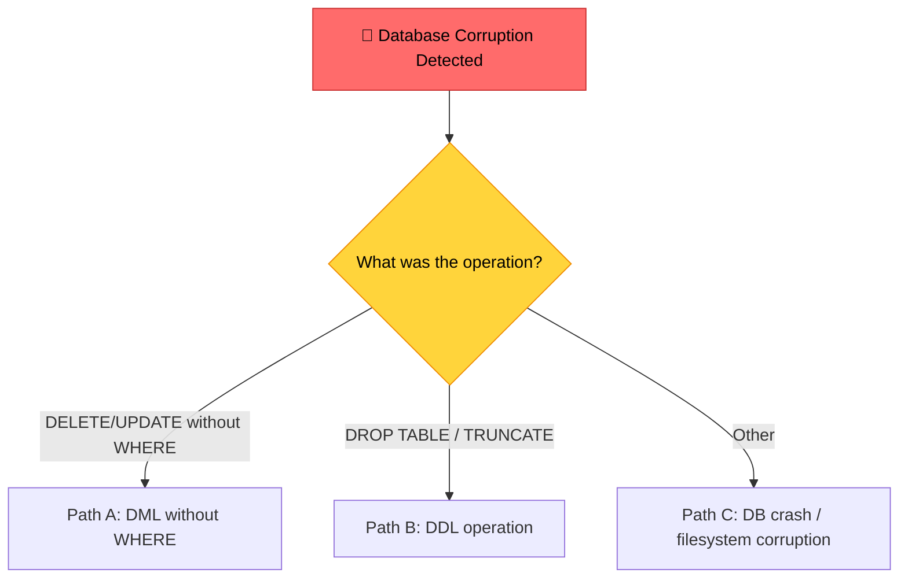
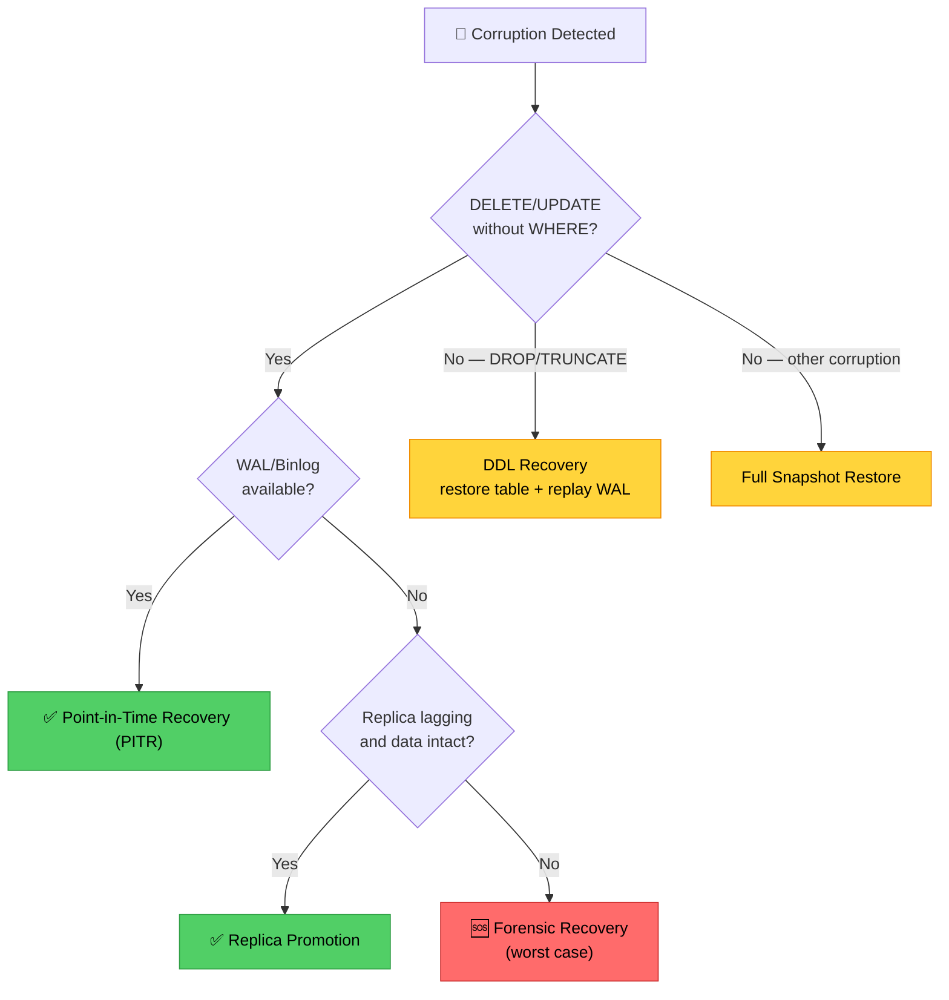
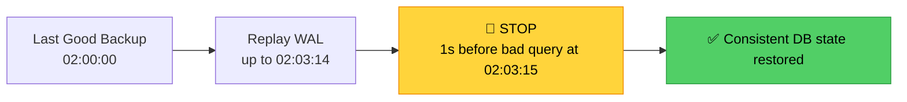
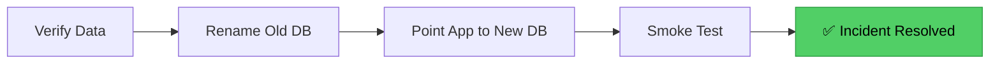
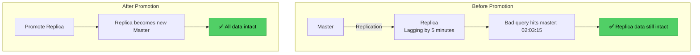
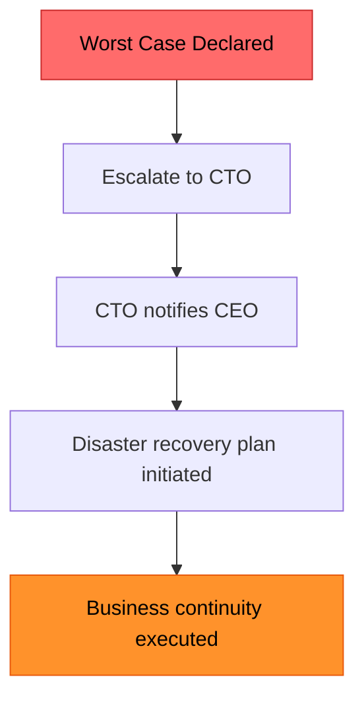
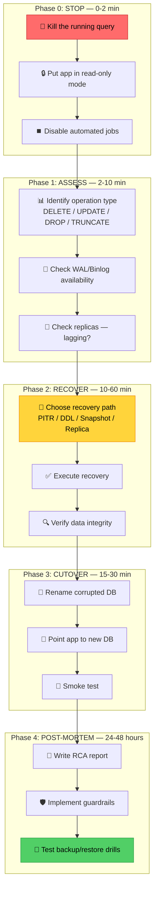
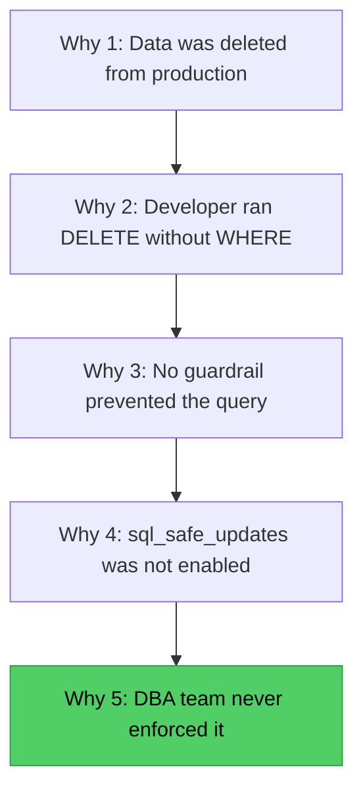
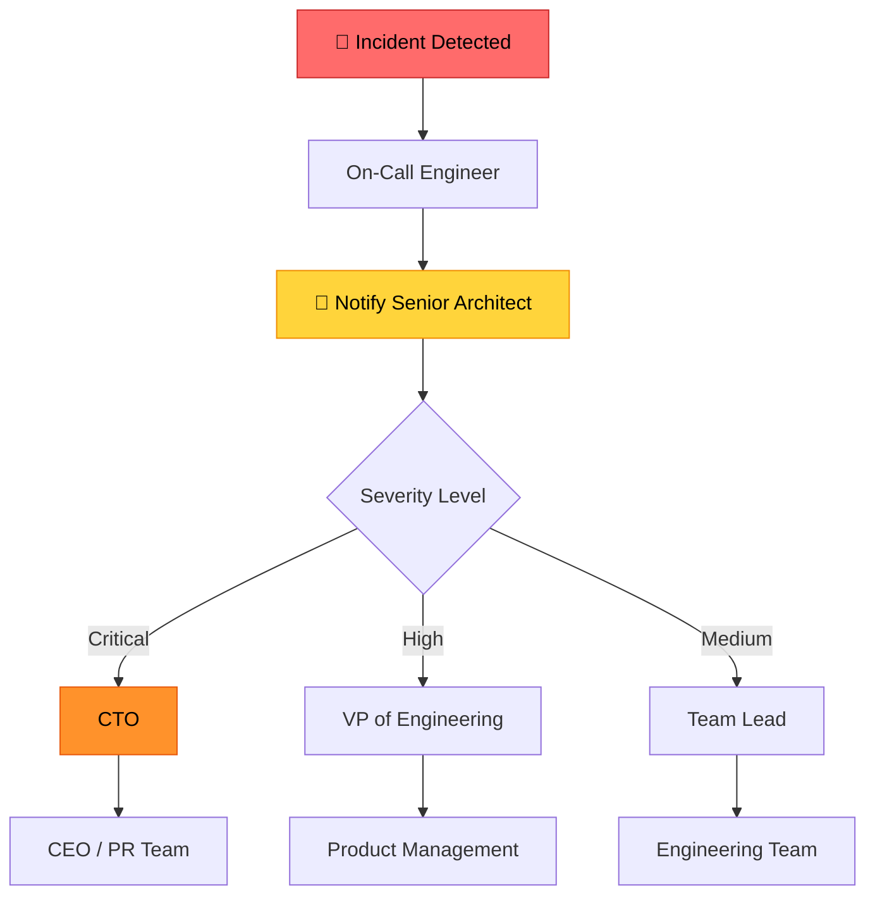

# Production Database Corruption: The Architect's Incident Response Playbook
### Day 79 of 50 - System Design Interview Preparation Series

**By Sunchit Dudeja**

*A Senior Architect's Guide to Database Disaster Recovery*

---

## 📑 Table of Contents

1. [Introduction: The 2 AM Nightmare Call](#introduction-the-2-am-nightmare-call)
2. [The Architect's First Question — Assess the Damage](#the-architects-first-question--assess-the-damage)
3. [The Decision Tree: Choosing Your Recovery Path](#the-decision-tree-choosing-your-recovery-path)
4. [Recovery Path 1: Point-in-Time Recovery (PITR)](#recovery-path-1-point-in-time-recovery-pitr)
5. [Recovery Path 2: DDL Recovery (DROP/TRUNCATE)](#recovery-path-2-ddl-recovery-droptruncate)
6. [Recovery Path 3: Full Snapshot Restore](#recovery-path-3-full-snapshot-restore)
7. [Recovery Path 4: Replica Promotion](#recovery-path-4-replica-promotion)
8. [Recovery Path 5: Worst Case — Forensic Recovery](#recovery-path-5-worst-case--forensic-recovery)
9. [The Complete Incident Response Workflow](#the-complete-incident-response-workflow)
10. [What Junior Developers Get Wrong (And Architects Get Right)](#what-junior-developers-get-wrong-and-architects-get-right)
11. [The Post-Mortem: Preventing the Next Disaster](#the-post-mortem-preventing-the-next-disaster)
12. [Quick Reference: Incident Response Checklist](#quick-reference-incident-response-checklist)
13. [The Complete Recovery Decision Matrix](#the-complete-recovery-decision-matrix)
14. [The One-Sentence Architect's Takeaway](#the-one-sentence-architects-takeaway)

---

## Introduction: The 2 AM Nightmare Call

*"On production, the entire database got corrupted. A junior developer ran a query, very mistakenly. Database corruption has happened to production data. Now, as a senior architect, how do you approach this problem?"*

The phone rings at 2 AM. The voice on the other end is panicked:

*"Architect, we have a problem. Someone ran a query on production and... the data is gone. The entire users table. I don't know what to do."*

Your heart stops. Your career flashes before your eyes.

But you are a Senior Architect. You have prepared for this moment. You stay calm. You ask the right questions. You follow the decision tree.

> **Companion reads:**
> - [Day 30 — Database Replication: AWS Architecture](./Day30_Database_Replication_AWS_Architecture.md) — the replica topology that makes Replica Promotion possible in this playbook.
> - [Day 61 — Hot vs Cold Standby, Failover, Cold Start](./Day61_Hot_vs_Cold_Standby_Failover_Cold_Start.md) — the same "how much state can I afford to lose" trade-off, one layer up the stack.

---

## The Architect's First Question — Assess the Damage

> *"The first question you should ask is whether it was a DELETE or UPDATE without a WHERE clause."*

### Step 1: Identify the Type of Operation



| Operation Type | Example | Recovery Path |
|---|---|---|
| DELETE without WHERE | `DELETE FROM users;` | PITR (WAL/Binlog) |
| UPDATE without WHERE | `UPDATE users SET status = 'inactive';` | PITR (WAL/Binlog) |
| DROP TABLE | `DROP TABLE orders;` | DDL Recovery |
| TRUNCATE | `TRUNCATE products;` | DDL Recovery |
| Other corruption | Filesystem failure, DB crash | Full Snapshot Restore |

### Step 2: Check for WAL/Binlog

> *"If it was without a WHERE clause, there's a WAL — a write-ahead log — right there that gets created whenever any interaction with the DB happens. You check whether this WAL file is available or not."*

**What is WAL?** Write-Ahead Logging is the database's journal. Every change is recorded in the WAL *before* it's applied to the data files — which means the WAL remembers the database's history even after the DELETE has already run.

| Database | WAL/Binlog Name | How to Check |
|---|---|---|
| PostgreSQL | Write-Ahead Log (WAL) | `SELECT * FROM pg_stat_archiver;` |
| MySQL | Binary Log (Binlog) | `SHOW BINARY LOGS;` |
| SQL Server | Transaction Log | `DBCC SQLPERF(LOGSPACE);` |
| Oracle | Redo Log | `SELECT * FROM V$LOG;` |

- **WAL available** → proceed to **Point-in-Time Recovery (PITR)**.
- **WAL not available** → check for a lagging replica instead.

---

## The Decision Tree: Choosing Your Recovery Path



The whole tree collapses to one architect's habit: **never guess your recovery path — derive it from what evidence (WAL, replicas, snapshots) actually survived the incident.**

---

## Recovery Path 1: Point-in-Time Recovery (PITR)

> *"If a WAL file is available, you can do Point-in-Time Recovery — restore the database to the exact point before the bad query, then verify data integrity going forward."*

**What is PITR?** Point-in-Time Recovery replays the WAL from your last good backup up to (but not including) the moment the bad query ran — recovering everything except the mistake itself.



### Step-by-Step PITR Process

**Step 1: Identify the bad query's exact time**

```sql
-- PostgreSQL: check logs for the bad query
SELECT
    log_time,
    user_name,
    database_name,
    message
FROM pg_log
WHERE message LIKE '%DELETE FROM users%'
   OR message LIKE '%UPDATE users%'
ORDER BY log_time DESC;
```

```sql
-- MySQL: check the binlog for the bad query
SHOW BINLOG EVENTS IN 'binlog.000123'
WHERE event_type = 'Query'
  AND information LIKE '%DELETE%';
```

**Step 2: Restore from the last full backup**

```bash
# PostgreSQL — restore to a new instance
pg_restore -h target-db -U postgres -d database_name /backup/2026-07-20.dump

# MySQL — restore from a full backup
mysql -h target-db -u root -p database_name < /backup/2026-07-20.sql
```

**Step 3: Configure recovery to stop before the bad query**

```bash
# PostgreSQL — recovery.conf / recovery.signal
recovery_target_time = '2026-07-20 02:03:14'
recovery_target_action = 'pause'
```

```bash
# MySQL — replay binlogs only up to the cutoff
mysqlbinlog --stop-datetime="2026-07-20 02:03:14" binlog.000123 | mysql -u root -p
```

**Step 4: Verify data integrity**

```sql
-- Row counts
SELECT COUNT(*) FROM users;

-- Spot-check records
SELECT * FROM users ORDER BY id LIMIT 100;

-- Then run application smoke tests against critical queries
```

**Step 5: Cutover**



---

## Recovery Path 2: DDL Recovery (DROP/TRUNCATE)

> *"If it wasn't a DELETE or UPDATE without a WHERE clause, check: was it a DROP or TRUNCATE? If so, recover using DDL recovery — restore the table from backup."*

**Why DDL is different:** `DROP TABLE` and `TRUNCATE` are Data Definition Language operations — they don't just remove rows, they remove (or reset) the object itself, so PITR's row-level replay isn't enough on its own.

| Operation | Type | Recovery Method |
|---|---|---|
| DROP TABLE | DDL | Restore table from backup + replay WAL |
| TRUNCATE | DDL | Restore table from backup + replay WAL |
| DELETE | DML | PITR from WAL/Binlog |
| UPDATE | DML | PITR from WAL/Binlog |

### Step-by-Step DDL Recovery Process

**Step 1: Restore the dropped table**

```bash
# PostgreSQL — restore only the dropped table from backup
pg_restore -h target-db -U postgres -d database_name -t users /backup/2026-07-20.dump

# MySQL — restore only the dropped table
mysql -h target-db -u root -p database_name < /backup/users.sql
```

**Step 2: Replay WAL from backup time to just before the DROP**

```bash
# PostgreSQL — recover to the instant before the DROP
recovery_target_time = '2026-07-20 10:15:30'  # 1 second before DROP
```

**Step 3: Verify data integrity**

```sql
SELECT COUNT(*) FROM users;
SELECT * FROM users ORDER BY id LIMIT 100;
```

**Step 4: Cutover** — same rename → repoint → smoke-test flow as PITR above.

---

## Recovery Path 3: Full Snapshot Restore

> *"If it wasn't a DROP or DELETE without WHERE, do a full restore from the latest snapshot — the backup that's already automated and sitting there."*

### When to Use Full Snapshot Restore

| Scenario | Why Use Snapshot Restore |
|---|---|
| Database files corrupted | File-level corruption requires a full restore |
| Failed database upgrade | Roll back to the previous stable version |
| Disaster recovery | Complete system failure |
| PITR not available | No WAL/Binlog to perform point-in-time recovery |

### Step-by-Step Full Snapshot Restore

**Step 1: Identify the latest known-good snapshot**

```bash
# AWS RDS — list snapshots
aws rds describe-db-snapshots --db-instance-identifier mydb

# AWS RDS — restore to a new instance
aws rds restore-db-instance-from-db-snapshot \
    --db-instance-identifier mydb-restored \
    --db-snapshot-identifier mydb-snapshot-2026-07-20
```

**Step 2: Restore the snapshot**


**Step 3: Verify data integrity**

```sql
SELECT COUNT(*) FROM users;
SELECT COUNT(*) FROM orders;
SELECT COUNT(*) FROM products;
```

**Step 4: Cutover** — same rename → repoint → smoke-test flow as above.

---

## Recovery Path 4: Replica Promotion

> *"If a WAL file isn't available, check whether the system has a lagging replica. If the master is lagging behind, promote that replica to the new master and everything gets restored."*

**Why this works:** if a replica is lagging behind the master by even a few minutes, it may not have received the bad query yet. If its data is intact, promoting it makes it the new source of truth.



### Step-by-Step Replica Promotion

**Step 1: Check replica lag**

```sql
-- PostgreSQL — check replication lag
SELECT
    pg_wal_lsn_diff(pg_current_wal_lsn(), replay_lsn) AS lag_bytes,
    replay_lsn_time
FROM pg_stat_replication;
```

```sql
-- MySQL — check replication lag
SHOW SLAVE STATUS\G
-- look at Seconds_Behind_Master
```

**Step 2: Stop replication and promote**

```bash
# PostgreSQL — stop replication and promote
pg_ctl promote -D /var/lib/pgsql/data

# MySQL — stop the slave and reset it as an independent master
STOP SLAVE;
RESET SLAVE;
RESET MASTER;
```

**Step 3: Verify data integrity**

```sql
SELECT COUNT(*) FROM users;
-- compare against expected row counts
```

**Step 4: Point the application to the new master** — update DNS, the RDS Proxy target group, or the application config, whichever your topology uses.

---

## Recovery Path 5: Worst Case — Forensic Recovery

> *"If none of that applies, this is the worst-case scenario — you need forensic recovery."*

### When to Declare the Worst Case

| Condition | Why It's Worst Case |
|---|---|
| No WAL/Binlog | Cannot do PITR |
| No replicas | Cannot promote to recover data |
| No snapshots | No backup to restore from |
| Backups corrupted | Even the safety net is unusable |

### Forensic Recovery Steps

**Step 1: Stop all operations** — put the application in maintenance mode, stop all writes, disable automated jobs.

**Step 2: Attempt file-level recovery**

```bash
# Linux — attempt to recover deleted files
extundelete /dev/sda1 --restore-file /var/lib/postgresql/data/users.ctl

# Or use photorec for broader file carving
photorec /dev/sda1
```

**Step 3: Rebuild from application logs** — manual, slow, and the reason this path is a last resort: parse application logs and replay every transaction they recorded.

**Step 4: Trigger the business continuity plan**

| Action | Who |
|---|---|
| Declare disaster | CTO, CEO |
| Notify stakeholders | VP of Product, Customer Support |
| Restore from offline backups | DBA Team |
| Manual data re-entry | Business Operations |
| Customer communication | PR Team |

**Step 5: Escalate**



---

## The Complete Incident Response Workflow



---

## What Junior Developers Get Wrong (And Architects Get Right)

| Mistake | Architect's Correction |
|---|---|
| "We'll just restart the database and hope it fixes itself." | Restarting doesn't fix data corruption — follow the decision tree systematically. |
| "We don't need WAL — it's just overhead." | WAL is the only way to recover from human errors like `DELETE` without a `WHERE`. |
| "We can just restore from the latest backup." | Restoring from backup *without* PITR loses every change made since that backup. |
| "We'll promote the replica immediately." | Check whether the replica already has the bad query — promoting it blindly replicates the corruption. |
| "We don't need a rollback plan." | A migration or incident response without a rollback plan is a gamble, not an engineering decision. |
| "We'll just restore the table and it'll be fine." | Restoring a table from backup still requires replaying WAL to catch it up to the incident time. |
| "We don't need to test our backups." | Test backups quarterly — an untested backup is a guess, not a safety net. |
| "The incident is resolved once traffic is switched." | The incident is resolved only after the post-mortem and prevention measures are implemented. |

---

## The Post-Mortem: Preventing the Next Disaster

### What Happened?

| Question | Answer |
|---|---|
| What was the operation? | `DELETE FROM users` without a `WHERE` clause |
| When did it happen? | 2026-07-20 02:03:15 |
| Who ran it? | Junior developer, direct production console |
| Why did it happen? | No guardrails, no review process |

### Why Did It Happen?

| Root Cause | Analysis |
|---|---|
| No `sql_safe_updates` | Would have blocked `DELETE`/`UPDATE` without a `WHERE` or `LIMIT` |
| No read-only users | The developer had write access in production |
| No automated backups review | No tested recovery plan for exactly this class of human error |

### How Was It Fixed?

| Recovery Step | Time |
|---|---|
| PITR | 15 minutes |
| Data integrity verification | 5 minutes |
| Cutover | 5 minutes |
| **Total user-facing downtime** | **0 — read replicas absorbed traffic during recovery** |

### How Do We Prevent It?

| Prevention Measure | Why It Matters |
|---|---|
| `sql_safe_updates=1` | Prevents `UPDATE`/`DELETE` without a `WHERE` or `LIMIT` |
| Read-only users for non-DBAs | No writes possible from a read-only account, by construction |
| Manual SQL review process | No production queries without a second pair of eyes |
| Backup restore drills | Quarterly tests confirming backups actually restore |
| Database firewall | Enforce query patterns — deny `DROP`, `TRUNCATE`, unfiltered `DELETE` |
| Immutable backups | Prevent backups from being deleted, overwritten, or corrupted |
| WAL archiving enabled | The prerequisite for Point-in-Time Recovery to even be an option |

### The 5 Whys



---

## Quick Reference: Incident Response Checklist

**0. Stop the Bleeding (0-2 min)**
- [ ] Kill the running query
- [ ] Put application in read-only mode
- [ ] Disable automated jobs

**1. Assess the Damage (2-10 min)**
- [ ] Identify operation type (DELETE/UPDATE/DROP/TRUNCATE)
- [ ] Check WAL/Binlog availability
- [ ] Check replicas — lagging?
- [ ] Identify the exact time of the bad query

**2. Choose Recovery Path (10-60 min)**

| Operation Type | WAL Available | Replica Lagging | Recovery Path |
|---|---|---|---|
| DELETE/UPDATE no WHERE | ✅ | — | PITR |
| DELETE/UPDATE no WHERE | ❌ | ✅ | Replica Promotion |
| DELETE/UPDATE no WHERE | ❌ | ❌ | Forensic Recovery (worst case) |
| DROP/TRUNCATE | — | — | DDL Recovery |
| Other corruption | — | — | Full Snapshot Restore |

**3. Execute Recovery**
- [ ] Perform the recovery (PITR/DDL/Snapshot/Replica)
- [ ] Verify data integrity
- [ ] Test application functionality

**4. Cutover (15-30 min)**
- [ ] Rename the corrupted database
- [ ] Point the application to the new database
- [ ] Smoke test critical flows
- [ ] Scale the application back up

**5. Post-Mortem (24-48 hours)**
- [ ] Write the RCA report
- [ ] Implement guardrails (`sql_safe_updates`, read-only users)
- [ ] Schedule a backup restore drill
- [ ] Update the Disaster Recovery Plan document

---

## The Complete Recovery Decision Matrix

| Scenario | Recovery Path | Time | Complexity | Risk |
|---|---|---|---|---|
| DELETE/UPDATE without WHERE + WAL available | PITR | 10-30 min | Medium | Low |
| DELETE/UPDATE without WHERE + WAL available + replica lagging | Replica Promotion | 5-15 min | Low | Low |
| DELETE/UPDATE without WHERE + no WAL + no replica | Forensic Recovery | Hours-Days | Very High | Very High |
| DROP TABLE + backup available | DDL Recovery | 15-45 min | High | Low |
| DROP TABLE + no backup | Worst Case | Days | Very High | Very High |
| Database corruption + snapshot available | Snapshot Restore | 20-60 min | Low | Medium |

### The Incident Response Phone Tree



---

## The One-Sentence Architect's Takeaway

> *"When production data is lost, the first 15 minutes determine the outcome — kill the query immediately, check WAL/Binlog for PITR, verify data integrity, cut over to the restored database, and use the post-mortem to make sure it never happens again."*

---

*Happy Learning!* 🎉

> *"A developer restores the data. An architect makes sure the next call never has to happen."*
