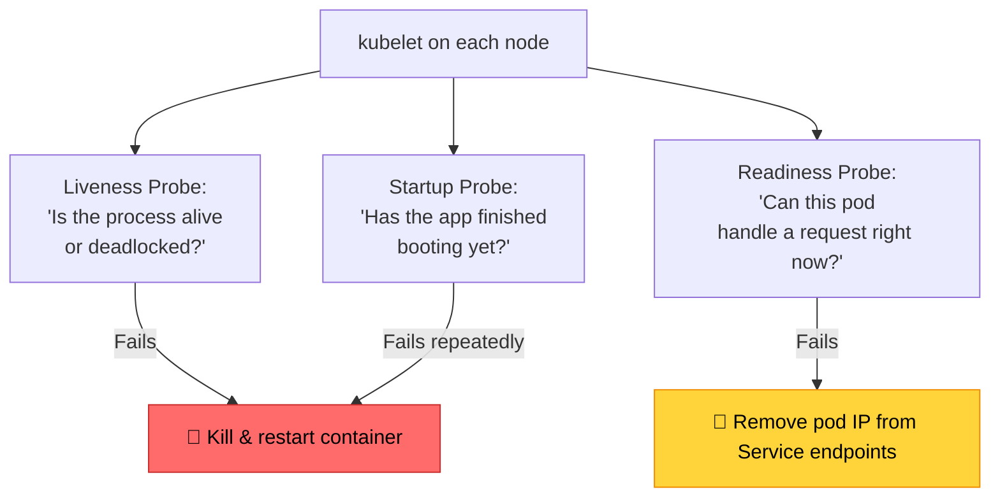
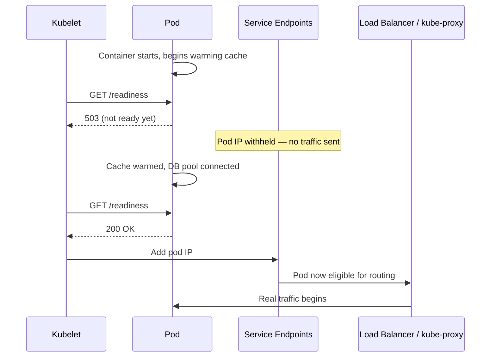
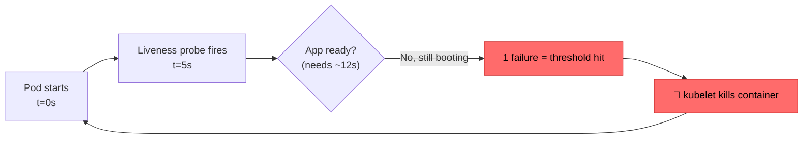
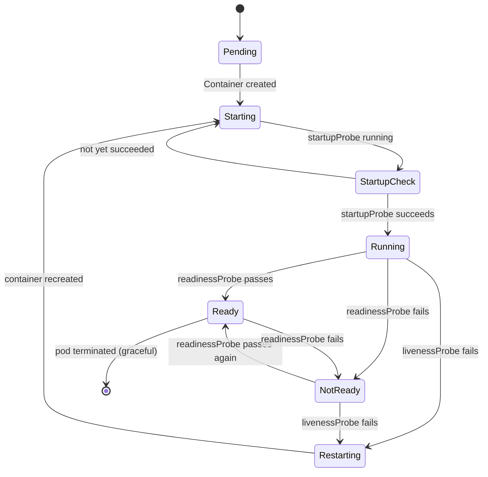

# Readiness vs Liveness Probes: The Health Check That Killed a Healthy Cluster
### Day 80 of 50 - System Design Interview Preparation Series

**By Sunchit Dudeja**

*Why "Is It Alive?" and "Is It Ready?" Are Two Completely Different Questions — And Confusing Them Takes Down Production*

---

## 📑 Table of Contents

1. [Introduction: The 3 AM Restart Loop](#-introduction-the-3-am-restart-loop)
2. [The Two Questions Kubernetes Actually Asks](#the-two-questions-kubernetes-actually-asks)
3. [Liveness Probe: "Should I Restart This?"](#liveness-probe-should-i-restart-this)
4. [Readiness Probe: "Should I Send Traffic Here?"](#readiness-probe-should-i-send-traffic-here)
5. [Startup Probe: The One Everyone Forgets](#startup-probe-the-one-everyone-forgets)
6. [The Incident: One Probe Config, Total Outage](#the-incident-one-probe-config-total-outage)
7. [Pod Lifecycle State Machine](#pod-lifecycle-state-machine)
8. [The Config That Fixed It](#the-config-that-fixed-it)
9. [Comparison Matrix: Liveness vs Readiness vs Startup](#comparison-matrix-liveness-vs-readiness-vs-startup)
10. [Anti-Patterns Architects Reject](#anti-patterns-architects-reject)
11. [Production Checklist](#production-checklist)
12. [How to Talk About It in an Interview](#-how-to-talk-about-it-in-an-interview)
13. [Quick Recap](#-quick-recap)
14. [Final Words](#-final-words)

---

## 🎯 Introduction: The 3 AM Restart Loop

A payments service deploys a routine change. Nothing risky — a new dependency, a slightly heavier startup sequence to warm a local cache. Ten minutes later, PagerDuty fires.

Pods are stuck in `CrashLoopBackOff`. Not because the code is broken. Not because the database is down. Because **the liveness probe gave up on a pod that just needed six more seconds to finish warming up** — and Kubernetes, doing exactly what it was told, killed it. Then killed the replacement. Then the replacement after that.

Every restart resets the clock. The service never gets past its warm-up window. Traffic keeps arriving. Pods keep dying. **The cluster is enforcing its own outage — one health check at a time.**

This is the single most common Kubernetes production incident that has nothing to do with Kubernetes being unreliable, and everything to do with an architect treating two different questions as if they were one:

> **"Is this process alive?"** and **"Is this process ready to serve traffic?"** are not the same question. Answering both with the same probe is how healthy services get killed by the platform meant to protect them.

> **Companion reads:**
> - [Day 11 — Kubernetes Scaling: The Architect's Orchestra](./Day11_Kubernetes_Scaling.md) — how the scheduler and HPA decide pod counts before probes ever run.
> - [Day 61 — Hot vs Cold Standby, Cold Start](./Day61_Hot_vs_Cold_Standby_Failover_Cold_Start.md) — why warm-up time is a first-class design constraint, not an afterthought.
> - [Day 13 — Circuit Breaker Pattern](./Day13_Circuit_Breaker_Pattern.md) — the client-side mirror of what readiness probes do server-side.
> - [Day 59 — Deployment Strategies Decision Tree](./Day59_Deployment_Strategies_Decision_Tree.md) — rollouts stall silently when readiness probes are misconfigured.

---

## The Two Questions Kubernetes Actually Asks



| Question | Probe | Wrong answer costs you |
|----------|-------|--------------------------|
| Is the process alive, or wedged/deadlocked? | **Liveness** | Restarting a healthy-but-slow pod → crash loop |
| Can it handle a request *right now*? | **Readiness** | Sending traffic to a pod mid-warm-up → 500s |
| Has it finished booting for the *first* time? | **Startup** | Liveness kills slow-starting apps before they ever get a fair chance |

The architect's mental model: **liveness protects the process, readiness protects the traffic, startup protects the launch.** Three different failure domains. One wrong assumption — "one health endpoint should cover all of it" — collapses all three into a single point of failure.

---

## Liveness Probe: "Should I Restart This?"

Liveness answers exactly one question: **is this container in a state it can never recover from on its own** (deadlock, hung thread pool, poisoned internal state)? If yes, the only fix is a fresh process — kill it, let Kubernetes reschedule.

```yaml
livenessProbe:
  httpGet:
    path: /actuator/health/liveness
    port: 8080
  initialDelaySeconds: 20
  periodSeconds: 10
  timeoutSeconds: 3
  failureThreshold: 3
  # 3 failures × 10s period ≈ 30s grace before restart
```

**What belongs behind a liveness endpoint:** thread-pool deadlock detection, "has the event loop stopped ticking" heartbeats, internal invariant checks.

**What must never touch a liveness endpoint:** downstream dependency checks. If your liveness probe pings the database, and the database has a 90-second blip, **Kubernetes will restart every pod in the deployment simultaneously** — turning a transient database hiccup into a full self-inflicted outage. The database recovers in 90 seconds; your service takes 10 minutes to come back because every pod is now cold-starting at once.

> **The rule an architect never breaks:** a liveness probe checks the process's own pulse, never a dependency's pulse.

---

## Readiness Probe: "Should I Send Traffic Here?"

Readiness answers a completely different question: **right now, this second, can this specific pod serve a request correctly?** This one *is* allowed to check dependencies — a pod that can't reach its database genuinely shouldn't receive traffic.

```yaml
readinessProbe:
  httpGet:
    path: /actuator/health/readiness
    port: 8080
  initialDelaySeconds: 15
  periodSeconds: 5
  timeoutSeconds: 2
  failureThreshold: 2
  successThreshold: 1
```



A failing readiness probe **never restarts the container.** It just pulls the pod's IP out of the Service's endpoint list until it passes again. This is the graceful, low-drama failure mode — traffic quietly reroutes to healthy siblings while the struggling pod either recovers or gets flagged for investigation. No crash loop, no cascading restart storm.

---

## Startup Probe: The One Everyone Forgets

Legacy Java monoliths, Spring Boot apps with heavy `@PostConstruct` initialization, ML services loading a multi-GB model into memory — these can take 30, 60, even 120 seconds to become responsive. Without a startup probe, the **liveness probe's own `initialDelaySeconds` is the only thing standing between a slow boot and a restart** — and one bad deploy, one noisy-neighbor node, one JIT warm-up hiccup, and that fixed delay isn't enough.

```yaml
startupProbe:
  httpGet:
    path: /actuator/health/liveness
    port: 8080
  periodSeconds: 5
  failureThreshold: 30
  # 30 × 5s = up to 150s to boot before liveness/readiness even start checking
```

While the startup probe is running, **liveness and readiness are both suspended.** Only once startup succeeds do the other two probes take over on their normal cadence. This is the mechanism that turns "slow boot" from a liability into a non-event.

---

## The Incident: One Probe Config, Total Outage

Back to the payments service. Here's the config that shipped:

```yaml
livenessProbe:
  httpGet:
    path: /health
    port: 8080
  initialDelaySeconds: 5      # 🚨 too short
  periodSeconds: 5
  failureThreshold: 1         # 🚨 one miss = dead
```

Three mistakes stacked on top of each other:

1. **`initialDelaySeconds: 5`** — the new dependency pushed real boot time to ~12 seconds. The probe started checking before the app could possibly answer.
2. **`failureThreshold: 1`** — zero tolerance for a single slow response. No jitter budget, no room for a GC pause during warm-up.
3. **No startup probe** — nothing shielded the boot sequence from liveness entirely.



The pod never got a second chance. Every restart re-entered the same 12-second boot window, hit the same 5-second probe, failed the same single-strike threshold. **CrashLoopBackOff wasn't a symptom of a broken app — it was the probe config working exactly as configured**, against an app that was never actually unhealthy.

---

## Pod Lifecycle State Machine



Notice what's absent from the `Ready ⇄ NotReady` cycle: **no restart.** That loop is readiness doing its job quietly. The only path back to `Starting` is a liveness failure — which is exactly why liveness needs to be the conservative, hard-to-trigger probe, and readiness the sensitive, fast-reacting one.

---

## The Config That Fixed It

```yaml
startupProbe:
  httpGet:
    path: /actuator/health/liveness
    port: 8080
  periodSeconds: 3
  failureThreshold: 20        # up to 60s to boot, checked every 3s

livenessProbe:
  httpGet:
    path: /actuator/health/liveness
    port: 8080
  periodSeconds: 10
  timeoutSeconds: 3
  failureThreshold: 3         # needs 3 consecutive misses — absorbs blips

readinessProbe:
  httpGet:
    path: /actuator/health/readiness
    port: 8080
  periodSeconds: 5
  timeoutSeconds: 2
  failureThreshold: 2
  successThreshold: 1
```

Three changes, three different failure domains fixed:

- **Startup probe added** → liveness is fully suspended for up to 60 seconds; boot time is no longer a liveness concern at all.
- **`failureThreshold: 3` on liveness** → one slow response (GC pause, brief CPU steal) no longer triggers a restart. It now takes three consecutive misses — real, sustained wedged-ness.
- **Liveness endpoint decoupled from dependency checks** → the database, cache, and downstream services only ever affect *readiness*, never *whether the pod gets killed*.

---

## Comparison Matrix: Liveness vs Readiness vs Startup

| Dimension | Liveness | Readiness | Startup |
|-----------|----------|-----------|---------|
| **Question answered** | Is the process alive/unstuck? | Can it serve traffic now? | Has first boot finished? |
| **On failure** | Kill & restart container | Remove from Service endpoints | Block liveness/readiness, keep retrying |
| **Checks dependencies?** | ❌ Never (self only) | ✅ Yes, deliberately | ❌ No (checks app itself) |
| **Failure blast radius** | Single pod restart | Single pod removed from LB rotation | Delays traffic, no restart |
| **Sensitivity** | Low — hard to trigger | High — reacts fast | Patient — generous threshold |
| **Common mistake** | Checking DB/downstream health | Missing entirely (traffic hits cold pod) | Omitted; liveness absorbs the blame |

---

## Anti-Patterns Architects Reject

- **Same endpoint for liveness and readiness.** They answer different questions with different consequences (restart vs. reroute) — collapsing them means every dependency blip becomes a restart storm.
- **Liveness pinging the database.** A downstream outage should degrade readiness, not trigger a coordinated self-destruct across every replica.
- **`failureThreshold: 1` on liveness.** Zero tolerance for jitter. One GC pause, one slow disk I/O, and the platform kills a perfectly healthy process.
- **No startup probe on slow-booting apps.** Forces `initialDelaySeconds` to be a worst-case guess that's wrong the moment someone adds a heavier dependency.
- **Readiness that always returns 200.** Defeats the purpose — pods get traffic before they're actually able to serve it correctly, especially right after deploy.

---

## Production Checklist

- [ ] Liveness endpoint checks **only** the process's own health — no network calls to dependencies.
- [ ] Readiness endpoint **does** check critical dependencies (DB pool, cache connection, downstream auth).
- [ ] `startupProbe` configured for any service with boot time > a few seconds — sized generously (2–3× observed worst-case boot).
- [ ] Liveness `failureThreshold` ≥ 3, with a `periodSeconds` that gives real breathing room for GC pauses.
- [ ] Readiness `failureThreshold` tuned lower/faster than liveness — you *want* fast rerouting, slow restarting.
- [ ] Alert on **readiness flapping** separately from **liveness restarts** — they signal different classes of incidents.

---

## 🎤 How to Talk About It in an Interview

When asked "how would you configure health checks for this service," don't just say "add liveness and readiness probes." Show the reasoning an architect uses:

> "I'd separate the two by failure consequence, not by convenience. Liveness only answers 'is this process wedged,' so it never touches downstream dependencies — otherwise a database blip restarts every replica at once instead of just degrading gracefully. Readiness is where dependency checks belong, because pulling one pod out of rotation is cheap and reversible. And if the service has any meaningful boot time, I add a startup probe so liveness doesn't start judging the app before it's had a fair chance to come up."

That answer signals you understand **blast radius**, not just YAML syntax — which is the difference interviewers are actually screening for.

---

## 📝 Quick Recap

- **Liveness** = "restart me if I'm truly stuck." Self-checks only. Generous thresholds.
- **Readiness** = "route around me if I'm not ready." Dependency-aware. Fast-reacting.
- **Startup** = "give me time to boot before judging me at all." Shields liveness during first launch.
- Conflating liveness and readiness turns transient dependency issues into coordinated restart storms.
- The incident pattern to remember: **short `initialDelaySeconds` + `failureThreshold: 1` + no startup probe = self-inflicted CrashLoopBackOff.**

---

## 🏁 Final Words

Kubernetes never lied to that payments service. It did precisely what its configuration told it to do, check after check, restart after restart. That's the uncomfortable lesson underneath every probe misconfiguration: **the platform isn't the failure domain — the assumptions baked into three lines of YAML are.**

An architect treats liveness, readiness, and startup as three separate contracts with three separate consequences, because the moment they blur into one, the health-check system stops protecting the cluster and starts attacking it.

---

*Happy Learning!* 🎉

> *"A developer adds a health check. An architect asks what happens when it fails."*
