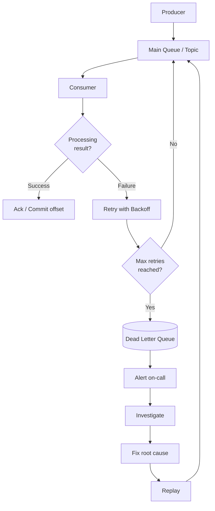
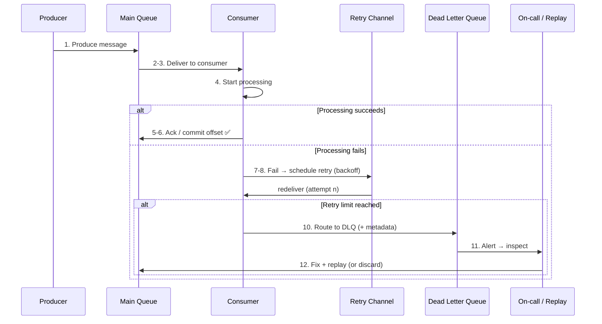
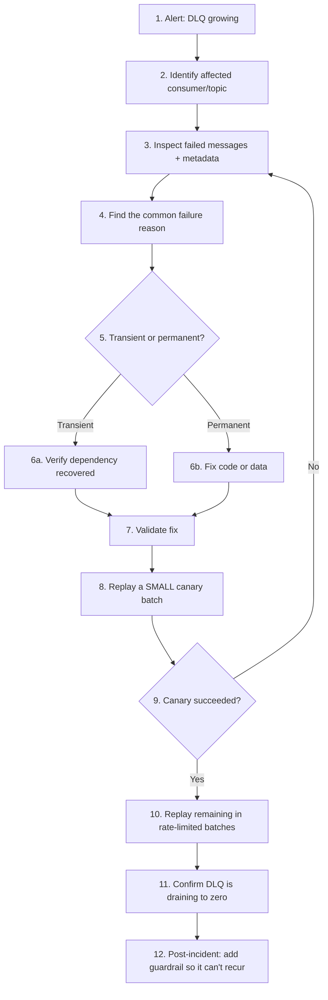
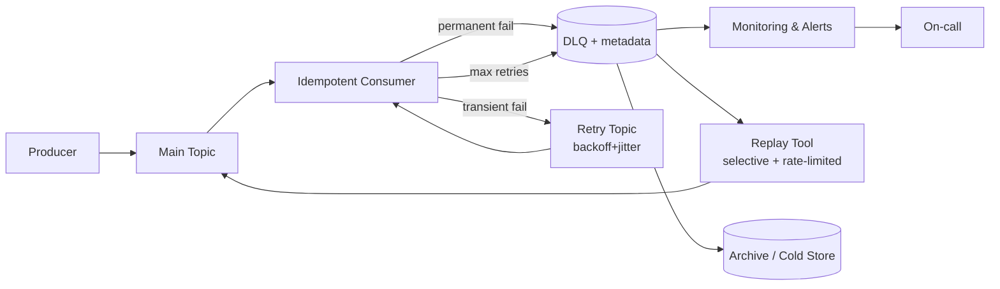
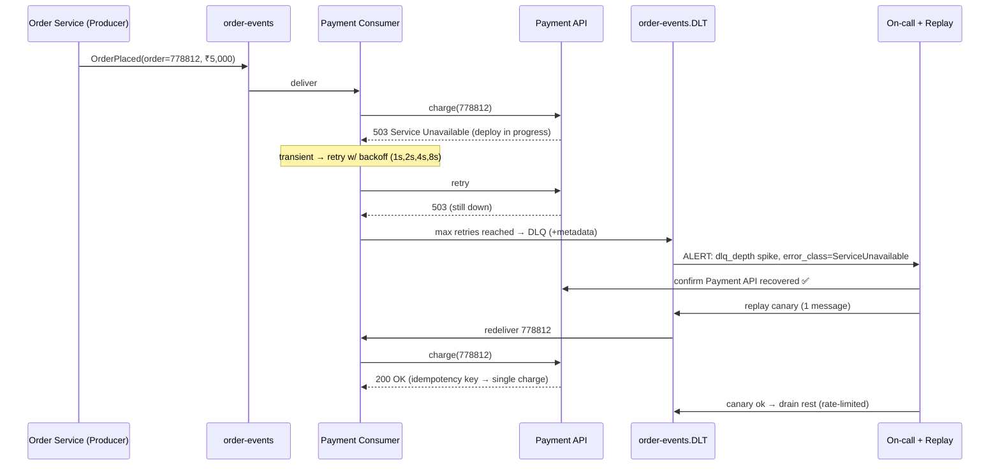

# Day 81 — The Dead Letter Queue: How to Stop One Poison Message From Taking Down Your Pipeline
## Retry the Transient. Isolate the Permanent. Fix the Root Cause. Replay Safely.

> **Series:** System Design Interview Preparation Series  
> **Difficulty:** Mid / Senior  
> **Core Concept:** Dead Letter Queues, Retry Strategy, Backoff & Jitter, Poison Messages, Idempotency, Replay  
> **Prerequisite:** Day 6 — Design For Failure, Day 36 — RabbitMQ vs Kafka, Day 48 — Idempotency, Day 53 — Retry Storm

---

## 🎬 The Story

It is 02:14 on a Sunday. Your `order-events` topic is healthy. Producers are publishing. Consumers are chewing through messages. Then a partner's upstream system pushes a single order with a `total_amount` field set to the string `"N/A"` instead of a number.

Your consumer deserializes the payload, hits `BigDecimal.valueOf("N/A")`, and throws. The framework does what frameworks do by default: it **redelivers** the message. The consumer picks it up again. Throws again. Redelivers again.

By 02:19 that one message has been retried **40,000 times**. It sits at the head of the partition, and because your consumer commits offsets in order, **nothing behind it moves**. Healthy orders — the ones from paying customers — are stuck behind a single un-processable message. Your log pipeline is now ingesting 8,000 identical stack traces per second. Your on-call's Slack is a wall of red.

Nothing is *down*. The database is fine. The broker is fine. The consumer process is fine. **One message that can never succeed is holding the entire pipeline hostage.**

This is the exact failure a **Dead Letter Queue** exists to prevent. Not a nice-to-have. Not a "we'll add it in Q3." A DLQ is the difference between "one bad message" and "a 3 AM incident bridge with 12 people on it."

```
02:14  Poison message published to order-events
02:15  Consumer fails → framework redelivers → fails → redelivers …
02:19  ~40,000 redeliveries; head-of-line blocking; healthy orders stalled
02:24  Log pipeline saturated by duplicate stack traces
02:31  On-call manually purges the partition — and loses 3 real orders with it
```

The fix was not "delete the message." The fix was an architecture that could say: *this message has failed enough times — move it aside, alert a human, and let everything else flow.*

---

## 🖼️ First, Let's Read the Diagram

The source of truth for this article is the supplied flow diagram. Before designing anything, an architect reads what is actually there — not what they wish were there.

**What the diagram explicitly shows** (three regions):

```
┌─ NORMAL FLOW ──────────────────────────────────────────────┐
│  Producer → Main Queue → Consumer → Process Successfully    │
└────────────────────────────────────────────────────────────┘

┌─ RETRY FLOW ───────────────────────────────────────────────┐
│  Consumer → Process Fails → Retry with Backoff              │
│      ├─ Max retries NOT reached → back to Main Queue        │
│      └─ Max retries reached     → Dead Letter Queue         │
└────────────────────────────────────────────────────────────┘

┌─ DLQ / RECOVERY FLOW ──────────────────────────────────────┐
│  DLQ → Alert → Investigate → Fix Root Cause → Replay        │
│      → Main Queue → Consumer → Process Successfully         │
└────────────────────────────────────────────────────────────┘
```

**Components I can identify directly from the diagram:**

| Component | Present in diagram? | Responsibility (as drawn) |
|-----------|--------------------|---------------------------|
| Producer | ✅ Explicit | Creates and publishes messages to the Main Queue |
| Main Queue | ✅ Explicit | Primary buffer between producer and consumer |
| Consumer | ✅ Explicit | Reads and attempts to process each message |
| Retry with Backoff | ✅ Explicit | Re-attempts failed processing with a delay |
| Max-retries decision | ✅ Explicit | Branches on retry-count threshold |
| Dead Letter Queue | ✅ Explicit | Holds messages that exhausted retries |
| Alert | ✅ Explicit | Notifies the owning team on DLQ arrival |
| Investigate → Fix → Replay | ✅ Explicit | Human-driven recovery workflow |

**What I *infer* (reasonable, but not drawn):**
- The "Retry with Backoff" box implies a **retry counter carried with the message** (header/metadata). The diagram doesn't show *where* the count lives — I'll recommend an approach later.
- "Replay Manually" implies a **replay tool / consumer** with access to the DLQ. The diagram shows the action, not the mechanism.

**What I *recommend* as an architect (not in the diagram — flagged clearly):**
- A dedicated **retry queue / retry topic** distinct from the Main Queue (the diagram loops retries back into the Main Queue; §5 explains why a separate retry channel is often better).
- **Metadata enrichment** on the DLQ message (error, trace ID, retry count — §7).
- **Observability** on DLQ depth and age (§11) — the diagram has "Alert" but not the metrics behind it.

> **💡 Architect's Note:** The diagram is technology-agnostic — no Kafka, SQS, or RabbitMQ branding is visible. So I will keep the core explanation platform-neutral and add a dedicated technology-specific section (§15) rather than assuming a broker.

---

## 1. 🧩 What Is a Dead Letter Queue?

**In one sentence:** a Dead Letter Queue is a separate queue where messages go when they cannot be processed successfully, so they stop blocking everything else.

**The beginner mental model.** Think of a factory conveyor belt. Most items pass through fine. Occasionally an item is damaged and jams the machine. You don't stop the whole line and you don't feed the jammed item back in forever — you lift it off into a **"defects" bin** beside the line. A human inspects the bin later. The line keeps running. The DLQ *is* that defects bin.

**The distributed-systems view.** In an event-driven system, the consumer offers an implicit contract: *"give me a message and I will process it exactly the way the business expects."* Some messages break that contract — bad data, a schema the code can't parse, a downstream dependency that's gone. If the messaging system's only tools are "redeliver" or "drop," you're forced to choose between an infinite loop and silent data loss. The DLQ is the third option: **quarantine with full context, preserved for later recovery.**

```
Producer → Main Queue → Consumer → ✅ success  → ack/commit
                            │
                            └─ ❌ failure → retry (with backoff)
                                              └─ retries exhausted → DLQ
```

> **✅ Recommended Practice:** Treat the DLQ as a **triage area**, not a graveyard. Every message in it is a question waiting to be answered: *"why did this fail, and what do we do about it?"*

---

## 2. 🏗️ Walking the Architecture, Component by Component

Following the diagram along the actual message flow.



**Producer.** Creates a message and publishes it to the Main Queue. *Why it exists:* to decouple the sender from the receiver — the producer shouldn't care whether the consumer is up, slow, or scaling. *On failure here* (e.g., broker unreachable), the failure is the producer's problem, handled by producer-side retries — **not** the DLQ, which is a consumer-side concern.

**Main Queue (or Topic).** The durable buffer. *Why it exists:* absorbs bursts, smooths load, and survives consumer restarts. *Success:* the message is delivered to a consumer. *Failure:* delivery/processing failures push the message into the retry path.

**Consumer.** Reads a message and runs your business logic. This is where "processing" succeeds or fails. *Success:* the consumer acknowledges/commits and the message is removed from the in-flight set. *Failure:* the consumer signals failure (throws, nacks, or lets the visibility timeout lapse) and the retry machinery engages.

**Retry with Backoff.** On failure, the system waits and re-attempts rather than hammering the failing dependency. *Why it exists:* most failures in distributed systems are **transient** — a 200ms network blip, a brief DB failover. A short wait often makes the next attempt succeed. *Success:* processing eventually works and the message leaves the system normally. *Failure:* attempts keep failing.

**Max-retries decision.** A hard ceiling. *Why it exists:* to guarantee the retry loop **terminates**. Without it, a permanent failure becomes an infinite loop (the poison message from the story). Below the ceiling → retry again. At the ceiling → route to DLQ.

**Dead Letter Queue.** The quarantine. *Why it exists:* to isolate un-processable messages so the Main Queue keeps flowing. *What happens to the message:* it's stored, ideally enriched with failure metadata (§7), and it triggers an alert.

**Alert → Investigate → Fix → Replay.** The human recovery loop. *Why it exists:* a DLQ with no one watching it is just a slower way to lose data. The alert pulls a human in; investigation finds the root cause; the fix addresses it; replay returns the message to the Main Queue for another honest attempt.

---

## 3. 🔄 The Complete Message Lifecycle



The twelve steps map cleanly onto the diagram: **produce → enqueue → deliver → process → (succeed & commit) OR (fail → retry → exhaust → DLQ) → inspect → fix/replay/discard.**

**The four channels — don't blur them:**

| Channel | Purpose | Who reads it |
|---------|---------|--------------|
| **Main Queue** | Normal, first-attempt processing | Primary consumer |
| **Retry Queue** | Delayed re-attempts of transient failures | Same consumer (often via a delay) |
| **Dead Letter Queue** | Terminal quarantine after retries exhausted | Ops tooling + replay job |
| **Parking-lot Queue** *(optional)* | Messages that failed **even after replay** — need deep human intervention | Humans only |

> **💡 Architect's Note:** The diagram loops retries back into the **Main Queue**. That's the simplest model and it's fine for low volume. At scale, mixing fresh traffic and delayed retries in the same queue causes two problems: retries compete with new messages for consumer capacity, and per-message delay is awkward to implement. A **separate retry queue/topic** (or SQS delay + redrive) keeps the two concerns clean. I'll treat "retry channel" as logically distinct even though the diagram merges it.

---

## 4. 💥 Why Do Messages Fail? (Transient vs Permanent)

This is *the* classification an architect must get right, because it decides whether retrying is medicine or malpractice.

| Failure | Example | Type | Retry helps? |
|--------|---------|------|--------------|
| Network timeout | Downstream call exceeds deadline | **Transient** | ✅ Yes |
| Downstream 503 / unavailable | Payment API deploying | **Transient** | ✅ Yes |
| Rate limited (429) | Throttled by dependency | **Transient** | ✅ Yes (with backoff) |
| DB failover in progress | Primary promoting a replica | **Transient** | ✅ Yes |
| Lock contention / deadlock | Concurrent writers | **Transient** | ✅ Usually |
| Invalid payload | `total = "N/A"` | **Permanent** | ❌ No |
| Schema mismatch | Field renamed, consumer can't parse | **Permanent** | ❌ No |
| Missing required field | `customerId` absent | **Permanent** | ❌ No |
| Business rule violation | Refund > original charge | **Permanent** | ❌ No |
| Unsupported message type | Unknown `eventType` | **Permanent** | ❌ No |
| Auth/authz failure | Expired service credential | **Depends** | ⚠️ Sometimes |
| Serialization/deser error | Corrupt Avro bytes | **Permanent** | ❌ No |
| Programming bug (NPE) | Code defect | **Permanent** | ❌ No (fix code first) |

**The rule:** retry the **transient**, DLQ the **permanent** *immediately*. Retrying a permanent failure 5 times just wastes 5× the resources and delays the inevitable trip to the DLQ.

> **⚠️ Production Pitfall:** The most expensive bug in this space is **misclassifying a permanent failure as transient**. A malformed payload retried with exponential backoff still ends in the DLQ — but only after burning CPU, flooding logs, and adding latency. Classify at the *catch site*: a `DeserializationException` should go **straight to the DLQ**, skipping retries entirely.

```java
try {
    process(message);
} catch (DeserializationException | ValidationException e) {
    deadLetter(message, e);           // permanent → DLQ immediately, no retry
} catch (TransientException e) {
    scheduleRetry(message, e);        // transient → backoff + retry
}
```

---

## 5. ⏳ Retry vs DLQ — Why Retries Can't Run Forever

Retries exist because transient failures are the common case. But an unbounded retry is just a poison-message amplifier (see Day 53 — the Uber retry storm). The DLQ is the **terminator** that makes retries safe.

**Retry strategies, compared:**

| Strategy | Behavior | When to use | Danger |
|----------|----------|-------------|--------|
| **Immediate retry** | Retry instantly, no wait | Ultra-transient blips, ≤1 retry | Hammers a struggling dependency |
| **Fixed delay** | Wait *N* ms each time | Simple, predictable load | Synchronized retry waves (thundering herd) |
| **Exponential backoff** | 1s, 2s, 4s, 8s… | Most downstream-dependency failures | Still synchronized without jitter |
| **Backoff + jitter** | Exponential ± randomness | **Default for production** | Slightly harder to reason about timing |
| **Max retry count** | Hard ceiling → DLQ | **Always, in combination** | Too high = slow DLQ; too low = premature DLQ |
| **Retry queue** | Delay isolated from main flow | High volume, per-message delay | Extra infra to operate |
| **DLQ** | Terminal quarantine | After ceiling reached | Needs monitoring + ownership |

**Backoff with jitter — the production default:**

```
delay = min(cap, base * 2^attempt) * random(0.5, 1.0)

attempt 0 → ~1s     attempt 3 → ~8s (± jitter)
attempt 1 → ~2s     attempt 4 → DLQ
attempt 2 → ~4s
```

> **✅ Recommended Practice:** For synchronous, user-facing calls keep retries **few and fast** (1–2, short deadline) — the user is waiting. For asynchronous event processing you can afford **more retries with longer backoff** because latency is cheaper. Match the retry budget to the SLA of the flow, not a global constant.

---

## 6. ☠️ Poison Messages

A **poison message** is a message that fails *every single time*, deterministically. It is the villain of the opening story. Without a retry ceiling, the flow looks like this:

```
Message A → Consumer → Fail → Retry → Fail → Retry → Fail → Retry → …forever
```

And here is the damage it does while looping:

- **Consumer starvation** — the consumer is busy re-failing on A instead of processing B, C, D.
- **Head-of-line blocking** — in ordered logs (Kafka partitions), *nothing* behind A commits.
- **Increased latency** — healthy messages wait behind the poison one.
- **Resource exhaustion** — CPU, threads, and connections burned on a doomed message.
- **Repeated downstream calls** — every attempt may hit a real API, multiplying load and cost.
- **Log flooding** — the same stack trace, thousands of times, drowning real signals and inflating your logging bill.
- **Operational cost** — auto-scalers spin up capacity to fight a load that pure retries created.

With a retry ceiling + DLQ, the story ends in milliseconds instead of hours:

```
Message A → Consumer → Fail → Retry → Fail → Max retries → DLQ
Message B → Consumer → ✅ (flows normally, never blocked by A)
```

> **💡 Architect's Note:** The single most important property a DLQ gives you is **liveness**: the guarantee that one bad message cannot stop good messages. Everything else — metadata, replay, dashboards — is refinement on top of that core guarantee.

---

## 7. 📦 What Should Live *Inside* a DLQ Message?

A DLQ entry that contains only the raw payload is nearly useless at 3 AM. The value of a DLQ is directly proportional to the **context** it preserves. Capture the *why*, not just the *what*.

| Field | Why it matters |
|-------|----------------|
| **Message ID** | Deduplication and precise identification |
| **Original payload** | You cannot replay what you didn't keep |
| **Original topic/queue** | Where to replay it back to |
| **Producer info** | Who sent it — often the source of bad data |
| **Consumer info / group** | Which service failed to process it |
| **Retry count** | How hard we already tried |
| **Failure reason / error code** | First-glance triage category |
| **Exception + stack trace** | The actual defect |
| **Timestamp (first + last failure)** | Age, and whether it's a burst or a trickle |
| **Correlation ID** | Tie the failure to a business transaction |
| **Trace ID** | Jump straight into distributed tracing (Day 33/50) |
| **Schema version** | Detect schema-evolution mismatches (Day 31) |

**Practical implementation:** put the payload in the DLQ message **body** and everything else in **headers/attributes**. Headers are queryable without deserializing a possibly-corrupt body.

```json
// DLQ message headers (payload kept separately in the body)
{
  "x-original-topic":  "order-events",
  "x-message-id":      "ord-9a3f...",
  "x-retry-count":     "5",
  "x-failure-reason":  "ValidationException: total_amount not numeric",
  "x-error-class":     "com.acme.ValidationException",
  "x-trace-id":        "4bf92f3577b34da6a3ce929d0e0e4736",
  "x-correlation-id":  "checkout-778812",
  "x-first-failed-at": "2026-08-04T02:14:07Z",
  "x-consumer-group":  "order-processor-v3"
}
```

> **⚠️ Production Pitfall:** If your consumer serializes the *exception object* into the DLQ and that serialization throws, you can lose the message entirely. Always capture `exception.getClass().getName()` + `getMessage()` + a **string** stack trace — never rely on serializing a live throwable.

---

## 8. 🛠️ DLQ Message Processing — Inspect, Diagnose, Fix, Replay

Once messages land in the DLQ, you have a menu of operational responses:

```
DLQ → Inspect → Diagnose → Fix → Replay
```

| Workflow | When to use |
|----------|-------------|
| **Manual replay** | Small volume, high-value messages, first time seeing this failure |
| **Automated replay** | Known-transient failures (e.g., dependency was down, now up) |
| **Selective replay** | Replay only messages matching a filter (one bad producer, one time window) |
| **Replay after fixing consumer** | Bug fix deployed → replay messages that hit the bug |
| **Replay after fixing data** | Correct the bad payload, then replay the corrected version |
| **Discard** | Genuinely invalid, non-recoverable, or duplicate messages |

> **❌ Anti-Pattern: "Replay the whole DLQ and hope."** Blindly re-driving every message is dangerous because (1) the root cause may not be fixed yet — you just re-fill the DLQ; (2) some messages are permanently invalid and will loop again; (3) a large replay can **stampede** a freshly-recovered downstream and knock it back over. Always replay a **small canary batch first**, watch it succeed, *then* drain the rest.

> **✅ Recommended Practice:** Make replay **selective and observable** by default. Your replay tool should support "replay where `failure_reason = X` and `first_failed_at between A and B`", replay in bounded batches with rate limiting, and emit replay-success/replay-failure metrics.

---

## 9. 🔁 Idempotency — The Non-Negotiable Prerequisite for Replay

The moment you introduce retries and replay, you introduce **duplicate processing**. A message can be delivered more than once, and a replayed message is a deliberate re-delivery. If your consumer isn't idempotent, recovery *creates* new bugs.

**The classic hazard:**

```
PaymentProcessed → Consumer → DB update (charge ₹5,000)
                 → Network timeout on the ACK
                 → Broker thinks it failed → redelivers
                 → Consumer charges ₹5,000 AGAIN  ❌ customer double-charged
```

The processing *succeeded*; only the acknowledgment was lost. At-least-once delivery means this is not an edge case — it's a *when*, not an *if* (see Day 48 & Day 49).

**Idempotency strategies:**

| Strategy | How it works | Best for |
|----------|--------------|----------|
| **Idempotency key** | Client-supplied unique key; server records "already done" | Payments, external APIs |
| **Message ID dedup** | Track processed message IDs | Any at-least-once consumer |
| **Dedup table** | `INSERT` message ID; duplicate = PK conflict = skip | Strong DB-backed guarantee |
| **Unique constraint** | DB rejects the second identical write | Order creation, ledger entries |
| **State check** | "Is this order already PAID? then skip" | State-machine workflows |

```java
// Dedup via unique constraint — the database is the arbiter of "exactly once effect"
try {
    dedupRepo.insert(message.getId());   // PRIMARY KEY on message_id
    applyBusinessEffect(message);        // safe: this runs at most once
} catch (DuplicateKeyException dup) {
    log.info("Duplicate {} — already processed, skipping", message.getId());
    // ack anyway: re-processing is a no-op
}
```

> **💡 Architect's Note:** "At-least-once delivery + idempotent consumer = effectively-once processing." That equation is the backbone of every reliable event-driven system. A DLQ without idempotent consumers is a loaded gun pointed at your data integrity.

---

## 10. 🔢 Ordering and DLQs — The Trade-off Nobody Mentions

Moving a message to the DLQ can **break ordering guarantees**. Consider an ordered stream:

```
Event 1 (create order)   → ✅ processed
Event 2 (apply discount) → ❌ fails → DLQ
Event 3 (charge order)   → ✅ processed  ← charged WITHOUT the discount!
```

If Event 2 is quarantined while Event 3 sails on, you've processed events **out of order** and produced a wrong business result. When it's later replayed, Event 2 arrives *after* Event 3 — the discount applies to an already-charged order.

**How architects handle this:**

| If ordering… | Strategy |
|--------------|----------|
| **Doesn't matter** (independent events) | Let DLQ-and-continue proceed — simplest, highest throughput |
| **Matters per-entity** (same order/user) | Partition by entity key; on failure, **stop the partition** or DLQ the *whole key's* subsequent events |
| **Matters globally** | Single-threaded ordered processing; a failure **halts** the stream until resolved (throughput sacrificed for correctness) |

> **⚠️ Production Pitfall:** Kafka preserves order **within a partition**. The naive "send failure to DLQ, commit offset, keep going" pattern silently sacrifices per-partition ordering. If order matters for that entity, you must either block the partition or route *all* subsequent events for that key to the DLQ too — otherwise you get the discount-after-charge bug above.

---

## 11. 📊 Observability & Monitoring

The diagram has an "Alert" box. That box is only as good as the metrics behind it. A DLQ you don't watch is a data-loss incident with a delay timer.

**Metrics that matter:**

| Metric | What it tells you | Alert when… |
|--------|-------------------|-------------|
| **DLQ message count (depth)** | Scale of the problem | > threshold |
| **DLQ growth rate** | Is it a burst or ongoing bleed? | Sustained positive slope |
| **Oldest message age** | Are we ignoring failures? | > SLA (e.g., 1h) |
| **Retry count distribution** | Transient vs permanent skew | Spike in max-retry hits |
| **Processing failure rate** | Consumer health | > baseline |
| **Consumer error rate by type** | Which failure dominates | New error class appears |
| **Replay success/failure rate** | Is recovery working? | Replay failures rising |
| **Time-to-resolution (MTTR)** | Operational maturity | Trending up |

**Example alerting policy:**

```
WARN:  dlq_depth > 100  for 5m
CRIT:  dlq_depth > 1000  OR  dlq_growth_rate > 50/min  for 5m
CRIT:  dlq_oldest_message_age > 1h
PAGE:  new distinct error_class appears in DLQ  (novel failure = investigate now)
```

> **✅ Recommended Practice:** Alert on **rate and age**, not just absolute depth. A DLQ holding 200 old, known-bad messages you've chosen to leave is fine. A DLQ that *just gained* 200 messages in 60 seconds is an active incident. The derivative matters more than the value.

---

## 12. 📋 Operational Runbook — "The DLQ Is Filling Up"

A runbook your on-call can follow at 3 AM without thinking hard.



1. **Detect** DLQ growth (alert fires).
2. **Identify** the affected consumer/topic.
3. **Inspect** failed messages — read the metadata/headers, not just the payload.
4. **Find the common reason** — group by `error_class`. Usually 90% share one cause.
5. **Classify** transient vs permanent.
6. **Fix** — restore the dependency (transient) or ship a code/data fix (permanent).
7. **Validate** the fix against one real failed payload in staging.
8. **Canary replay** — a handful of messages first.
9. **Check** the canary succeeded.
10. **Drain** — replay the rest in bounded, rate-limited batches.
11. **Confirm** the DLQ returns to zero (or to the known-bad residue).
12. **Prevent recurrence** — add validation at the edge, a schema check, or an alert.

> **⚠️ Production Pitfall:** Skipping step 7 (validate) and step 8 (canary) is how a "quick replay" becomes a second outage. Never let the entire DLQ back into production on an unvalidated assumption.

---

## 13. 🚫 Common DLQ Design Mistakes (and the Fix)

| ❌ Anti-Pattern | Why it hurts | ✅ Fix |
|----------------|--------------|--------|
| **No DLQ monitoring** | Silent data loss; you find out from customers | Alert on depth, rate, age |
| **Infinite retries** | Poison messages loop forever; retry storms | Hard max-retry ceiling → DLQ |
| **No backoff** | Thundering herd on a struggling dependency | Exponential backoff + jitter |
| **Blind full replay** | Re-fills DLQ; stampedes recovered downstreams | Selective, canary-first, rate-limited replay |
| **No idempotency** | Replay double-charges / duplicates effects | Idempotency keys / dedup table |
| **Losing error context** | Can't diagnose; blind guessing | Preserve metadata (§7) |
| **One giant shared DLQ** | Can't tell which consumer/failure owns what | DLQ per consumer/topic (or tag rigorously) |
| **No retention policy** | DLQ grows unbounded; storage + compliance risk | Set TTL + archival policy |
| **No ownership** | "Someone else's problem"; messages rot | Named owning team per DLQ |
| **DLQ as permanent storage** | Not designed for durability/query | Archive to durable store; DLQ is transient triage |
| **No alerting** | The runbook never starts | Page on novel error classes |
| **No replay strategy** | Manual, error-prone recovery | Build a replay tool up front |
| **Ignoring PII in DLQ** | Sensitive payloads sit unencrypted/over-retained | Encrypt, restrict access, redact, short TTL |

---

## 14. 🏛️ Production-Grade DLQ Design

Separating what you **must** have from what's **nice** to have.

**Essential (do not ship without these):**

- ✅ **Max retry ceiling** — guarantees the retry loop terminates
- ✅ **Exponential backoff + jitter** — safe re-attempts
- ✅ **Transient/permanent classification** — permanent → DLQ immediately
- ✅ **Dedicated DLQ per consumer/topic** — clear ownership & triage
- ✅ **Metadata preservation** — payload + error + trace/correlation IDs
- ✅ **Idempotent consumers** — replay-safe by construction
- ✅ **Monitoring + alerting** — depth, rate, age, novel errors
- ✅ **Replay mechanism** — selective, canary-first, rate-limited
- ✅ **Named ownership** — a team accountable for each DLQ

**Nice-to-have (maturity improvements):**

- ➕ **Automated replay** for known-transient categories
- ➕ **Parking-lot queue** for replay-failed messages
- ➕ **Auto-classification** of failure reasons into buckets
- ➕ **Self-service replay UI** for owning teams
- ➕ **Audit log** of every replay/discard (who, when, why)
- ➕ **Retention + archival** to cold storage for compliance



---

## 15. 🔧 Technology-Specific Considerations

> The supplied diagram names **no specific broker**, so this section stays comparative rather than assuming one. Map the generic concepts onto whatever you actually run.

| Platform | Native DLQ support | Retry model | Notes |
|----------|-------------------|-------------|-------|
| **AWS SQS** | ✅ First-class **redrive policy** (`maxReceiveCount` → DLQ) | Visibility timeout + `ApproximateReceiveCount` | Built-in **redrive-to-source** for replay. Simplest DLQ story. |
| **AWS SNS** | ✅ Per-subscription DLQ (an SQS queue) | N/A (fan-out) | DLQ catches undeliverable notifications. |
| **RabbitMQ** | ✅ Via `x-dead-letter-exchange` | Nack/reject + TTL; delayed retry via a **delay/retry queue** with TTL | Classic pattern: message TTL in a "wait" queue dead-letters back to the work queue. |
| **Apache Kafka** | ⚠️ **No native DLQ** — you build it | App-level retry topics; **Kafka Connect** & Spring Kafka have DLQ helpers | Ordering is per-partition — mind §10. Common pattern: `topic → topic.retry → topic.DLT`. |
| **Azure Service Bus** | ✅ First-class DLQ (`/$DeadLetterQueue`) sub-queue | `MaxDeliveryCount` | Dead-letters on max delivery, TTL expiry, or explicit dead-lettering. |
| **Google Pub/Sub** | ✅ Dead-letter topic on subscription | `maxDeliveryAttempts` + ack deadline | DLQ is just another topic + subscription. |

**Kafka-specific caution (since it has no native DLQ):**
- You own the retry counter — carry it in a header, or use per-topic retry levels (`retry-5s`, `retry-1m`, `dlt`).
- Committing the offset of a poisoned message to "skip forward" trades data loss for liveness — only acceptable if you've *also* written it to a DLT first.
- Spring Kafka's `DeadLetterPublishingRecoverer` + `DefaultErrorHandler` (with a `BackOff`) is the idiomatic building block.

---

## 16. 💻 Code Example — A Production-Oriented Consumer

Java + Spring Kafka style, but the shape translates to any platform. It shows classification, bounded retry, backoff, DLQ routing with metadata, idempotency, and observability.

```java
@Component
public class OrderConsumer {

    private static final int MAX_RETRIES = 5;

    private final DedupRepository dedup;
    private final DlqPublisher dlq;
    private final MeterRegistry metrics;

    @KafkaListener(topics = "order-events", groupId = "order-processor-v3")
    public void onMessage(ConsumerRecord<String, String> rec) {
        String messageId = header(rec, "x-message-id");
        int attempt = intHeader(rec, "x-retry-count", 0);

        try {
            // 1) Idempotency: process the business effect at most once.
            if (!dedup.markProcessed(messageId)) {
                metrics.counter("order.duplicate").increment();
                return;                                  // already done → no-op
            }

            // 2) Business processing.
            Order order = deserialize(rec.value());      // may throw (permanent)
            processOrder(order);                          // may throw (transient/permanent)
            metrics.counter("order.processed").increment();

        } catch (DeserializationException | ValidationException permanent) {
            // 3) Permanent failure → DLQ immediately, skip retries.
            dedup.unmark(messageId);                      // effect never applied
            dlq.publish(rec, permanent, attempt);
            metrics.counter("order.dlq", "reason", "permanent").increment();

        } catch (TransientException transient) {
            // 4) Transient failure → retry with backoff, DLQ only after ceiling.
            dedup.unmark(messageId);
            if (attempt >= MAX_RETRIES) {
                dlq.publish(rec, transient, attempt);
                metrics.counter("order.dlq", "reason", "exhausted").increment();
            } else {
                scheduleRetry(rec, attempt + 1);          // backoff + jitter elsewhere
                metrics.counter("order.retry").increment();
            }
        }
    }
}
```

```java
// DLQ publisher preserves the context that makes 3 AM triage possible (§7).
public void publish(ConsumerRecord<String, String> rec, Exception e, int attempt) {
    ProducerRecord<String, String> dead =
        new ProducerRecord<>("order-events.DLT", rec.key(), rec.value());
    dead.headers()
        .add("x-original-topic", rec.topic().getBytes(UTF_8))
        .add("x-retry-count",    String.valueOf(attempt).getBytes(UTF_8))
        .add("x-error-class",    e.getClass().getName().getBytes(UTF_8))
        .add("x-failure-reason", String.valueOf(e.getMessage()).getBytes(UTF_8))
        .add("x-failed-at",      Instant.now().toString().getBytes(UTF_8));
    kafka.send(dead);
    log.error("DLQ: msg={} attempt={} reason={}", rec.key(), attempt, e.toString());
}
```

> **✅ Recommended Practice:** Note the ordering: **dedup → process → on permanent failure, un-mark and DLQ**. Un-marking on failure ensures a message that *didn't* apply its effect can be honestly replayed later, while a message that *did* succeed stays deduped even if the ack is lost.

---

## 17. 🧪 End-to-End Example — Order → Payment → DLQ → Recovery

A concrete business scenario tying it all together.



**What happened at each step:**
1. Order Service publishes `OrderPlaced`.
2. Payment Consumer tries to charge; the Payment API is mid-deploy and returns 503.
3. **Transient** classification → retry with exponential backoff + jitter.
4. All retries fail (deploy took longer than the retry budget) → message routed to the **DLT** with full metadata.
5. **Alert** fires on the DLQ-depth spike + novel error class.
6. On-call **investigates**, confirms the Payment API is healthy again — a transient outage that outlived the retry window.
7. **Canary replay** of one message succeeds; the **idempotency key** guarantees the customer is charged exactly once even though earlier attempts partially ran.
8. On-call **drains** the remaining DLQ in rate-limited batches; depth returns to zero.

No customer was double-charged. No order was lost. The pipeline never stalled for healthy orders. **That** is a DLQ doing its job.

---

## 18. 🎓 What I Would Consider Before Designing a DLQ (Architect Perspective)

Not a checklist — a set of trade-offs to reason through *before* writing code.

- **Which failures are retryable?** If you can't answer this per-exception, your retry logic is guessing. The classification *is* the design.
- **How many retries — and against which SLA?** A user-facing sync flow and a nightly batch have opposite answers. A global constant is a smell.
- **How long do messages live in the DLQ?** Too short and you lose recoverable data; too long and you accumulate risk (and PII exposure). Tie TTL to your recovery-time objective.
- **Who owns the DLQ?** An unowned DLQ is a data-loss incident waiting for a calendar date. Ownership is an architectural decision, not an afterthought.
- **Is the consumer idempotent?** If not, **stop** — replay will corrupt data. Idempotency is a prerequisite for the whole pattern, not a bonus.
- **Does ordering matter for this stream?** If yes, "DLQ-and-continue" may silently produce wrong results (§10). Decide between throughput and correctness *explicitly*.
- **What's the expected volume, and what happens during a downstream outage?** A total dependency outage can dump your *entire* live stream into the DLQ in minutes. Can the DLQ absorb that? Can you replay it without a stampede?
- **How do we prevent replay storms?** Rate-limit replay, canary first, and consider circuit breakers on the replay path itself.
- **How do we protect sensitive data?** DLQ payloads are still your data — encrypt at rest, restrict access, redact PII, and keep retention short.
- **What observability is required, and what are the RTOs?** The alert-to-drain loop must be fast enough to meet the business's recovery expectations. Design the metrics before the incident, not during it.

> **💡 Architect's Note:** The DLQ is not a feature you bolt on; it's an expression of how your system *thinks about failure*. A team that designs a good DLQ has already answered the hard questions about retries, idempotency, ownership, and recovery. A team that skips it has merely postponed those questions to their worst possible moment.

---

## 19. 🔑 Key Takeaways

1. **A DLQ guarantees liveness** — one poison message can never block healthy ones. That's the whole point; everything else is refinement.
2. **Classify failures first.** Retry the transient; DLQ the permanent *immediately*. Misclassification is the most expensive mistake.
3. **Retries must terminate.** Unbounded retries are poison-message amplifiers and retry-storm generators. A max-retry ceiling is mandatory.
4. **Backoff + jitter is the production default** — not fixed delay, not immediate retry.
5. **Preserve context in the DLQ.** Payload + error + retry count + trace/correlation IDs. A DLQ without metadata is useless at 3 AM.
6. **Idempotency is non-negotiable.** At-least-once + idempotent consumer = effectively-once. Without it, replay corrupts data.
7. **Ordering and DLQs conflict.** DLQ-and-continue can produce out-of-order, wrong results. Decide throughput vs correctness explicitly.
8. **Never blind-replay.** Canary first, validate, then drain in rate-limited batches. Fix the root cause *before* replaying.
9. **Monitor rate and age, not just depth.** The derivative signals an active incident; the absolute value may be known-bad residue.
10. **Every DLQ needs an owner and a runbook.** Unowned, unmonitored DLQs are silent data loss.
11. **DLQ is triage, not storage.** Archive for durability/compliance; keep the DLQ transient with a retention policy.
12. **Treat DLQ payloads as sensitive.** Encrypt, restrict, redact, expire — the same data protections as your primary store.

---

## ⚡ TL;DR for Developers

> A **Dead Letter Queue** is where messages go after they've failed processing too many times, so one bad message can't block the whole pipeline. Retry **transient** failures with **exponential backoff + jitter** up to a **hard ceiling**; send **permanent** failures straight to the DLQ. Preserve the **payload + error + trace ID** so you can diagnose it. Make consumers **idempotent** so **replay** doesn't double-process. **Monitor** DLQ depth/rate/age, **alert** the owning team, fix the **root cause**, then **canary-replay** before draining the rest. Never retry forever, never blind-replay, never skip idempotency.

---

## ✅ Production Readiness Checklist

**Retry & routing**
- [ ] Failures classified transient vs permanent at the catch site
- [ ] Permanent failures routed to DLQ **immediately** (no retries)
- [ ] Exponential backoff **with jitter** on transient retries
- [ ] Hard **max-retry ceiling** enforced

**DLQ content**
- [ ] Original payload preserved
- [ ] Error class + message + stack trace (as strings) captured
- [ ] Retry count, timestamps, original topic recorded
- [ ] Correlation ID + trace ID propagated

**Correctness**
- [ ] Consumers are **idempotent** (key / dedup table / unique constraint)
- [ ] Ordering requirements decided explicitly (block vs continue)

**Operations**
- [ ] Dedicated DLQ per consumer/topic
- [ ] Named **owning team** per DLQ
- [ ] **Runbook** written and linked from the alert
- [ ] **Replay tool**: selective, canary-first, rate-limited
- [ ] Retention/TTL + archival policy defined

**Observability**
- [ ] Metrics: depth, growth rate, oldest-age, retry distribution, replay success/failure
- [ ] Alerts on rate, age, and **novel error classes**
- [ ] Dashboard for DLQ health

**Security**
- [ ] DLQ encrypted at rest
- [ ] Access restricted (least privilege)
- [ ] PII redacted / short retention

---

## 📖 Related Reading

- **Day 6** — Design For Failure: The Architect's Mindset
- **Day 36** — RabbitMQ vs Kafka: The Architect's Decision Guide
- **Day 39** — Outbox Pattern: Reliable Messaging Without Distributed Transactions
- **Day 46** — Kafka Message Ordering: What Architects Know
- **Day 48** — The Idempotency Key That Lied
- **Day 49** — The Kafka OOM Crash That Charged 1000 Customers Twice
- **Day 53** — The Uber Retry Storm That Almost Broke Surge Pricing

---

## 📚 External References

- **AWS SQS Developer Guide** — *Amazon SQS dead-letter queues and redrive*
- **Azure Service Bus** — *Dead-letter queues and MaxDeliveryCount*
- **Google Cloud Pub/Sub** — *Handling message failures with dead-letter topics*
- **Confluent / Spring Kafka** — *Error handling, retry topics, and DeadLetterPublishingRecoverer*
- **RabbitMQ** — *Dead Letter Exchanges and TTL-based retry queues*
- **Google SRE Book** — *Chapter 22: Addressing Cascading Failures*

---

*Day 81 · System Design Interview Preparation Series · How to Think Like an Architect · [YouTube](https://www.youtube.com/@CodeWithSunchitDudeja) · [Instagram](https://www.instagram.com/sunchitdudeja/)*
