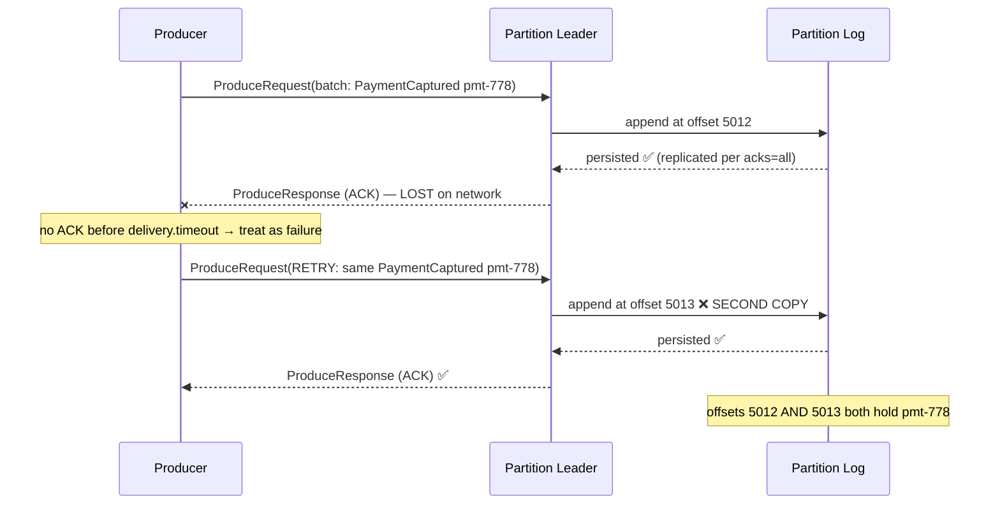
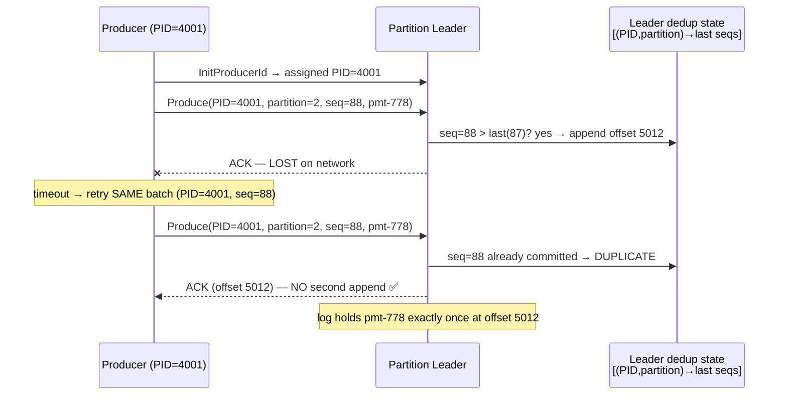

# Day 82 — The Lost ACK: Why Kafka Producer Retries Create Duplicates, and How Idempotence Actually Stops Them
## When You Don't Know Whether It Failed *Before* or *After* the Write Actually Happened

> **Series:** System Design Interview Preparation Series  
> **Difficulty:** Senior / Principal  
> **Core Concept:** Kafka Producer Idempotence, Lost-ACK Ambiguity, Producer ID + Sequence Numbers, Delivery Semantics, Exactly-Once  
> **Prerequisite:** Day 46 — Kafka Message Ordering, Day 48 — Idempotency, Day 49 — Duplicate Charge, Day 81 — Dead Letter Queue

---

> **The insight this entire article is built around:**
> *The most dangerous failure in distributed systems isn't knowing that something failed. It's not knowing whether it failed **before** or **after** the operation actually happened.*

---

## 🏷️ Five Titles (pick your poison)

1. **The Lost ACK: Why "The Broker Didn't Answer" Never Meant "The Broker Didn't Write"**
2. **Producer Idempotence Isn't Exactly-Once — And Confusing the Two Will Cost You a Weekend**
3. **Duplicate Records at 2 AM: The Kafka Retry Semantics Every Architect Gets Wrong Once**
4. **Producer ID + Sequence Number: What Kafka Idempotence *Actually* Does Behind the "id=123" Cartoon**
5. **At-Least-Once Is a Choice, Not a Bug: Reasoning About Kafka Retries, ACK Loss, and Deduplication**

---

## 🎬 The Story

A payments team ships a Kafka producer that publishes `PaymentCaptured` events. Standard stuff: `acks=all`, `retries` cranked up to survive transient blips, three brokers, healthy cluster. It runs clean in staging for two weeks.

Then, one Tuesday, a top-of-rack switch has a 4-second hiccup during peak. Not an outage — a *blip*. Afterwards, reconciliation finds **1,847 payments captured twice**. Same `paymentId`, same amount, two Kafka records, two downstream ledger entries, ~1,800 customers double-charged.

The engineer on call pulls the producer logs and finds the smoking gun — except it isn't smoking. Every one of those sends **logged a failure and a retry**. From the producer's point of view, the first attempt *failed*. It did the responsible thing: it retried.

Here's the part that ends careers if you don't understand it: **the first attempt didn't fail. The broker persisted every one of those records. The acknowledgement just never made it back across that flapping switch.** The producer retried a write that had *already succeeded*, and with idempotence disabled, the broker happily appended it a second time.

Nothing was "down." No exception was swallowed. No bug in the business logic. The system did exactly what it was configured to do. The defect was in the **retry semantics** — specifically, in the gap between *"I didn't get an ACK"* and *"the write didn't happen."* Those are not the same statement, and an entire class of production incidents lives in the space between them.

This is the story of that gap, why `enable.idempotence=false` turns it into duplicates, and what `enable.idempotence=true` *actually* does at the protocol level — which is emphatically **not** "the broker checks the message ID."

---

## 🖼️ First, Let's Read the Diagram — And Fix Its One Oversimplification

The supplied diagram contrasts two flows:

```
enable.idempotence = FALSE                enable.idempotence = TRUE
──────────────────────────                ─────────────────────────
Producer --send--> Broker                 Producer --send(id=123)--> Broker
Broker persists msg  ✅                    Broker persists msg  ✅
ACK ----X (network drop)                  ACK ----X (network drop)
Producer retries (assumes fail)           Producer retries (id=123)
Broker persists AGAIN ❌ DUPLICATE         Broker sees id=123 already → SKIP ✅
```

**What the diagram gets right:** the *shape* of the failure. A message is persisted, the ACK is lost, the producer retries, and the outcome differs based on idempotence. That conceptual model is correct and useful.

> **⚠️ Accuracy Correction — read this before you repeat the diagram in a design review.**
> The diagram shows the producer sending `id=123` and the broker "checking id=123." **That is a conceptual cartoon, not the mechanism.** Kafka does **not** deduplicate on an application-supplied message ID, and it does **not** compare your business key. What actually happens:
>
> - On `enable.idempotence=true`, the producer is assigned a **Producer ID (PID)** by the broker during initialization (via the `InitProducerId` request).
> - Every record batch carries a **monotonically increasing sequence number**, tracked **per `(PID, topic-partition)`**.
> - The broker (specifically, the **partition leader**) maintains state: for each `(PID, partition)` it remembers the last **5** accepted sequence numbers.
> - On a retry, the broker sees a batch whose `(PID, sequence)` it has *already committed*, recognizes it as a duplicate, and **acks it without appending again**.
>
> So the deduplication key is **`Producer ID + partition + sequence number` compared against broker-side state** — *not* `id=123`, and *not* your application's `paymentId`. This distinction is the entire point of the "What Kafka Idempotence Actually Means" section below, and getting it wrong leads directly to the misconception that idempotence protects your *business* events (it doesn't — it protects a *producer session's writes*).

**What I infer (not drawn):** the diagram omits the `InitProducerId` handshake, the per-partition sequence tracking, and the fact that this guarantee is scoped to a *single producer session*. All of that matters for correctness and is covered below.

---

## 1. 📡 The Real Problem: Delivery vs Acknowledgement

Strip away Kafka for a second. Any network request-with-reply has **two** messages on the wire: the request out, and the reply back. A failure can happen on *either* leg, and from the caller's side, **the two are indistinguishable**.

```
Producer  ──(1) send──▶  Broker
                          persists ✅
Producer  ◀──(2) ack──   Broker        ← if THIS leg drops, the producer
   (never arrives)                        sees a timeout, not a success
```

The producer experiences a **timeout**. A timeout means one of these happened — and the producer *cannot tell which*:

1. The request was lost **before** reaching the broker → **nothing persisted**.
2. The request reached the broker but **wasn't persisted** (broker died mid-write) → **nothing persisted**.
3. The request **was persisted**, but the **ACK was lost** on the way back → **already persisted**.

Cases 1 and 2 mean "retry is necessary and safe." Case 3 means "retry will duplicate." The producer sees the *same symptom* — no ACK — for all three. That is the ambiguity.

> **💡 Architect's Note:** This is the **Two Generals** problem wearing a Kafka hat. You cannot build a protocol where the sender *always* knows the receiver's state after a single lost message. So Kafka doesn't try to remove the ambiguity — it makes the **retry idempotent** so the ambiguity stops mattering for producer-side writes.

Because the producer's only safe default is "assume it might not have persisted, so retry," Kafka's baseline delivery guarantee is **at-least-once**: every record is delivered *at least* once, and *possibly more* than once. Duplicates aren't a malfunction — they are the **designed consequence** of choosing durability (retry on uncertainty) over silence.

---

## 2. 🔬 Walking the Diagram, Step by Step

### 2a. `enable.idempotence = false` — the duplicate path



Step by step:
1. Producer sends the batch; the leader appends it at offset 5012 and replicates it (because `acks=all`).
2. The record is **durably persisted**. The write *succeeded*.
3. The `ProduceResponse` (the ACK) is **lost** on the return path.
4. The producer waits, hits `delivery.timeout.ms`, and concludes the send **failed**.
5. It **retries** the identical batch.
6. With idempotence off, the leader has **no memory** that it already wrote this batch. It appends *again* at offset 5013.
7. Two records, two offsets, one logical payment. Every consumer now sees `pmt-778` twice.

### 2b. `enable.idempotence = true` — the safe path



Step by step:
1. On startup the producer calls `InitProducerId` and is assigned **PID = 4001**.
2. It sends the batch tagged `(PID=4001, partition=2, sequence=88)`. The leader checks: is 88 the next expected sequence for this `(PID, partition)`? Yes → append at 5012, record "last committed seq = 88."
3. The record is persisted.
4. The **ACK is lost** — identical network failure to 2a.
5. The producer times out and **retries the identical batch**, still tagged `(PID=4001, seq=88)`.
6. The leader consults its per-`(PID, partition)` state, sees sequence **88 has already been committed**, and recognizes this as a **duplicate retry**.
7. It **returns a successful ACK pointing at the original offset 5012 — without appending again**. The log holds `pmt-778` exactly once.

> **Why the second request isn't just "ignored at the network level."** People assume the retry is silently dropped by TCP or a firewall. It is not. The retry is a **fully-formed, fully-received `ProduceRequest`** that the broker *processes*. The broker deliberately **recognizes it via the producer protocol** (PID + sequence vs its committed state) and **chooses** to ack-without-append. This is application-protocol-level idempotency built into Kafka's produce path — not a network coincidence. That's why it's reliable: it doesn't depend on the retry looking identical at the packet level, only on it carrying the same `(PID, sequence)`.

---

## 3. 🧠 What Kafka Idempotence *Actually* Means

Precisely: with `enable.idempotence=true`, **a single producer session's writes to a partition are deduplicated by the broker using per-producer sequence numbers, so that producer retries do not create duplicate records.**

Three architectural pillars:

**1. Producer identity (PID + epoch).**
`InitProducerId` assigns a **Producer ID**. It also carries an **epoch** — a fencing token bumped when a producer with the same *transactional* identity re-initializes, used to fence out **zombie** producers. For a plain (non-transactional) idempotent producer, the PID is ephemeral: **a new PID is assigned on every producer restart** (more on why that matters in §4/§5).

**2. Per-partition sequence numbers.**
The producer assigns each record batch a **monotonically increasing sequence number, scoped to `(PID, topic-partition)`**. Sequences are per-partition — partition 2's sequence 88 is unrelated to partition 5's sequence 88.

**3. Broker-side state + gap detection.**
The partition **leader** remembers the last **5** sequence numbers per `(PID, partition)` (which is exactly why `max.in.flight.requests.per.connection` must be **≤ 5** for idempotence). On each batch it checks:
- **seq == last + 1** → in order → append.
- **seq ≤ last committed** → **duplicate** → ack, don't append.
- **seq > last + 1** → **out-of-order gap** → reject with `OutOfOrderSequenceException` (a batch was lost; the guarantee would be violated, so Kafka refuses rather than silently corrupt ordering).

> **❌ Oversimplification to avoid:** "Kafka checks the message ID." No. There is no application message ID in this mechanism. Kafka compares a **protocol-level tuple** — `(Producer ID, partition, sequence number)` — against **broker-committed state**. Your `paymentId` is invisible to this machinery.

> **💡 Application IDs ≠ Kafka producer sequencing.** Your `paymentId=778` is a *business* key meaningful to *your* logic. Kafka's `(PID, seq)` is a *transport* construct meaningful only within *one producer session's* lifetime. Kafka idempotence guarantees "this producer session won't duplicate *its own* retries." It does **not** guarantee "this `paymentId` appears once in the topic forever." Two different producer instances (or the same producer after a restart, or an application bug that emits the same business event twice) will each get their own PID and can absolutely write `paymentId=778` multiple times. **Deduplicating the business event is the application's job — not Kafka's.**

---

## 4. 🕳️ Why the Duplicate Happens When Idempotence Is Disabled

Return to the three-way ambiguity from §1:

| The producer observes | What might have actually happened | Safe action |
|-----------------------|-----------------------------------|-------------|
| Timeout / no ACK | (a) request lost before broker → not persisted | retry |
| Timeout / no ACK | (b) broker died mid-write → not persisted | retry |
| Timeout / no ACK | (c) persisted, ACK lost on return | **must NOT retry-append** |

With idempotence **off**, the producer has exactly one strategy for all three: **retry**. It has no way to distinguish (c) from (a)/(b), and the broker has no memory to protect it. So in case (c) — the lost-ACK case — the retry becomes a second append. The producer isn't buggy; it's **blind**, and the broker is **stateless** about prior producer writes. Duplication is the inevitable result of blind-retry + stateless-broker.

> **⚠️ Production Pitfall:** Turning `retries=0` to "avoid duplicates" doesn't fix this — it just converts your duplicate problem into a **data-loss** problem (cases a/b now drop the record silently). You haven't removed the ambiguity; you've chosen the other bad horn of it. The correct fix is idempotence, which lets you keep retries *and* avoid duplicates.

---

## 5. 🛡️ What Changes When Idempotence Is Enabled

- **Producer retries become duplicate-safe** for the lost-ACK case: the broker recognizes the replayed `(PID, seq)` and acks without a second append.
- **Ordering is preserved even with in-flight pipelining.** Before idempotence, `max.in.flight > 1` + retries could **reorder** records (a retried batch lands after later batches). Idempotence's sequence checks let Kafka keep up to 5 in flight *and* still guarantee per-partition order, because out-of-order sequences are rejected/re-sequenced.

**What Kafka idempotence guarantees:**
- ✅ Exactly-once **append** per record **for a single producer session**, even across retries.
- ✅ Per-partition **ordering** under retries with pipelining (in-flight ≤ 5).

**What it explicitly does NOT guarantee:**
- ❌ Deduplication across a **producer restart** (new PID → broker sees a "new" producer → no shared dedup state).
- ❌ Deduplication of **application-level** duplicate events (your code calling `send()` twice for the same business fact).
- ❌ Atomicity across **multiple partitions or topics** (that needs **transactions**).
- ❌ **Exactly-once end-to-end** including the consumer's side effects (that needs transactions + read-process-write, or idempotent consumers).

> **💡 Architect's Note:** Idempotence is scoped to **`(one producer session) × (partition)`**. Every boundary it *doesn't* cross — restarts, multiple partitions, the consumer — is a boundary where *you* still own correctness.

---

## 6. 🎯 Idempotence ≠ Exactly-Once (Mandatory Section)

This is the single most consequential confusion in Kafka reliability discussions. Let's be exact.

| Semantic | Definition | How you get it | Duplicate risk |
|----------|------------|----------------|----------------|
| **At-most-once** | Delivered 0 or 1 times; may lose data | `acks=0/1`, no/low retries | None (but data loss) |
| **At-least-once** | Delivered 1+ times; may duplicate | `acks=all`, retries, **no** idempotence | **Yes** |
| **Idempotent producer** | Producer *retries* don't duplicate, per session/partition | `enable.idempotence=true` | Producer-retry dupes: **No**. Restart/app/consumer dupes: **Yes** |
| **Exactly-once (EOS)** | Each record's effect applied once, end-to-end | **Transactions** + `read_committed` consumers, or transactional read-process-write | No — *within the transactional boundary* |

**Why enabling producer idempotence does not make your workflow exactly-once:** idempotence solves **one link** in the chain — the producer→broker append under retry. A real workflow looks like:

```
Service A → produce → Kafka → consume → Service B → DB write → produce → Kafka → …
```

Producer idempotence protects only the `produce → Kafka` hops, and only within each producer session. It says nothing about:
- the **consumer** processing a record twice (rebalance, reprocessing from an uncommitted offset),
- **Service B's DB write** being applied twice,
- an **application** emitting the same event from two code paths,
- **cross-partition atomicity**.

Exactly-once *processing* requires **Kafka transactions** (`transactional.id`, `initTransactions`, `sendOffsetsToTransaction`, `commitTransaction`) so that "consume → process → produce → commit offset" is one atomic unit, read by `isolation.level=read_committed` consumers — **or** an **idempotent consumer** that deduplicates effects on its own side (Day 48/49). Producer idempotence is a *necessary building block*, not the whole building.

> **⚠️ Production Pitfall:** The sentence "we turned on idempotence, so we're exactly-once now" has caused more double-charge incidents than any config typo. Idempotence is table stakes; it is not a workflow guarantee.

---

## 7. 🧨 Failure Scenarios

| Scenario | Broker received? | Persisted? | ACK received? | Producer retries? | Duplicate risk (idem OFF) | Duplicate risk (idem ON) |
|----------|:---:|:---:|:---:|:---:|:---:|:---:|
| Request lost before broker | ❌ | ❌ | ❌ | ✅ | None (retry writes the *only* copy) | None |
| **Persisted, ACK lost** ⭐ | ✅ | ✅ | ❌ | ✅ | **HIGH — duplicate** | **None — dedup by (PID,seq)** |
| Broker unavailable / leader down | ❌ | ❌ | ❌ | ✅ | None (retry to new leader) | None |
| Persisted on leader, leader crashes pre-replication (`acks=1`) | ✅ | ⚠️ maybe lost | ❌ | ✅ | Data **loss** possible | Data loss possible (idem ≠ durability; use `acks=all`) |
| Producer **restart** mid-flight | ✅/❌ | ✅/❌ | ❌ | new process re-sends | **Duplicate** | **Duplicate** (new PID → no shared state) |
| **Application** emits same event twice | ✅ | ✅ | ✅ | n/a (2 distinct sends) | **Duplicate** | **Duplicate** (different `send()` calls) |
| Consumer reprocesses after rebalance | n/a (consumer side) | n/a | n/a | n/a | **Duplicate effect** | **Duplicate effect** (consumer-side problem) |

The ⭐ row is the diagram's scenario and the *only* row idempotence fully solves. Read the last two data rows carefully: **restart, application-level duplication, and consumer reprocessing are all still your problem** even with idempotence on.

> **💡 Architect's Note:** Notice `acks=1` + idempotence still risks **loss** if the leader dies before replicating. Idempotence prevents *duplicate appends*; it does not provide *durability*. Durability comes from `acks=all` + `min.insync.replicas ≥ 2`. Reason about them together (§8).

---

## 8. ⚙️ Configuration & Operational Considerations

These settings are a **system**, not independent knobs. Change one and you constrain the others.

| Setting | Role | Interaction |
|---------|------|-------------|
| `enable.idempotence` | Turns on PID + sequence dedup | Since Kafka 3.0, **defaults to `true`**. Enabling it *forces* `acks=all`, `retries>0`, and `max.in.flight ≤ 5`. |
| `acks` | Durability of the write | Idempotence **requires `acks=all`**. `acks=1` reintroduces loss on leader failover. |
| `retries` | How many times to re-send | Must be `> 0` for idempotence to have anything to protect. Prefer relying on `delivery.timeout.ms` as the real bound. |
| `max.in.flight.requests.per.connection` | Pipelining depth | Must be **≤ 5** for idempotence (broker tracks last 5 seqs). `> 5` with idempotence → config error. Without idempotence, `> 1` risks **reordering** on retry. |
| `delivery.timeout.ms` | Total time bound for a send incl. retries | The real "give up" knob. Retries stop when this elapses. |
| `min.insync.replicas` (broker/topic) | Replicas that must ack under `acks=all` | Pair with `acks=all`; `≥ 2` for meaningful durability. |

**The coherent posture:** `enable.idempotence=true` (default) → which mandates `acks=all`, `retries>0`, `max.in.flight ≤ 5`; then set `min.insync.replicas=2` on the topic. That combination gives you **no duplicate appends + no reordering + durable writes** for the producer→broker link.

> **✅ Recommended Practice:** Don't set `retries=0` "to be safe" — on modern clients that also **disables idempotence** and hands you at-most-once (silent loss). If you truly need to disable idempotence, do it explicitly and know you've chosen at-least-once-with-dupes or at-most-once.

> **⚠️ Production Pitfall:** Explicitly setting `max.in.flight.requests.per.connection=6+` alongside idempotence will make the producer **throw on startup** in modern clients (or silently disable idempotence in older ones). Audit inherited configs — a copy-pasted `max.in.flight` from a throughput-tuning blog post can quietly break your dedup guarantee.

---

## 9. 🧯 Common Misconceptions

**❌ "If I didn't get an ACK, the message wasn't written."**
False, and this is the whole article. A lost ACK is *indistinguishable* from a lost request. The write may well have succeeded (the ⭐ row). Treating "no ACK" as "no write" is exactly what produces duplicates on retry.

**❌ "Retries always mean duplicate messages."**
False. Retries mean duplicates *only when* (a) the original actually persisted **and** (b) there's no dedup. With idempotence on, retrying a persisted batch is a **no-op append** — the broker acks the original offset.

**❌ "Idempotence means exactly-once processing."**
False. Idempotence is exactly-once **append per producer session per partition**. Exactly-once *processing* end-to-end needs **transactions** or **idempotent consumers**. (§6.)

**❌ "A message ID in my application is the same as Kafka's producer sequencing."**
False. Your `paymentId` is a business key Kafka never inspects for dedup. Kafka uses `(PID, partition, sequence)` scoped to a producer *session*. Different sessions writing the same `paymentId` will **not** be deduplicated by Kafka.

**❌ "Idempotence protects me from every possible duplicate."**
False. It does **not** cover producer **restarts** (new PID), **application-level** double-sends, **cross-partition** atomicity, or **consumer-side** reprocessing. Those need transactions, an outbox, or consumer idempotency.

---

## 10. 🏛️ Architecture Perspective — Where This Bites, and What's Enough

| Domain | Why duplicates hurt | Is producer idempotence enough? |
|--------|--------------------|--------------------------------|
| **Payments / capture** | Double charge, financial + regulatory damage | ❌ No — need idempotent consumer / dedup on `paymentId`, often transactions |
| **Order systems** | Duplicate orders, double fulfillment | ❌ No — dedup on `orderId`; outbox for the DB→Kafka hop |
| **Inventory updates** | Non-idempotent decrements oversell stock | ❌ No — make effects idempotent (set-to-value, or conditional decrement with version) |
| **Notifications** | Duplicate push/email/SMS annoys users | ⚠️ Often "good enough" with producer idempotence + best-effort consumer dedup; low blast radius |
| **Microservices / event-driven** | Duplicate events fan out into duplicate side effects | ❌ No — idempotent consumers are mandatory; consider transactions for read-process-write |

**When producer idempotence alone is sufficient:** a **single producer session** writing to Kafka where the only failure you're defending against is **producer-retry duplication on a lost ACK**, *and* downstream effects are naturally idempotent or duplicate-tolerant (e.g., analytics counters that dedup, notifications with low harm).

**When you need more:**
- **Idempotent consumers** (dedup table / unique constraint / state check — Day 48/49) whenever a duplicate causes a *harmful side effect*.
- **Kafka transactions** for atomic **read-process-write** (consume → process → produce → commit offset as one unit) and **cross-partition/topic** atomicity, with `read_committed` consumers.
- **Outbox pattern** (Day 39/78) to make the **DB-write → Kafka-publish** step atomic, eliminating dual-write duplicates/loss at the *source* — because producer idempotence does nothing for the gap between your database and your `send()` call.

> **💡 Architect's Note:** Producer idempotence secures **one hop**. Business correctness is a **chain**. Map every hop — DB→producer, producer→broker, broker→consumer, consumer→side-effect — and ask *"what dedups this link?"* Idempotence answers exactly one of them.

---

## 11. ✅ Production Recommendations & Checklist

**When should idempotence be enabled?**
- [ ] Essentially **always** for producers you care about. It's the default (Kafka ≥ 3.0) and the cost is negligible. Only disable with a written justification.

**What producer config should be reviewed?**
- [ ] `enable.idempotence=true` (confirm not overridden to false)
- [ ] `acks=all` (idempotence needs it; don't regress to `acks=1`)
- [ ] `max.in.flight.requests.per.connection ≤ 5` (audit inherited values)
- [ ] `retries` effectively `> 0`; bound retries via `delivery.timeout.ms`
- [ ] Topic `min.insync.replicas ≥ 2` for real durability under `acks=all`

**When are Kafka transactions required?**
- [ ] Atomic **read-process-write** loops (consume → transform → produce)
- [ ] Writes spanning **multiple partitions/topics** that must be all-or-nothing
- [ ] You need consumers to see **only committed** output (`isolation.level=read_committed`)
- [ ] Set a stable `transactional.id`; use `initTransactions` / `sendOffsetsToTransaction` / `commitTransaction`

**When is consumer-side idempotency required?**
- [ ] Whenever a duplicate produces a **harmful side effect** (charge, ship, decrement, notify-with-cost)
- [ ] Across **producer restarts** or **application-level** double-emits (idempotence can't help there)
- [ ] Implement via dedup table / unique constraint / state check keyed on a **business** idempotency key

**What monitoring/observability should be implemented?**
- [ ] Alert on `OutOfOrderSequenceException` / `ProducerFencedException` (dedup/ordering or zombie-fencing events)
- [ ] Producer **record-retry-rate** and **request-latency** (retries spike right before duplicate incidents)
- [ ] Consumer-side **dedup hit rate** (how often you're catching duplicates — sudden rise = upstream trouble)
- [ ] Business-level **duplicate-key reconciliation** (e.g., count of `paymentId` seen > once) as the ultimate backstop
- [ ] Track `delivery.timeout.ms` expirations — these are your "gave up after retries" signals

---

## 12. 🎓 Conclusion — The Architectural Takeaway

The failure that double-charged 1,847 customers wasn't a crash, a bug, or a bad deploy. It was a **4-second lost ACK** interpreted, correctly-per-config, as a failed write. The producer retried a write that had already succeeded, and a stateless broker wrote it again.

The durable lesson is a single sentence senior engineers should be able to defend under pressure: **an acknowledgement failure is not a write failure.** "No ACK" means "I don't know," and in distributed systems *not knowing whether an operation happened before or after the failure* is the hard part — harder than knowing it failed outright.

Kafka's producer idempotence doesn't resolve that ambiguity — nothing can, per the Two Generals result. Instead it makes the ambiguity **stop mattering for producer retries**: by tagging writes with a **Producer ID and per-partition sequence number** and having the **broker remember** what it already committed, a replayed batch is recognized and acked-without-appending. Not "the broker checks id=123" — `(PID, partition, sequence)` against broker state.

But keep the scope honest. Idempotence secures **one producer session, one partition, the produce hop**. Restarts, application double-emits, cross-partition atomicity, and consumer side effects remain **your** responsibility — solved with **transactions**, an **outbox**, and **idempotent consumers**. Enable idempotence (it's free and default), then build the rest of the chain deliberately. Exactly-once is an *end-to-end property you engineer*, not a checkbox you flip.

---

## ⚡ TL;DR for Engineers

> A lost ACK ≠ a failed write. When the broker persists a record but the ACK is dropped, a non-idempotent producer retries and writes a **duplicate**. `enable.idempotence=true` (default in Kafka ≥ 3.0) tags each batch with a **Producer ID + per-partition sequence number**; the broker remembers the last 5 sequences per `(PID, partition)` and **acks retries without re-appending**. This is exactly-once *append per producer session per partition* — **not** exactly-once processing. It does **not** cover producer restarts, application double-emits, cross-partition atomicity, or consumer side effects. For those, use **transactions**, the **outbox pattern**, and **idempotent consumers**. Keep `acks=all`, `max.in.flight ≤ 5`, and `min.insync.replicas ≥ 2`.

---

## 📖 Related Reading

- **Day 39** — Outbox Pattern: Reliable Messaging Without Distributed Transactions
- **Day 46** — Kafka Message Ordering: What Architects Know
- **Day 48** — The Idempotency Key That Lied
- **Day 49** — The Kafka OOM Crash That Charged 1000 Customers Twice
- **Day 78** — The Outbox Pattern: Solving the Dual-Write Problem
- **Day 81** — The Dead Letter Queue: Stop One Poison Message From Taking Down Your Pipeline

---

## 📚 External References

- **Apache Kafka Documentation** — *Idempotent Producer, `enable.idempotence`, `acks`, `max.in.flight.requests.per.connection`*
- **KIP-98** — *Exactly-Once Delivery and Transactional Messaging* (Producer ID, sequence numbers, transactions)
- **KIP-679** — *Producer will enable the strongest delivery guarantee by default* (idempotence default in 3.0)
- **Confluent** — *Transactions in Apache Kafka* and *Exactly-Once Semantics*
- **Kafka: The Definitive Guide (2nd ed.)** — Chapters on reliable data delivery and exactly-once

---

*Day 82 · System Design Interview Preparation Series · How to Think Like an Architect · [YouTube](https://www.youtube.com/@CodeWithSunchitDudeja) · [Instagram](https://www.instagram.com/sunchitdudeja/)*
