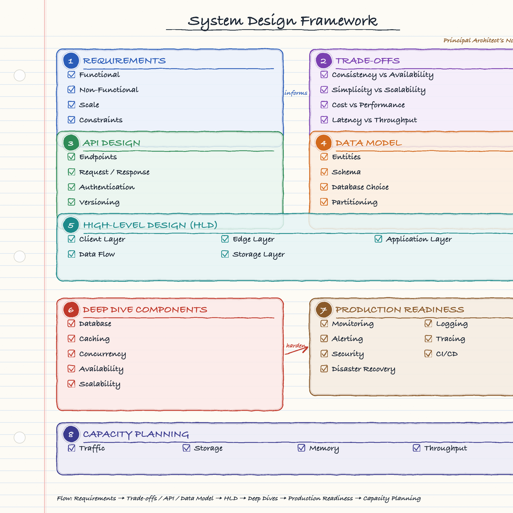
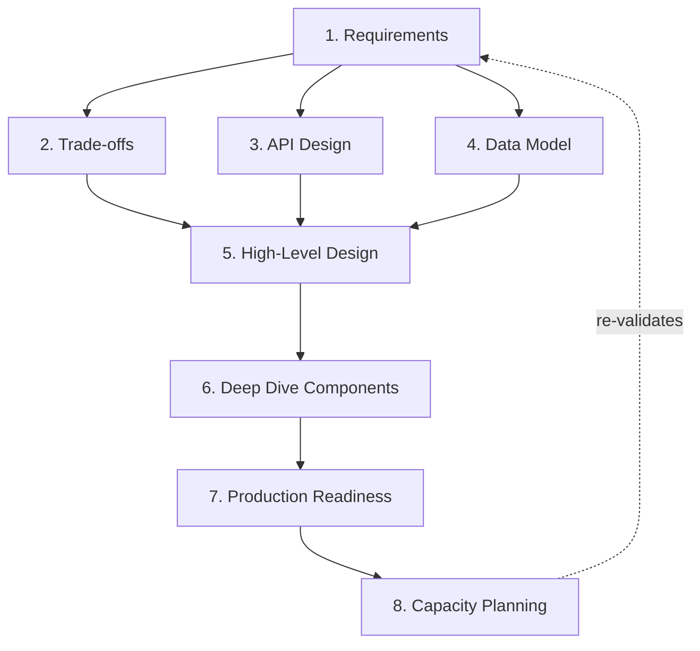

# Day 83 — The System Design Framework: A Repeatable Way to Attack Any Design Problem
## Requirements → Trade-offs / API / Data Model → HLD → Deep Dives → Production Readiness → Capacity Planning

> **Series:** System Design Interview Preparation Series  
> **Difficulty:** All levels (Junior → Principal)  
> **Core Concept:** A structured framework for approaching system design — in interviews and in production  
> **Prerequisite:** None — this is the map the rest of the series hangs off

---

---

## 🎬 Why a Framework at All?

Two engineers get the same prompt: *"Design a URL shortener."*

The first one starts drawing boxes immediately — a load balancer here, a database there, "we'll add Redis." Ten minutes in, they've built an elaborate diagram and have no idea whether it's *right*, because they never established what "right" means. When the interviewer asks "what's your read:write ratio?" the whole thing wobbles.

The second engineer spends the first three minutes asking questions. What's the scale? Do short links expire? Is a 50ms redirect acceptable, or do we need 5ms? Only *then* do they draw — and every box they draw traces back to a requirement they can name.

The difference isn't intelligence or experience. It's **process**. System design feels like an open-ended, intimidating problem because it *is* one — until you have a repeatable order of operations that turns "design a system" into a sequence of smaller, answerable questions. That order of operations is what this framework gives you.

The diagram above is that framework as a single page. This post walks each of its eight sections, explains *why* the order matters, and shows how the sections feed each other. Use it as a checklist in an interview, and as a design-review agenda in production.

> **💡 Architect's Note:** The framework is not "steps you do once and discard." It's a **loop**. Real design bounces between sections — a capacity number invalidates a database choice, which changes the data model, which changes the API. The value of the framework is that it tells you *which question to ask next* when you're stuck, and *what you might have skipped* when something feels off.

---

## 🧭 The Flow at a Glance

The arrows matter. **Requirements feed everything.** Trade-offs, API, and data model are the vocabulary you design *in*. The HLD is where they converge into a system. Deep dives harden the risky parts. Production readiness makes it operable. Capacity planning validates that the numbers actually work — and often sends you back to Requirements with a hard question. It's a directed flow with a feedback edge, not a straight line.

---

## 1. 📋 Requirements — Define "Right" Before You Build

You cannot design a correct system until you know what correct *means*. This section is where most weak designs are lost — not in the architecture, but in skipping the definition of success.

| Sub-area | The question it answers | Example |
|----------|------------------------|---------|
| **Functional** | What must the system *do*? | "Shorten a URL; redirect a short link; track click counts." |
| **Non-Functional** | *How well* must it do it? | "99.9% availability; p99 redirect < 50ms; durable links." |
| **Scale** | *How much* of it? | "100M new links/month; 10B redirects/month; 100:1 read:write." |
| **Constraints** | What boundaries are fixed? | "Single region for v1; $X budget; GDPR; existing auth service." |

**Functional** requirements are the features. **Non-functional** requirements (the "-ilities": availability, latency, durability, consistency, security) are what actually shape the architecture — they're the difference between a toy and a system. **Scale** turns adjectives into numbers, and numbers are what you design against. **Constraints** are the walls of the room: region, budget, compliance, team, existing systems.

> **⚠️ Production Pitfall:** "Make it scalable" is not a requirement — it's a wish. *"Handle 10B redirects/month at p99 < 50ms in a single region"* is a requirement. If you can't attach a number, you can't verify the design, and you'll over- or under-build. Push every vague requirement until it has a figure or an explicit "don't care."

> **✅ Recommended Practice:** State your assumptions out loud and write them down. "I'll assume 100:1 read:write and links never expire — flag me if that's wrong." This makes the whole design auditable and gives the interviewer (or your reviewer) a chance to correct course early instead of at the end.

---

## 2. ⚖️ Trade-offs — There Is No Free Lunch

Every meaningful design decision buys one property by spending another. Senior engineers are distinguished not by knowing the "best" choice but by being able to **name the trade** and justify which side they took *for this problem*.

| Trade-off | Left side buys… | Right side buys… | Decided by |
|-----------|-----------------|------------------|------------|
| **Consistency vs Availability** | Correct reads always | Serves during partitions | Is stale data harmful? (CAP — Day 41) |
| **Simplicity vs Scalability** | Fast to build & operate | Handles growth | Real near-term scale vs speculative |
| **Cost vs Performance** | Cheaper infra | Lower latency / more headroom | What's the SLA worth in $? |
| **Latency vs Throughput** | Fast individual requests | High aggregate volume | Batch vs interactive workload |

**Consistency vs Availability** is the CAP trade — during a network partition you can be consistent *or* available, not both. A bank ledger picks consistency; a "like" counter picks availability. **Simplicity vs Scalability** is the one juniors get backwards: they build for Google-scale on day one and drown in complexity for traffic that never comes. **Cost vs Performance** forces you to price your SLA — that last 10ms might cost 3× the infra. **Latency vs Throughput** is the batch-vs-interactive tension: the design that maximizes requests-per-second is rarely the one that minimizes per-request time.

> **💡 Architect's Note:** In an interview, *explicitly naming* the trade-off you're making — "I'll favor availability here and accept eventual consistency, because a slightly-stale click count is harmless" — is worth more than the choice itself. It demonstrates you understand there *is* a trade, which is the entire job.

---

## 3. 🔌 API Design — The Contract Everything Else Honors

The API is the system's public promise. Design it early, because it constrains the data model, the HLD, and every client. Get the contract right and the internals can change freely; get it wrong and you're stuck migrating callers forever.

| Sub-area | What to nail down |
|----------|-------------------|
| **Endpoints** | Resource-oriented paths, verbs, sync vs async, idempotency of writes |
| **Request / Response** | Payload shape, pagination, error model, status codes |
| **Authentication** | Who calls this? Tokens, scopes, service-to-service vs user auth |
| **Versioning** | How the contract evolves without breaking existing clients |

Define **endpoints** as resources and actions (`POST /links`, `GET /{code}`), decide which writes are idempotent, and whether long operations are synchronous or return a job handle. Pin down **request/response** shapes — including pagination and a *consistent error model*, which juniors always forget. Decide **authentication** (user tokens vs service credentials, scopes). And plan **versioning** from day one — URI (`/v1/`), header, or content negotiation — because the day you need a breaking change, retrofitting versioning is agony.

> **✅ Recommended Practice:** Design the **error contract** with the same care as the success path. Consistent status codes, machine-readable error codes, and idempotency keys on writes are what make an API survivable in production (see Day 48 on idempotency, Day 82 on retry duplication).

---

## 4. 🗄️ Data Model — Where the Design Becomes Concrete

The data model is where abstract requirements crystallize into something you can query. It's also the hardest thing to change later — you can refactor services in an afternoon, but reshaping a 10TB table across live traffic is a project (Day 77).

| Sub-area | The decision |
|----------|-------------|
| **Entities** | The nouns and their relationships |
| **Schema** | Fields, types, indexes, normalization vs denormalization |
| **Database Choice** | SQL vs NoSQL vs specialized store — driven by access patterns |
| **Partitioning** | The shard/partition key that lets it scale (Days 64, 68) |

Identify **entities** and their relationships. Design the **schema** around your *access patterns*, not around tidy normalization — how you read the data dictates how you should store it. Make the **database choice** from those access patterns and the trade-offs in §2 (Day 23): relational for rich queries and transactions, NoSQL for scale and flexible schema, plus caches/search/blob stores as needed. Then choose the **partitioning key** — arguably the highest-stakes decision in the whole design, because the wrong shard key creates hotspots you can't fix without a painful resharding (Day 28, Day 64).

> **⚠️ Production Pitfall:** Choosing the database before knowing the access patterns is backwards. "We'll use Postgres" or "we'll use Dynamo" is an *answer*; the *question* is "how is this data written and read, and at what scale?" Let the access patterns pick the store.

---

## 5. 🏗️ High-Level Design (HLD) — Assemble the System

Now the pieces converge. The HLD is the classic boxes-and-arrows diagram, but a *good* one is organized in layers, each with a clear responsibility, and it shows the **data flow**, not just the components (see Day 22 — the 7 layers of every HLD).

| Layer | Responsibility |
|-------|----------------|
| **Client Layer** | Web / mobile / API consumers — where requests originate |
| **Edge Layer** | DNS, CDN, load balancers, API gateway — routing, TLS, rate limiting |
| **Application Layer** | Stateless services holding the business logic |
| **Data Flow** | How a request traverses the layers, read and write paths |
| **Storage Layer** | Databases, caches, queues, blob/object stores |

Requests enter at the **client layer**, hit the **edge layer** (CDN for static/cached content, load balancer + gateway for auth, routing, and rate limiting), reach the stateless **application layer** where business logic lives, and land in the **storage layer**. The **data flow** is the part that separates a real design from a sticker chart: trace a *write* and a *read* end-to-end, and show where caching, queues, and replication sit.

> **💡 Architect's Note:** Keep the application layer **stateless** so you can scale it horizontally behind the load balancer. State lives in the storage layer. This single principle — stateless compute, stateful storage — is what makes the whole thing scale, fail over, and deploy cleanly.

---

## 6. 🔍 Deep Dive Components — Harden the Risky Parts

You can't deep-dive everything in the time you have, so an architect picks the **two or three components most likely to break or bottleneck** and goes deep. This section is where you prove you can go past the box on the diagram.

| Component | What "going deep" looks like |
|-----------|------------------------------|
| **Database** | Replication, indexing, sharding, read replicas, failover (Days 30, 64, 79) |
| **Caching** | What to cache, invalidation, hit-rate, stampede protection (Days 9, 37) |
| **Concurrency** | Locking (optimistic vs pessimistic), idempotency, race conditions (Days 21, 48) |
| **Availability** | Redundancy, failover, circuit breakers, graceful degradation (Days 13, 61, 72) |
| **Scalability** | Horizontal scaling, statelessness, partitioning, back-pressure |

For the **database**, discuss replication, read replicas, indexing, and failover. For **caching**, the hard part is *invalidation* and *stampede protection*, not the cache itself. **Concurrency** is where correctness bugs hide — locking strategy, idempotency, and race conditions. **Availability** is redundancy plus the resilience stack (circuit breakers, timeouts, bulkheads — Day 72). **Scalability** ties back to statelessness and partitioning.

> **✅ Recommended Practice:** Signal your prioritization: *"The redirect read path is the hottest thing in this system, so I'll deep-dive caching and read replicas; the write path is 100× lighter, so I'll keep it simple."* Choosing *where* to go deep is itself a senior signal.

---

## 7. 🚦 Production Readiness — The Part Juniors Forget

A design that works in the diagram but can't be operated, observed, or recovered isn't done — it's a liability. This section is what separates "it works on my machine" from "it survives contact with real traffic and real incidents."

| Sub-area | Why it matters |
|----------|----------------|
| **Monitoring** | Metrics on health, latency, saturation — you can't fix what you can't see |
| **Logging** | Structured, centralized logs for forensic debugging (Day 60) |
| **Alerting** | Actionable alerts on symptoms, tied to SLOs — not noise |
| **Tracing** | Follow one request across services (Days 33, 50) |
| **Security** | AuthN/Z, encryption in transit & at rest, secrets, least privilege |
| **CI/CD** | Safe, repeatable, reversible deploys (Days 25, 42, 59) |
| **Disaster Recovery** | Backups, RTO/RPO, failover, tested restores (Day 79) |

**Monitoring, logging, alerting, and tracing** are the four pillars of observability — collectively, your ability to answer "what is happening and why" at 3 AM. **Security** is cross-cutting: authentication, authorization, encryption, secrets, least privilege. **CI/CD** makes change *safe and reversible* (blue-green, canary — Days 42, 59). **Disaster recovery** is the plan for when a whole component or region is lost — with *tested* backups and explicit RTO/RPO targets.

> **⚠️ Production Pitfall:** "We have backups" is worth nothing until you've *restored* from one. Untested DR is theater. The same goes for alerts you've never seen fire and runbooks nobody has walked. Production readiness is verified, not assumed (see Day 79 — incident response, Day 81 — DLQ operations).

---

## 8. 📊 Capacity Planning — Prove the Numbers Actually Work

The final section is the reality check. You made scale claims in §1; here you verify the design can actually meet them and size the infrastructure. This is where back-of-the-envelope estimation (Days 5, 44) pays off.

| Dimension | What you estimate |
|-----------|-------------------|
| **Traffic** | QPS (peak vs average), read:write ratio, growth |
| **Storage** | Data volume now and in N years, retention, replication factor |
| **Memory** | Cache working set, per-instance footprint |
| **Throughput** | Bandwidth, messages/sec, connection limits |

Convert the scale requirements into **traffic** (peak QPS, not just average — peaks are where systems die), **storage** (volume × retention × replication), **memory** (does the hot working set fit in cache?), and **throughput** (network bandwidth, queue rates, connection ceilings). The output is concrete: number of app instances, database size, cache size, bandwidth — *and* a verdict on whether the design in §5–§7 holds up.

> **💡 Architect's Note:** Capacity planning frequently sends you *back* to Requirements — that dashed feedback arrow in the diagram. "At this traffic, a single region can't hit the durability target" is exactly the kind of finding that reopens §1. That loop isn't a failure of the process; it *is* the process. Better to discover it on the whiteboard than in production.

---

## 🧩 Putting It Together — A 45-Minute Interview, Mapped

| Minutes | Section | What you produce |
|---------|---------|------------------|
| 0–5 | Requirements | Functional list, NFRs with numbers, scale, constraints |
| 5–8 | Trade-offs | Named the 2–3 trades that matter here |
| 8–15 | API + Data Model | Core endpoints, entities, schema, DB choice, shard key |
| 15–28 | HLD | Layered diagram with read & write data flow |
| 28–38 | Deep Dives | 2–3 hardened components (caching, DB, concurrency…) |
| 38–43 | Production Readiness | Observability, security, DR at a high level |
| 43–45 | Capacity Planning | QPS / storage / memory numbers; sanity-check the design |

The same map works for a design *review*: walk the eight sections as an agenda and you'll catch the gap before it ships.

---

## 🔑 Key Takeaways

1. **Requirements define "right."** No numbers, no verifiable design. Push every vague ask until it has a figure or an explicit "don't care."
2. **Name the trade-off, then choose.** Naming the trade is the senior signal; the choice is secondary and context-dependent.
3. **Design the API contract early** — including the error model, idempotency, and versioning — because everything downstream honors it.
4. **Access patterns pick the database**, not the other way around. The shard key is the highest-stakes, hardest-to-change decision.
5. **HLD is layered and shows data flow.** Stateless compute, stateful storage — that principle is what makes it scale.
6. **Deep-dive the risky few, not everything.** Choosing *where* to go deep is itself an architectural skill.
7. **Production readiness is not optional.** Observability, security, CI/CD, and *tested* DR are the difference between a diagram and a system.
8. **Capacity planning validates the whole design** — and its feedback arrow back to Requirements is a feature, not a detour.
9. **The framework is a loop, not a line.** Its real value is telling you which question to ask next.

---

## ⚡ TL;DR

> Attack any system design in a fixed order: **Requirements** (with numbers) → **Trade-offs** (named explicitly) → **API + Data Model** (the contract and the access patterns) → **HLD** (layered, with data flow) → **Deep Dives** (harden the risky 2–3 components) → **Production Readiness** (observability, security, CI/CD, DR) → **Capacity Planning** (QPS/storage/memory that validates the design and loops back to requirements). The framework's value isn't the boxes — it's giving you the next question to ask when you're stuck.

---

## 📖 Related Reading

- **Day 3** — Functional vs Non-Functional Requirements
- **Day 5 / Day 44** — Capacity Estimation
- **Day 22** — The 7 Layers of Every High-Level Design
- **Day 23** — Database Selection for System Design
- **Day 41** — ACID vs BASE & CAP
- **Day 64 / Day 68** — Sharding & Partitioning
- **Day 72** — The Resilience Stack
- **Day 79** — Production Database Corruption: Incident Response
- **Day 81 / Day 82** — DLQ Operations & Kafka Idempotence

---

*Day 83 · System Design Interview Preparation Series · How to Think Like an Architect · [YouTube](https://www.youtube.com/@CodeWithSunchitDudeja) · [Instagram](https://www.instagram.com/sunchitdudeja/)*
