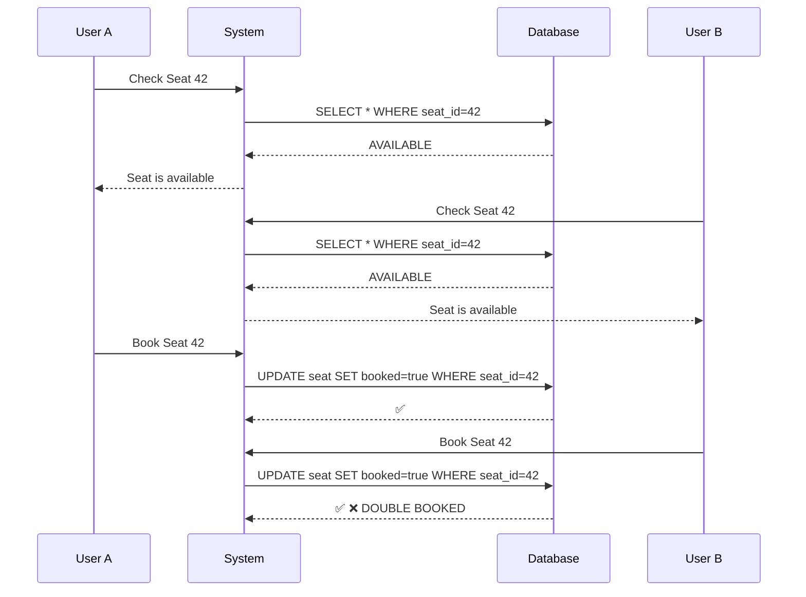
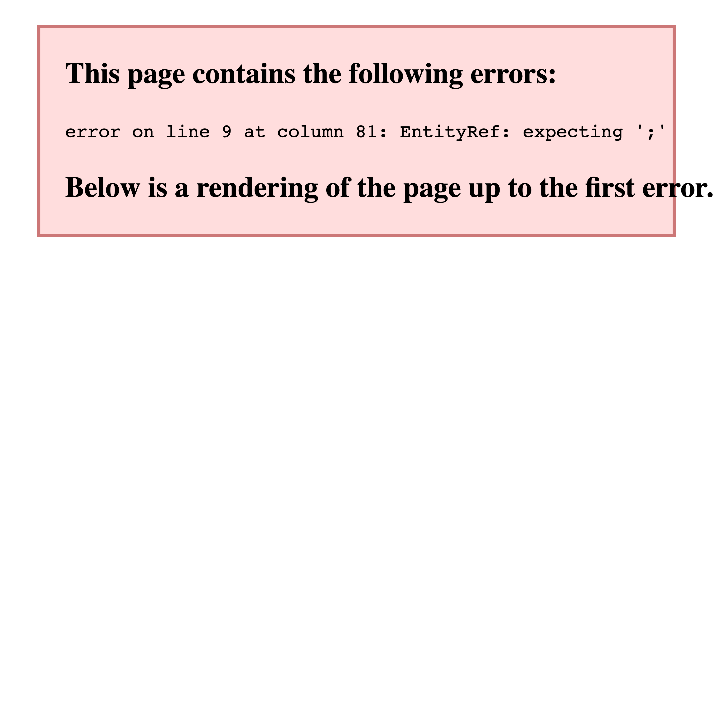
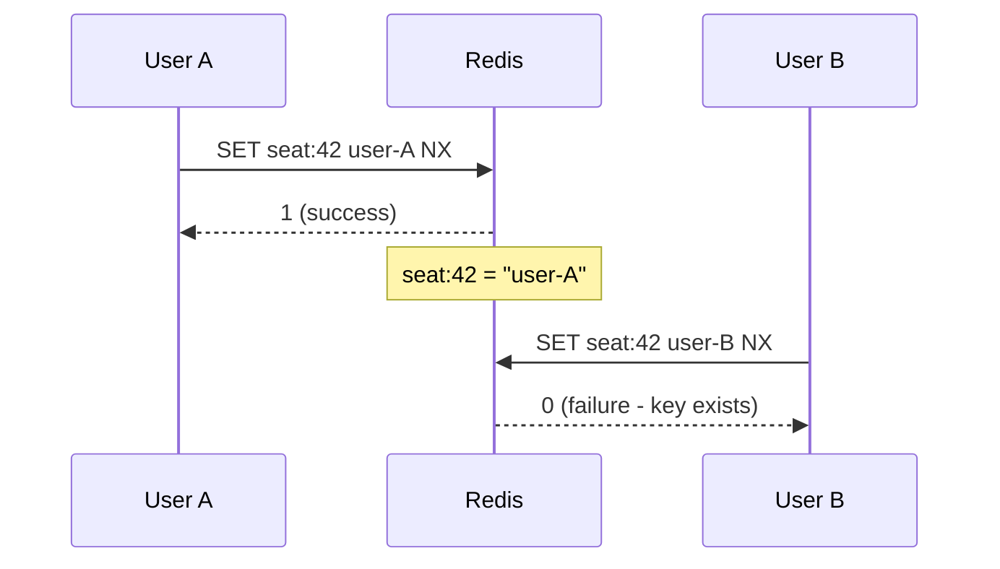
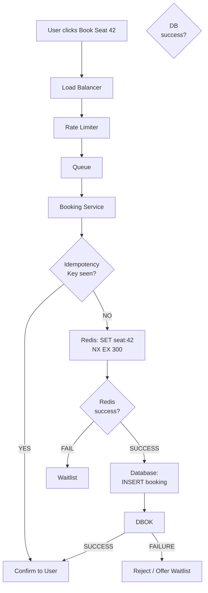

# Day 84 — The Booking System Race Condition: How Millions of Concurrent Requests, Redis Atomicity, and Queues Prevent Double Booking
## Why "Book Seat 42" Becomes a Distributed Systems Problem at Million-Request Scale

> **Series:** System Design Interview Preparation Series  
> **Difficulty:** Senior / Principal  
> **Core Concept:** High-scale resource allocation, concurrency control, Redis atomic operations, queues, rate limiting, idempotency  
> **Prerequisite:** Day 23 — Database Selection, Day 48 — Idempotency, Day 64 — Sharding, Day 72 — Resilience Stack, Day 81 — Dead Letter Queue

---

## 🎬 The Story

It is 9:59:50 AM.

A popular concert has released 500 tickets for a show in three months. Ticket sales are limited to 500 for *good reasons* — the venue caps out at 500 people.

The booking system is live.

9:59:55 AM — the website is humming, a few pre-sales trickling in.

10:00:00 AM — the sale officially opens.

In the **first second**, the system receives **1,000,000 booking requests** from fans frantically clicking "buy ticket."

Fifty users are currently trying to book Seat 42.

In a naive system:

User A: Check Seat 42 → Available
User B: Check Seat 42 → Available
User C: Check Seat 42 → Available
...
User A: Book Seat 42 → SUCCESS
User B: Book Seat 42 → SUCCESS
User C: Book Seat 42 → SUCCESS

Now five users have successfully booked the same seat.

The booking system has **oversold** the venue. Fans arrive on concert day — five people hold tickets for the same seat. The venue has a capacity of 500, and now it has accidentally sold 2,000 tickets (an exaggeration, but the principle holds).

This incident didn't happen because of a bug in the booking logic. It happened because the system didn't understand **concurrency** — the fact that multiple independent requests can observe and modify the same data simultaneously.

> **The core problem:** How do you guarantee that one scarce resource (a seat) can be allocated to only one user, even when millions of requests arrive concurrently?

This is the question this entire architecture is built to answer.

---

## 🖼️ The Architecture at a Glance

```
                    MILLIONS OF USERS
                           │
                           ▼
                  ┌─────────────────┐
                  │  Load Balancer  │
                  └────────┬────────┘
                           │
                           ▼
                  ┌─────────────────┐
                  │   Rate Limiter  │
                  └────────┬────────┘
                           │
                           ▼
                  ┌─────────────────┐
                  │      Queue      │
                  └────────┬────────┘
                           │
                           ▼
                ┌───────────────────────┐
                │   Booking Service     │
                └────────┬──────────┬───┘
                         │          │
                 ┌───────┘          └────────┐
                 ▼                            ▼
             ┌────────┐              ┌──────────────┐
             │ Redis  │              │   Database   │
             │ Atomic │              │   Durable    │
             └────────┘              └──────┬───────┘
                                            │
                                            ▼
                                    ┌──────────────┐
                                    │  Waitlist    │
                                    └──────────────┘
```

**Detailed Architecture Diagram:**


Each component solves a different problem:
- **Load Balancer** → Distribute traffic
- **Rate Limiter** → Prevent overload
- **Queue** → Absorb spikes
- **Booking Service** → Business logic
- **Redis** → Fast, atomic coordination
- **Database** → Durable truth + constraints
- **Waitlist** → Handle sold-out inventory

---

## 1. 🧩 The Problem: Check-Then-Act is Not Atomic

The naive booking logic is:

```
if seat.available:
    book(seat)
```

This looks correct in isolation. The problem emerges under concurrency.



Both users observed the same state (AVAILABLE), both acted on it independently, and both succeeded. The system violated its core invariant: **one seat, one owner**.

**Visual Comparison (Naive vs Redis Solution):**



> **💡 Architect's Note:** The problem isn't "the database is slow." The problem is that **CHECK** and **ACT** are two separate operations. In a distributed system, any two separate operations can race each other. The solution is to make them **atomic** — indivisible, executed as one unit.

---

## 2. ⚖️ Why Scale Makes This Harder

At small scale (10 users), double booking is unlikely but possible. At large scale (1 million users), it becomes **inevitable** without proper protection.

Think of it probabilistically. The more concurrent requests, the higher the probability that two requests will race on the same resource:

```
10 users        → 1 chance per day (maybe)
1,000 users     → 10 chances per day
1,000,000 users → Tens of thousands per day
```

At ticket release scale, you don't get a warning sign. You get a lawsuit.

---

## 3. 📊 The Three Problems in One Diagram

The high-scale booking architecture solves three distinct problems that beginners often conflate:

| Problem | Symptom | Solution |
|---------|---------|----------|
| **Scalability** | 1M requests/sec arrives; system can't process it all | Load Balancer, Horizontal Scaling, Queue, Rate Limiting |
| **Concurrency** | Multiple users want the same resource | Redis atomic operations, Locks, Database constraints |
| **Reliability** | Network losses, retries, partial failures | Idempotency, Retries, TTL, Durable DB, Reconciliation |

A weak design tries to solve all three with one component. A strong design uses the **right tool for each problem**.

---

## 4. 🚀 Load Balancing: Distribute Traffic Across Multiple Servers

The first limit is the application server's capacity.

```
1 server  @ 10,000 RPS
= 10,000 RPS total
```

But the ticket sale generates:

```
1,000,000 RPS incoming
```

A single server is a bottleneck.

The solution is **horizontal scaling** behind a load balancer:

```
Load Balancer
 /     |     \
▼      ▼      ▼
API-1  API-2  API-3

100 servers × 10k RPS = 1M RPS
```

Now the application layer can handle the traffic.

> **✅ Recommended Practice:** Keep application servers **stateless**. No session affinity, no in-process caching of resource state. This makes it easy to scale horizontally and to drain/restart instances without losing bookings-in-progress.

---

## 5. 🚦 Rate Limiting: Protect Downstream Services

Even with 100 servers, allowing every request to reach the booking service is wasteful.

Rate limiting sits upstream and enforces limits:

```
User limit:     20 requests/sec
IP limit:       100 requests/sec
Event limit:    50,000 requests/sec
```

Requests above the limit are:
- **Rejected** (HTTP 429) → client backs off
- **Queued** → wait their turn
- **Delayed** → rate-limited client retries

This protects the booking service from unnecessary work and the database from being hammered by duplicate attempts.

> **⚠️ Production Pitfall:** Rate limiting that's *too strict* converts a rush of legitimate demand into a rush of 429 errors and client retries, which can actually increase backend load. Tune the limits based on your actual capacity, not a guess.

---

## 6. 📬 Queues: Absorb Traffic Spikes

After rate limiting, a **queue** provides a buffer.

```
Incoming Traffic: 1,000,000 RPS
Processing Rate: 50,000 RPS

Without queue:
Requests get rejected or overload the system.

With queue:
Queue depth = 950,000 at t=0
             = 900,000 at t=1 (50k processed)
             = ...
             = 0 at t=19 (all caught up)
```

The queue smooths the traffic spike. Instead of a thundering herd hitting the booking engine simultaneously, requests wait and are processed in order.

This is called **backpressure** — the system absorbs demand and processes it at a sustainable rate.

**Queue technologies:**
- Kafka (partitioned, replay-able, high throughput)
- RabbitMQ (flexible routing, message models)
- SQS (managed, simple, AWS-native)
- Redis Streams (fast, simple, in-memory)
- Pulsar, Kinesys, etc.

---

## 7. 🔒 Redis: Atomic Seat Reservation

Now we arrive at the core concurrency control problem.

Redis is single-threaded (on its command-processing path), which gives it a powerful property: **commands are executed sequentially**, and there's no race on individual keys.

**The key operation: `SET ... NX` (set if not exists)**

```
SET seat:42 user-123 NX EX 300
```

Meaning:
- Set the key `seat:42` to value `user-123`
- **Only if it doesn't already exist** (`NX`)
- **Expire after 300 seconds** (`EX 300`)

Result:
```
1  → successfully set (key didn't exist)
0  → failed (key already exists)
```

**How it prevents double booking:**



User A succeeds. User B fails. Only one user can claim the seat through Redis's atomic operation.

> **💡 Architect's Note:** Redis's single-threaded execution model doesn't mean it's slow (memory-based operations are extremely fast). It means concurrency is simpler — multiple clients competing for a key are serialized by Redis's event loop, so there's no possibility of both winning.

---

## 8. ⚠️ But Redis Is Not Your Source of Truth

This is critical.

```
❌ WRONG:
Redis → "This is THE database"

✅ RIGHT:
Redis  → Fast coordination / temporary state
Database → Durable business records
```

A booking claimed in Redis must also be persisted in the database. What if:

```
Redis: SET seat:42 user-A → SUCCESS
DB:    INSERT booking → FAILURE
```

Now Redis says the seat is booked, but the database doesn't have the record. You've created an inconsistency.

**The solution: temporary reservations.**

```
Redis reservation: 5-minute TTL
       ↓
User completes payment
       ↓
Database: INSERT booking → SUCCESS
       ↓
Reservation → CONFIRMED
```

If payment fails or takes too long, the reservation expires in Redis and the seat becomes available again.

---

## 9. 📝 Idempotency: Retries Must Be Safe

Networks are unreliable. Requests get lost, responses are dropped.

```
User clicks Book
     ↓
Server processes successfully
     ↓
Response packet lost
     ↓
User sees timeout
     ↓
User clicks Book again
```

The server receives:
```
Request #1 → Book Seat 42
Request #2 → Book Seat 42
```

Without idempotency, the second request creates a second booking.

**Idempotency Key Solution:**

The client sends:
```
POST /bookings
Idempotency-Key: abc-123-def

{
  "event_id": "concert-1",
  "seat_id": "42",
  "user_id": "user-100"
}
```

The server stores:
```
idempotency_key: "abc-123-def"
result: {"booking_id": "123", "status": "CONFIRMED"}
```

If the same request arrives again:
```
abc-123-def already exists
            ↓
Return stored result
```

No second booking is created.

> **✅ Recommended Practice:** Idempotency is not a feature — it's a **requirement**. Every write operation that could be retried (and almost all of them can be, due to network uncertainty) must be idempotent.

---

## 10. ⏳ TTL: Prevent Abandoned Reservations

A reservation shouldn't block inventory forever.

```
Seat 42 reserved by user-123
       ↓
User opens payment page
       ↓
User gets distracted
       ↓
Browser tab open for 30 minutes
       ↓
Seat should become available again
```

TTL (Time To Live) solves this:

```
SET seat:42 reservation-token EX 300
```

After 300 seconds (5 minutes):
```
seat:42 automatically expires
       ↓
Key is deleted
       ↓
Seat available again
```

Without TTL, the seat stays reserved even though the user abandoned checkout, effectively removing it from inventory forever.

---

## 11. 🗄️ Database Constraints: Defense in Depth

Redis should not be the *only* defense against double booking.

The database should enforce a **unique constraint**:

```sql
ALTER TABLE bookings
ADD CONSTRAINT unique_event_seat
UNIQUE (event_id, seat_id);
```

Now if two requests somehow bypass Redis protection:

```
Request A → INSERT booking → SUCCESS
Request B → INSERT booking → UNIQUE violation ❌
```

The database becomes the final safety net. This is **defense in depth** — multiple layers, each defending against a different failure mode.

---

## 12. 🌊 The Complete Flow



Key decision points:
1. **Idempotency** — have we seen this request before?
2. **Redis** — can we atomically claim the seat?
3. **Database** — can we persist the booking?

---

## 13. 🪑 When There Are No Seats: Waitlist

If Redis fails to claim a seat (it's already booked), move to the waitlist:

```
Booking Request
      │
      ▼
Available seats?
    ╱    ╲
  YES    NO
   │      │
   ▼      ▼
 Book   Waitlist

Position 1 → User A (waiting)
Position 2 → User B (waiting)
Position 3 → User C (waiting)

When a cancellation occurs:
Seat available
      ↓
Waitlist head
      ↓
User A
      ↓
Offer seat
```

A waitlist is just a queue with business semantics — instead of processing a message, you're offering an opportunity.

---

## 14. 🚨 Failure Scenarios

**Redis fails completely:**

```
Redis unavailable
       ↓
Strategy: Fail closed
       ↓
Disable booking
       ↓
Users see "Booking temporarily unavailable"
```

For ultra-scarce inventory, correctness is more important than availability. Better to deny bookings than to risk overselling.

**Database fails:**

```
Redis reservation created
Database write fails
       ↓
TTL cleans up the reservation
       ↓
Seat available again (eventually)
```

TTLs act as a self-healing mechanism.

**Queue message duplicated:**

```
Queue delivers message twice
       ↓
Idempotency key prevents duplicate booking
```

Idempotency covers this.

**Response lost:**

```
Booking succeeds
Response packet dropped
User sees timeout
User retries
       ↓
Idempotency key returns original result
```

Again, idempotency saves the day.

---

## 15. 🔥 Hot Key Problem

A massively popular event creates a hot key.

```
5M users trying to book:
concert-123

Result: enormous traffic to one Redis key.

Redis can handle millions of requests/sec, but if all of them target one key, that key becomes a bottleneck.
```

Mitigations:
- **Sharding** — partition seats by group (A-M, N-Z) and book against the relevant group's inventory
- **Queue discipline** — throttle requests more aggressively
- **Request coalescing** — combine duplicate concurrent requests
- **Waitlist → re-offer** — once inventory is gone, focus on waitlist management instead of attempting to book

---

## 16. 🏛️ Tier Analysis: Separating Three Problems

The most important insight is that this architecture isn't *one* problem. It's **three**:

```
Layer 1: SCALABILITY
What: Handle 1M RPS
How: Load Balancer, Queues, Rate Limiting, Horizontal Scaling

Layer 2: CONCURRENCY
What: Guarantee one seat → one owner
How: Redis atomic ops, Temporary reservations, DB constraints

Layer 3: RELIABILITY
What: Survive failures and retries
How: Idempotency, TTLs, Durable DB, Reconciliation, Observability
```

Each layer uses different tools and solves a different problem. Conflating them leads to confusion.

---

## 17. 📊 Observability

Production visibility is non-negotiable.

Monitor:
- **Traffic** — RPS, success/failure rate
- **Queue** — depth, processing lag, dead letters
- **Redis** — latency, memory, hit rate, hot keys
- **Database** — query time, lock contention, replication lag
- **Business** — booking success rate, waitlist size, double-booking attempts (should be zero)

Alert on:
- Queue depth exceeding threshold
- Redis latency spikes
- DB lock timeouts
- Unusual double-booking attempts (potential bug)

---

## 18. 🎓 The Real Lesson: Resource Allocation Under Contention

This isn't just about booking seats. The same problem appears everywhere:

```
Tickets → Seats
Hotels  → Rooms
Flights → Seats
Parking → Spots
Appointments → Time slots
Cloud   → GPU allocation
Inventory → Units
```

Whenever you have:
```
Many users + Limited resources + Concurrent requests
```

You have a **distributed resource allocation problem**, and this architecture applies.

---

## 🔑 Key Takeaways

1. **Race conditions are real.** CHECK + ACT must be atomic. Don't assume a sequence of reads and writes is safe.
2. **Redis is excellent for fast, atomic coordination** — not a replacement for a durable database.
3. **Queues and rate limiting are your first line of defense** — they prevent overload before expensive operations start.
4. **Idempotency is mandatory.** Every write can be retried; assume it will be.
5. **TTLs prevent resource leaks** — abandoned reservations should expire.
6. **Database constraints are the final safety net** — never rely on application logic alone.
7. **Separate scalability, concurrency, and reliability** — they have different solutions.
8. **Fail gracefully under extreme load** — sometimes "booking unavailable" is better than "oversold."

---

## ⚡ TL;DR

> When millions of users race for the same scarce resource, a naive "check then book" fails because CHECK and ACT are separate operations that can race. Solve it with: (1) Load Balancer + Queue to handle traffic; (2) Redis atomic SET-NX to atomically claim the resource; (3) Database with UNIQUE constraint for durable enforcement; (4) Idempotency keys to make retries safe; (5) TTL to expire abandoned reservations; (6) Waitlist for sold-out inventory. Separate scalability (load balancer, queue) from concurrency (Redis, locks) from reliability (idempotency, retries, TTL).

---

## 📖 Related Reading

- **Day 23** — Database Selection for System Design
- **Day 28** — Sharding and Hot Key Problems
- **Day 48** — The Idempotency Key
- **Day 64** — Partitioning Strategies
- **Day 72** — The Resilience Stack
- **Day 79** — Production Database Corruption: Incident Response
- **Day 81** — The Dead Letter Queue
- **Day 83** — System Design Framework

---

*Day 84 · System Design Interview Preparation Series · How to Think Like an Architect · [YouTube](https://www.youtube.com/@CodeWithSunchitDudeja) · [Instagram](https://www.instagram.com/sunchitdudeja/)*
