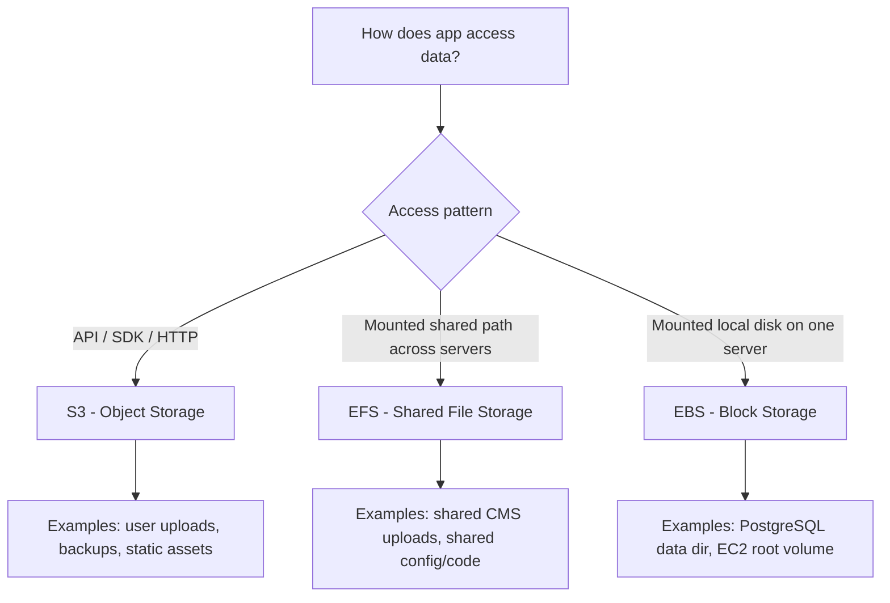
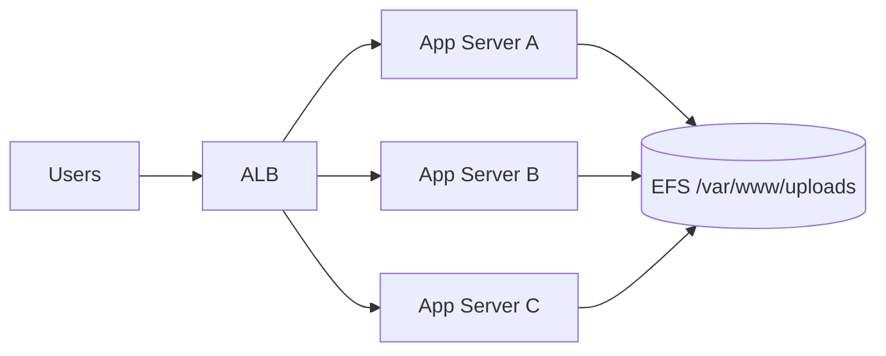
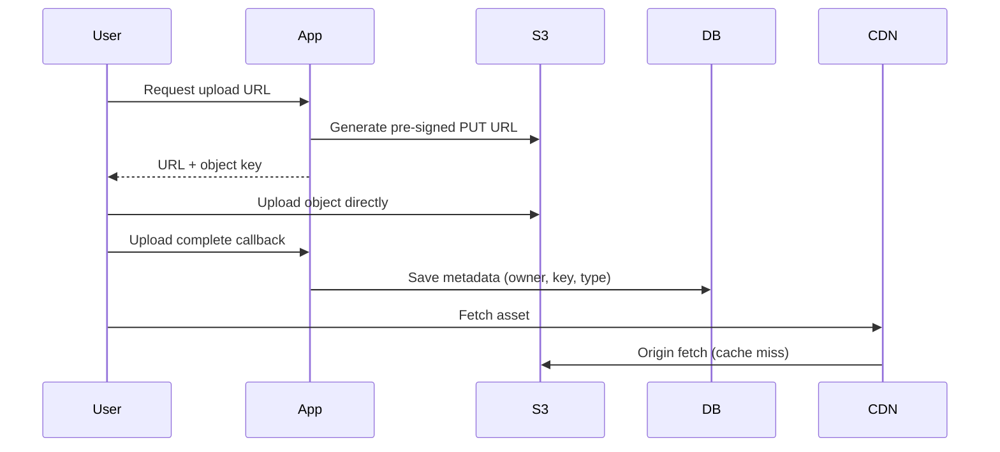

# Day 85 — AWS Storage Explained Simply: S3 vs EFS vs EBS (A Senior Architect's Guide for Young Developers)
## The One Decision That Quietly Decides Your System's Cost, Scale, and Failure Modes

> **Series:** System Design Interview Preparation Series  
> **Difficulty:** Intermediate → Senior  
> **Core Concept:** Object vs File vs Block storage selection, access patterns, cost/performance trade-offs, production failure modes  
> **Prerequisite:** Day 23 — Database Selection, Day 30 — AWS Replication, Day 64 — Sharding, Day 77 — On-Prem to AWS Migration

---

## 🎯 Why This Topic Matters

Most teams do not fail because they forgot an AWS service name.  
They fail because they picked storage by **label** ("we store files, so EFS") instead of by **access pattern** ("how does the app actually read/write data?").

At scale, a wrong storage choice leads to:
- runaway cost,
- latent performance issues,
- painful rewrites after launch.

This post gives you a practical and architectural framework to pick between:
- **Amazon S3** (object),
- **Amazon EFS** (shared filesystem),
- **Amazon EBS** (block disk attached to one compute instance at a time).

---

## 🧠 The Simple Analogy (Correct but Incomplete)

| Service | Analogy | What It Really Means |
|---|---|---|
| **S3** | Google Drive / Dropbox | Store independent objects accessed via API/SDK (HTTP) |
| **EFS** | Shared network drive | Multiple servers mount the same filesystem concurrently |
| **EBS** | Local hard drive | One server gets a low-latency attached block volume |

Analogy helps beginners.  
Architecture needs one more step: **how your code accesses data**.

---

## The Golden Rule (Architect Version)

> Start with **data access semantics**, not AWS names.

Ask in this order:
1. Is data accessed as API objects (`PUT/GET`)?
2. Is data accessed as mounted files/directories by many instances?
3. Is data accessed as low-latency block storage by one instance?

If 1 → **S3**, if 2 → **EFS**, if 3 → **EBS**.

---

## 📊 Comparison Table (Interview + Production Useful)

| Feature | Amazon S3 | Amazon EFS | Amazon EBS |
|---|---|---|---|
| Storage model | Object | File (NFS) | Block |
| App access style | SDK/API over HTTP | `open/read/write` via mounted path | OS block device + filesystem |
| Multi-instance concurrent access | Yes (API-based) | Yes (shared mount) | No (single writer model for most workloads) |
| Latency profile | Higher than local disk | Network filesystem latency | Lowest among the three |
| Best fit | Uploads, media, backups, logs, data lakes | Shared app content/config across nodes | DB volumes, OS roots, transaction-heavy disks |
| Typical anti-pattern | Using it like a POSIX filesystem | Using it for object upload workloads | Trying to share one volume across app fleet |
| Cost tendency | Usually cheapest at scale | Usually most expensive for bulk file storage | Medium; depends on type + provisioned performance |

---

## 🧭 Quick Decision Diagram

---

## "Mounted as a Drive" — What It Actually Means

Mounted means storage appears at a Linux path such as `/data`, `/shared`, `/var/lib/postgresql`.

Your app uses normal file APIs:
- `open()`
- `read()`
- `write()`
- `ls`

No explicit S3 API call is needed in code for each operation.

### Practical meaning
- **EFS mount:** many servers mount the same path and see the same files.
- **EBS mount:** one server mounts its own private high-performance disk.

---

## Real-Life App Example: Shared Network Drive (EFS)

Suppose you run a WordPress-like CMS on 6 EC2 app servers behind a load balancer.
Users upload images from any server.

Without EFS:
- upload lands on Server A local disk,
- request later hits Server C,
- image missing (404/inconsistent behavior).

With EFS:
- all servers mount `/var/www/uploads`,
- upload from Server A is instantly visible on Server C/D/E/F.

---

## Real-Life App Example: Database Storage (EBS)

A PostgreSQL service needs low latency and predictable IOPS.

Pattern:
- EC2 instance + EBS gp3/io2 volume
- DB writes WAL/data to mounted EBS (`/var/lib/postgresql`)
- snapshots for backup

Why not EFS?
- Database random I/O and lock-heavy behavior generally prefer attached block volume characteristics.

---

## Real-Life App Example: User Uploads & Document Store (S3)

A document platform where users upload PDFs/photos/videos.

Pattern:
- App issues pre-signed URL,
- client uploads directly to S3,
- metadata stored in DB,
- CDN serves static content.

---

## ✅ When to Choose What

### Choose S3 when:
- data is object-like and API-driven,
- you need virtually unlimited scale,
- you want cheap durable storage for files/backups/logs,
- you plan CDN distribution and lifecycle policies.

### Choose EFS when:
- multiple compute nodes must read/write same filesystem simultaneously,
- application expects POSIX-style directory behavior,
- shared content path is mandatory.

### Choose EBS when:
- workload is single-node attached disk oriented,
- low-latency block performance matters,
- running stateful engines (databases/search nodes/OS root volumes).

---

## ❌ Common Mistake (and Why It Happens)

> "We store files, so we need EFS."

This is usually wrong for user uploads.

A user-uploaded PDF is often:
- write once,
- read many,
- accessed by key/URL/API,
which maps naturally to **S3 object storage**.

EFS should be chosen only when your runtime requires shared mounted filesystem semantics.

---

## Architect Trade-Off Matrix

| Concern | S3 | EFS | EBS |
|---|---|---|---|
| Horizontal scale | Excellent | Good | Limited per attached instance |
| Application simplicity (file APIs) | Lower (SDK integration needed) | High | High (single node) |
| Multi-node sharing | Via API, naturally | Native | Not native for app fleet sharing |
| Peak transaction latency | Moderate | Moderate | Best |
| Cost for large cold-ish file corpus | Best | Worst of three in many scenarios | Depends on provisioned size/type |
| Operational blast radius | Object-level patterns | Shared FS contention risks | Node-coupled failure domain |

---

## Production Patterns You Should Remember

### Pattern 1: S3 + CloudFront for static/user assets
- Most scalable and cost-effective for public/static delivery.

### Pattern 2: EBS for stateful compute
- Database/search/queue broker local durable volumes.

### Pattern 3: EFS only where true shared filesystem is needed
- CMS shared uploads, shared plugin directories, shared rendering workspace.

### Pattern 4: Hybrid is normal
- Example: app binary on container image, user uploads in S3, DB on EBS, occasional shared runtime path on EFS.

---

## Interview-Ready Answer (30 seconds)

If data is accessed as objects via API, use **S3**.  
If multiple servers must mount and read/write the same filesystem path, use **EFS**.  
If one server needs low-latency attached disk (like database/OS), use **EBS**.  
The key is not "file vs not file"; the key is **object API vs shared filesystem vs local block disk**.

---

## Final One-Line Rule

> **If it's uploaded via API, use S3; if it's mounted as a shared folder, use EFS; if it's a local high-performance disk for one node, use EBS.**

