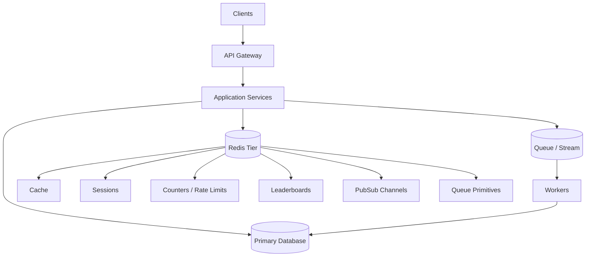
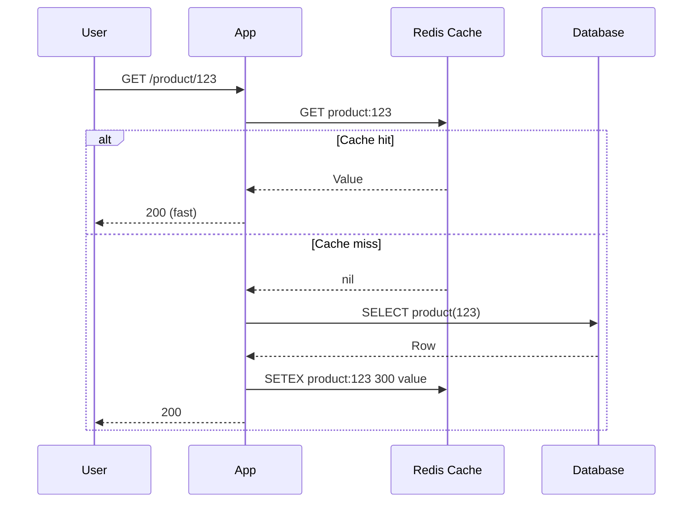
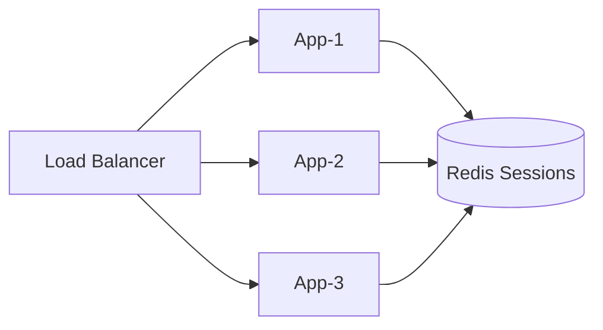
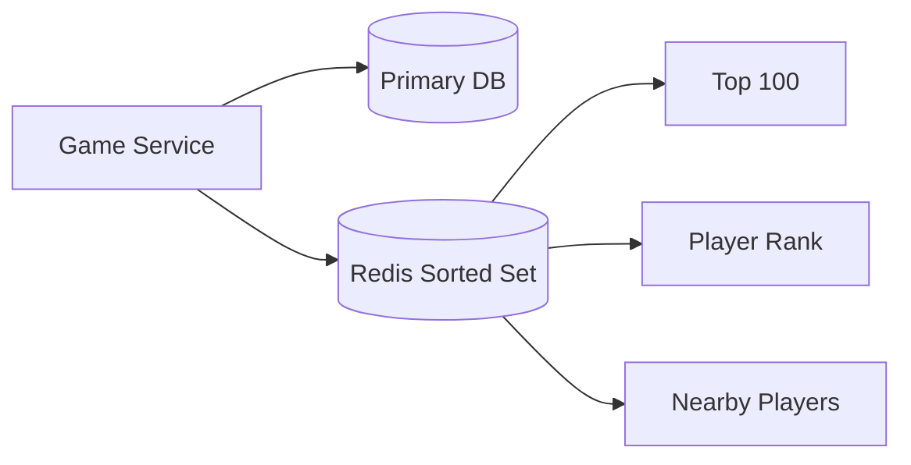
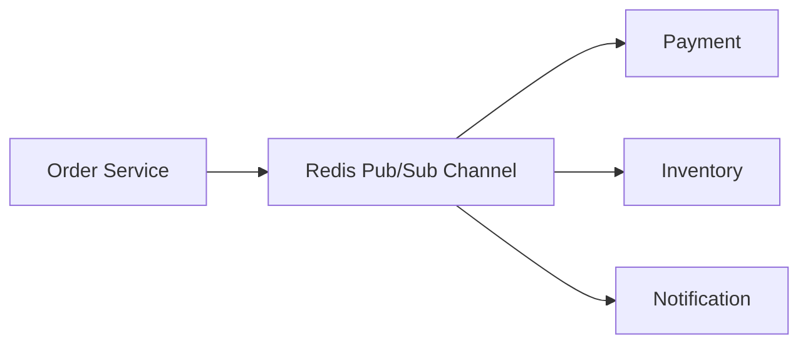
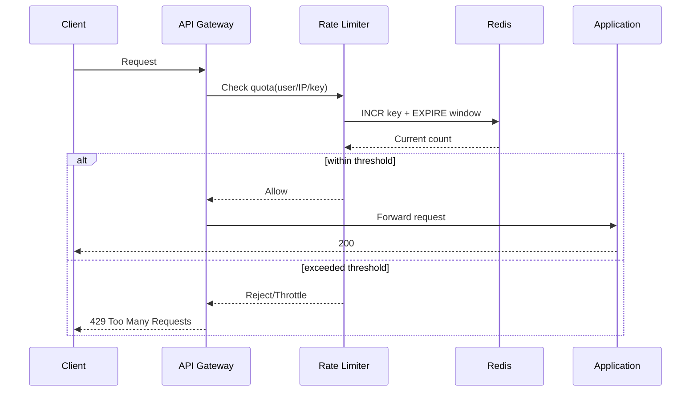
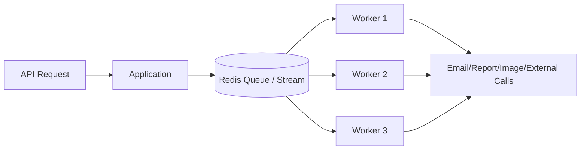
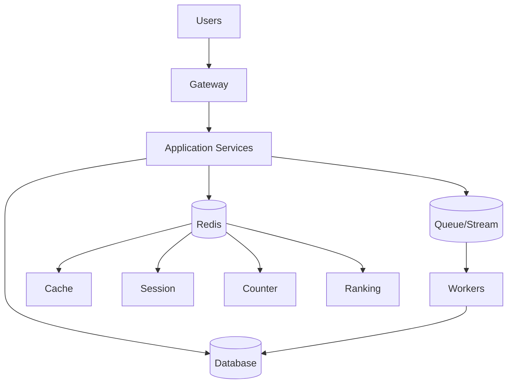
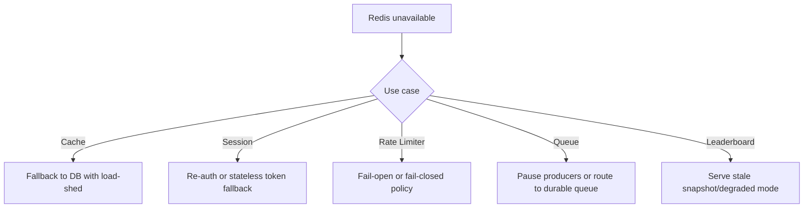
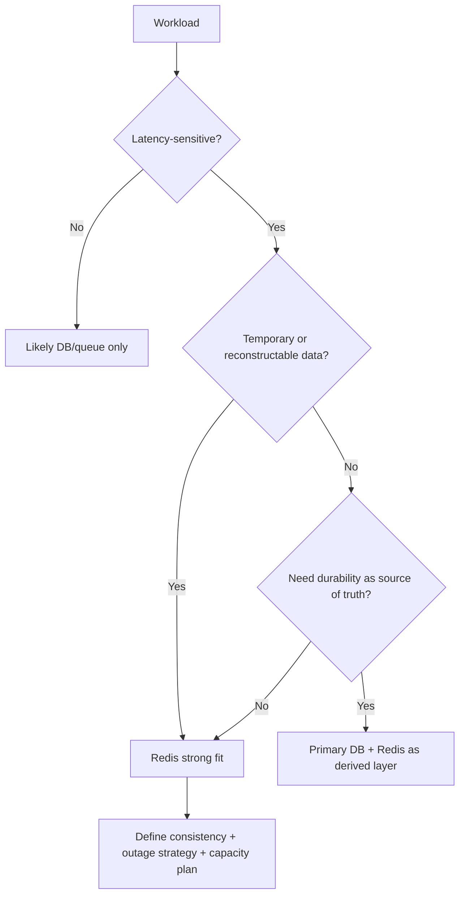

# Day 86 — Redis as a System Design Building Block: A Senior Architect's Perspective
## Beyond "Fast Key-Value Store": Responsibility, Consistency, and Failure Design

> **Series:** System Design Interview Preparation Series  
> **Difficulty:** Senior / Principal  
> **Core Concept:** Redis responsibility boundaries, consistency/durability trade-offs, outage behavior, and production workflows  
> **Prerequisite:** Day 48 — Idempotency, Day 55 — Real-Time Notifications, Day 57 — Rate Limiting, Day 81 — DLQ

---

Redis is often introduced as “a fast in-memory key-value store.” That is technically correct, but architecturally incomplete.

From a senior system design perspective, Redis is valuable because it can take several responsibilities away from your primary database and application tier: accelerating reads, coordinating distributed state, controlling traffic, processing asynchronous work, and maintaining real-time structures.

The important question is not:

> **“Where can I use Redis?”**

It is:

> **“Which system responsibility should Redis own, what consistency guarantees do I need, and what happens when Redis is unavailable?”**

The six patterns below are among the most useful Redis building blocks in large-scale systems.

---

## Senior Architect System View (Workflow)



---

## 1. Caching: Protect the Database Before Optimizing Everything Else

Without caching, every frequently accessed request reaches the database.

```text
100,000 requests/sec
        |
        v
   Database
        |
   Connection pressure
        |
   High latency
```

With Redis:

```text
100,000 requests/sec
        |
        v
   Application
        |
        +---- Redis ---> Cache Hit
        |
        +---- Database ---> Cache Miss
```

### Cache Read Workflow



### What should we cache?

- Frequently accessed database records
- API responses
- Product/catalog information
- Configuration and feature flags
- Expensive aggregation results
- Authorization metadata
- Frequently queried reference data

### The key architectural decision: TTL

```text
SET product:123 = {...}
EXPIRE product:123 300
```

For critical data, you may also need:
- invalidation on writes,
- versioned keys,
- write-through/cache-aside,
- event-driven invalidation,
- stale-while-revalidate,
- negative caching.

### Senior architect question

Don’t ask, “Can Redis make this query faster?”

Ask:

> “What is acceptable staleness, and what is the failure behavior when cache disappears?”

Redis cache is typically an optimization layer, not the only persistent source of truth.

---

## 2. Session Store: Moving State Out of Application Servers

Stateless services scale better than stateful application servers.

If user session data lives only inside App-1, the next request routed to App-2 may fail user continuity.

### Session Workflow



Example session object:

```text
session:abc123
{
  userId: 9182,
  roles: ["admin"],
  cartId: "cart-772",
  expiresAt: ...
}
```

Redis works well because sessions need low-latency read/write, TTL expiration, and centralized access.

### Senior decision boundary

If access tokens are self-contained and short-lived, centralized Redis session lookups may be unnecessary.  
The bigger decision is auth model: centralized mutable session vs largely stateless token validation.

---

## 3. Leaderboards: Redis as a Real-Time Ranking Engine

Leaderboards need rank/order operations at high write/read frequency.

Sorted sets map naturally:

```text
ZADD leaderboard 9500 player123
```

### Leaderboard Workflow



The database remains durable source of business data; Redis serves real-time rank/query traffic.

> Choose data structure by access pattern, not by familiarity.

---

## 4. Pub/Sub Messaging: Decoupling Services (With Explicit Loss Semantics)

Synchronous coupling amplifies latency/failure.

Eventing model:



Channel examples:

```text
channel:order-events
OrderCreated
OrderPaid
OrderCancelled
```

### Critical warning

Redis Pub/Sub is not a durable queue. If subscriber is disconnected, messages may be missed.

Decision question:

> “Can this event be lost?”

If yes, Pub/Sub can fit. If no, use durable stream/queue semantics.

---

## 5. Counters and Rate Limiting: Protecting the System

Redis counters are strong primitives for distributed throttling.

```text
INCR rate:user:12345
EXPIRE rate:user:12345 60
```

### Rate Limiter Workflow



Also useful for likes, views, downloads, login attempts, quotas, and real-time usage metrics.

At scale, algorithm choice matters: fixed window, sliding window, token bucket, leaky bucket.

Senior-level concerns:
- atomicity and race conditions,
- hot keys,
- time-window boundaries,
- multi-instance consistency,
- behavior during Redis outages.

---

## 6. Queues: Moving Slow Work Out of the Request Path

Don’t block user latency on work that can run later.



Use cases:
- email dispatch,
- report generation,
- media processing,
- analytics pipelines,
- downstream integrations.

Production queue concerns:
- delivery guarantees,
- retry/backoff,
- dead-letter handling,
- visibility timeout,
- idempotency,
- ordering,
- backpressure,
- observability.

Queue is not just `push(job)/pop(job)`; it is a reliability boundary.

---

## Redis Is Not Six Different Technologies

| Pattern | Primary Problem |
|---|---|
| Caching | Reduce latency and DB load |
| Session Store | Centralize temporary app state |
| Leaderboards | Real-time ranking |
| Pub/Sub | Real-time notifications |
| Counters | Distributed counting and traffic control |
| Queues | Asynchronous processing |

Shared architectural theme:

> Redis moves high-frequency, low-latency workloads away from slower or expensive components.

---

## Real Architecture: Redis + Database + Queue



- **Database:** durable business state, transactions, long-term persistence.
- **Redis:** low-latency temporary/derived state and real-time structures.
- **Queue/Event layer:** async work, decoupling, retry, work distribution.

This is separation of concerns in practice.

---

## The Questions I Ask Before Adding Redis

1. **What exact problem are we solving?** (latency, load, coordination, async, ranking, temporary state)
2. **What happens if Redis is down?** (degrade, fallback, fail-open/closed, blast radius)
3. **Is Redis source of truth or derived state?**
4. **What consistency/freshness is required?**
5. **What happens during spikes?** (hot keys, memory, evictions, connection limits, network)
6. **Can we rebuild this data?** (cache warmup, replay, re-auth, job recovery)

### Redis Outage Workflow (Design-Time Mandatory)



---

## Practical Decision Framework



This prevents “Redis everywhere” anti-patterns.

---

## Final Takeaway

Redis is powerful because it can be:
- a cache,
- a session store,
- a ranking engine,
- a real-time messaging layer,
- a counter/rate-limiter primitive,
- and a queueing building block.

But the senior design perspective is not:

> “Redis can do all these things.”

It is:

> “Redis can do all these things, and each has different consistency, durability, availability, and failure characteristics.”

The strongest architecture is not the one that uses Redis everywhere.  
It is the one where every Redis deployment has:
- a clearly defined responsibility,
- a known failure mode,
- an explicit source of truth,
- and a measurable reason for existing.

That is the difference between **adding Redis to architecture** and **architecting Redis into a system**.

