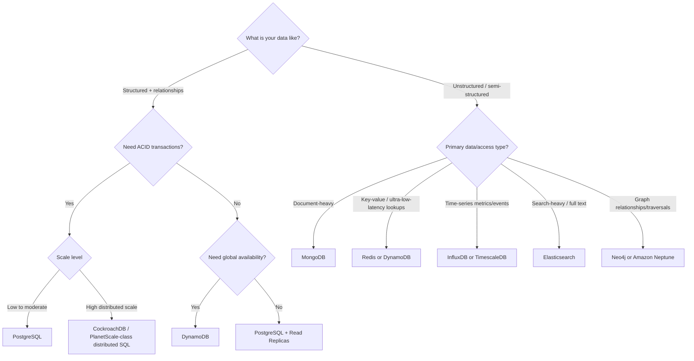
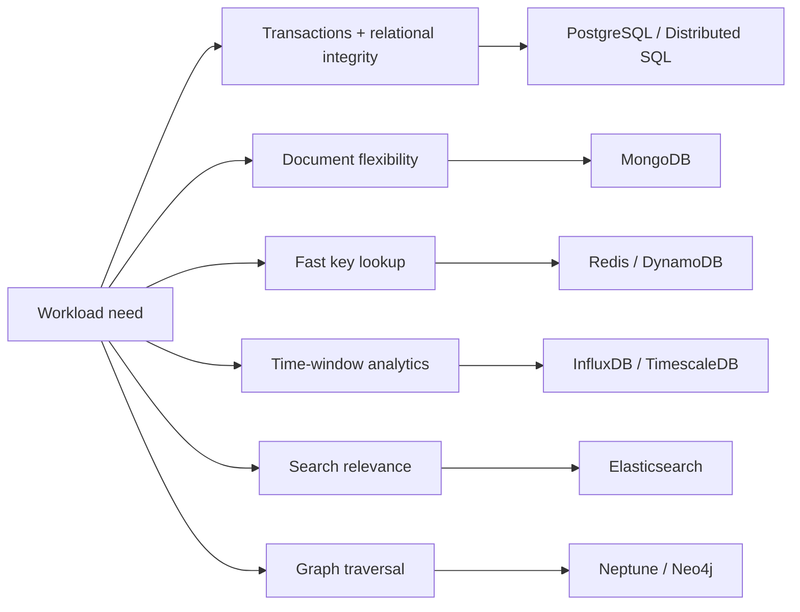

# Day 89 — Architect Database Decision Tree: Choosing the Right Database Without Guesswork
## From Data Shape to ACID, Scale, and Access Pattern

> **Series:** System Design Interview Preparation Series  
> **Difficulty:** Intermediate → Senior  
> **Core Concept:** database selection decision tree across SQL/NoSQL models and scaling constraints  
> **Prerequisite:** Day 23 — Database Selection, Day 64 — Sharding, Day 68 — Partitioning vs Sharding

---

## 🎯 Why This Matters

Most database failures are not caused by bad syntax.  
They are caused by choosing a storage model that does not match the workload.

The architect approach is to use a clear decision tree:
1. What is your data shape?
2. Do you need ACID transactions?
3. What is your scale and availability requirement?
4. If unstructured, what dominant access pattern do you need?

---

## The Database Decision Tree

---

## 1) Structured Data Branch

If your data has strong relational structure (joins, foreign keys, consistent entity integrity), start with SQL.

### Need ACID + low/moderate scale
- Use **PostgreSQL**.
- Strong consistency, mature tooling, rich query capabilities.

### Need ACID + high distributed scale
- Use **distributed SQL** options like **CockroachDB** (or equivalent architecture).
- Suitable when one region/one node architecture cannot meet scale and resilience goals.

### No strict ACID requirement
Then ask whether global availability is a hard requirement:
- **Yes** → **DynamoDB** (global, managed, high availability design patterns).
- **No** → **PostgreSQL + read replicas** often remains simpler and cheaper.

---

## 2) Unstructured Data Branch

When relational constraints are not central, choose by dominant access pattern:

1. **Document model** → **MongoDB**  
   Best for flexible schemas and document-centric reads/writes.

2. **Key-value model** → **Redis / DynamoDB**  
   Best for direct key lookups, low latency access, and simple retrieval paths.

3. **Time-series model** → **InfluxDB / TimescaleDB**  
   Best for timestamped telemetry, metrics, and trend queries over time windows.

4. **Search-heavy model** → **Elasticsearch**  
   Best for full-text search, relevancy scoring, and faceted query experiences.

5. **Graph-heavy model** → **Neo4j / Amazon Neptune**  
   Best for many-hop relationship traversals and connected-data workloads.

---

## Model Selection by Workload

---

## Key Architect Checks Before Finalizing

1. **Consistency requirement:** strict ACID vs eventual consistency tolerance.
2. **Availability and geography:** single region, multi-region, or global distribution.
3. **Growth path:** expected write throughput and storage growth over 12–24 months.
4. **Query shape:** joins, point lookups, range scans, text search, graph traversals.
5. **Operational complexity:** backups, failover, migrations, and team familiarity.

---

## Common Decision Mistakes

- Choosing a database by popularity instead of access pattern.
- Forcing high-join workloads into key-value stores.
- Using search engines as system-of-record databases.
- Jumping to distributed SQL before exhausting single-node optimization.
- Ignoring future migration costs between data models.

---

## Interview-Ready Answer (30 Seconds)

I use a database decision tree based on data shape and workload behavior. If data is structured and relationship-heavy, I start with SQL and evaluate ACID and scale: PostgreSQL for low/moderate scale, distributed SQL like CockroachDB for high distributed ACID scale. If strict ACID is not needed, I decide based on global availability requirements, often DynamoDB for globally available patterns or PostgreSQL with replicas for simpler regional systems. For unstructured workloads, I map by dominant access type: MongoDB for documents, Redis/DynamoDB for key-value, InfluxDB/TimescaleDB for time-series, Elasticsearch for search, and Neptune/Neo4j for graph-heavy traversals.

---

## One-Line Takeaway

> **Pick databases by data shape and access pattern first, then validate consistency, scale, and operational complexity.**

**Day 89/50 complete.**
