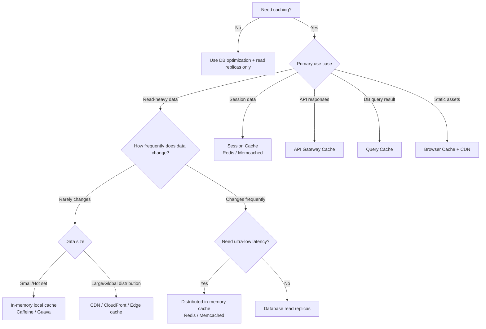
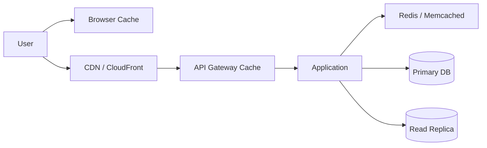
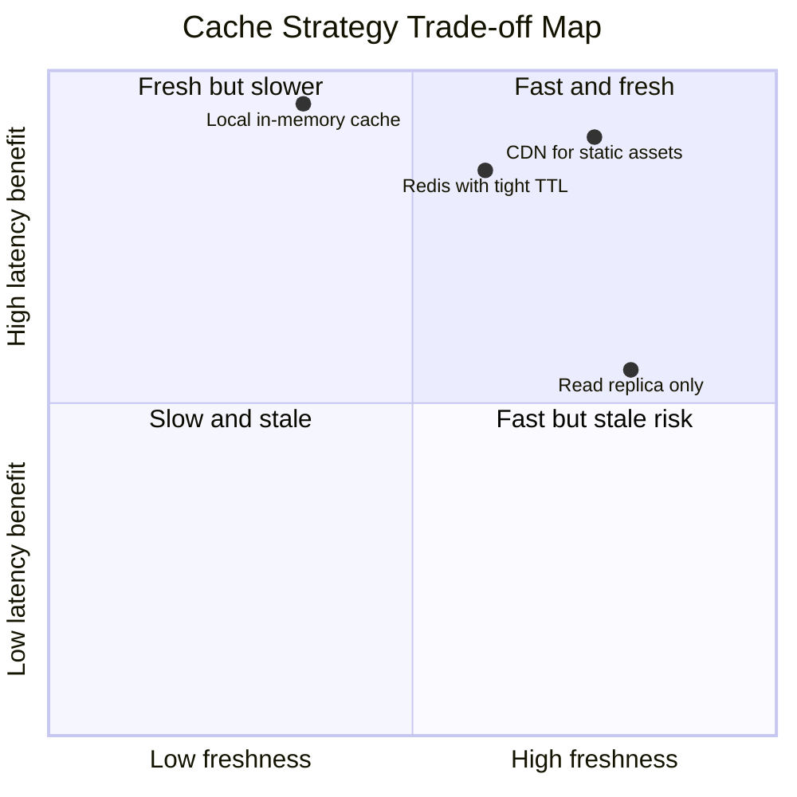

# Day 89 — Caching Decision Framework Every Architect Must Know
## From “Should We Cache?” to “Which Cache, Where, and Why?”

> **Series:** System Design Interview Preparation Series  
> **Difficulty:** Intermediate → Senior  
> **Core Concept:** cache decision tree, staleness vs latency trade-offs, cache placement by use case  
> **Prerequisite:** Day 57 — Rate Limiting, Day 60 — Centralized Logging, Day 86 — Redis as a Building Block

---

## 🎯 Why This Topic Matters

Most teams don’t fail because they forgot to add cache.  
They fail because they added the **wrong cache at the wrong layer**.

Architect-level caching starts with three questions:
1. **Do we need caching at all?**
2. **What is the data-change pattern (stable vs fast-changing)?**
3. **What cache type fits this specific use case (session/API/query/static)?**

If you answer these in order, cache design becomes predictable instead of guesswork.

---

## The Decision Tree (Core Framework)

---

## 1) First Decision: Do You Need Caching?

If workload is low, data is always fresh-critical, and DB can handle P95 comfortably, cache may add complexity without value.

Use **no cache** when:
- dataset is tiny and already fast from source,
- write-heavy workload makes cache stale almost instantly,
- consistency requirements are strict and staleness is unacceptable.

Use **cache** when:
- read-heavy traffic repeatedly fetches same data,
- source latency/cost needs reduction,
- burst handling needs a faster read layer.

---

## 2) If Read-Heavy: Choose by Change Frequency + Data Size

### A. Data changes rarely

If data is stable, cache hit ratio will stay high.

- **Small hot dataset** → in-process cache (Caffeine/Guava)
  - fastest lookup (no network hop),
  - ideal for config, feature flags, small reference tables.

- **Huge dataset / global audience** → edge cache (CDN/CloudFront)
  - offloads origin,
  - serves from geographically close POPs.

### B. Data changes frequently

Fast-changing data can go stale quickly, so ask:

- Need **ultra-low latency** and still high QPS?
  - Use **Redis/Memcached** with tight TTL or invalidation.

- Can tolerate a little more latency while reducing primary DB load?
  - Use **database read replicas**.

---

## 3) Cache by Use Case (Layer Placement)

### Session cache
- Store auth/session state centrally (Redis/Memcached).
- Keeps app servers stateless and horizontally scalable.

### API gateway cache
- Cache idempotent API responses at edge/gateway.
- Reduces app and DB pressure for repeated requests.

### Query cache
- Cache expensive DB query results with tuned TTL.
- Good for report-like reads and repeated joins/aggregates.

### Browser cache for static content
- JS/CSS/images/fonts cached client-side.
- Pair with CDN and proper cache headers for maximal benefit.

---

## 4) Staleness vs Latency: The Fundamental Trade-Off

Every cache design is a negotiation between:
- **Freshness** (new data quickly visible),
- **Latency** (fast reads),
- **Cost** (infra + complexity).

---

## 5) Practical Rules Senior Engineers Apply

1. **Cache only what is repeatedly read.**  
   Don’t cache everything.

2. **Define invalidation before launch.**  
   TTL-only is sometimes enough; event-driven invalidation is better for critical paths.

3. **Match cache scope to data scope.**  
   Local cache for local hot keys, distributed cache for shared mutable keys, CDN for global static distribution.

4. **Observe hit ratio and eviction churn.**  
   A cache with low hit ratio can be pure operational noise.

5. **Always design fallback path.**  
   On cache miss/outage, behavior must degrade safely to DB/replica/origin.

---

## 6) Interview-Ready Answer (30 Seconds)

I use a three-step caching decision tree: first, verify we need caching by checking read pressure and latency/cost goals; second, classify data by update frequency and size; third, map to cache layer by use case. For stable small hot data, I prefer local in-memory cache like Caffeine. For massive global static distribution, I use CDN/CloudFront. For fast-changing low-latency reads, Redis or Memcached with strict TTL/invalidation. If low latency is less critical, read replicas are enough. Sessions go to session cache, API responses to gateway cache, heavy query outputs to query cache, and static assets to browser+CDN.

---

## One-Line Takeaway

> **Good caching is not “add Redis”; it is choosing the right cache layer based on read pattern, change frequency, and staleness tolerance.**

**Day 89/50 complete.**
