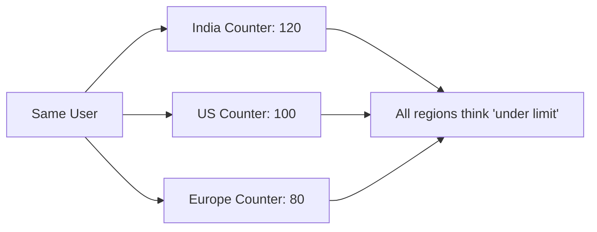
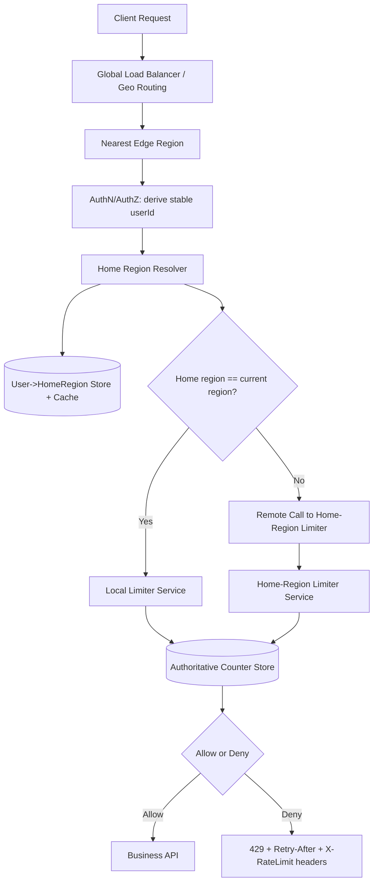
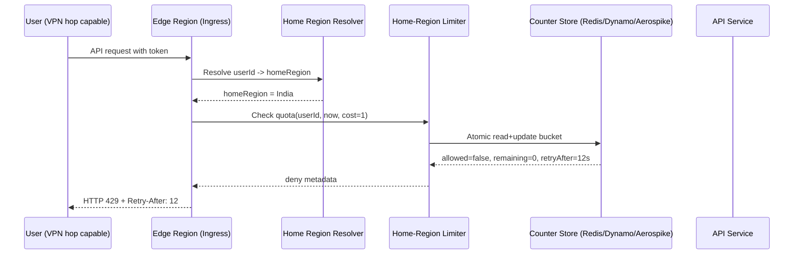

# Day 89 — Multi-Region Rate Limiting: Closing the VPN Bypass Gap with Home-Region Enforcement
## How to Enforce 300 Requests/Minute Globally When Traffic Enters from India, US, and Europe

> **Series:** System Design Interview Preparation Series  
> **Difficulty:** Senior  
> **Core Concept:** Identity-anchored global rate limiting, home-region ownership, cross-region enforcement, consistency vs latency trade-offs  
> **Prerequisite:** Day 57 — Rate Limiting Algorithms, Day 53 — Retry Storm, Day 70 — Routing Layers

---

## 🎯 Problem Statement

You have services deployed in **India, US, and Europe**.  
The product requirement is:

> **Allow at most 300 requests per minute per user globally.**

Traffic routing is geo-based:
- Asia-Pacific users hit India,
- US users hit US,
- Europe users hit Europe.

Now a user uses VPN to hop across regions.

Example in one minute:
- India: 120 requests
- US: 100 requests
- Europe: 80 requests

Global total = **300**.  
But if each region enforces limit independently, each region is still below 300, so the **301st request is incorrectly allowed**.

That is the architectural gap.

---

## ❌ Why the Naive Design Fails

The incorrect model is:

> "Route by geo and count by region."

That model ties enforcement to **ingress location**, not **user identity**.

VPN changes ingress region without changing user identity.  
So the same user receives three independent counters instead of one global budget.



---

## ✅ Senior Architecture: Home-Region Ownership per User

The fix is to make rate limiting **identity-centric**:

1. Each user is assigned a stable **home region**.
2. All rate-limit decisions for that user are made in that home region.
3. Any edge region can receive traffic, but it must enforce quota against the user’s home-region counter.

So the user can enter from US today and Europe 5 seconds later; both still consume from the **same global bucket**.

---

## 🏛️ High-Level Design



---

## 🔁 End-to-End Request Flow



---

## 🧠 The Key Design Principle

> **Route for latency, enforce for correctness.**

- Geo-routing minimizes network latency.
- Home-region ownership guarantees quota correctness.

Do not conflate these two concerns.

---

## Counter Strategy (What to Implement)

For production, use **Token Bucket** or **Sliding Window Counter** with atomic updates.

Recommended defaults:
- Limit: `300/min/user`
- Refill rate: `5 tokens/sec`
- Burst: business-dependent (e.g., 30)
- Key: `rl:{userId}`

All updates must be atomic (Lua script / conditional update / transaction) to prevent race conditions across concurrent requests.

---

## Data Model

### A) User home-region metadata

```text
user_home_region
- user_id (PK)
- home_region (INDIA | US | EUROPE)
- version
- updated_at
```

### B) Runtime counter state

```text
rate_limit_state:{user_id}
- tokens
- last_refill_ts
- ttl
```

---

## Failure Modes and Policy Decisions

### 1) Home region is down

You must predefine behavior:
- **Fail-closed** for sensitive endpoints (auth, payments).
- **Fail-open** or degraded quota for availability-first endpoints.

### 2) Home-region resolver unavailable

- Use short-lived cache for `userId -> homeRegion`.
- Keep resolver cache hit ratio high to avoid DB dependency on hot path.

### 3) Counter store partition/latency spike

- Circuit-break remote limiter calls.
- Return deterministic error policy instead of silent fallback.
- Emit clear telemetry for deny-by-policy vs deny-by-quota.

---

## Global Consistency vs Latency Trade-Off

This design introduces cross-region calls when ingress region differs from home region.

Mitigate by:
1. Caching home-region mapping at edge.
2. Keeping limiter RPC payload tiny.
3. Using persistent connections.
4. Co-locating limiter and counter store.
5. Choosing home-region assignment aligned to user’s dominant geography.

---

## Observability You Must Expose

- `rate_limit_allowed_total`
- `rate_limit_denied_total`
- `rate_limit_remote_check_latency_ms`
- `home_region_cache_hit_ratio`
- `quota_decision_error_total`
- `vpn_geo_switch_frequency_per_user`

And trace tags:
- `ingress_region`
- `home_region`
- `decision_source=home_authoritative`

---

## Interview-Ready Answer (Concise)

If rate limits are tracked per region, VPN switching bypasses global policy.  
I would assign each user a stable home region and enforce that user’s quota only in that region. Requests can enter any region, but limiter checks are routed to the home-region authority with atomic token-bucket updates in a shared low-latency store. This preserves geo-routing performance while guaranteeing global correctness for a `300 req/min/user` policy.

---

## One-Line Takeaway

> **Never anchor quota to geography; anchor quota to identity and enforce through a single authoritative ownership model.**

**Day 89/50 complete.**
