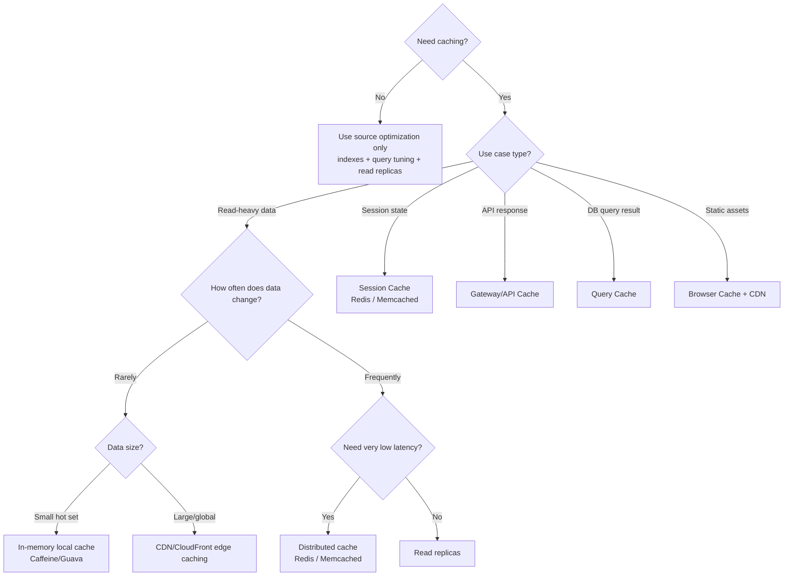
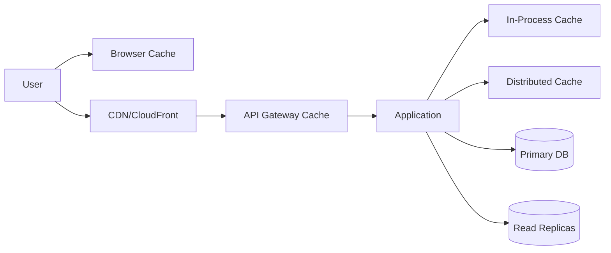

# Day 90 — Architect Caching Decision Tree: The 3 Questions Every Developer Must Learn
## A Practical Framework to Decide If You Need Cache, Which Cache Type, and Where to Place It

> **Series:** System Design Interview Preparation Series  
> **Difficulty:** Intermediate → Senior  
> **Core Concept:** cache necessity, read-pattern classification, staleness/latency trade-offs, layer-specific cache selection  
> **Prerequisite:** Day 57 — Rate Limiting, Day 86 — Redis Building Blocks, Day 89 — Caching Decision Framework

---

## 🎯 Why This Matters

Caching is one of the most misapplied optimizations in system design.

The common mistake is to ask:
> “Should we add Redis?”

The architect-level question is:
> “What problem are we solving, what staleness can we tolerate, and which layer should own this cache?”

This Day 90 post gives a deterministic **3-question decision tree** you can use in interviews and in production design reviews.

---

## The 3 Questions

1. **Do we need caching at all?**  
2. **If yes, is this read-heavy and how often does data change?**  
3. **Which cache layer matches the use case (session, API, query, static)?**

---

## Decision Tree (Interview-Ready)

---

## Branch-by-Branch Interpretation

### 1) Need caching?
- **No** when load is low, freshness must be strict, and DB already meets SLO.
- **Yes** when repetitive reads dominate and latency/cost pressure is high.

### 2) Read-heavy branch
- **Rarely changing + small dataset** → in-process cache (fastest, cheapest hop).
- **Rarely changing + large/global dataset** → CDN/CloudFront.
- **Frequently changing**:
  - use Redis/Memcached if ultra-low latency is required,
  - use read replicas if slightly higher latency is acceptable.

### 3) Use-case branch
- **Session cache** for auth/session continuity across stateless app nodes.
- **API cache** at gateway for idempotent endpoint responses.
- **Query cache** for expensive, repeatedly executed DB queries.
- **Browser cache** for static assets via proper cache headers.

---

## Layer Placement View

---

## Staleness vs Latency Reality

Any cache strategy must explicitly define:
- acceptable staleness window,
- invalidation method (TTL/event-driven/write-through),
- fallback behavior during cache miss/outage.

If these three are undefined, the design is incomplete.

---

## Senior-Level Anti-Patterns to Avoid

1. **Caching everything** without measuring hit ratio.
2. **Using distributed cache for tiny hot config** that could be local memory.
3. **Using only TTL** for fast-mutating business-critical data.
4. **No fallback path** when cache tier is unavailable.
5. **Ignoring placement** (e.g., caching static assets in app tier only).

---

## Interview Answer (30 Seconds)

I make caching decisions through three questions: whether cache is needed, how read-heavy and fast-changing the data is, and which cache layer matches the use case. Stable small hot data goes to local in-memory cache; stable large global content goes to CDN/CloudFront; frequently changing low-latency reads go to Redis/Memcached; if low latency is less critical, read replicas may be enough. Sessions use session cache, API responses use gateway cache, heavy query outputs use query cache, and static assets use browser+CDN.

---

## One-Line Takeaway

> **Great cache design is a decision tree, not a tool choice: decide necessity, change pattern, and ownership layer before picking technology.**

**Day 90/50 complete.**
