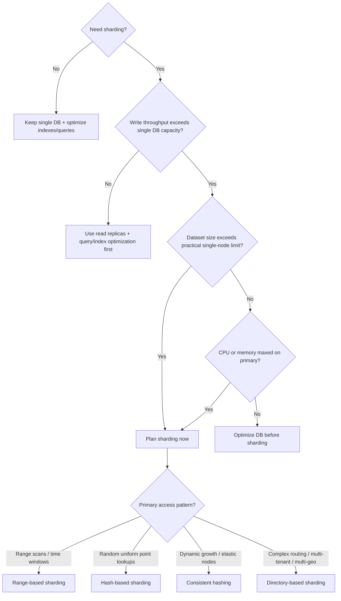
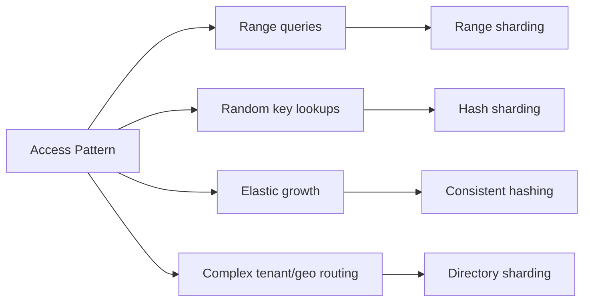

# Day 91 — Database Sharding Decision Tree for Scale and Performance
## How Architects Decide Whether to Shard, When to Avoid It, and Which Sharding Strategy to Choose

> **Series:** System Design Interview Preparation Series  
> **Difficulty:** Senior  
> **Core Concept:** sharding readiness checks, write-throughput and capacity triggers, strategy selection by access pattern  
> **Prerequisite:** Day 64 — Sharding Strategies, Day 68 — Sharding vs Partitioning, Day 76 — ID Strategies

---

## 🎯 Why This Matters

Sharding is not the first optimization.  
It is the point where vertical scaling and simple read scaling stop being enough.

Architects use a decision tree because premature sharding creates long-term complexity: routing, rebalancing, cross-shard queries, and operational overhead.

---

## The Decision Tree

---

## 1) Do You Really Need Sharding?

Use sharding only when one or more of these are true:
- write throughput saturates one primary node,
- dataset growth pushes beyond practical single-node limits,
- CPU/memory pressure remains high even after database tuning.

If writes are still manageable, apply lower-risk options first:
- read replicas,
- indexing and query plan optimization,
- connection pool tuning,
- caching for read-heavy endpoints.

---

## 2) Read Replicas vs Sharding (Critical Distinction)

- **Read replicas** scale read traffic and improve availability.
- **Sharding** scales write throughput and total storage by distributing ownership of data.

If the bottleneck is reads, replicas are usually enough.  
If the bottleneck is writes + capacity, sharding becomes necessary.

---

## 3) Strategy Selection by Access Pattern

### A) Range-based sharding
Best when queries are range-oriented (time, ID bands).  
Risk: hotspotting on active ranges.

### B) Hash-based sharding
Best for evenly distributed random access by key.  
Risk: poor support for range queries and potential rebalancing pain with naive modulo.

### C) Consistent hashing
Best for unknown growth and frequent node add/remove.  
Benefit: fewer key remaps during scaling.

### D) Directory-based sharding
Best for multi-tenant, multi-geo, or explicit routing rules.  
Trade-off: lookup layer complexity and operational overhead.

---

## 4) Key Considerations Before Finalizing

1. **Shard key quality**  
   High cardinality, even distribution, and alignment with dominant query predicates.

2. **Cross-shard query behavior**  
   Minimize scatter-gather for latency-sensitive paths.

3. **Rebalancing strategy**  
   Plan movement, throttling, and cutover before day one.

4. **Observability**  
   Track per-shard CPU, memory, disk, QPS, p95 latency, and hotspot skew.

5. **Failure isolation**  
   Understand blast radius per shard and replica topology.

---

## 5) Senior Anti-Patterns

- Sharding before exhausting DB optimization fundamentals.
- Choosing shard key by intuition instead of access-pattern analysis.
- Ignoring future resharding cost.
- Designing without a routing abstraction.
- Allowing cross-shard transactions in critical hot paths by default.

---

## Interview-Ready Answer (30 Seconds)

I decide sharding through a readiness tree: first validate we truly need it by checking whether writes and capacity exceed a single-node DB after tuning. If writes are not the bottleneck, I use read replicas and optimization first. If sharding is needed, I choose strategy from access patterns: range for range scans, hash for uniform random access, consistent hashing for elastic growth, and directory sharding for complex tenant or geo routing. Then I lock shard-key quality, rebalancing plan, and hotspot observability before rollout.

---

## One-Line Takeaway

> **Shard only when single-node write/capacity limits are real, then choose strategy from access pattern—not from technology preference.**

**Day 91/50 complete.**
