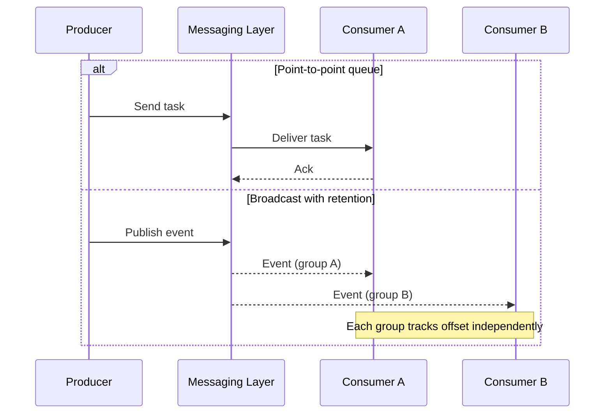
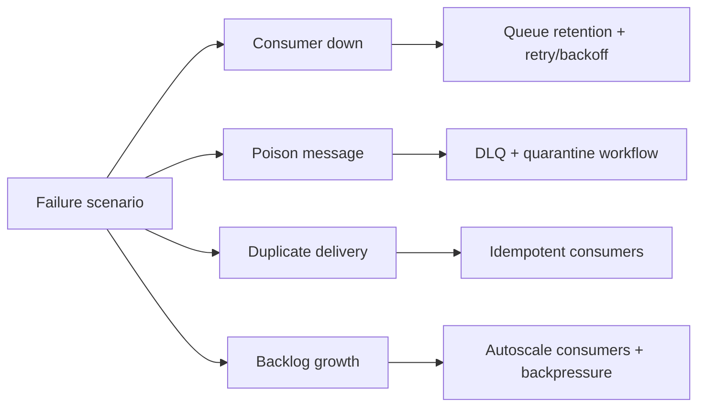

# Day 92 — Architect’s Messaging System Decision Tree
## How to Choose Kafka, RabbitMQ, SQS, or SNS Based on Communication Pattern, Durability, and Replay

> **Series:** System Design Interview Preparation Series  
> **Difficulty:** Senior  
> **Core Concept:** messaging system selection by interaction pattern, durability requirement, and replay semantics  
> **Prerequisite:** Day 36 — RabbitMQ vs Kafka, Day 39 — Outbox Pattern, Day 81 — DLQ

---

## 🎯 Why This Matters

At large scale, synchronous service-to-service calls alone are not enough.  
You need external messaging to:
- decouple producers and consumers,
- absorb spikes,
- survive temporary consumer outages,
- process tasks asynchronously,
- support event-driven architectures.

The mistake developers make is selecting tooling by trend.  
Architects choose by **message pattern + delivery contract + replay need**.

---

## The Architect’s Decision Tree

```mermaid
flowchart TD
    A{Need external messaging?}
    A -->|No| A0[Use direct sync calls + retries/timeouts/circuit breakers]
    A -->|Yes| B{Primary communication pattern?}

    B -->|Point-to-point task queue| C{Need strict ordering/FIFO?}
    B -->|Fan-out broadcast pub/sub| D{Need durable retention?}
    B -->|Internal async event reactions| E{Need replay later?}

    C -->|Yes| C1[SQS FIFO or RabbitMQ quorum queue]
    C -->|No| C2[SQS Standard or RabbitMQ classic/work queues]

    D -->|Yes| D1[Kafka (retention + consumer groups + replay)]
    D -->|No| D2[SNS / lightweight pub-sub without long retention]

    E -->|Yes| E1[Kafka event log]
    E -->|No| E2[RabbitMQ or SQS task/event queue]
```

---

## 1) First Question: Do You Need External Messaging?

Use messaging when at least one of these is true:
- producer and consumer should be independently deployable/scalable,
- consumer may be temporarily offline but work must not be lost,
- request-response coupling causes cascading failures,
- workloads are asynchronous by business nature (notifications, billing, analytics, enrichment).

If none of these apply, a synchronous API call may stay simpler.

---

## 2) Pattern Branch A — Point-to-Point Task Processing

This is one producer → one queue → one worker at a time per message.

Examples:
- image resize task,
- email send job,
- invoice generation,
- webhook delivery retry pipeline.

### If strict FIFO/order is required
Choose:
- **SQS FIFO** (managed, strict ordering per message group),
- or **RabbitMQ** with queue strategy that preserves ordered handling in your topology.

### If strict FIFO is not required
Choose:
- **SQS Standard** (high throughput, at-least-once),
- or **RabbitMQ** for richer routing/ack patterns.

---

## 3) Pattern Branch B — One Producer, Many Independent Consumers (Pub/Sub)

Here one event is consumed by multiple downstream services independently.

Example: `OrderPlaced` consumed by:
- inventory service,
- payment orchestration,
- notification service,
- analytics pipeline.

### Need durable retention and late consumers?
Choose **Kafka**:
- messages retained for time/size policy,
- multiple consumer groups can process independently,
- consumers can reprocess by offset rewind.

### No retention/replay requirement, only live fan-out
Choose **SNS-like pub/sub**:
- lightweight broadcast,
- lower operational overhead for simple notification fan-out.

---

## 4) Pattern Branch C — Internal Event-Driven Async Reactions

When services emit internal events and downstream handlers react later:

Ask one key question:
> **Will we need replay?**

- **Yes** → Kafka is the best fit (durable log + replay).
- **No** → RabbitMQ or SQS can be sufficient (queue semantics, no heavy replay model needed).

---

## Sequence View: How the Branches Differ



---

## Practical Mapping Table

| Requirement | Best-fit options | Why |
|---|---|---|
| Single-task queue, strict order | SQS FIFO / RabbitMQ | Ordered delivery semantics |
| Single-task queue, max throughput | SQS Standard / RabbitMQ | Scalable async task execution |
| Broadcast without replay | SNS-style pub/sub | Simple fan-out |
| Broadcast with retention + replay | Kafka | Durable event log with offsets |
| Event sourcing / audit rebuild | Kafka | Reprocessing from historical log |
| Rich broker routing rules | RabbitMQ | Exchange + binding model |

---

## Non-Functional Checks Before Final Choice

1. **Delivery guarantee**
   - at-most-once, at-least-once, effectively-once with idempotency.

2. **Ordering scope**
   - global order is expensive; usually partition/group order is enough.

3. **Replay semantics**
   - required for analytics rebuilds, bug backfills, and recovery workflows.

4. **Throughput and latency envelope**
   - sustained peak write/read rates, payload size, consumer lag tolerance.

5. **Operational maturity**
   - managed service preference vs operating your own cluster/platform.

---

## Failure Modes You Must Design For



No messaging choice is complete without:
- DLQ strategy,
- retry policy (exponential backoff + jitter),
- idempotent consumer contract,
- observability on lag, redrive, failure rates.

---

## Senior Architect Guidance (Reality Check)

- Don’t use Kafka just because event streaming is popular.
- Don’t force RabbitMQ for long-term replay/history use cases.
- Don’t use SNS-like pub/sub when compliance needs replayable retention.
- Don’t use FIFO queues unless business correctness truly requires order (FIFO reduces parallelism).

Choose the smallest system that satisfies correctness and growth expectations.

---

## Interview-Ready Answer (30 Seconds)

I start with a messaging decision tree: first confirm external messaging is needed for decoupling and offline processing. Then I classify by communication pattern. For point-to-point tasks, I use queue systems such as SQS or RabbitMQ, selecting FIFO only when strict ordering is required. For one-to-many broadcast, I check durability: Kafka when retention and replay are needed, SNS-style pub/sub for lightweight live fan-out. For internal async events, replay requirement is the deciding factor—Kafka for replay, RabbitMQ/SQS when replay is unnecessary. I finalize with idempotency, DLQ, retry policy, and lag observability.

---

## One-Line Takeaway

> **Pick messaging by pattern first (queue vs pub/sub vs event log), then by durability and replay—not by brand preference.**

**Day 92/50 complete.**
